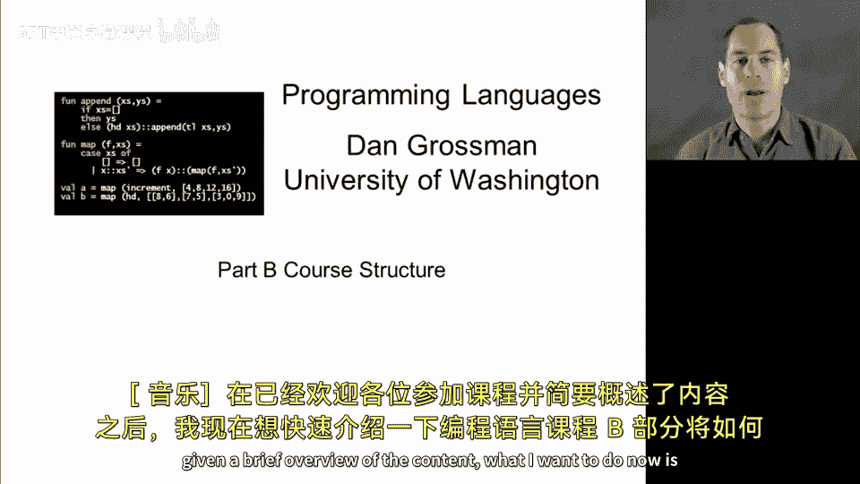
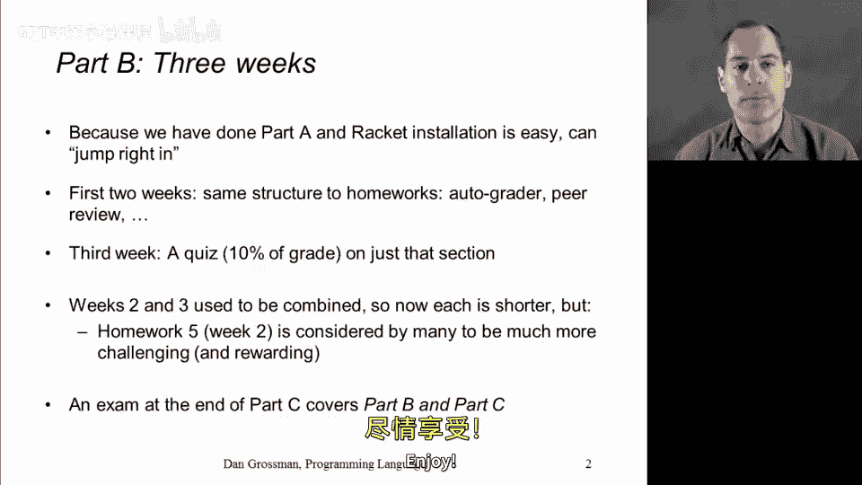

# 编程语言：B部分：课程结构 📚

在本节课中，我们将要学习编程语言课程B部分的结构安排。我们已经欢迎了大家加入课程，并对内容进行了简要概述。现在，我们将快速回顾B部分的结构。完成A部分后，B部分的结构会显得非常熟悉。

## 课程开始阶段 🚀

在课程开始时，我们不会专门用一整周时间进行软件安装和学习如何提交作业。那样安排会使这一周的内容过于轻松。幸运的是，安装我们将用于B部分的DrRacket环境非常简单。我们假设大家可以按照提供的说明快速完成安装，以便在第一周就能深入到一个相当复杂且内容丰富的章节。

## 作业与评估 📝

本周和下周，我们将布置编程作业，并进行同伴互评等评估活动。这与我们在A部分的三次作业模式非常相似。在B部分，我们还将有两次类似性质的作业。

## 最后一周的安排 🧠

在B部分的最后一周，安排会有所不同。这一周将包含更多概念性材料，这些内容不太适合通过编程作业来巩固。因此，我们将进行一次测验，该测验约占成绩的10%。这一周的安排将仅针对该章节的内容，而不像A部分结束时那样，有一次涵盖课程所有内容的考试。

## 各周内容分布 ⚖️

需要补充的是，虽然第一周有很多视频材料且内容相当深入，但第二周和第三周的内容原本是合并在一起的。我意识到它们可以很容易地分开，因此我提前将内容稍微分散了一下。所以，你会看到这两周的视频数量比通常一周的要少。

尽管如此，课程第二周的作业5被许多人认为是最具挑战性，同时也是最有收获的作业。综合来看，第二周的内容在难度上达到了平衡。我认为你会发现第三周是一个很好的总结，并且以一种更概念化的方式，退一步来比较和对比我们在课程中迄今为止接触到的不同编程方法。

## 考试安排 📋

最后我想补充的是，在B部分结束时没有累积性考试。我们只有两次编程作业和一次测验。然而，在C部分结束时，将有一次考试。这次考试不仅关注C部分的内容，还会重点比较和对比C部分与B部分的内容。因此，在C部分结束时，你将有机会回顾B部分的材料，并在C部分最后综合所有概念。

总而言之，以上就是在接下来三周里我们的课程结构安排。接下来应该是软件安装，然后我们将深入实际的课程内容。祝大家学习愉快！

---

本节课中我们一起学习了编程语言课程B部分的结构安排，包括课程开始阶段的设置、作业与评估模式、最后一周的测验安排、各周内容的分布特点，以及B部分与C部分在考试上的衔接。