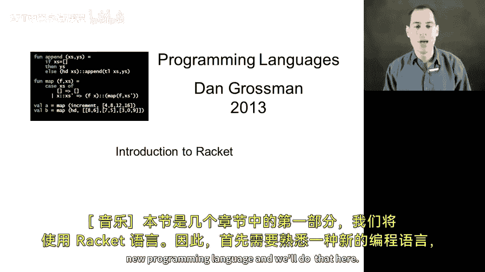
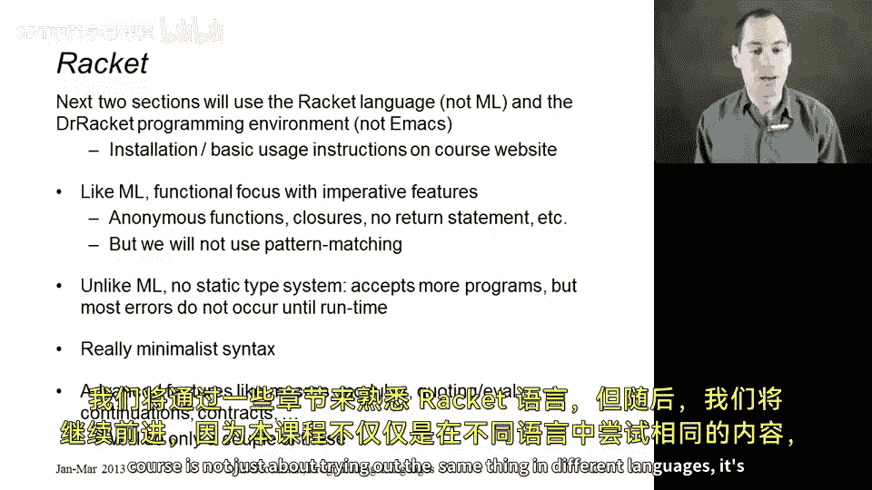
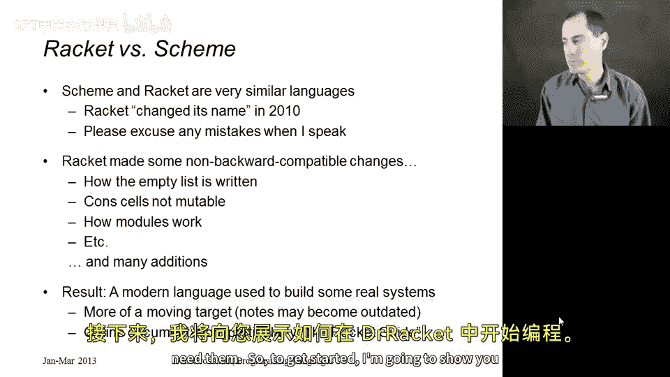
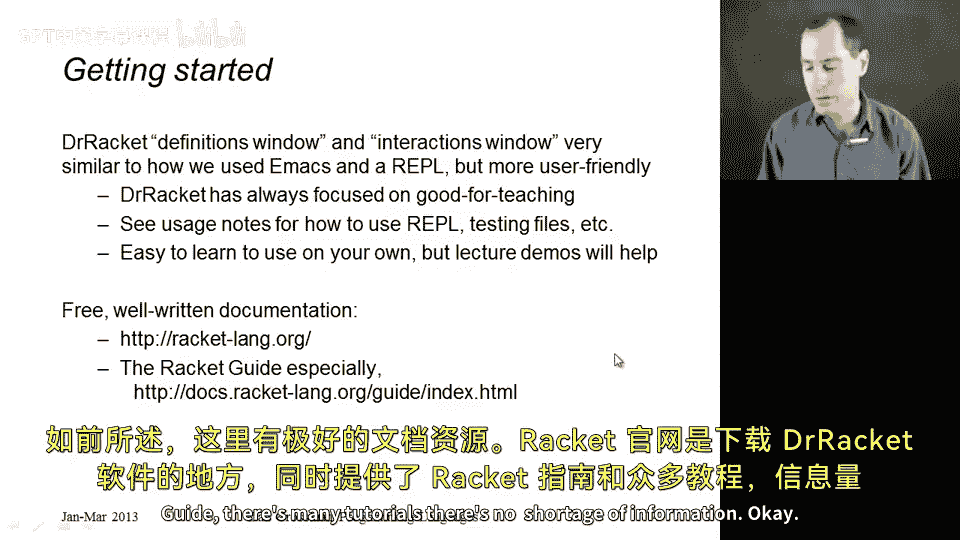
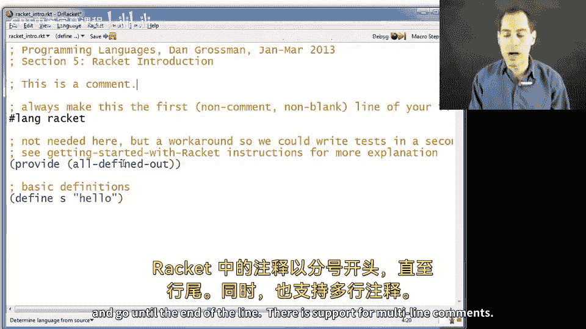
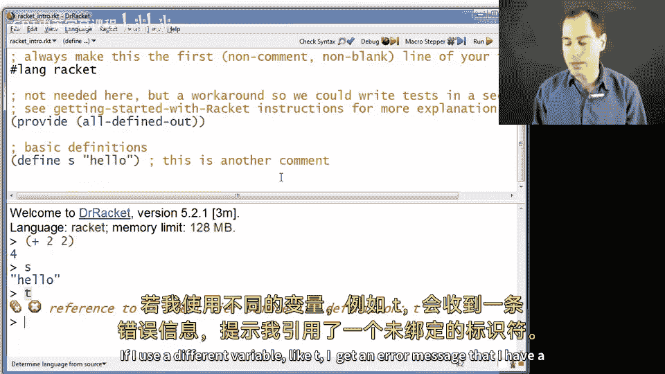
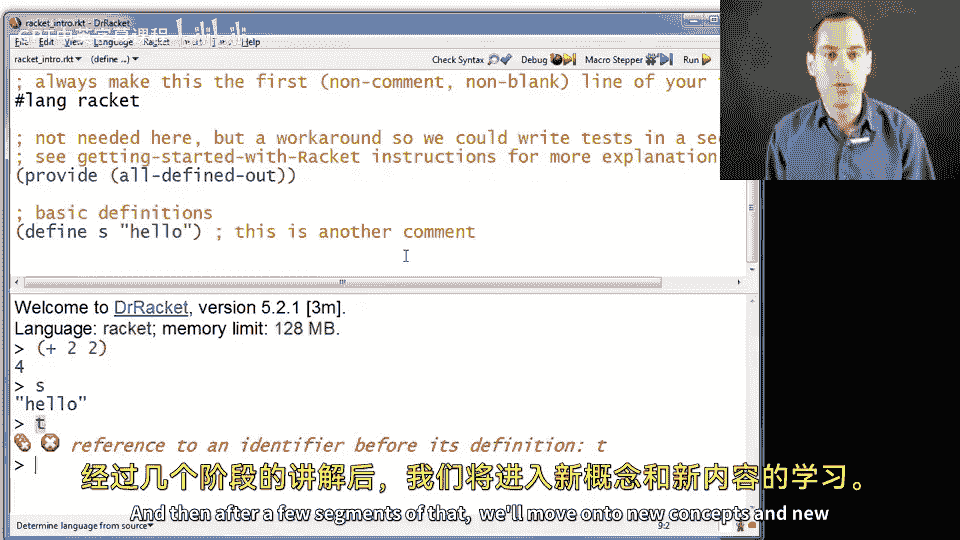

# 编程语言 A/B/C CSE341 Coursera：3.01：Racket 语言入门 🚀

在本节课中，我们将开始学习 Racket 语言。我们将从熟悉这个新的编程环境开始，了解其基本概念和使用方法。

## 课程概述



本节是课程第一部分的开始，我们将使用 Racket 语言。因此，我们需要先熟悉这个新的编程语言。我们将在此处完成这一过程。

我们将使用 Racket 语言，而不是 ML。我们推荐使用 Dr. Racket 编程环境，而不是其他编辑器。因此，在本部分课程中，我们不会使用 Emacs。课程网站上提供了安装和使用说明。您会发现安装过程非常简单直接，只需花几分钟时间即可完成。


## Racket 与 ML 的相似之处

与 ML 类似，Racket 主要是一种函数式语言。因此，我们在 ML 中学到的许多概念，将在新的环境中再次见到。我们仍然会使用匿名函数、一等函数闭包，并且一切都是表达式，因此我们不需要像 `return` 语句这样的东西。

我们不会使用 Racket 的某种 `case` 表达式形式。它确实支持一些此类功能，但我们将以不同的方式访问我们的类型，这对于我们的目的来说已经足够。

## Racket 与 ML 的关键区别

然而，Racket 与 ML 有两个关键区别，这也是我希望在本部分课程中使用 Racket 的原因。

首先，Racket 不那么依赖静态类型系统。它接受更多的程序，只是将 ML 中会出现的类型错误推迟到运行时发生。例如，如果您尝试将一个数字和一个字符串相加，在 ML 中会立即报错，但在 Racket 中，直到实际执行该表达式时才会出现运行时错误。

其次，您将在后续章节中看到，当我们开始编写一些实际代码时，Racket 的语法非常**简约**。它大量使用括号来分组事物，而不是像大多数其他编程语言那样拥有复杂的语法规则。

此外，Racket 拥有许多高级功能。我们没有时间涵盖大部分内容，但如果有时间，我至少希望讨论一下模块系统。我还想讨论宏等概念。

## 课程安排与目标



总体而言，由于 Racket 与 ML 的相似性，接下来的作业不仅仅是熟悉 Racket 的作业。前一两道题会是，但之后，我想讨论一些新概念，一些我们本可以在 ML 中完成但在 Racket 中实现得更清晰的新事物。

因此，我们将用几个章节来熟悉 Racket 语言，然后继续前进，因为本课程不仅仅是在不同语言中尝试相同的事情，而是学习新概念。


## 关于 Scheme 的说明

我应该提一下，有一个相关的编程语言叫做 Scheme。Racket 本质上是从 Scheme 演化而来的，并在大约 2010 年左右持续发展。Racket 的设计者决定停止使用 Scheme 这个名称，以便他们可以更自由地进行创新，而不必受其束缚。

我有时可能会口误说成 Scheme，因为我仍然习惯称这类语言为 Scheme。我会尽量避免，但如果我说了，请不要感到困惑。如果您以前用 Scheme 编程过，它是一种非常流行的语言，特别是在入门编程和实际应用中。Racket 做出了一些不兼容的更改，您最可能注意到的是与列表使用方式相关的更改，特别是与 ML 列表类似，Racket 列表的元素是**不可变的**。如果您以前见过 Scheme，您需要适应这一点。如果没有，我们将把 Racket 作为一个独立的、出色的现代编程语言来介绍。

## Racket 的应用与发展

我应该提一下，作为一种现代语言，Racket 已被用于构建一些真实的系统，并且继续在这方面发挥作用。它在教育领域也被广泛使用，这可能是它最出名的地方。该语言持续发展，因此可能有些变化。我正在努力保持所有内容都是最新的，它的变化速度并不快，您可以随时查阅在线文档。特别是 **Racket 指南**，这是一份免费的用户指南，涵盖了该语言的重要概念，内容远超过本课程所需，但您可以根据需要轻松查找信息。




## Dr. Racket 环境介绍

现在开始，我马上向您展示 Dr. Racket。它将有一个所谓的“定义窗口”和一个“交互窗口”。这对我们来说会非常熟悉：在 Emacs 中，我们有编写代码的缓冲区（buffer）和运行代码的 REPL。Dr. Racket 的工作方式相同。我认为您会发现它比我们使用 ML 的方式更用户友好，并且您会发现它相当容易自学。如果您有任何问题，可以在讨论论坛上提问，当然，讲座演示也会展示我使用该工具的过程。

正如我提到的，有很棒的文档。通用的 Racket 网站是您下载 Dr. Racket 的地方，那里还有 Racket 指南和许多教程，信息非常丰富。



## Dr. Racket 界面演示


那么，我现在切换到这里。这就是 Dr. Racket，我向您展示的当前缓冲区只是一个您可以编写代码的缓冲区。当我想运行它时，只需点击右上角的这个“运行”按钮。现在我得到了这个分割视图，下方是 REPL，上方是代码。您可以在它们之间切换，菜单选项有只显示一个或同时显示两者的选项。我认为按 `Ctrl+E` 可以在只显示定义和同时显示定义与 REPL 之间切换。我在这里按 `Ctrl+E` 来回切换。

除了我为了在录制中看起来更好而增大了字体大小并更改了字体外，Dr. Racket 在您那里的外观基本就是这样。

## 代码结构解析

现在让我们看看实际的代码。您看到的这种棕色的文本是**注释**。Racket 中的注释以分号 `;` 开始，直到行尾。支持多行注释，但我不太常用。通常的做法是让注释的每一行都以分号开头。您也可以在同一行代码的右侧添加注释。所以底部这里，是另一个注释。



## 文件开头的必要设置

在我们的文件中，总是要做几项簿记工作。


首先，始终让文件的第一个非注释行**恰好**是这一行。我再为您输入一遍，尽管您应该只写一次：

```racket
#lang racket
```

这行代码告诉 Dr. Racket 这个文件中的代码是 Racket 代码。Dr. Racket 实际上支持定义自己的语言，用许多不同的语言运行代码，所以我们必须说明我们的代码是哪种语言，我们用这第一行来说明。

第二行 `(provide (all-defined-out))` 是一个变通方法，目的是为了让我们的事情保持简单。默认情况下，Racket 有一个模块系统，就像我们在 ML 中学到的那样。但在 Racket 的模块系统中，每个文件都是一个模块，默认情况下，其中的所有内容都是私有的，您必须说明您希望向其他文件公开什么。

使用我们本课程中将测试放在第二个文件中的方法，这有点麻烦。所以这一行代码（您可以复制它，或者我们会在作业中提供给您）的意思是：更改默认设置，使所有内容公开。这使得您的代码更容易测试。

## 定义变量与运行代码

处理完这两件事后，您就可以在文件的其余部分定义一堆定义、变量和其他内容了。对于本讲座，我只做了一个定义，我们将在下一节中做更多。

我定义了变量 `s` 为字符串常量 `"hello"`。当您定义一个变量时，语法是：开括号、关键字 `define`、变量名、值 `"hello"`、闭括号。

```racket
(define s "hello")
```

这就像 ML 中的 `val s = "hello"`。

如果我运行这个（点击运行按钮），在 REPL 中，它确实运行了所有代码，因此它为 `s` 创建了那个定义。与 ML 不同，它不会告诉我们任何信息。如果有什么问题，它会给我们一个错误。但由于一切正常，它只是给我们提示符。我可以说 `(+ 2 2)`，我会得到 `4`。这就是您在 Racket 中做加法的方式：括号、运算符 `+`、参数、另一个括号。我也可以输入 `s`，得到字符串 `"hello"`。如果我使用一个不同的变量，比如 `t`，我会得到一个错误消息，提示引用了一个未绑定的标识符。

## 总结

本节课中，我们一起学习了 Racket 语言的入门知识。我们了解了 Dr. Racket 编程环境的基本界面和操作方法，学习了 Racket 文件的基本结构，包括必要的 `#lang racket` 声明和 `(provide (all-defined-out))` 语句。我们还通过一个简单的变量定义示例，体验了在 Racket 中编写和运行代码的过程。

Dr. Racket 将继续在接下来的几节中使用，我们将快速介绍许多在 ML 中已经见过的相同概念。在那之后，我们将转向新的概念和新的材料。






