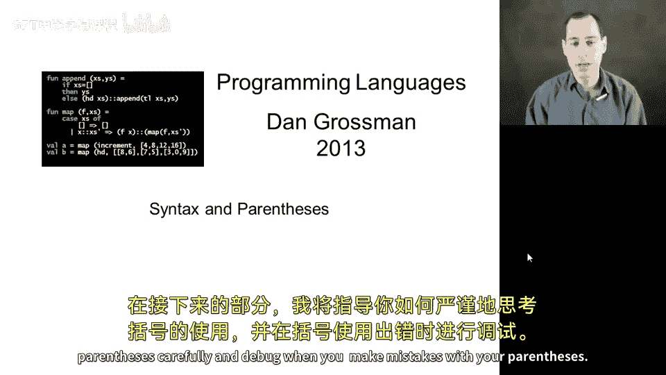
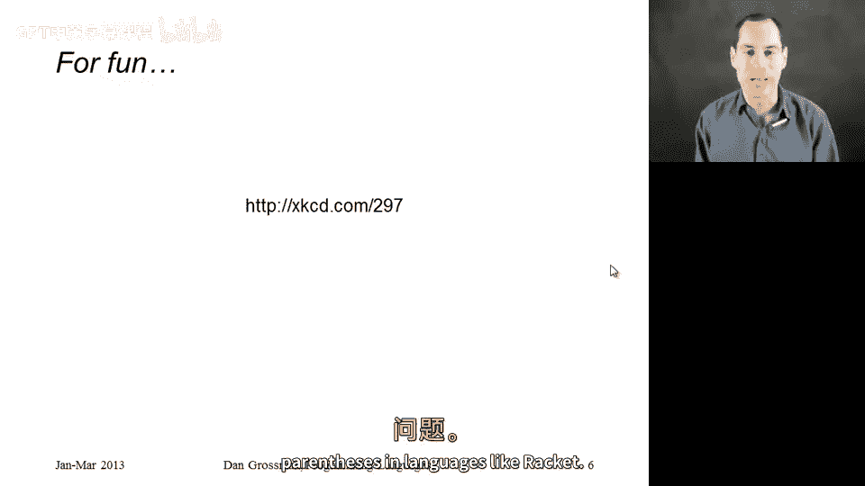

# 【编程语言 A⧸B⧸C CSE341 Coursera】华盛顿大学—中英字幕 p104 6_04_syntax-and-parentheses -BV1bw4m1D7MM_p104-

At this point in our study of rackcet， you've probably noticed that there are a lot of parentheses。

 so in this segment I want to talk about why that's actually a good thing in many ways。

 and then in the next segment I want to teach you how to really think about parentheses carefully and debug when you make mistakes with your parentheses。

So。Ignoring a few bells and whistles， a few corners of the language that we haven't encountered and won't really focus on。

 Raet has an amazingly simple syntax。 The way we write programs does not have a lot of complicated rules。

 In fact， I can pretty much put them all on this slide。 That's amazing。

 So let's go through what the rules of writing racket programs are。

 So anything you write in the language。 What racket people would call a term。

 is either some primitive at， Adam， as in the word for indivisible coming from the Greek， right。

 So true and false， I haven't shown these to you yet， but you write them hash T and hash F， a number。

 a string 4。0 variable names， These are all atoms。😊。

There are also certain atoms that are special forms defined as a special form。

 lambmbda if here I'm just talking about the words and when we study macros in the next section we'll be able to define our own special forms。

 that's essentially what macros are， but we'll get there。So we have atoms。

 a very small set of them are special forms， and then we have sequences。

 which is just putting some sequence of terms in parentheses。 so term is a recursive definition。

 each of these terms could itself be a sequence or be an atom or a special form。

So the semantics comes straight from this syntax as follows， if t1 is a special form。

 well then we have different semantics for each special form。

 if has a meaning lambda has a meaning defined has a meaning and so on。

 Otherwise if T1 is not a special form， it's not one of these special words。

 then this is a function call and that's really it so let's do a couple examples。

 if I have plus three car of x's， this is a sequence with three terms plus3 and car of x's。

 plus it turns out is not a special form， so this is a function call just like we expect。

Here I have a lambmbda。😡，So I also have a sequence of three terms。

 and I'm missing a parenthesis here。 I'll fix that after I record。 So I have lambda。

 then this sequence with the X， then an if。 and I should close this with one more round parenthsesis。

 Since lambda is a special form。 that affects the meaning of the rest of this。

 So this next thing is not a function call。 It's the list of parameters。

 And the thing after that is the function body， which is treated as something that we would evaluate as an expression。

 And that's really all there is to racket syntax。 And it's because of all those parentheses that it's so simple。

😊，One minor note， as long as we're talking about syntax。

 you can also use the square bracket anywhere you use the round bracket。

 it's really just a matter of style where you use square where you use round never affects the meaning of everything we won't be picky about this。

 but I will show you a few places where square brackets are the convention Dr。

 Raet is actually kind of nice on this one。 if you're writing a bunch of closed parentheses。

 don't worry about which kind you're closing if you on your keyboard hit the round parenthesis。

 but there's a matching open square bracket， Dr。 racket will just change it to a closing square bracket for you。

 it's just a convenient keyboard Dr bracketet thing。Okay。So why are all these parentheses good。

 There's a few reasons， but the one I want to emphasize is that converting the program text into a tree that represents the program is completely trivial。

So let's go straight to the example you see here kind of in the middle of the slide。

 Here' is one of the versions of the cube function we wrote a couple segments ago。

And when you write it， it's just lines of text， right， It's just， you know， rows and， and。

 and columns of， of characters， right， parenthesis define cube and so on。

Anything that wants to reason about your program for compiling it， running it。

 indenting it automatically for you when you hit tabab really wants to think about your program in terms of this tree。

 you have defined with two children， cube and Lambda， lambda with two children， the argument。

 and then the body， this body is just a function call with star in the first position。

 and then three children that in this case all happen to be X。😡。

The process of going from the code on the left to the tree on the right is incredibly easy when all those parentheses are there。

 This is called parsing in programming languages speak taking the string of a program and converting it to the right tree and when you have all these parentheses it's easy enough that there's never any confusion on the programmerss part with how these things are organized we simply don't have issues like we do in other languages of things if you have x plus y times Z is that the tree with plus at the top with a subte with the multiplication or is the multiplication at the top with the plus as a subtree in other languages we have to come up with rules for this in school you had to learn the mathematical convention that multiplication binds more tightly than addition but in a syntax like racks just use extra parentheses put everything in prefixed notation。

 put the times before its arguments and there's never。ThereA bunch of special rules。O。

So it turns out that people tend to not like this。 I don't mind it。 some people do like it。

 but a lot of people don't like all these parentheses。

 So let me defend the parentheses for one slide。 First of all。

 I never hear anyone complain about HTML。 If you go to a web page and you look at the source for that web page。

 It takes exactly the same approach。 Instead of things like open parentheses。

 foo or fo is some kind of special form。 It actually does something even longer。

 It writes fo and angle brackets。 It's one character longer。

And then instead of the closed parenthsesis， it's much longer。

 it writes a slash and it repeats whatever open the corresponding thing。 And in HTML。

 you're not allowed to leave off the closed things。

 We don't have a bunch of rules where you get to write plus in the middle。

 but other things have to go at the beginning。 And yet no one seems to complain about this。

 I agree at first， that's a little harder to read。 It's nice to have an environment that colors things and in dense things for you。

 but we have all that for racket， and we have all that for HTML。😊。

And yet going all the way back to listsp and scheme and all these languages that like rackcet use parentheses for everything。

 people seem to have what I would even call an irrational dislike of them now I can have an irrational like and you can have an irrational dislike because it's just syntax this course is not about teaching you which syntax is good or which syntax is bad so we're allowed to have different opinions。

 I can like parentheses and you can dislike parentheses and that's okay what I think is inappropriate to do is to dismiss the entire language of rackcet just because you don't like parentheses It has a number of interesting constructs。

 perspective semantics that we want to study and even if you don't like parentheses I ask you to look past them the analogy I have on this slide is it would be like if someone was a historian and wanted to learn about European history so they wanted to learn all about the different countries how they came to be the wars。

 the social change。and all that， but there was one particular country where they didn't like that people's accent。

 they found that accent hard to understand and they wish that people didn't talk like that and as a result they never studied that country's history。

 I would argue that that would make you a poor historian and dismissing oliveive racket just because you happen to not like looking at a bunch of parentheses on your screen would make you a bit of a poor computer scientist。

Okay and just to finish up， now that I've been a little vigorous and attacking of people's dislikes or preferences。

 there is a fun cartoon I'm linked to here that talks about this age old issue of there being lots of parentheses in languages like racket。

