# 编程语言 A/B/C CSE341 Coursera：7.05：括号的重要性与调试实践 🧩

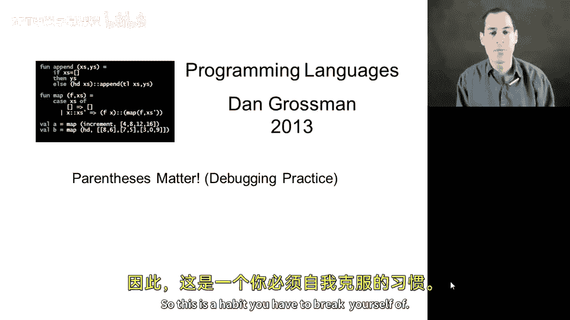

在本节课中，我们将深入探讨 Racket 语言中括号的重要性。括号在 Racket 中并非可有可无，它们具有明确的语法含义。我们将通过一系列示例，特别是阶乘函数的实现，来理解括号的正确使用方式，并学习如何避免和调试因括号使用不当而引发的错误。

## 括号的基本含义

上一节我们介绍了 Racket 的基本语法，本节中我们来看看括号的核心作用。在 Racket 中，括号并非用于增强可读性的装饰，而是具有严格的语法意义。

在大多数情况下，将表达式写在括号中意味着：**先对表达式 `E` 求值，然后将结果作为一个零参数函数进行调用**。这是因为在 Racket 中，函数调用的语法是 `(函数名 参数...)`。如果没有参数，就是零参数调用。

例如，`((E))` 的含义是：
1.  对 `E` 求值。
2.  将第一步的结果作为零参数函数调用。
3.  将第二步的结果再次作为零参数函数调用。

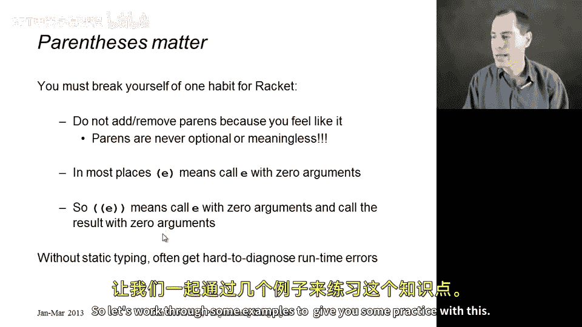

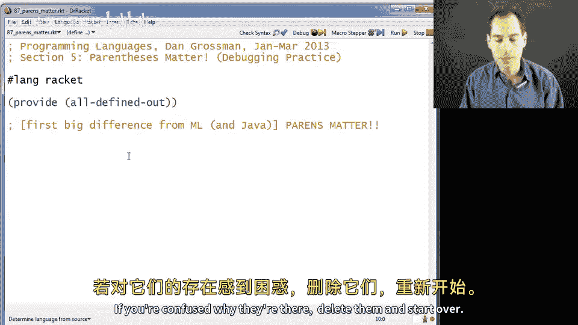

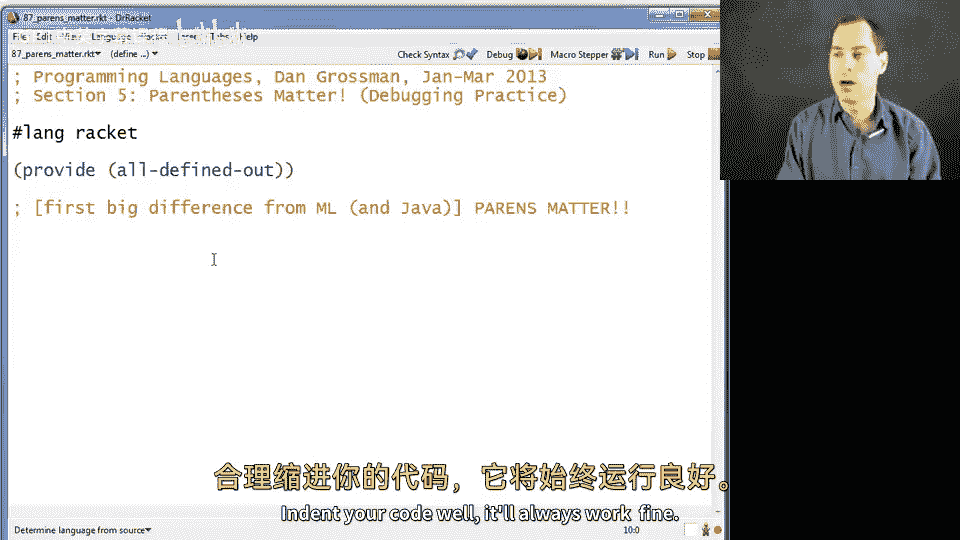

这完全符合语法，但如果你并非此意，就会导致错误。由于 Racket 是动态类型语言，这类错误在保存或点击“运行”时可能不会立即报错，但当代码实际执行时（例如在某个函数体内），就会产生“尝试将非函数对象作为函数调用”的错误，这种错误有时难以诊断。

## 正确的阶乘函数示例

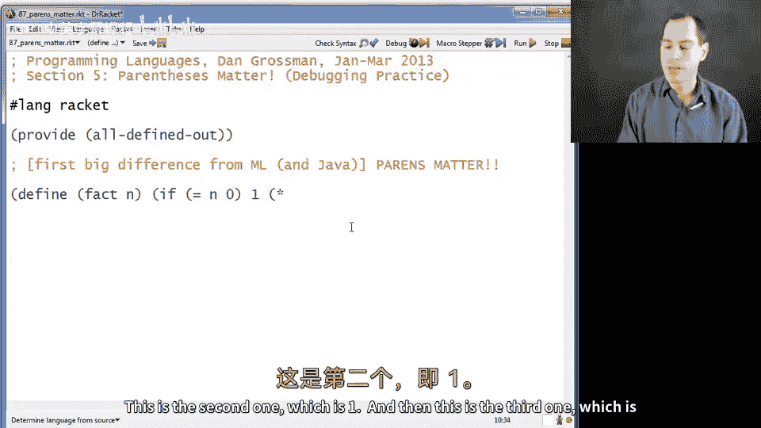

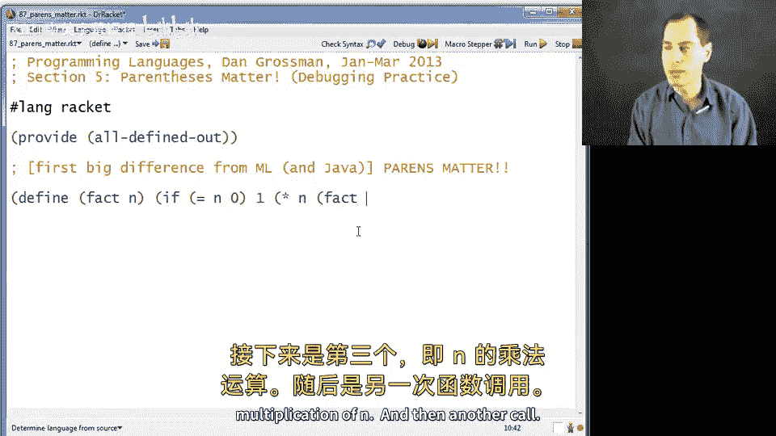

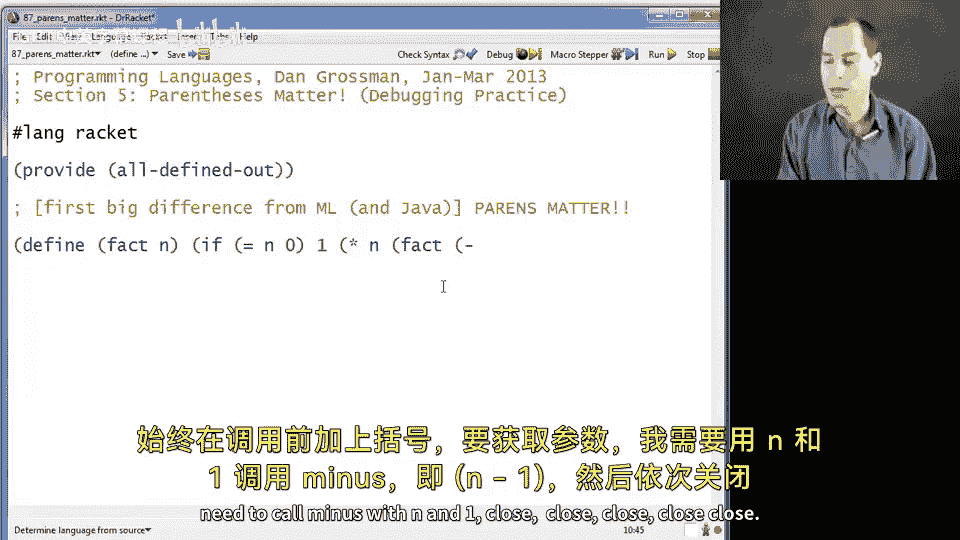

在开始分析错误之前，我们先来看一个正确的阶乘函数实现。以下是实现步骤：

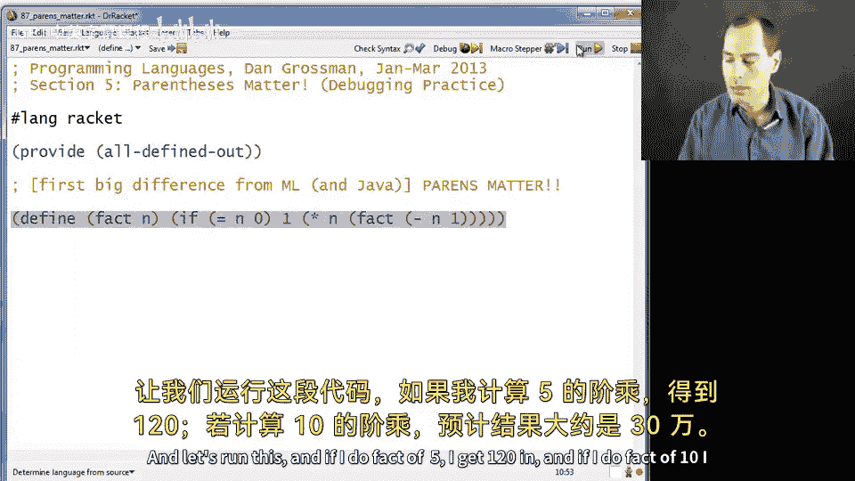

以下是 `fact` 函数的定义：
```racket
(define (fact n)
  (if (= n 0)
      1
      (* n (fact (- n 1)))))
```
*   `(define (fact n) ...)`：定义一个名为 `fact` 的单参数函数。
*   `(if (= n 0) ...)`：`if` 表达式需要三个参数。第一个是条件 `(= n 0)`。
*   `1`：第二个参数，当条件为真（`n` 等于 0）时返回的结果。
*   `(* n (fact (- n 1)))`：第三个参数，当条件为假时执行的表达式。它计算 `n` 乘以 `(fact (- n 1))` 的结果。注意，调用 `fact` 和 `-` 函数时，前面都需要括号。

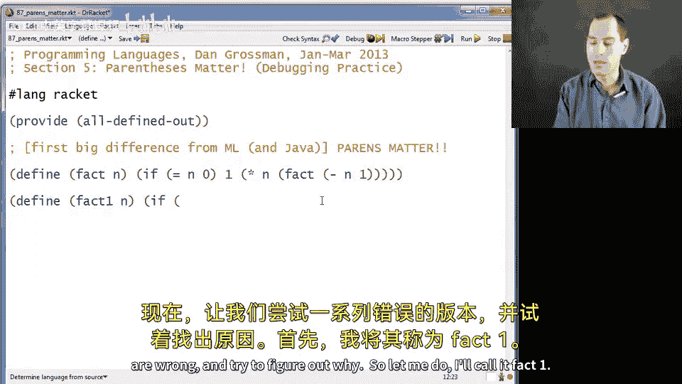

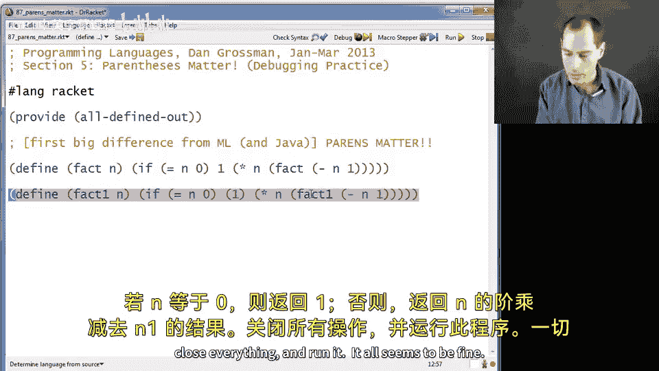

运行 `(fact 5)` 会得到正确结果 `120`。

## 常见的括号错误及分析

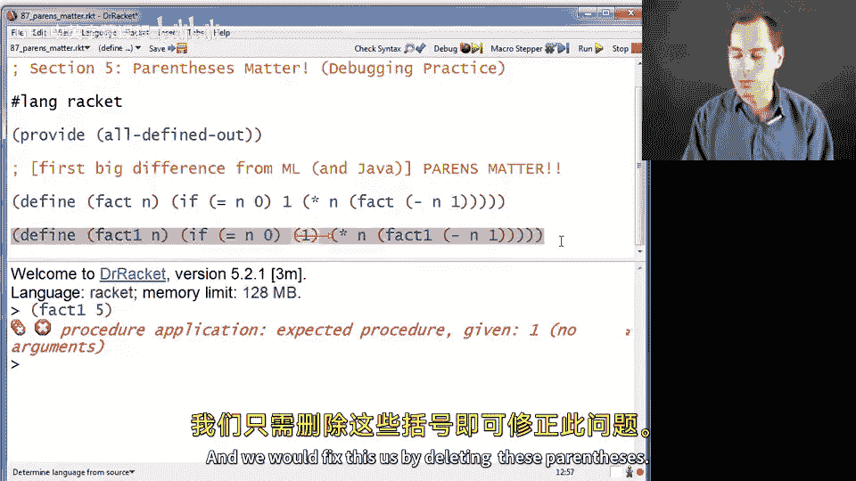

现在，让我们通过几个错误的版本来练习调试，理解括号误用导致的各类问题。

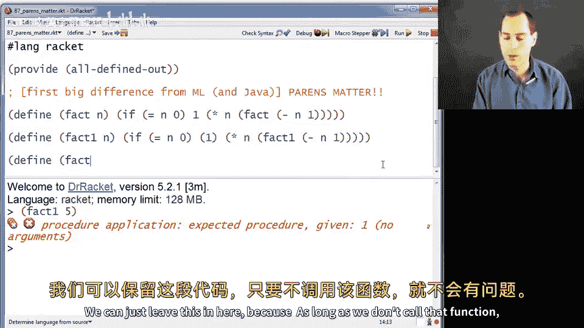

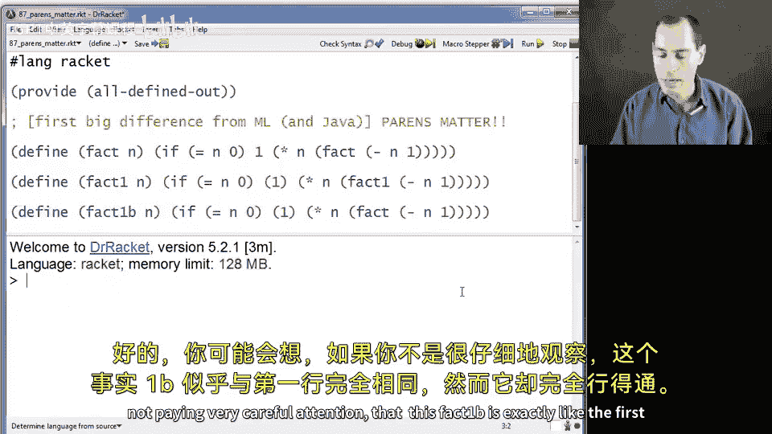

### 错误示例 1：多余的括号导致函数调用

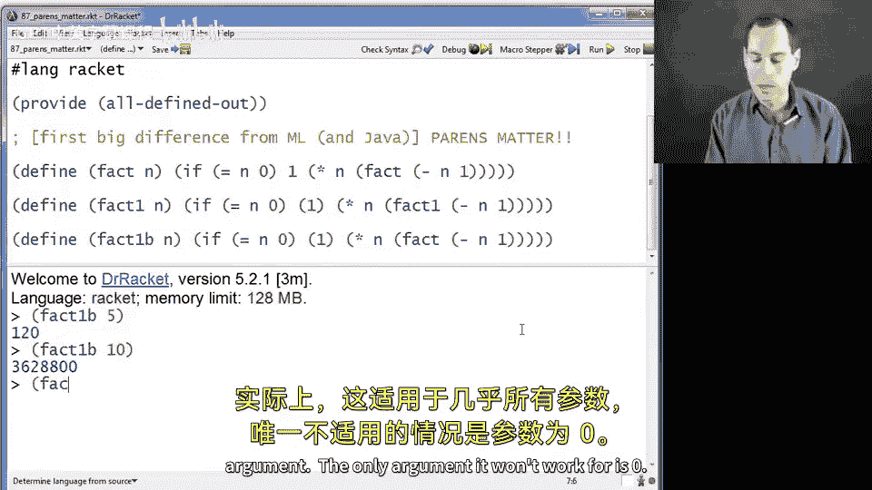

在基础情况（`n` 为 0）的返回值 `1` 外加了括号。
```racket
(define (fact1 n)
  (if (= n 0)
      (1) ; 错误：尝试将数字 1 作为零参数函数调用
      (* n (fact1 (- n 1)))))
```
运行 `(fact1 5)` 时，在递归到基础情况后会报错：`procedure application: expected procedure, given: 1; arguments were: ()`。修复方法是删除 `1` 周围的括号。

### 错误示例 2：错误递归调用掩盖问题

这个版本犯了和 `fact1` 类似的错误，但递归调用时错误地调用了之前正确的 `fact` 函数，而非 `fact1b` 自身。
```racket
(define (fact1b n)
  (if (= n 0)
      (1) ; 错误
      (* n (fact (- n 1))))) ; 注意：这里调用的是 `fact`，不是 `fact1b`
```
调用 `(fact1b 5)` 看似能工作，因为它实际调用了正确的 `fact` 函数。但调用 `(fact1b 0)` 会立即触发与 `fact1` 相同的错误。这提醒我们，递归调用自身时必须确保函数名正确。

### 错误示例 3：`if` 表达式结构错误

忘记了将条件表达式 `(= n 0)` 用括号括起来，导致 `if` 后面跟了 5 个部分，不符合语法。
```racket
(define (fact2 n)
  (if = n 0 ; 错误：`if` 后面跟了 `=`， `n`， `0`， `1`， `(* n ...)` 共5部分
      1
      (* n (fact2 (- n 1)))))
```
这会导致语法错误，无法运行。Racket 会提示：`if: bad syntax (has 5 parts after keyword)`。修复方法是为条件加上括号：`(if (= n 0) ...)`。

### 错误示例 4：函数定义语法错误

在定义函数时，括号的位置放错了。括号应该放在函数名之前，而不是参数列表之前。
```racket
(define fact3 (n) ; 错误：括号位置错误
  (if (= n 0)
      1
      (* n (fact3 (- n 1)))))
```
这会导致语法错误：`define: bad syntax (multiple expressions after identifier)`。正确的定义方式是 `(define (fact3 n) ...)`。

### 错误示例 5：函数调用缺少括号

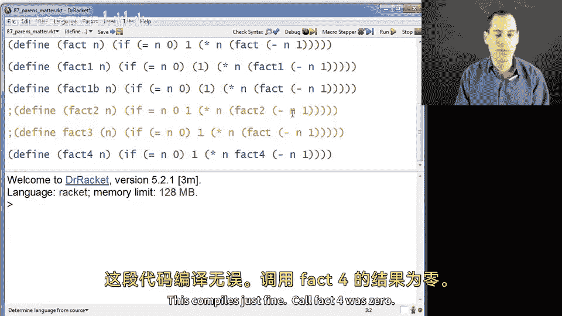

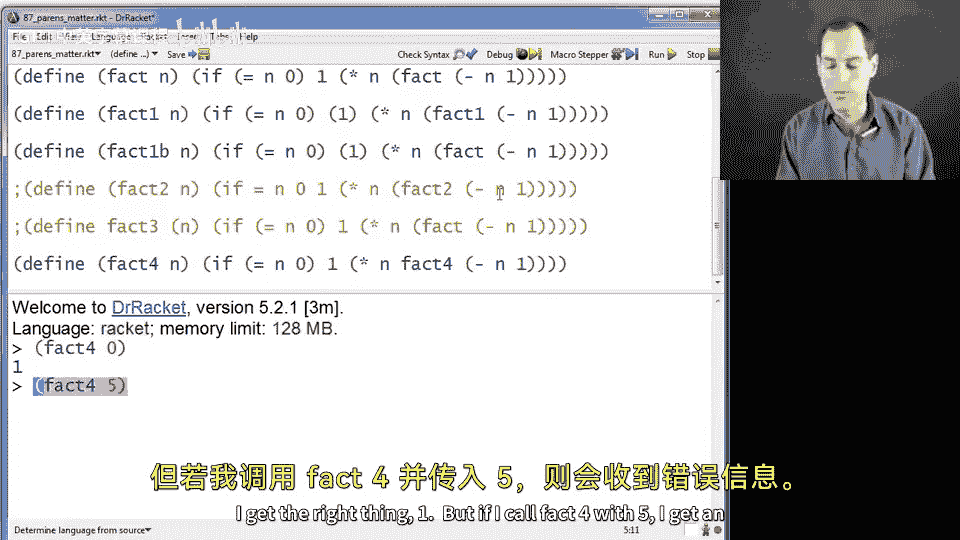

在递归调用 `fact4` 时，忘记在其前面加括号进行调用，导致 `*` 函数收到了三个参数：`n`、函数对象 `fact4` 和 `(- n 1)`。
```racket
(define (fact4 n)
  (if (= n 0)
      1
      (* n fact4 (- n 1)))) ; 错误：`*` 收到了 n, fact4, (- n 1) 三个参数
```
运行 `(fact4 5)` 会报错：`*: expects type <number> as 2nd argument, given: #<procedure:fact4>`。修复方法是在 `fact4` 前后加上括号，使其成为一个函数调用：`(* n (fact4 (- n 1)))`。

### 错误示例 6：函数调用括号过多

在递归调用时，给 `fact5` 加了多余的括号，导致尝试用零个参数调用它。
```racket
(define (fact5 n)
  (if (= n 0)
      1
      (* n ((fact5) (- n 1))))) ; 错误：`(fact5)` 尝试用零参数调用函数
```
运行 `(fact5 5)` 会报错：`procedure fact5: expects 1 argument, given 0`。修复方法是使用正确的调用形式：`(fact5 (- n 1))`。

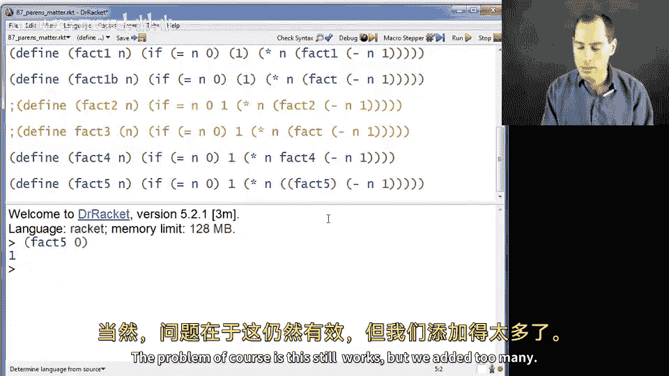

### 错误示例 7：算术表达式写法错误

使用了中缀表达式的习惯来写乘法，这在 Racket 中是不合法的。
```racket
(define (fact6 n)
  (if (= n 0)
      1
      (n * (fact6 (- n 1))))) ; 错误：将 n 放在了操作符 * 的位置
```
运行 `(fact6 5)` 会报错：`procedure application: expected procedure, given: 5; arguments were: * #<procedure:fact6> ...`。错误在于它试图将数字 `n`（例如 5）作为函数来调用，参数是 `*` 和 `(fact6 (- n 1))` 的结果。必须使用前缀表达式：`(* n (fact6 (- n 1)))`。

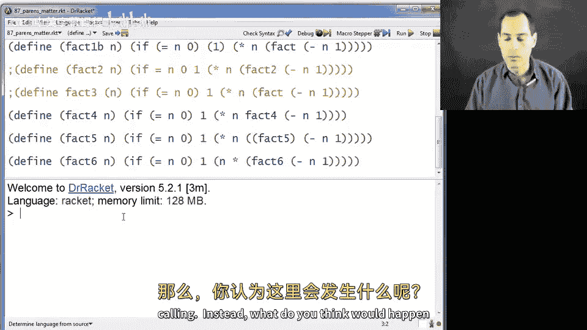

## 总结与调试建议

本节课中我们一起学习了 Racket 语言中括号的关键作用。核心要点是：**括号在 Racket 中始终具有语法含义，主要用于组织表达式和进行函数调用**，不能随意添加或删除。

当遇到令人困惑的错误时，请遵循以下调试建议：
1.  **放慢速度**：不要盲目增删括号。
2.  **仔细思考**：理解你写的每个括号的意图。
3.  **重新开始**：如果感到混乱，删除有问题的括号，根据语法规则重新添加。
4.  **良好缩进**：正确的代码缩进能极大地帮助你识别结构错误。
5.  **理解错误信息**：Racket 的错误信息通常会明确指出问题所在，例如期望的过程类型、给定的参数数量等。

通过反复练习和对语法的深入理解，你将能够熟练而准确地使用括号，从而编写出正确、高效的 Racket 程序。