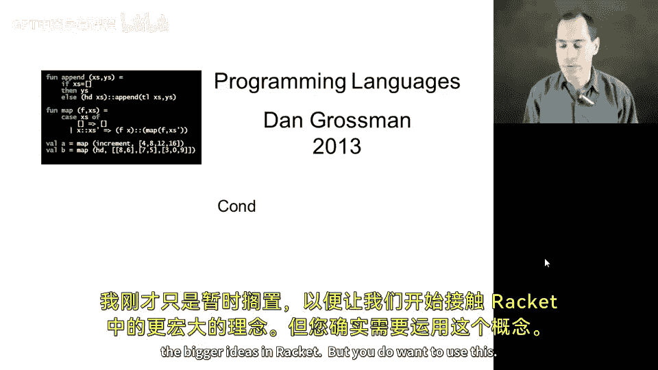
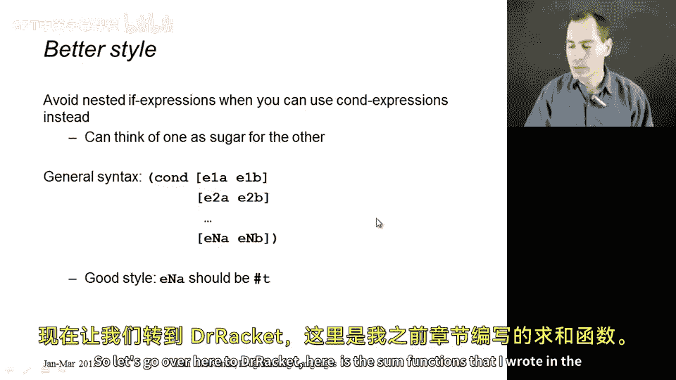
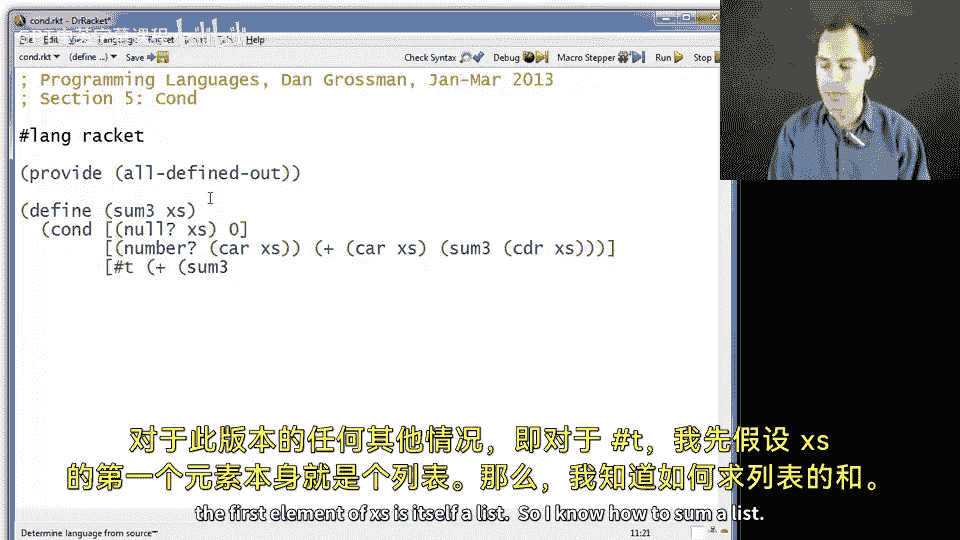
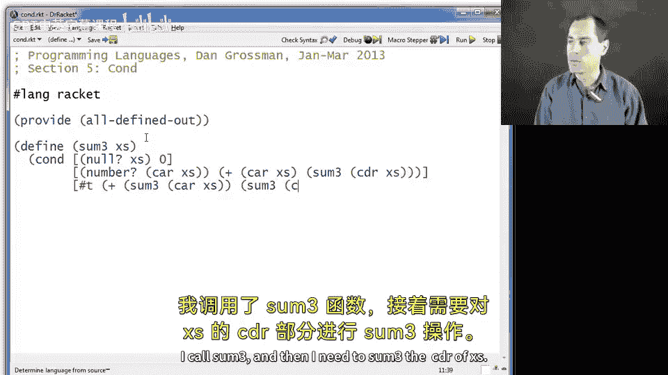
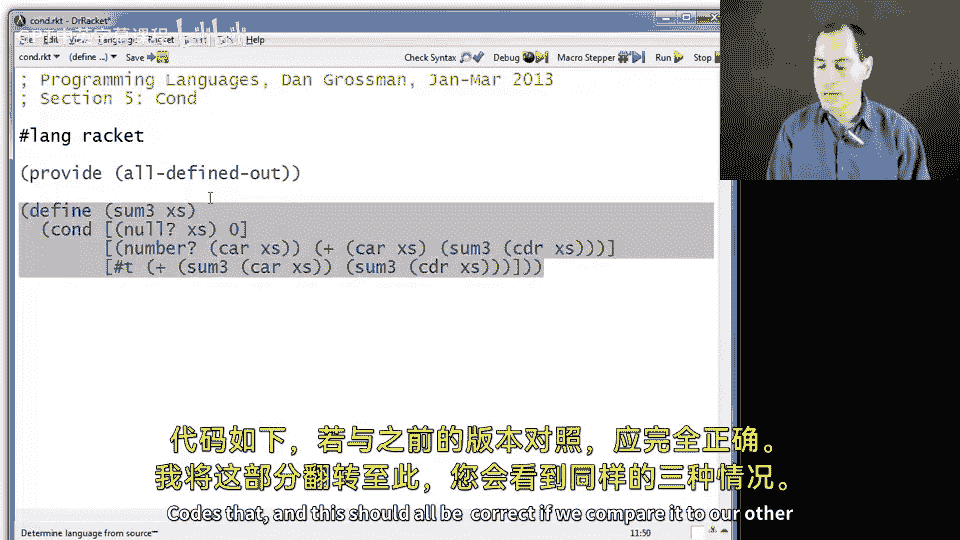
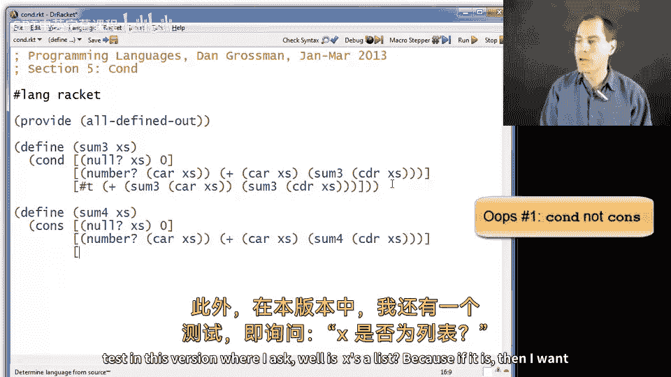
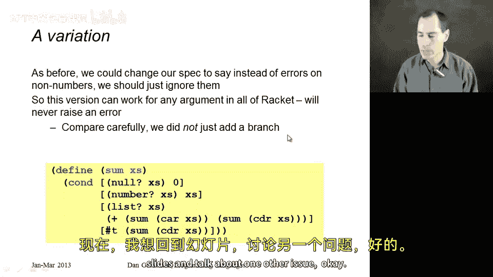
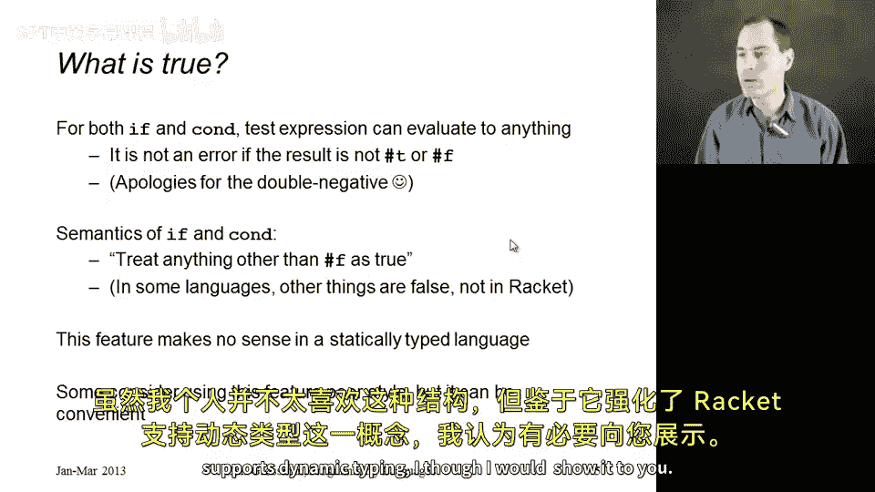
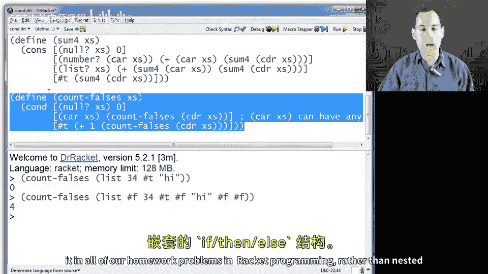

# 【编程语言 A⧸B⧸C CSE341 Coursera】华盛顿大学—中英字幕 p107 9_07_cond -BV1bw4m1D7MM_p107-

In this segment， I want to introduce the con construct into racket。

 It's useful in place of nested if than else expressions。 It's better style。

 and it's not very hard to learn。 I just put it off to get us started with the bigger ideas in racket。

 but you do want to use this whenever you have a bunch of nested ifs where your else branch。

 your false branch is another if and then the else branch of that as another if cond is definitely better style。

 You can think of cond as just syntactic sugar for nested if than else expressions。

 Or if you prefer to think of if then else as syntactic sugar for a con with just two branches。

 that's fine too So here's how cond works。 it's just a special form。 CO and D。

 So of course it has a parenthsesis is a beginning and at the end we then have in parentheses。

 N pairs of expressions。

Right， so I have a bracket because that's the convention semantically。 It doesn't matter。

 Just syntactically， it's better styled have the bracket。 It doesn't matter。

 You can use round parentheses if you want。 Then one expression。

 then another expression and that branch， another one， another one。

 The way this works is all these first ones are tests and all the second ones are what to do if that test is true。

 So if the first one is true， then do the second one else， if this is true， do this one else。

 if this one。 And you stop， and your result is the first branch where the thing on the left was true。

 And then you evaluate the thing on the right and that's your answer。Now， as a matter of style。

 it's very important that your last branch typically be just true， which we write in racket hash T。

 this is your default case， this is saying in any other case。

 I want to evaluate this last expression and that's my answer。

 If you do not do this and your last test expression also evaluates to false then K will return some strange void object which is a bad idea in racket it will not produce an error here。

 but probably it's going to return some result that someone else doesn't want to use and you'll end up confusing yourself so always make your last branch have as its test true。

Okay so let's go over here， Dr。 Raet， here is the sum functions that I wrote in the previous segment。

 so this first one works on a list of numbers that could have nested within them other list of numbers and so on is deep as you want and it's an error to have anything in there that's not a list or a number and then the second version that if there's some nonlist or non-ner nested somewhere in a list we just skip over it and we can rewrite each of these using con and so I'm going to do that just in a different file here there we go。

 and this will not be very difficult， So I'll call these sum3 and sum4 to continue what we're doing in the previous section and I can have a con which of course can have any number of branches I want and the first branch will be that if the input X's is the no list。

 the empty list the result should be zero。

Otherwise， if the first element is a number。 So number of car of x's， then add the car of x's。Two。

 the recursive sum of the cutter of x's。That will end that branch notice you can type round parentheses and if they match square brackets。

 Dr。 Raett will turn it into a square bracket for us， and in any other case for this version。

 so for hash T， I'll go ahead and assume that the first element of x's is itself a list so I know how to sum a list I call sum3s and then I need to sum3 the co of x's。

Gos that。 And this should all be correct。 If we compare it to our other version。

 I'm going to flip that over here， you'll see that we have the same three cases。 If it's null 0。

 the first number， first thing list is a number， do this edition， Otherwise do this edition。

 but you'll probably agree with me that it's easier to read laid out as this cons。

 And we can see the three tests， null number and true quite easily。

 and then what to do in each case by the expression that follows the test。

So that's sum 3 now let me quickly do sum 4， it's the same idea。

 I'll have a con and if the list is empty， then return zero。

If the first thing in the list is a number， then sorry number of x's， and in fact。

 it's exactly the same as before， Car of x is some4 now cutter of x's。Otherwise。

 I have another test in this version where I ask， well， is x is a list because if it is。

 then I want to do what I used to do just by the default assumption。

 But this time I checked that it was a list。 So you can see the difference between the two versions quite easily。

 And in any other case， skip the car of x's and just sum the cutter of x's。 And if you look back。

 this is exactly like sum 2， just laid out nicely with the con construct。 So that's our example。

 Now what I want to do is go back to the slides and talk about one other issue。 as before， oh， sorry。

 here's where I want to go。 Okay， so for both if and con， I just didn't tell you this for if。

 And now I'm telling you for both the test expression。 that first expression does not have to be。

True or false， hash T or hash F。It turns out it can be anything。 It's never an error。 And it's fine。

 So what is the semantics， The semantics and racket is that anything other than false counts as true。

 So the only way to take the false branch is if you have hash F。But to take the true branch。

 you do not need hash T。 You just need anything that is not hash F。

This is fairly common in dynamically typed languages。

 some dynamically typed languages make other things false。

 things like the empty list or the empty string or things like this。

 that's not true in racket and racket there's exactly one thing that's false and that's hash F。

 Everything else counts as true。Now this makes no sense in aesthetically typed language in aesthetic statically typed language。

 we would insist that a conditional expression takes something of type bo for its first argument。

 since everything has exactly one type， there's no point in allowing anything to be in that first position but in a language like racket。

 you can do this Now a lot of people consider this bad style。

 a lot of people consider this convenient and okay and some people are kind of in between and say it depends on the situation。

 I'm not a huge fan of this construct， but since it reinforces the idea that racket supports dynamic typing I thought I would show it to。

 So let's do a couple quick examples here。

So first of all， let me just click run and do something at the repple here。

 So what if I said if 34 then 14。Else 15， well， since 34 is not false， it must be true， and I get 14。

Okay， so it's just that simple。 And I could say if empty list 14 elses 15。

 and I would get 14 and so on。 But if I say hash false。Then I get 15。

So now let me just paste in a quick example of where this is useful I don't want to take the time to type it all out。

 and you don't need this， you could get by and rack it without this feature。There we go。

 So what this function does is it count。 It takes in a list， just a list。

 No nested lists or anything。 and counts how many falses are in it。 Okay。

 so let me just run this so we can see it in action。

 And so if I count falses of the list of 34 true and high， I should get 0。

 But if I add in here a couple falses， maybe one at the beginning one there and how about a couple at the end。

Then I get 4。 that's all it does。 It counts how many falses there are。 Use cond。

 which we introduced here。 And we say that if the list is empty， then there are zero falses in it。

If the car of x's is not false。Well， here is one way to do that right if car of x's is anything other than false。

 then this test will be true， and so we'll recursively count the falses in the cutudter。

 and in any other case， the only case that's left is that the first thing in the list was false。

 and then we would add one to count falses of coter of x's so that is an example of using this feature that everything that is not hash F is true。

 the only thing that is false is hash F。 but the main idea in this segment was using con for better style。

 and now we can use it in all of our homework problems in racket programming rather than nested if than else's。

