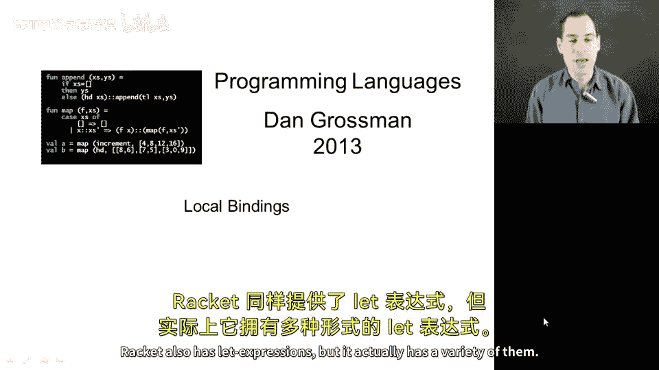
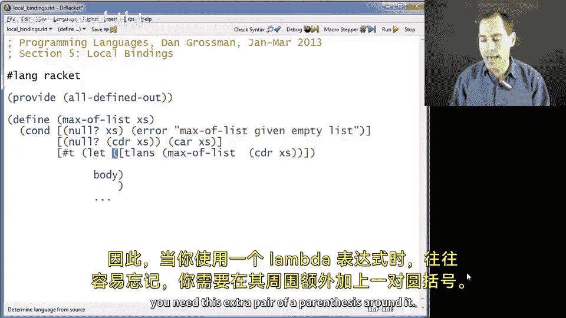
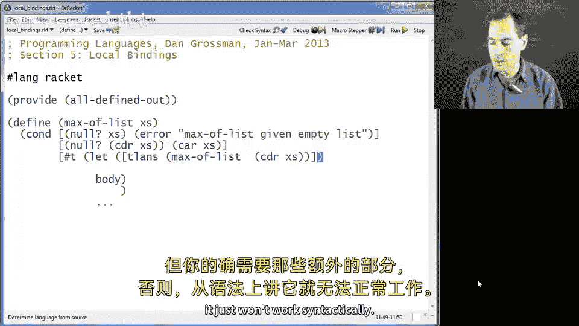
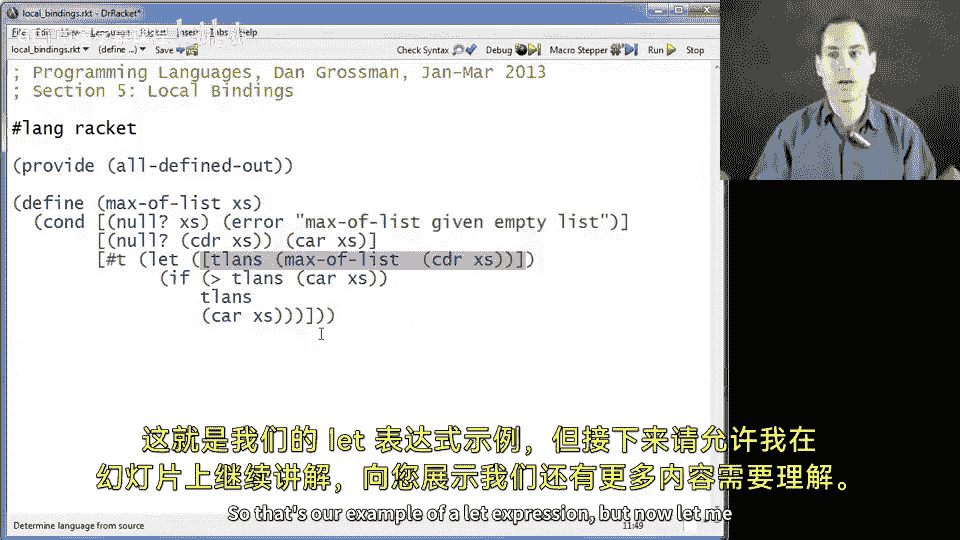
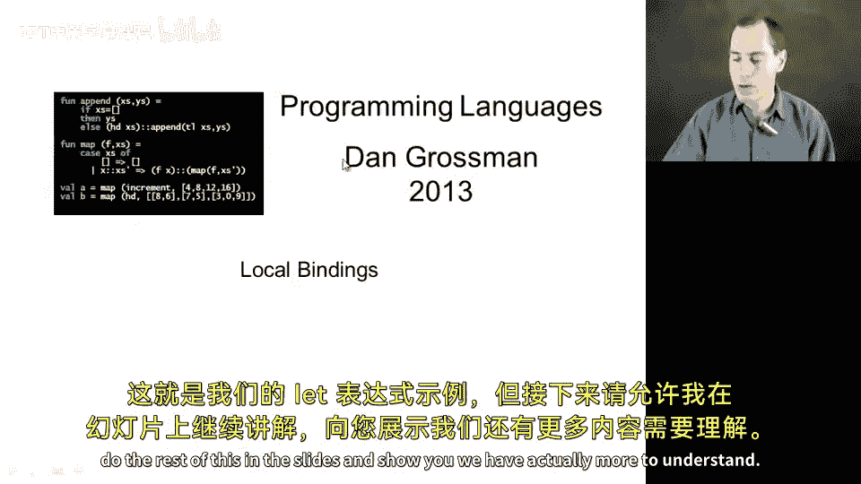
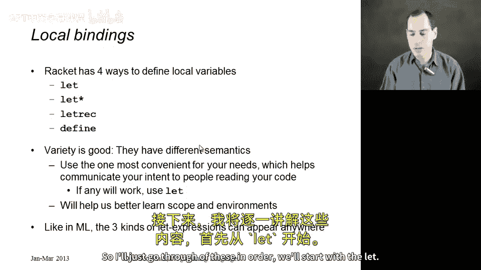
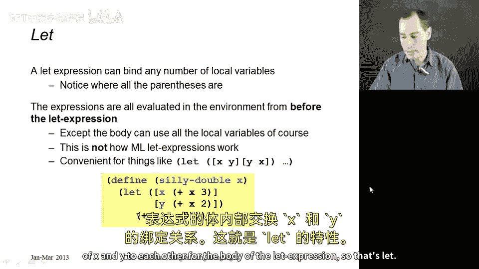
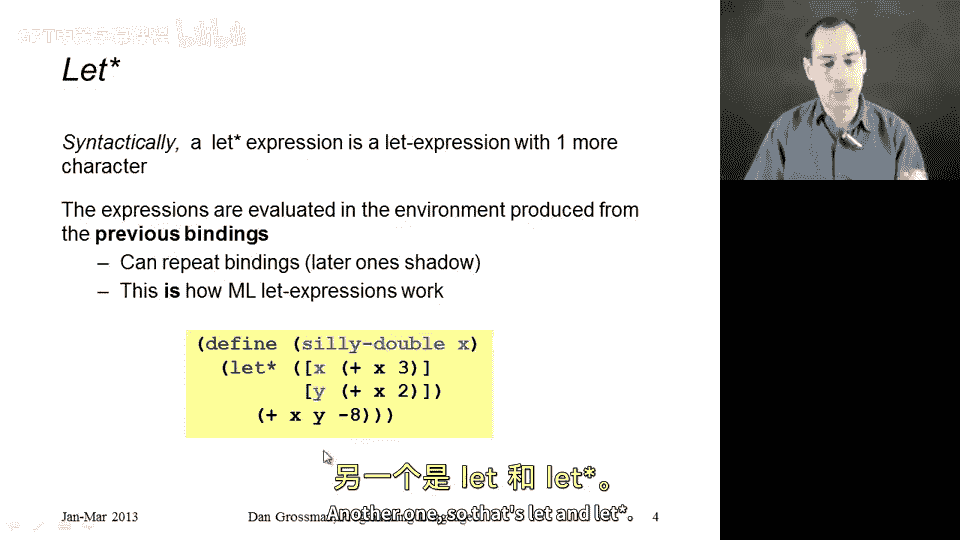
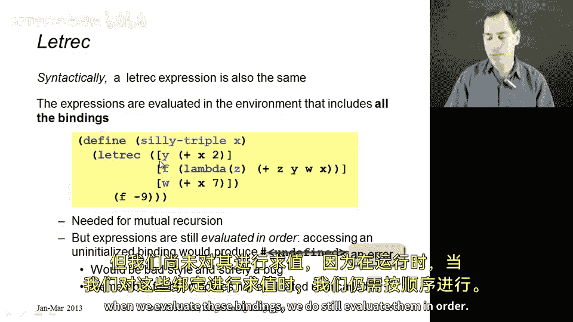
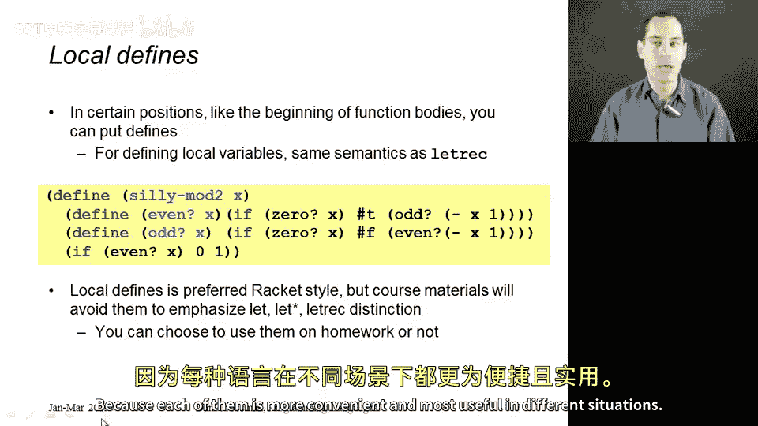

# 编程语言 A/B/C CSE341 Coursera：10：Racket 中的局部绑定 🧩

在本节课中，我们将学习 Racket 语言中的局部绑定机制。我们将探讨几种不同的 `let` 表达式形式，理解它们各自独特的语义和适用场景，并通过具体示例来掌握其用法。

## 概述



Racket 提供了多种定义局部变量的方式，包括 `let`、`let*`、`letrec` 和局部 `define`。这些形式在变量作用域和绑定时机上存在差异，理解这些差异对于编写正确且清晰的 Racket 代码至关重要。

## `let` 表达式基础

首先，我们来看一个使用 `let` 表达式的简单示例：计算一个数字列表中的最大值。

```racket
(define (max-of-list xs)
  (cond
    [(null? xs) (error "列表为空")]
    [(null? (cdr xs)) (car xs)]
    [else
     (let ([tail-ans (max-of-list (cdr xs))])
       (if (> tail-ans (car xs))
           tail-ans
           (car xs)))]))
```





在上面的代码中，我们使用 `let` 创建了一个局部变量 `tail-ans`，它保存了列表尾部（`cdr`）的最大值。这样我们就避免了在递归中对同一列表进行多次计算，防止了性能上的指数级爆炸。



`let` 表达式的基本语法结构如下：



```racket
(let ([var1 exp1]
      [var2 exp2]
      ...)
  body)
```

其中，`[var1 exp1]` 等是变量绑定，`body` 是表达式主体。所有初始化表达式（`exp1`, `exp2`...）都在 `let` 表达式**之前**的环境中求值，它们**不能**相互引用。



## 三种 `let` 表达式的语义对比

Racket 拥有 `let`、`let*` 和 `letrec` 三种形式，它们的主要区别在于变量绑定创建的作用域不同。

### 1. `let`：并行绑定

在 `let` 表达式中，所有绑定是“并行”创建的。每个初始化表达式都在外层环境中求值，彼此之间看不到对方。

```racket
(define (silly-double x)
  (let ([x (+ x 3)]
        [y (+ x 2)])
    (+ x y -5)))
```

在这个例子中，两个绑定 `[x (+ x 3)]` 和 `[y (+ x 2)]` 中的 `x` 都指向函数参数 `x`，而不是新绑定的 `x`。因此，如果传入参数 `5`，计算过程为：`x` 绑定为 `8`（5+3），`y` 绑定为 `7`（5+2），最终结果为 `8 + 7 - 5 = 10`，即参数的两倍。



`let` 的这种语义在需要交换变量值时非常方便：
```racket
(let ([x y]  ; 这里的 y 是外层的 y
      [y x]) ; 这里的 x 是外层的 x
  ...)       ; 在主体中，x 和 y 的值完成了交换
```

### 2. `let*`：顺序绑定

`let*` 的语义与 ML 语言中的 `let` 相同，绑定是“顺序”创建的。每个初始化表达式都可以使用前面已经绑定的变量。

```racket
(define (silly-double x)
  (let* ([x (+ x 3)]
         [y (+ x 2)])
    (+ x y -8)))
```



此时，第一个绑定 `[x (+ x 3)]` 中的 `x` 是函数参数。第二个绑定 `[y (+ x 2)]` 中的 `x` 则是新绑定的 `x`（即参数加3）。因此，对于参数 `5`：`x` 绑定为 `8`，`y` 绑定为 `10`（8+2），最终结果为 `8 + 10 - 8 = 10`，同样是参数的两倍。

当后续绑定需要依赖前面绑定的值时，应使用 `let*`。

### 3. `letrec`：递归绑定

`letrec` 允许所有绑定（包括后面的）在初始化表达式的环境中都可见。这主要用于定义**相互递归的函数**。

```racket
(define (triple x)
  (letrec ([y (+ x 2)]
           [f (lambda (z) (+ x y z w))]
           [w (+ x 7)])
    (f -9)))
```



在这个复杂的例子中，函数 `f` 的定义（第二个绑定）中使用了后面才绑定的变量 `w`。这是允许的，因为 `f` 是一个函数，其函数体在定义时并不会立即求值，只有在调用时才会。当调用 `(f -9)` 时，所有变量（包括 `w`）都已完成初始化。

`letrec` 的一个典型应用是定义互递归函数来判断奇偶性：

```racket
(define (mod2 x)
  (letrec ([even? (lambda (n) (if (= n 0) 0 (odd? (- n 1))))]
           [odd?  (lambda (n) (if (= n 0) 1 (even? (- n 1))))])
    (even? x)))
```

**重要警告**：虽然 `letrec` 允许向前引用，但初始化表达式仍然是按顺序求值的。如果在一个变量的初始化表达式中直接（而非通过函数间接）使用了后面尚未求值的变量，会导致未定义行为或错误。因此，`letrec` 应谨慎使用，通常仅用于互递归函数定义。

## 局部 `define`

除了 `let` 系列表达式，Racket 还允许在函数体内部使用 `define` 来创建局部绑定，其语义与 `letrec` 完全相同。

```racket
(define (mod2 x)
  (define even? (lambda (n) (if (= n 0) 0 (odd? (- n 1)))))
  (define odd?  (lambda (n) (if (= n 0) 1 (even? (- n 1)))))
  (even? x))
```

目前 Racket 社区更推崇使用局部 `define` 的语法风格。你可以根据喜好和代码清晰度来选择使用 `let`/`let*`/`letrec` 或是局部 `define`。

## 总结

本节课我们一起学习了 Racket 中四种定义局部绑定的方式：
1.  **`let`**：并行绑定。初始化表达式在外层环境求值，互不可见。适用于交换变量值或无需相互引用的简单绑定。
2.  **`let*`**：顺序绑定。每个初始化表达式可以看见前面绑定的变量。语义与 ML 的 `let` 相同，是最常用的一种。
3.  **`letrec`**：递归绑定。允许所有绑定相互可见，主要用于定义相互递归的函数。需注意避免在初始化表达式中直接向前引用。
4.  **局部 `define`**：在函数体内使用 `define`，语义同 `letrec`，是 Racket 社区推荐的新风格。



理解这些绑定形式的差异，不仅能帮助你正确编写 Racket 代码，更能加深你对编程语言中作用域和环境概念的理解。在实际编码时，请根据需求选择最清晰、最合适的绑定形式。