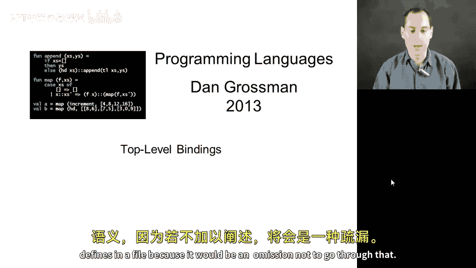
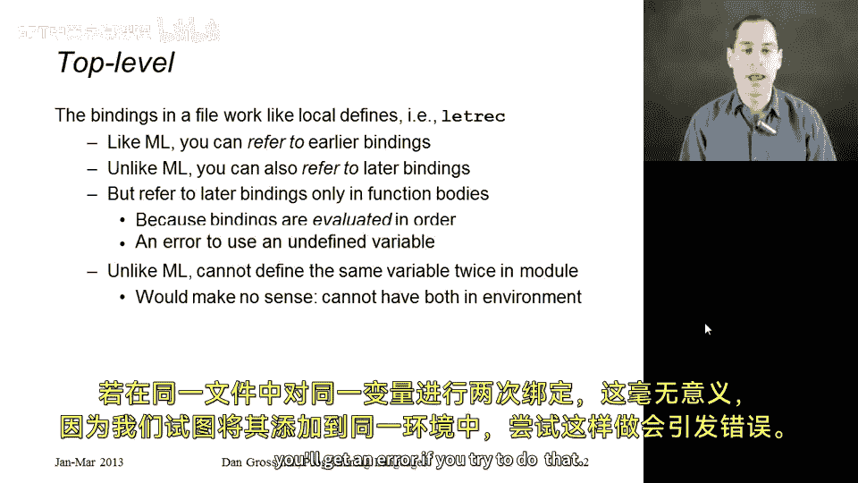
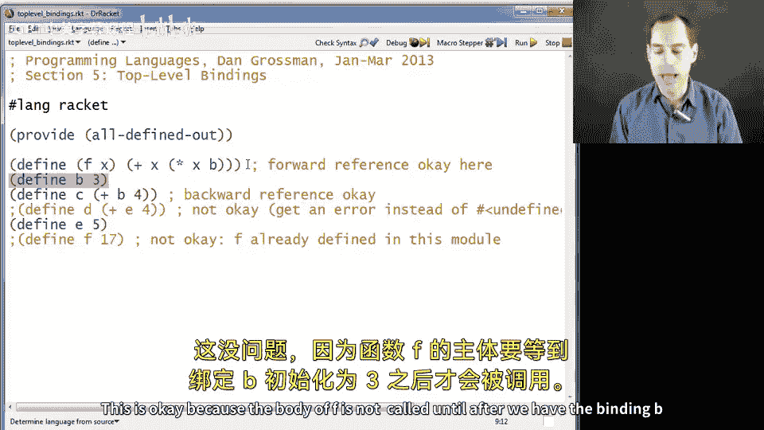
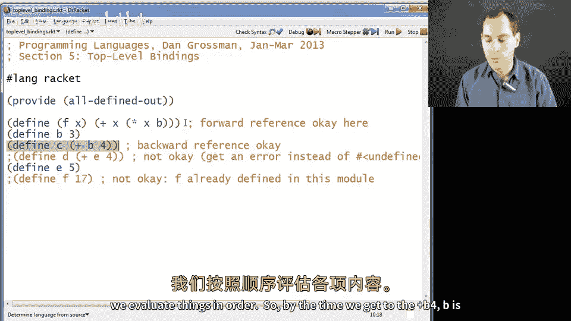
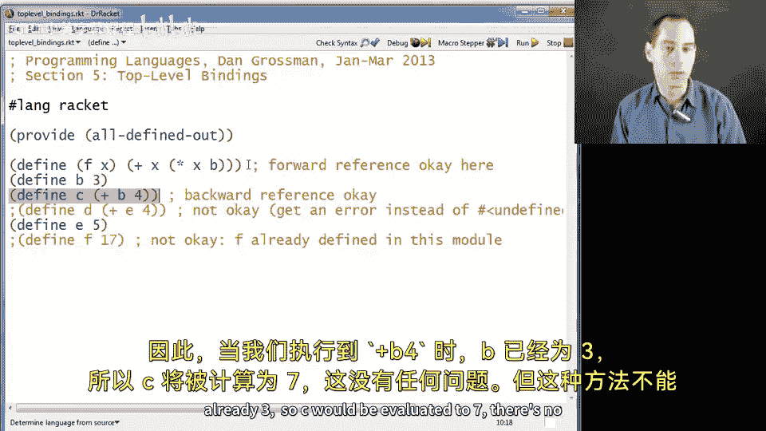
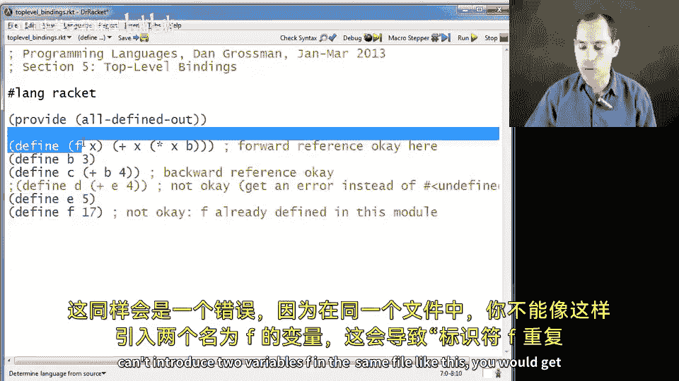
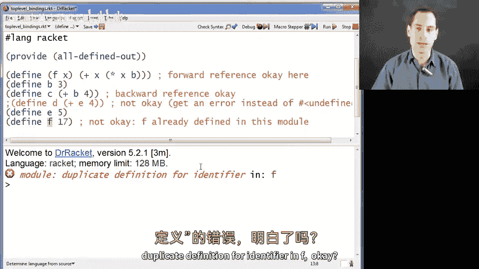
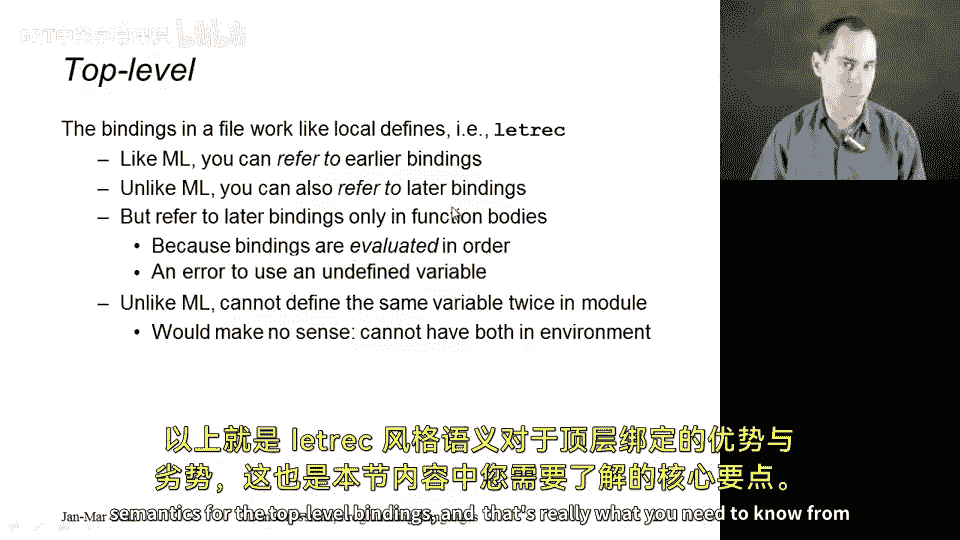
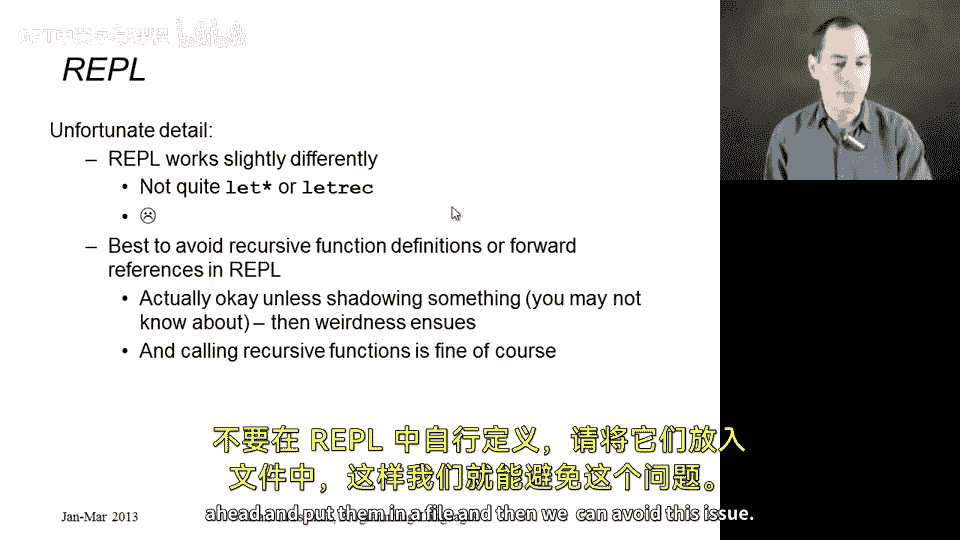
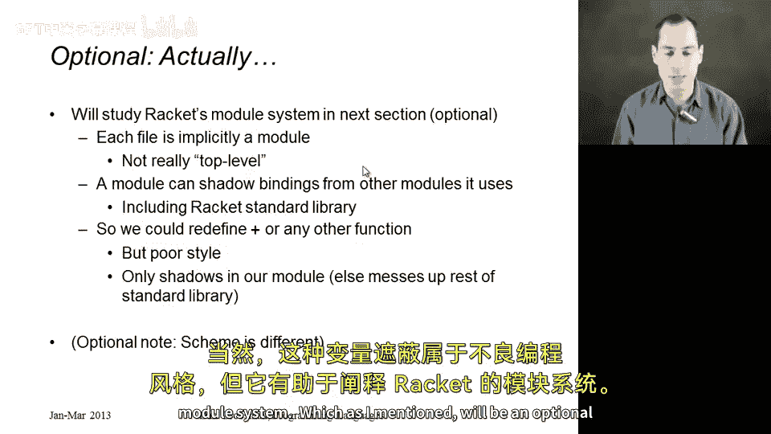

# 编程语言 A/B/C CSE341：11：顶层绑定语义详解 🧠

在本节课中，我们将要学习顶层绑定的语义规则。我们已经讨论了局部绑定的工作原理，现在来看看在文件中的 `define` 语句（即顶层绑定）是如何工作的。理解这一点至关重要，否则知识体系将不完整。

## 核心语义：类 `letrec` 风格

顶层绑定的简短版本是：它们的工作方式类似于 `letrec`，或者说类似于局部的 `define`。这意味着绑定可以按顺序求值，并且可以引用后续的绑定，这与 ML 语言不同。



具体来说：
*   可以引用**先前**的绑定（与 ML 和 `let*` 相同）。
*   可以引用**后续**的绑定（这是与 ML 的关键区别）。

然而，由于是按顺序求值，你必须谨慎引用后续绑定。以下是关键规则：

*   **规则**：你只应在**函数体**中引用后续绑定。
*   **规则**：你必须确保，在引用的绑定完成其表达式求值**之前**，那些函数**不会被调用**。

如果违反此规则（例如在非函数体的表达式中直接引用后续定义），在 Racket 中会导致错误，这与函数内部可能产生未定义结果的情况不同。

## 示例与规则详解

以下是几个代码示例，具体说明了顶层绑定的工作方式、允许的操作以及会导致错误的操作。

### 示例1：在函数体中正确引用后续绑定



```racket
(define (f x) (+ x b)) ; 函数 f 在其体中引用了后续定义的 b
(define b 3)           ; b 在此处定义
; 调用 (f 10) 将得到 13，因为调用发生在 b 被绑定为 3 之后。
```



这个例子是可行的，因为函数 `f` 的定义虽然引用了尚未定义的 `b`，但 `f` 的**函数体**在 `b` 被求值并绑定为 `3` 之前**不会被执行**。任何对 `f` 的调用都发生在 `b` 完成定义之后。

### 示例2：引用先前的绑定





```racket
(define b 3)
(define c (+ b 4)) ; c 被求值为 7
```
这就像在 ML 或 `let*` 中一样，按顺序求值，当计算 `c` 时，`b` 已经是 `3`，因此没有问题。

### 错误示例1：在非函数体中引用后续绑定

```racket
(define d (+ e 5)) ; 错误！在 e 定义之前就试图使用它。
(define e 10)
```
如果取消这行注释并运行，Racket 会报错：`reference to an identifier before its definition`。这正是我们强调的错误。





### 错误示例2：在同一文件中重复定义（遮蔽）

```racket
(define (f x) (* x 2))
(define f 17) ; 错误！在同一文件中不能有两个同名的绑定。
```
尝试这样做会导致错误：`duplicate definition for identifier`。在同一个文件（模块）内，你不能对同一个变量名进行多次定义或遮蔽。

## 交互环境（REPL）的特殊性

上一节我们介绍了文件中的顶层绑定规则，本节中我们来看看交互环境（REPL）的特殊情况。REPL 的行为并不完全像 `letrec`，也不完全像 `let*`，事实上，它的行为并不总是完全“正确”。

在正常使用中，REPL 通常会如你所愿地工作，就像我们在 ML 和 Racket 中使用的那样。但是，存在一些边界情况，特别是当你试图遮蔽（即使是标准库中）已经定义的内容，并且定义递归函数时，事情可能会出错。

因此，一个简单的解决方案是：





*   **建议**：在 REPL 中，**不要定义你自己的递归函数**。
*   **建议**：调用由你运行的文件所定义的递归函数是没问题的。
*   **建议**：将你自己的递归函数放在文件中定义，然后运行该文件，这样可以避免此问题。

## 模块系统的前瞻（可选）

最后，作为一个可选的知识点，我想提一下 Racket 的模块系统。从技术上讲，我之前称其为“顶层绑定”并不完全准确。在 Racket 中，每个文件都隐式地处于其自己的模块中。

不过，该模块内部仍然具有 `letrec` 风格的语义，因此我展示的所有代码示例都是正确的。关键在于，**跨文件时**，并不是一个大的 `letrec`，而是每个文件有自己独立的 `letrec` 环境。

你可以从一个文件（模块）引入内容到另一个文件，并且你可以在自己的模块中遮蔽从其他模块引入的定义。例如，`+` 只是一个在标准库其他模块中定义的函数，你甚至可以在自己的文件中遮蔽 `+` 函数，但每个文件内部仍然只能定义一次。当然，这种遮蔽通常是不好的风格，但它有助于解释 Racket 的模块系统，这将是课程后期的一个可选主题。

## 总结



本节课中我们一起学习了 Racket 中顶层绑定的语义。核心要点是：文件中的 `define` 序列具有类 `letrec` 的语义，允许引用后续绑定，但必须仅在函数体中进行此类引用，并确保函数在依赖项定义后才被调用。同时，我们了解到在同一文件内不能重复定义（遮蔽）变量名，并注意到了 REPL 环境中的特殊注意事项。最后，我们前瞻了每个文件都是一个独立模块的概念，这为理解更复杂的代码组织方式奠定了基础。