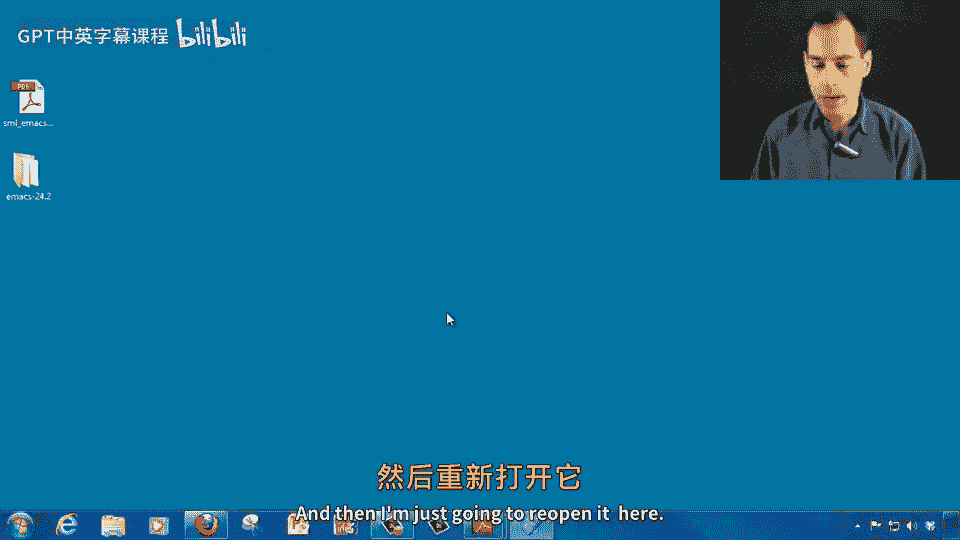
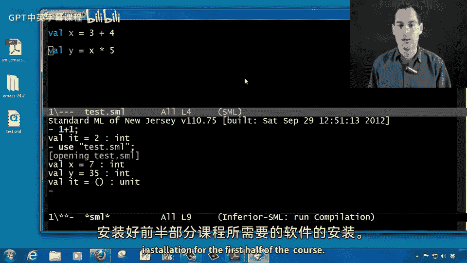

# 【编程语言 A⧸B⧸C CSE341 Coursera】华盛顿大学—中英字幕 p11 10_04_sml-mode-installation -BV1bw4m1D7MM_p11-

Right now what we're going to do is we're going to get SmL mode for Emax installed。

 So we've installed Emax and we've installed SmL。 but now we want to make emax convenient and useful for both writing and running Sml programs。

 So we're going to do this entirely from within Emax。

 So the first thing I'm going do is open it just going to type emax here and run it You're going to see some slightly different colors here and you're not going to see the menu bar。

 that is just formatting that I did so that it's easier to see on the video you probably still have a white background and that's just fine So now I've opened emax。

 I'm now going to run a command metax list packages So on a Windows keyboard I'm going type alt X and then type list either space。

 although it'll print as a dash or you could type the dash packages and hit return And what that's going to do if you're an Emax version 24 something or higher is bring up a list of packages that are easy to install。

 If you have an older version of Emax or you're not。To the Internet。

 you're going to have to follow some significantly more complicated instructions and an older version of SML mode and the written instructions do walk through that。

 But assuming you've got this screen to go up， you can just scroll down either with your mouse or with your keyboard。

 down here to SM L dash mode。 And then you can just take your mouse and click on that。

 That's going split the screen in two here。 So I'm now seeing two buffers in Emax。

 And you can just click on this install button。😊，It's going to ask if I want to install it。

 I clearly do。And a minute later， it says that everything's installed。

 Now what I want to do is go ahead and exit Emax with control X， control C。

 And then I'm just going to reopen it here。

And bring that back over so you can see it and get that nice big font again。

 And now we just want to check that we've done it correctly。

 We are done installing so you want to open an Sml file Now you can use control X control F and then the file name to do this or if you have a file created and I'm just gonna create one over here on the desktop I'm not going give it a Txt extension I'm going to call it something like test do Sml So I'll get a warning saying you really want to change the file extension and I do because when you have something with an Sml file extension。

 Eax should now know that it's an Sml file So I can literally just drag that onto Emax and you'll notice down here in the bottom。

 the mode line says I'm editing an editing an Sml file。

 So if you wrote SmL code which if you haven't learned how to do yet you will soon something like Valal X equals 3 plus4 Val Y equals x times5 you'll see coloring we had multiple lines here you'd see nice。

Indentation by hitting the tab key and etcter。 When I want to save the file。

 I type control X control S。 Now， what if I wanted to run SmL， I'm not going do that in this buffer。

 but I can do it from within Eax。 Anytime I'm editing a dot Sml file。

 I can just type control C control S Now， All I did was type control C control S。

 What's come up is Sml command Sml hit return。 It's going split my buffer in2。

 And now here at the bottom。 I do have an Sml read aval print loop。

 where I could type1 plus1 semicolon and get2。In fact， because I did that from that test SmL file。

 I'm in the same folder directory as I was over there。

 so if I want to load the contents of that file， I can say use， and then in quotation marks， test。

 SMm and semicolon and indeed it just ran that program and said x is 7 and y is 35 so we have everything correctly installed。

 we can now use SML from within ems， edit our files in there and we're all set with installation for the first half of the course。

