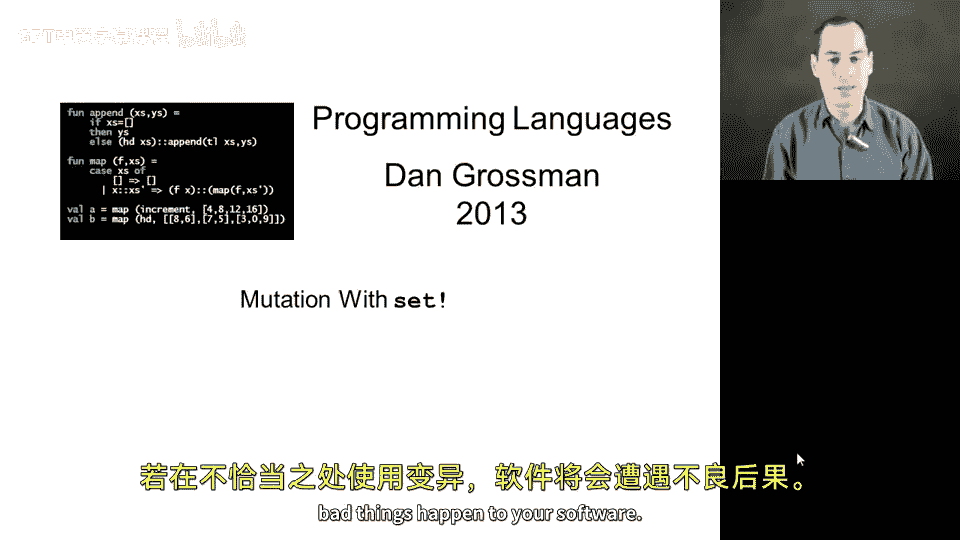
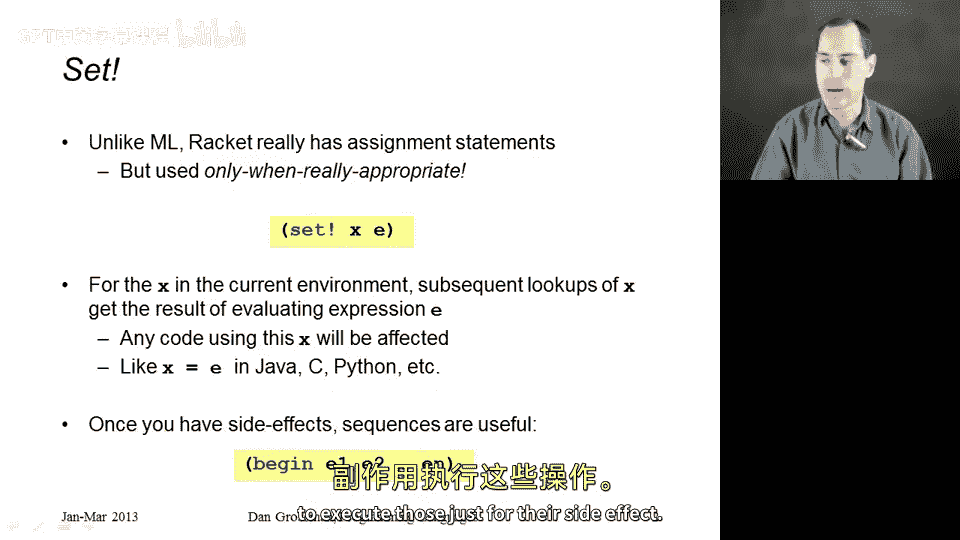
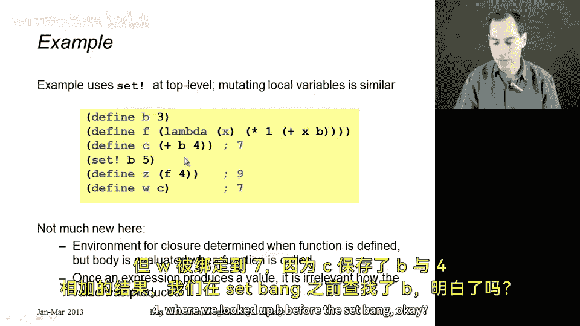
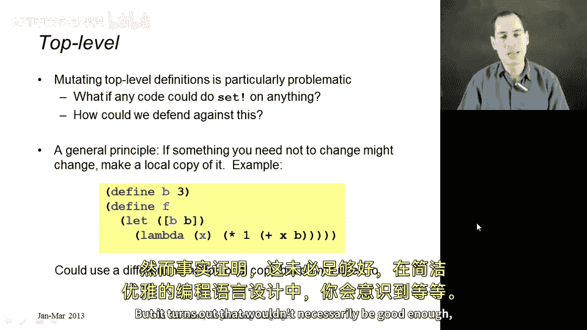
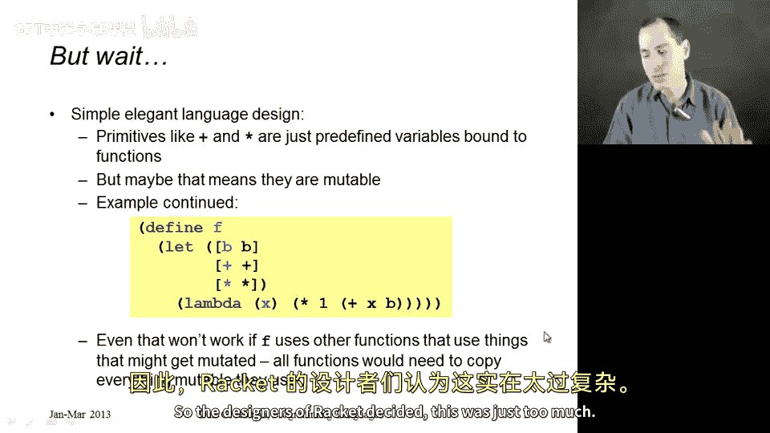
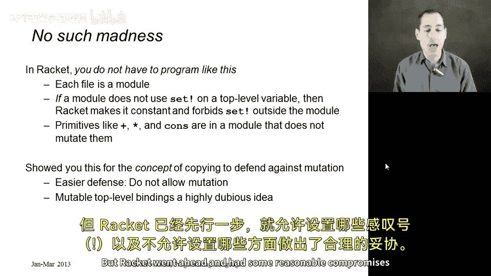

# 编程语言 A/B/C CSE341 Coursera：12：使用 set! 进行变量修改 🛠️

在本节中，我们将学习 Racket 语言中的变量修改功能。具体来说，我们将探讨 `set!` 语句的工作原理、它可能引发的问题，以及如何避免这些问题。通过本节的学习，你将理解为什么在函数式编程中应谨慎使用变量修改。



---

## 概述 📋

在本节中，我们将要学习 Racket 语言中的变量修改功能。虽然 Racket 主要是一种函数式编程语言，但它确实提供了 `set!` 语句来实现变量的赋值和修改。我们将通过具体示例来展示 `set!` 的使用方法，并讨论其潜在的问题和解决方案。

---

## Racket 中的赋值语句：set! 🔄

上一节我们介绍了 Racket 的基本语法和函数定义，本节中我们来看看 Racket 中的赋值语句 `set!`。`set!` 是 Racket 中用于修改变量值的语句，其语法如下：

```racket
(set! x e)
```



其中，`x` 是一个已经存在于环境中的变量，`e` 是一个表达式。`set!` 会计算表达式 `e` 的值，并将变量 `x` 绑定到该值。此后，任何在环境中使用 `x` 的地方都会看到更新后的值。

需要注意的是，如果某个代码在 `set!` 执行之前已经查找过 `x` 的值，那么它看到的是修改前的值。只有在 `set!` 执行之后查找 `x` 的代码才会看到更新后的值。

---

## 顺序执行：begin 表达式 📝

一旦引入了像 `set!` 这样的副作用操作，有时我们需要按顺序执行一系列操作。虽然本节不会使用 `begin` 表达式，但有必要介绍一下它的用法。`begin` 表达式是 Racket 中的顺序执行操作符，其语法如下：

```racket
(begin
  e1
  e2
  ...
  en)
```

`begin` 会按顺序执行每个表达式 `e1`、`e2`、...、`en`，并返回最后一个表达式 `en` 的值。前面的表达式通常用于执行副作用操作，例如修改变量或打印输出。

---

## 示例：set! 的使用与问题 ⚠️

让我们通过一个具体示例来展示 `set!` 的使用及其可能引发的问题。以下是示例代码：



```racket
(define b 3)
(define f (lambda (x) (* 1 (+ x b))))
(define c (f 4))
(set! b 5)
(define z (f 4))
(define w c)
```

以下是代码的逐步解释：

1. 第一行定义变量 `b` 并绑定到值 `3`。
2. 第二行定义函数 `f`，它接受参数 `x` 并返回 `(* 1 (+ x b))`。在函数式编程中，由于闭包的存在，`f` 应该始终将 `b` 的值（即 `3`）加到参数 `x` 上。
3. 第三行调用 `f` 并传入 `4`，此时 `b` 的值为 `3`，因此 `c` 被绑定到 `7`。
4. 第四行使用 `set!` 将 `b` 的值修改为 `5`。
5. 第五行再次调用 `f` 并传入 `4`，此时 `b` 的值为 `5`，因此 `z` 被绑定到 `9`。
6. 第六行将 `c` 的值绑定到 `w`，此时 `c` 的值仍然是 `7`。

通过这个示例，我们可以看到 `set!` 修改了 `b` 的值，导致函数 `f` 的行为发生了变化。这可能会引发意想不到的问题，尤其是在大型软件项目中。

---

## 如何避免 set! 引发的问题 🛡️

如果我们希望函数 `f` 始终使用 `b` 在定义时的值（即 `3`），而不是在调用时的更新值，我们可以通过创建局部副本来实现。以下是具体的实现方法：

```racket
(define f
  (let ([local-b b])
    (lambda (x) (* 1 (+ x local-b)))))
```



在这个实现中，我们使用 `let` 表达式创建了一个局部变量 `local-b`，并将其初始化为 `b` 的当前值。这样，函数 `f` 在调用时会使用 `local-b` 的值，而不会受到外部 `b` 值修改的影响。

然而，这种方法仍然存在潜在问题。例如，如果 `+` 或 `*` 这些函数被修改，函数 `f` 的行为仍然可能发生变化。为了避免这种情况，我们可能需要为所有依赖的变量创建局部副本：

```racket
(define f
  (let ([local-b b]
        [local-plus +]
        [local-times *])
    (lambda (x) (local-times 1 (local-plus x local-b)))))
```

尽管这种方法在语义上是正确的，但在实际编程中并不常用，因为它会增加代码的复杂性。

---

## Racket 的设计选择 🧩

Racket 的设计者意识到，如果允许修改像 `+` 这样的内置函数，可能会导致大量代码出现问题。因此，Racket 采取了一种折中方案：如果一个文件在定义某个变量时没有使用 `set!` 修改它，那么其他文件也不能修改它。由于 `+` 和 `*` 等内置函数在定义时没有使用 `set!`，因此我们无需担心它们被修改。



这种设计选择简化了编程模型，使得开发者可以更安全地使用内置函数和变量。

---

## 总结 📚

本节课中我们一起学习了 Racket 中的变量修改功能。我们介绍了 `set!` 语句的基本用法，展示了它可能引发的问题，并探讨了如何通过创建局部副本来避免这些问题。此外，我们还了解了 Racket 的设计选择，即限制对内置函数的修改，以确保代码的稳定性和可预测性。



在实际编程中，应谨慎使用 `set!`，尤其是在修改全局变量时。通过避免不必要的变量修改，我们可以编写出更简洁、更可靠的代码。