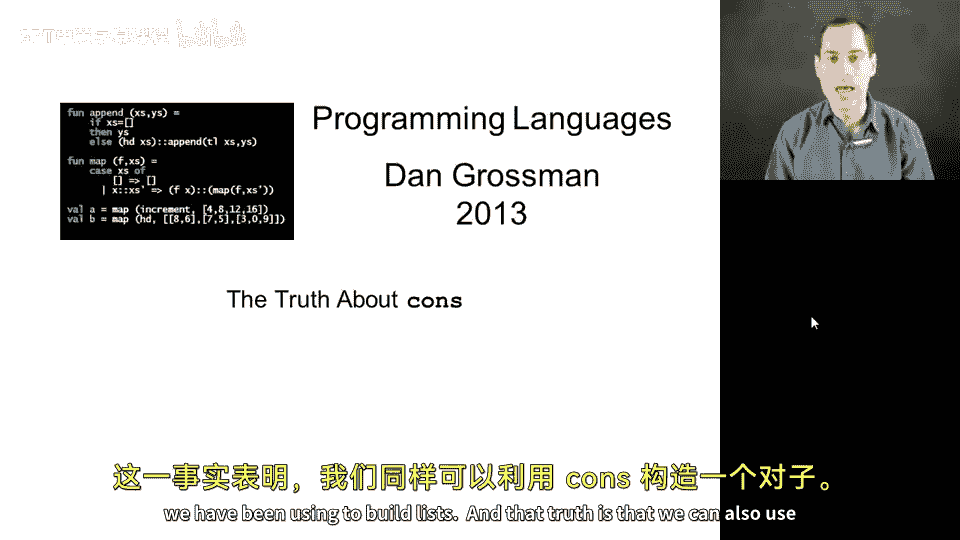
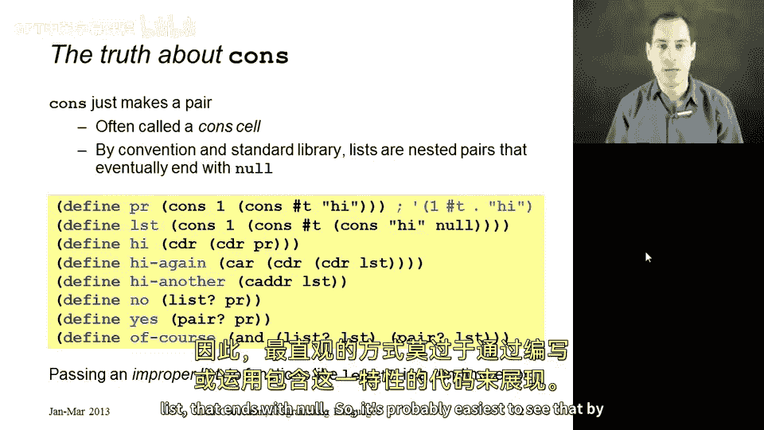
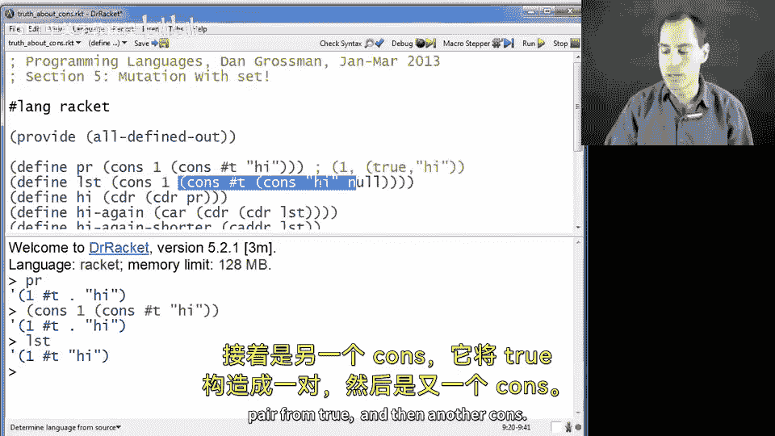
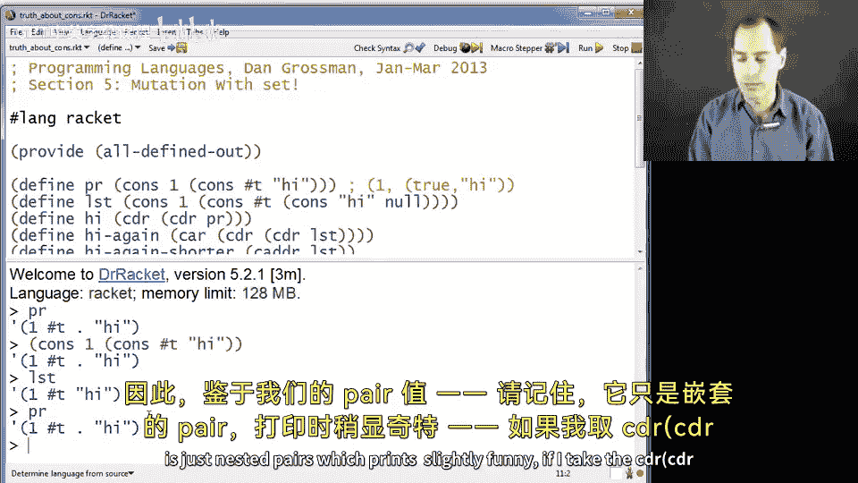
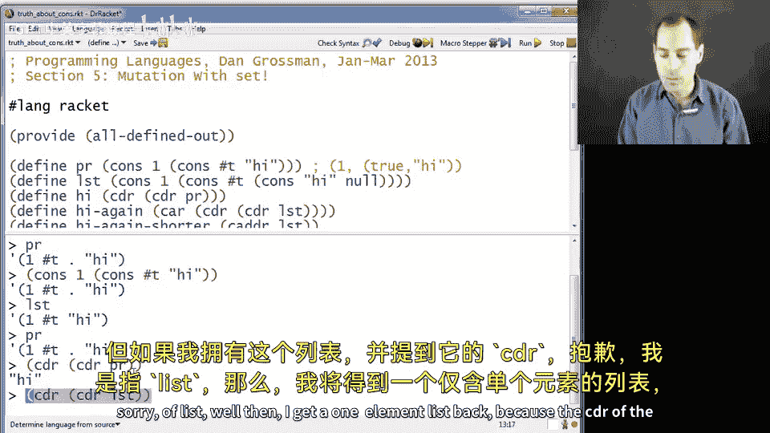
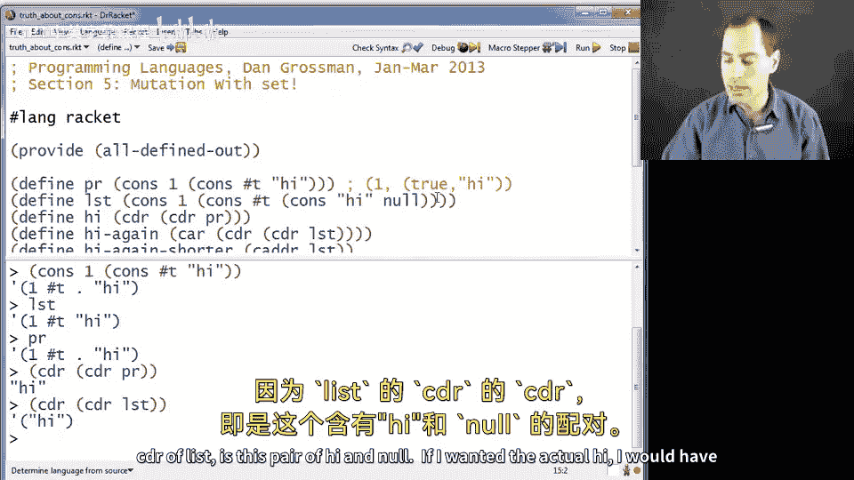
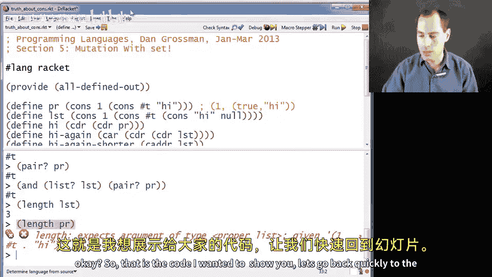
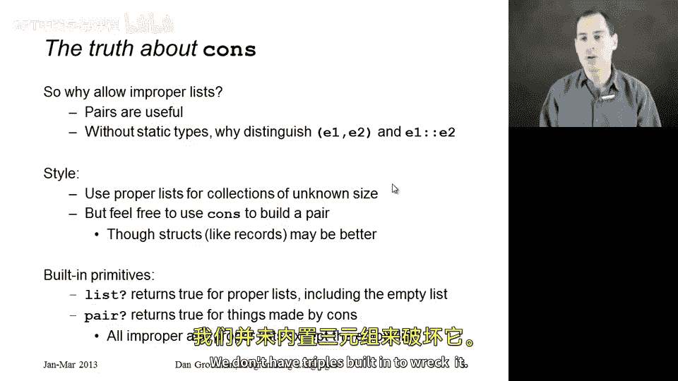
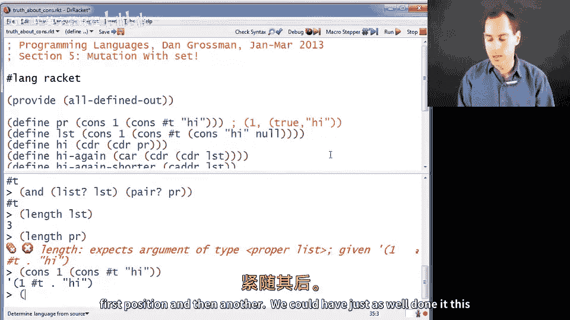
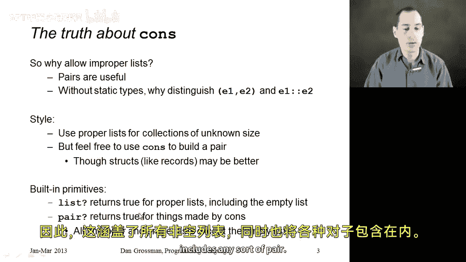

# Racket编程：13.11：关于cons的真相 🔍

在本节课中，我们将继续学习Racket作为动态类型语言的特点，通过揭示我们一直用来构建列表的`cons`原语的真相。我们将了解`cons`不仅可以构建列表，还可以构建“对”（pair），并探讨列表与对之间的区别与联系。



## 概述

本节我们将学习`cons`函数的本质。我们会发现，在Racket中，列表实际上是由一系列嵌套的“对”构成的，而`cons`正是构建这些“对”的基础。我们将通过代码示例来理解如何创建和操作“对”与列表，并学习相关的内置函数和编程风格建议。

---



## 列表的本质：嵌套的对

上一节我们介绍了Racket的动态类型特性，本节中我们来看看`cons`函数的完整功能。`cons`接受两个参数并创建一个“对”。在Racket这类动态类型语言中，一个列表本质上就是一系列以空列表`null`结尾的嵌套“对”。

以下是一个代码示例，展示了如何用`cons`创建一个“对”：

```racket
(define pr (cons 1 (cons #t "hi")))
```

这段代码定义了一个变量`pr`。它不是一个列表，而是一个“对”。其第一个位置是`1`，第二个位置是另一个包含`#t`和`"hi"`的“对”。在ML语言中，这类似于`(1, #t, "hi")`，但在Racket中我们使用`cons`来构建。



在REPL中打印`pr`，会看到如下输出：
```
(1 #t . "hi")
```
输出中`"hi"`前的点`.`表明这不是一个列表，而是一个“对”。

现在，让我们将其与一个真正的列表进行对比：

```racket
(define lst (cons 1 (cons #t (cons "hi" null))))
```



这里同样使用了`cons`，但最后一个`cons`的第二个参数是`null`（空列表）。这就构成了一个列表，因为列表的定义就是一系列`cons`，其中每个“对”的第二个位置是下一个`cons`，直到遇到`null`为止。

因此，列表是嵌套“对”的一种特定形式。





---

## 访问对中的元素：car与cdr

理解了“对”的结构后，我们来看看如何访问其中的元素。访问“对”的组成部分使用`car`和`cdr`函数。

*   `car`：获取“对”的第一个元素，类似于ML中的`#1`。
*   `cdr`：获取“对”的第二个元素，类似于ML中的`#2`。

以下是使用示例：

给定之前的“对”`pr`：
```racket
(cdr (cdr pr)) ; 返回 "hi"
```
这获取了第二个“对”的第二个元素。

给定列表`lst`：
```racket
(cdr (cdr lst)) ; 返回 ("hi")，这是一个单元素列表
(car (cdr (cdr lst))) ; 返回 "hi"
```
要获取列表中的实际元素`"hi"`，需要对结果再使用`car`。

为了方便，Racket提供了一些组合函数。例如，`caddr`函数等价于`(car (cdr (cdr x)))`，它是标准库中的内置函数。

---

## 区分列表与对

我们可能需要判断一个值是列表还是“对”。Racket提供了相应的内置谓词函数。

以下是相关的判断函数：
*   `list?`：判断一个值是否为**真列表**（proper list），即以`null`结尾的嵌套“对”。
*   `pair?`：判断一个值是否是由`cons`构建的“对”。所有真列表（除了空列表`null`本身）也是“对”。
*   `null?`：判断一个值是否为空列表。

示例：
```racket
(list? pr) ; 返回 #f，因为 pr 不是以 null 结尾
(pair? pr) ; 返回 #t，因为 pr 是由 cons 构建的
(list? lst) ; 返回 #t
(and (list? lst) (pair? lst)) ; 返回 #t，列表也是“对”（除了空列表）
```



需要注意的是，像`length`这样的列表函数只对真列表有效。如果对非列表（即使是由`cons`构建的）使用`length`，会引发错误。这种不以`null`结尾的、由`cons`构建的结构，有时被称为**非真列表**（improper list）。

---

## 为何如此设计及编程风格

为什么Racket要这样设计，允许`cons`同时用于构建“对”和列表？

在动态类型语言中，没有类型检查器来严格区分列表和“对”的类型。因此，与其像ML那样使用逗号`,`构建元组、使用`::`构建列表，不如统一使用`cons`来构建这两种结构。程序员需要自己留意哪些值是列表，哪些是“对”。

关于编程风格，有以下建议：





1.  **处理未知大小的集合时，应使用真列表**。这是约定俗成的做法，记得在末尾使用`null`。
2.  **当只需要一个简单的二元组或三元组时，使用“对”是完全可以的**。Racket没有内置的三元组，但可以通过嵌套`cons`来实现。
    ```racket
    ; 一种构建三元组的方式
    (define triple1 (cons 1 (cons #t "hi"))) ; 打印为 (1 #t . "hi")
    ; 另一种结构不同的方式
    (define triple2 (cons (cons 1 #t) "hi")) ; 打印为 ((1 . #t) . "hi")
    ; 访问元素
    (cdr (car triple2)) ; 返回 #t
    ```
3.  **更好的风格是定义自己的数据类型**（我们将在后续章节看到）。这比单纯使用`cons`更易于管理和理解代码的组织结构。

内置谓词的行为总结如下：
*   `list?` 对真列表（包括空列表）返回`#t`，对非真列表返回`#f`。
*   `pair?` 对所有由`cons`构建的值返回`#t`（这包括所有非空的真列表和所有的“对”），对空列表返回`#f`。

---

## 总结

本节课中我们一起学习了：
1.  `cons`函数在Racket中的本质是构建一个“对”（pair）。
2.  列表是由一系列嵌套的“对”构成，并以空列表`null`结尾的特殊结构。
3.  使用`car`和`cdr`函数可以访问“对”中的元素，并且有像`caddr`这样的组合函数。
4.  可以使用`list?`和`pair?`等谓词来区分列表和“对”。
5.  在动态类型语言中，统一使用`cons`简化了语法，但程序员需注意值是否为真列表。
6.  在编程风格上，处理集合用列表，简单固定结构可用“对”，但定义自定义类型通常是更佳选择。



理解“对”与列表的关系，是掌握Racket及其家族语言（如Scheme）中数据结构的核心。