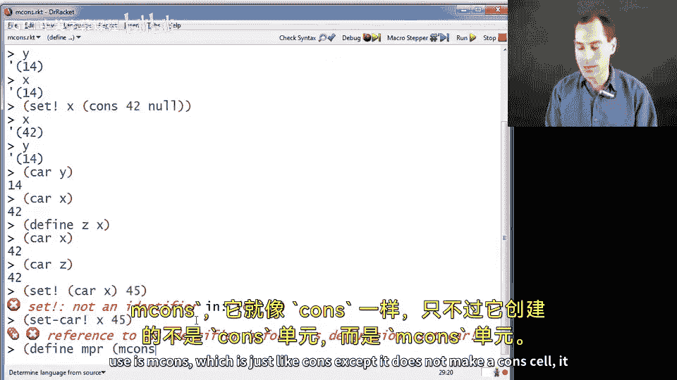
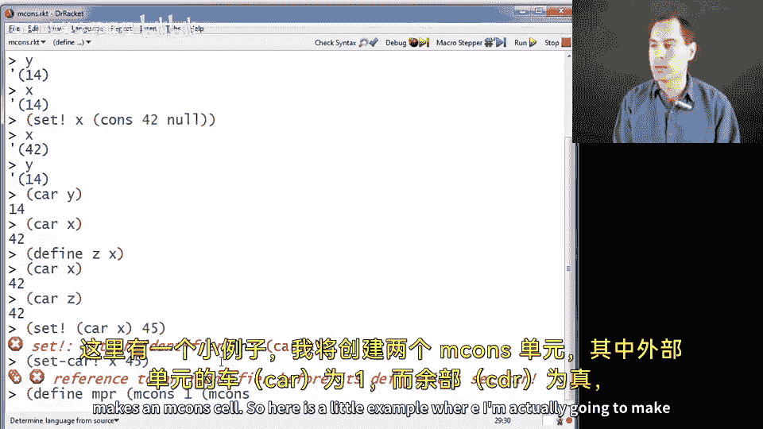
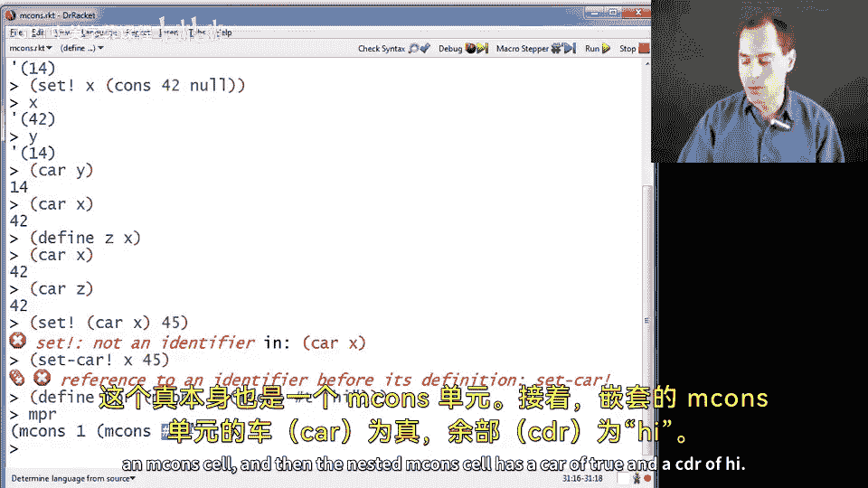
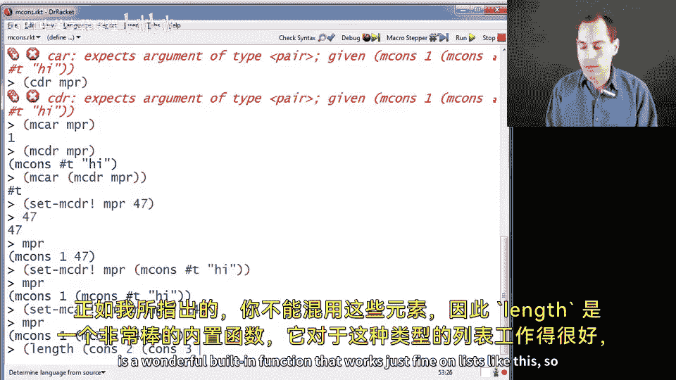
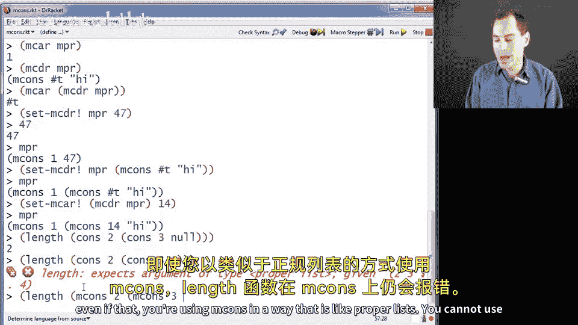

# 编程语言 A/B/C CSE341：14：可变对与 MCons 单元 🧩


在本节课中，我们将学习 Racket 中的可变数据结构。我们将了解为什么标准的 `cons` 单元是不可变的，以及如何通过 `mcons` 单元来创建可以修改其内容的数据结构。理解这两种类型的区别对于编写高效且意图清晰的程序至关重要。

## 标准 Cons 单元的不可变性

上一节我们介绍了 `cons` 单元，它用于构建对和列表。本节中我们来看看 `cons` 单元的一个重要特性：**不可变性**。

在 Racket 中，一旦一个 `cons` 单元被创建，其 `car` 和 `cdr` 字段的内容就无法被改变。这与 Scheme 等 Racket 的前身语言不同。Racket 做出这一设计选择，是为了让使用 `cons` 构建的对和列表像 ML 语言中的元组和列表一样，具有不可变性。

不可变性的最大优势是**消除了别名（aliasing）的困扰**。因为数据无法被修改，所以一个列表的一部分是否是另一个列表的别名变得无关紧要，程序的行为不会因此产生差异。我们在课程的第一部分曾重点讨论过这一点。此外，在像 Racket 这样的动态类型语言中，不可变性还带来了一个额外的好处：像 `list?` 这样的过程可以实现得更高效。因为在创建 `cons` 时，我们就能立即知道它是否构成一个列表，并且这个状态永远不会改变，因此无需在每次调用 `list?` 时遍历整个列表来检查其结构。

## 可变的需求与 `set!` 的局限

但是，假设我们确实需要修改数据结构的内容，该怎么办呢？了解什么可行、什么不可行非常重要，因为在某些特定的编程模式中，有控制地使用可变性会非常有用。

首先需要明确的是，`set!` 操作符**并不能**修改 `cons` 单元的内容。它只能改变一个变量（标识符）所绑定的值。


以下是一个示例：
```racket
(define x (cons 14 null)) ; x 指向一个包含 14 的 cons 单元
(define y x)              ; y 也指向同一个 cons 单元
(set! x (cons 42 null))   ; set! 改变了 x，让它指向一个新的 cons 单元
```
执行后，`x` 现在指向新的列表 `(42)`，但 `y` 仍然指向原来的列表 `(14)`。`set!` 改变了变量 `x` 的引用，但没有改变原先那个 `car` 为 14 的 `cons` 单元本身。

如果我们希望 `x` 和 `y` 共享的同一个数据结构内部能被修改，这在标准的 `cons` 单元上是无法实现的。Racket 的前身 Scheme 提供了 `set-car!` 和 `set-cdr!` 来做到这一点，但 Racket 为了保持不可变性的优势，**没有**提供这些操作。


## 引入 MCons 单元

那么，在 Racket 中如何实现可变的对呢？答案是使用一个独立的内置数据类型：**MCons 单元**。

创建 MCons 单元的函数是 `mcons`，它类似于 `cons`，但创建的是可变单元。与 MCons 单元交互需要使用一套专门的函数：

以下是相关操作：
*   **`(mcons a b)`**: 创建一个 `car` 为 `a`，`cdr` 为 `b` 的可变对。
*   **`(mcar mpair)`**: 获取可变对 `mpair` 的 `car` 部分。
*   **`(mcdr mpair)`**: 获取可变对 `mpair` 的 `cdr` 部分。
*   **`(set-mcar! mpair val)`**: 将可变对 `mpair` 的 `car` 部分修改为 `val`。
*   **`(set-mcdr! mpair val)`**: 将可变对 `mpair` 的 `cdr` 部分修改为 `val`。
*   **`(mpair? obj)`**: 判断 `obj` 是否是一个可变对。

让我们看一个例子：
```racket
(define mpr (mcons 1 (mcons #t "hi")))
; mpr 指向一个 MCons，其 car 是 1，cdr 是另一个 MCons (其 car 是 #t, cdr 是 "hi")



(mcar mpr)               ; => 1
(mcdr mpr)               ; => (mcons #t "hi")
(mcar (mcdr mpr))        ; => #t






(set-mcdr! mpr 47)       ; 修改 mpr 的 cdr 部分
mpr                      ; => (mcons 1 47)

(set-mcar! (mcdr mpr) 14) ; 错误！因为此时 (mcdr mpr) 是 47，不是一个 MCons 单元。
```

## 不可混合使用

需要特别注意，`cons` 单元（不可变列表）和 `mcons` 单元（可变结构）的操作是**不能混用**的。

以下是关键区别：
*   像 `length`、`map`、`list?` 这样的列表操作只能用于由 `cons` 构成的**标准不可变列表**。对 `mcons` 结构使用它们会导致错误。
*   像 `mcar`、`set-mcar!` 这样的操作只能用于 `mcons` 单元。对标准的 `cons` 单元使用它们也会导致错误。





这种分离强制程序员明确其数据结构的意图：是需要不可变的、可安全共享的数据，还是需要内部状态可变的实体。


## 总结

本节课中我们一起学习了 Racket 中可变数据结构的实现。我们了解到：
1.  标准的 `cons` 单元是不可变的，这带来了别名无关性和潜在的性能优化等优势。
2.  `set!` 只能修改变量的绑定，不能修改 `cons` 单元的内容。
3.  当确实需要可变对时，应使用 `mcons` 来创建 MCons 单元，并配套使用 `mcar`、`mcdr`、`set-mcar!` 和 `set-mcdr!` 等操作。
4.  不可变的 `cons` 列表和可变的 `mcons` 结构在 Racket 中是严格区分的，其操作函数不能交叉使用。


根据需求选择不可变或可变的数据结构，是编写清晰、健壮 Racket 程序的重要一环。