# 【编程语言 A⧸B⧸C CSE341 Coursera】华盛顿大学—中英字幕 p113 15_13_delayed-evaluation-and-thunks -BV1bw4m1D7MM_p113-

In this segment， we're going to begin emphasizing in our semantics when expressions get evaluated。

 this is a key concept in programming languages， and it's going to be essential for understanding the programming idioms we're going to see in the next few segments。

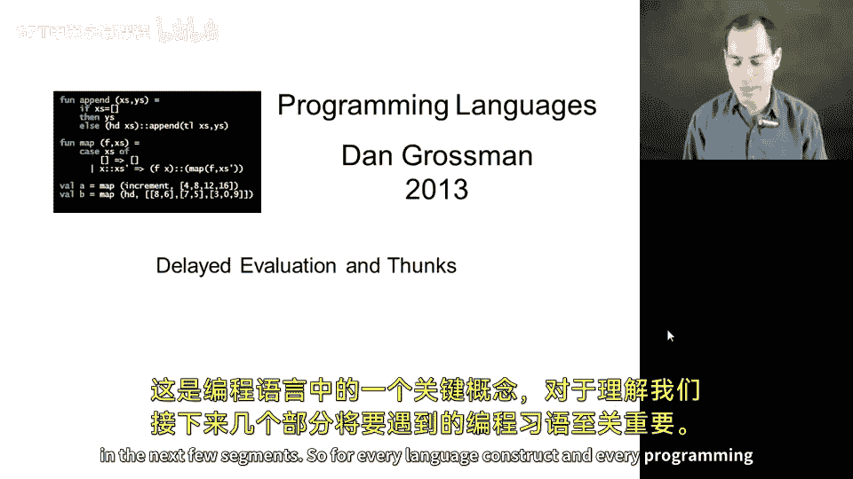

So for every language construct in every programming language。

 the semantics does have to specify if or when those sub expressionpressions appear to get evaluated。

For two crucial examples， let's focus on function calls and conditionals。

So in ML and rackcet and other languages you're probably familiar with。

 when you have a function call， the arguments to the call are evaluated before the call starts before you evaluate the function body。

 each of them is evaluated once， and then the function body uses variables。

 the function parameters to look up the results of those computations that already occurred。

Conditionals work very differently if you look at an if that takes three expressions， the test。

 the true branch and the false branch， we do not evaluate all of them eagerly like that。

 we evaluate just the first one and then use the result to decide which of the other two we evaluate。

 and then the other one is never evaluate。So we have not emphasized this quite as much before。

 but this piece of the semantics of language constructs is essential for programming correctly。

 so I'm going to switch over to the code which I have written out here and show you a number of examples that show that so let's start with an ordinary function。

 totally normal implementation of factorial we've seen such an example many times and if I click run and use it。

 it will work as expected。

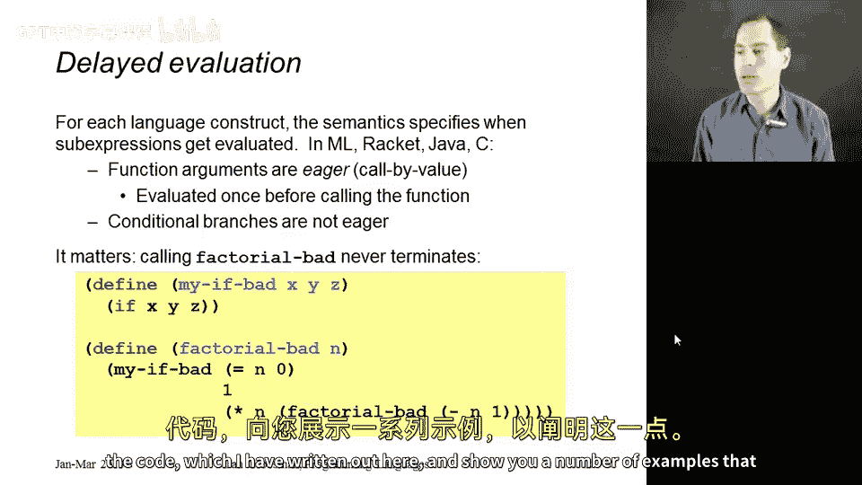

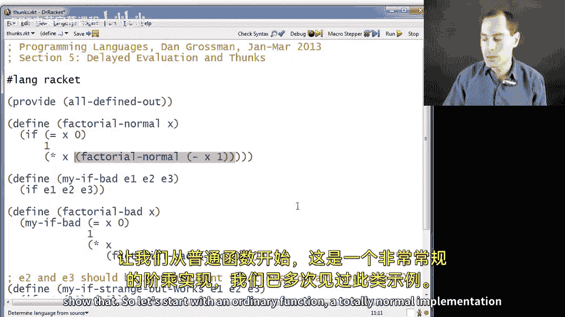

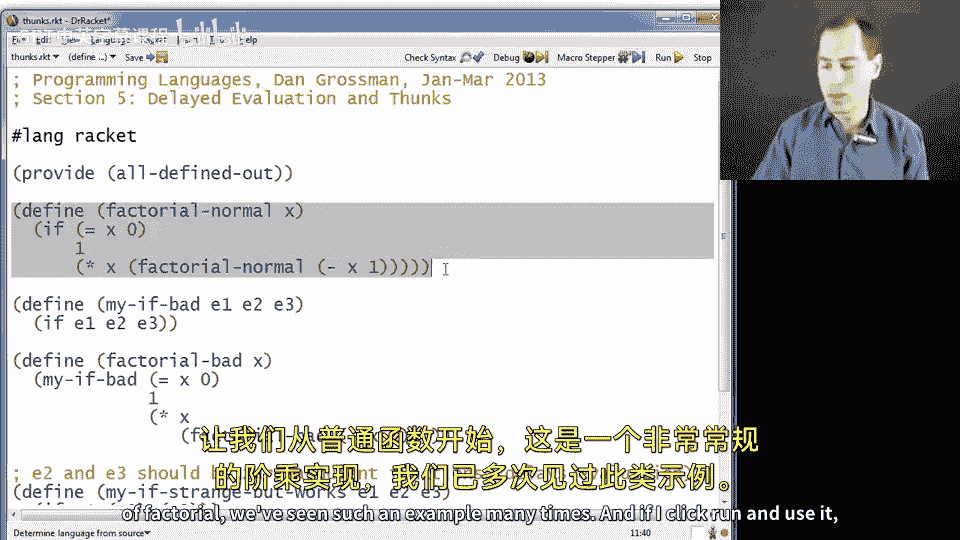

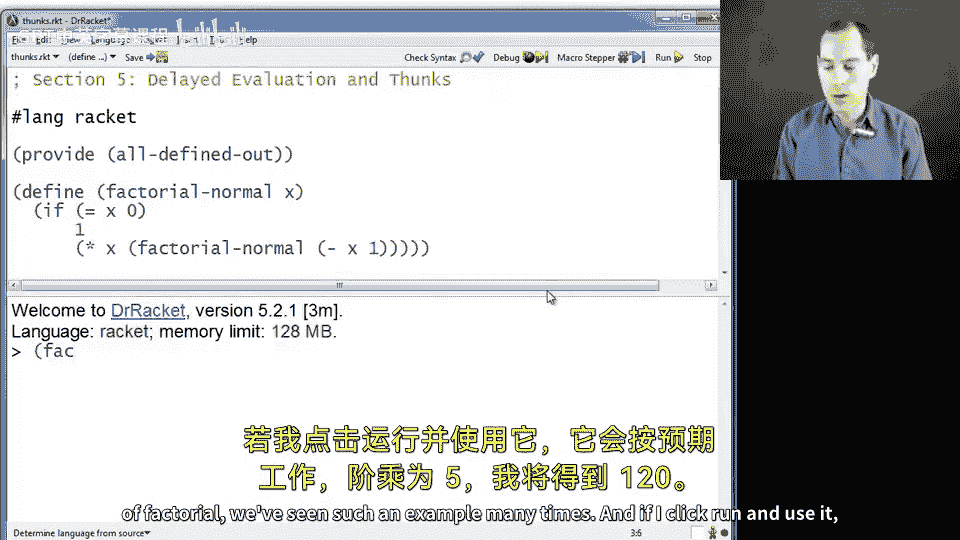

Normal of 5。 I'll get 120。 And by the way， this function grows very fast and racket has no problem with large numbers。

 So if I ask factorial 500， it's happy to print out this very large number that I will trust is 500 times 499 times 498 and so on。

 and everything works correctly。 And what happened is when I called factorial normal of 500。

 If I had it evaluated 500， That was a value， went into the body。😊，Decided， oh， x is 0。

 So I will evaluate the false branch because x is not0。 Excuse me。 And so only because 500 is not0。

 do we decide to do this multiplication。 And when we do a multiplication， we eagerly look up X。

 we get 500。 And then we do this recursive call， which after a whole lot of work returns a very large number。

 and then we do a multiplication and then we return。😊，So while I'm emphasizing this。

 let me show you a slight variation。Suppose I try to write a little rapper for if。😡。

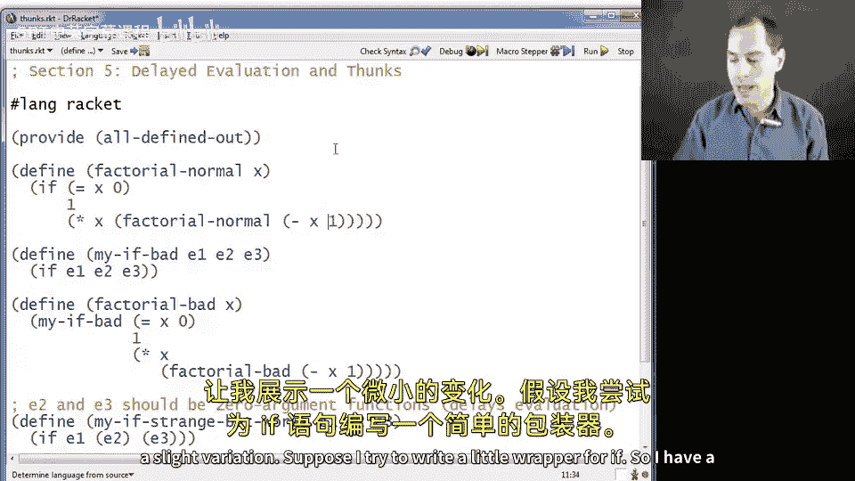

So I have a function， my if bad， it takes three function three arguments， E1， E2 and E3。

 and then it just calls if with E1， E2 and E3， so it looks like it's just an unnecessary function wrapping of if。

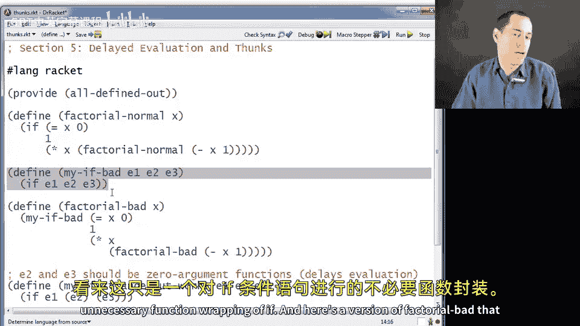

And here's a version of factorial badD that uses my if badD。😡。

Now I encourage you to try this out on your own， I'm not going to do it while recording。

 but if you call factorial bad with any number whatsoever， it will never terminate。

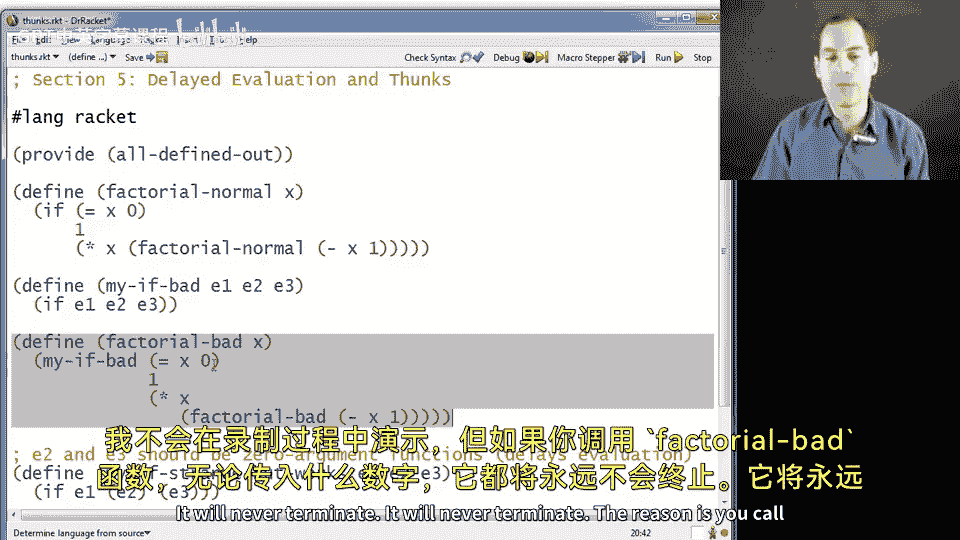

It will never terminate。 The reason is you call factorial bad with an argument，0，505。

 I don't care what it is。 negative 7。And the first thing it has to do is call the my if bad function。

😡。

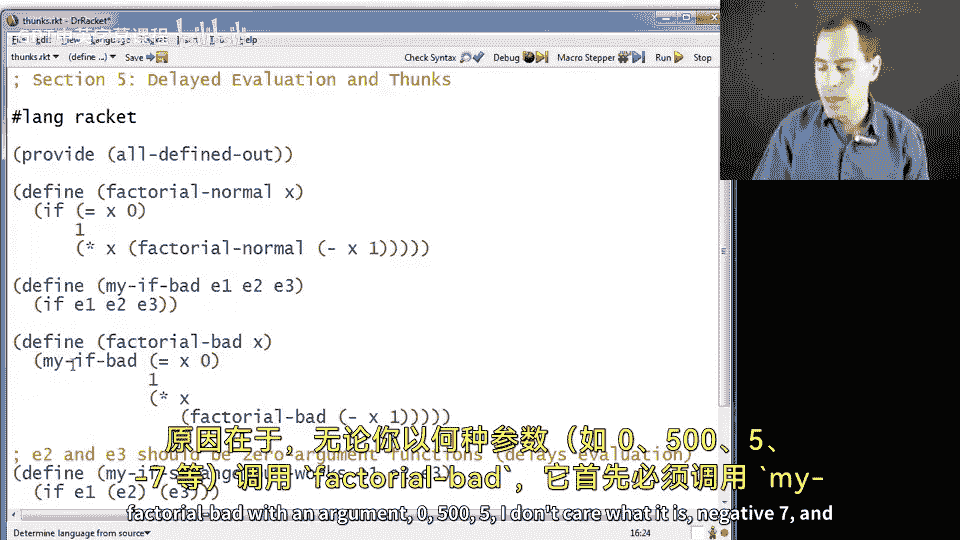

And before you call a function， you evaluate all three arguments。 So you see if x is 0。

 that will go quickly。 you see if you evaluate one， that goes quickly。

But then you have to evaluate this as well。 And that will do a recursive call。

 and that will do a recursive call。 and we will never end the recursion。 See。

 it's essential to all of our recursive functions that if。

 as we saw up here in the good version does not evaluate both of its branches。

 it only evaluates the one we need。 But my， if bad being a function evaluates both。

So it turns out that I'm going to make a third version of the example。

 which is actually going to work。 This is not good style。 The first version is good style。

 but it's going to introduce an idiom that's going to prove very useful to us in upcoming segments。😡。

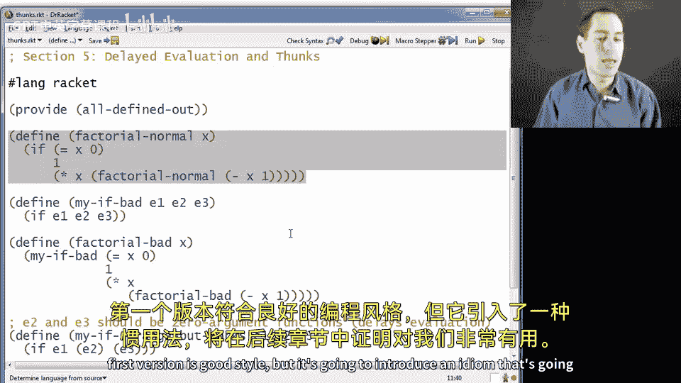

And that is， if you really want a function that takes three arguments and acts like if。

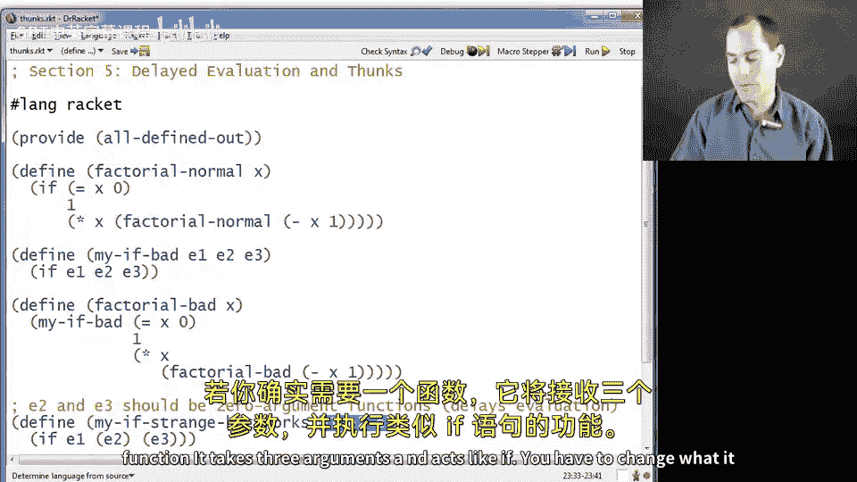

You have to change what it takes for some of those arguments。Have it take for E2 and E3。

 not the result you want， but a zero argument function that if you call that function。

 you get back the result you want。So what my if strange but works does is it evaluates E1。😡。

To get an answer。 And then it either calls E2 with no arguments or calls E3 with no arguments。

 because remember， in racket， if you want to call a zero argument function。

 it's in some expression E， you write E inside of parentheses。

 So E2 and E3 and any call to my if strange， but works。

 have to themselves be zero argument functions。 So we're doing higher order functions here。

 And now if you want to write factorial using my if strange， but works。 you can do that。

 let me just make this on the screen for you。 So factorial， okay。

 takes in a number X says if x is it calls my if strange， but works with three arguments。

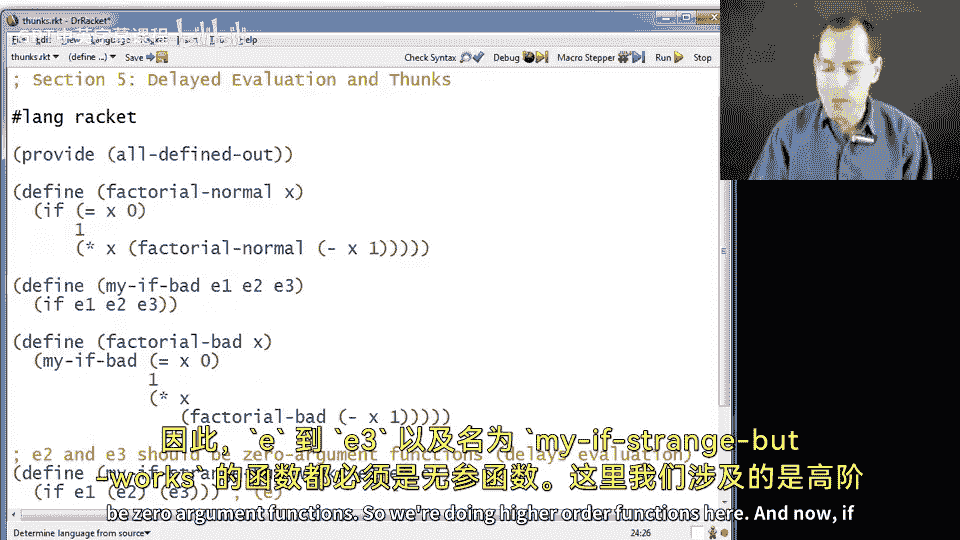

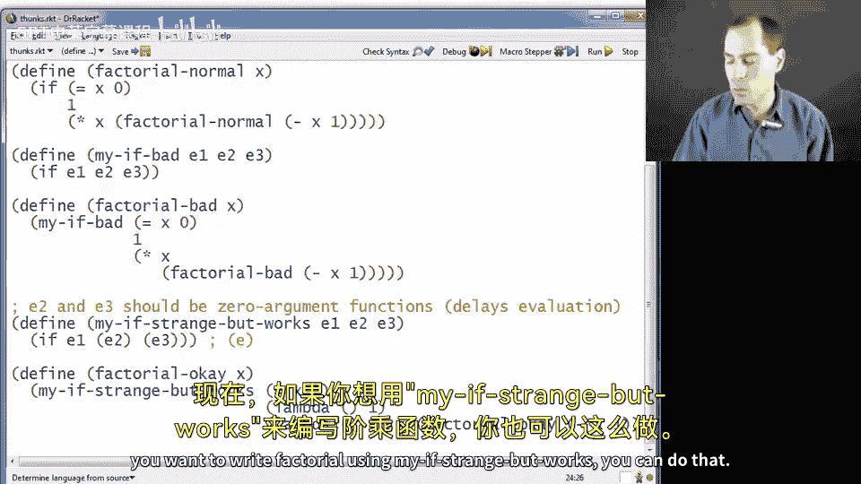

The result of is x0。This function。And this function。

So functions do not evaluate their bodies until you call them。 We know that。

 so all three of these arguments evaluate very quickly is x is0， that's very fast。

 these other two are already values， we just make the right closure。

 and then we call myF strange but works and myF strange but works decides which one of these lambmbdas to call and it never calls the other one。

 And if you never call a function， its body is never going to execute。😡，So this works just fine。

 if I say factorial O of 500， I will get my very big number。

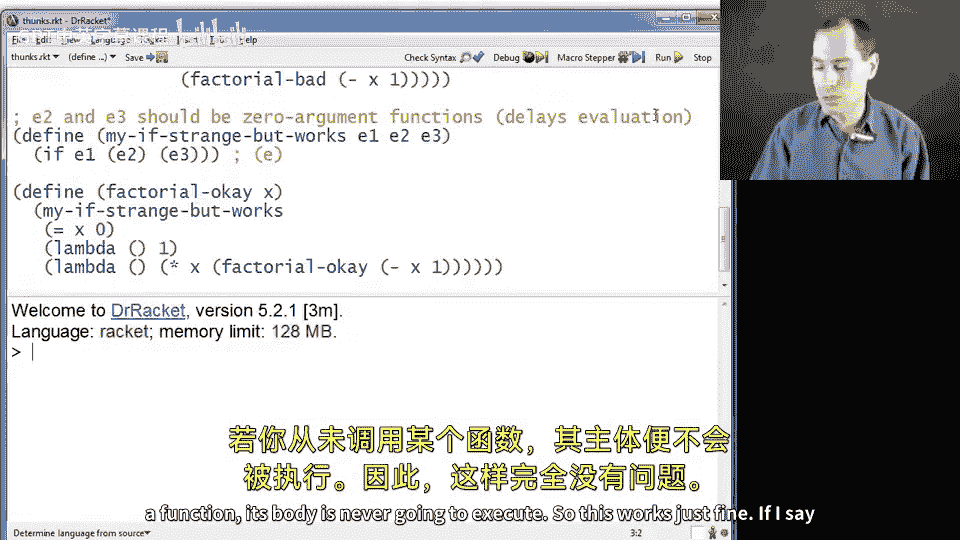

嗯。So that is the code I wanted to show you。 Let me emphasize yet again what is going on and what we call these things。

 There's some terminology I want to introduce related to this idiom。

So we know how to delay evaluation if you have an expression that you don't want to evaluate yet。

 you want it to evaluate later or maybe not at all， put it in a function and don't call the function。

😡，Thanks to closures， you can really do this anywhere， anywhere you want。

 you can just take some expression E， replace it with lambda， take no arguments of E。

 And now you have a procedure that when you call it。

Will produce the answer then but you do have to remember to call it So that's what we saw here。

 you see it on the side compared to the example that did not work。

 our definition of the my if function had to remember to either call its second argument or call its third argument。

 and then our use of it in factorial had to not pass in the expressions that we wanted to evaluate。

 but to pass in zero argument functions that we could then call to get the answers we wanted。

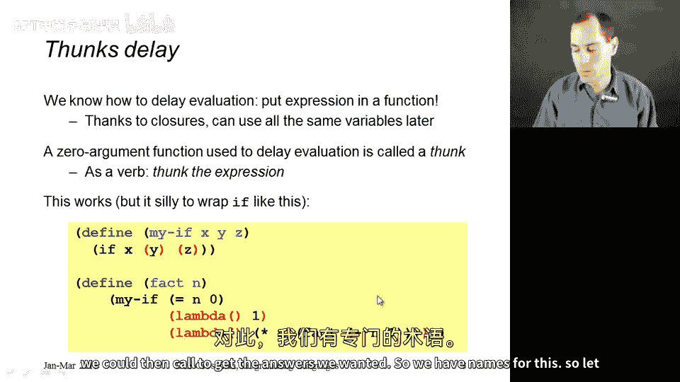

So。We have names for this。 So let me actually let me go back on the slide here。

 I forgot to say this middle part I wanted to say。 so when you have these zero argument functions。

 we actually have a name for them。 they're called thunks。

 you can read on the internet where people think this word came from Nobody is quite sure or at least I have not heard a definitive account。

 but it's just a funny word that computer scientists use a zero argument function that is used for the purpose of delaying evaluation in this way。

 is called a thunk。 you can even use this as a verb。 if you want to tell someone no， no， no。

 you're evaluating that thing too eagerly。 we might not need it passing a function that produces the result。

 you can just say， oh， thunk that thunk the expression or the function needs a thk you can say all of these things。

 So let's emphasize three very different things in racket， they look similar。

 but it's essential we understand the difference or you're going to find it very difficult to do your next homework assignment。

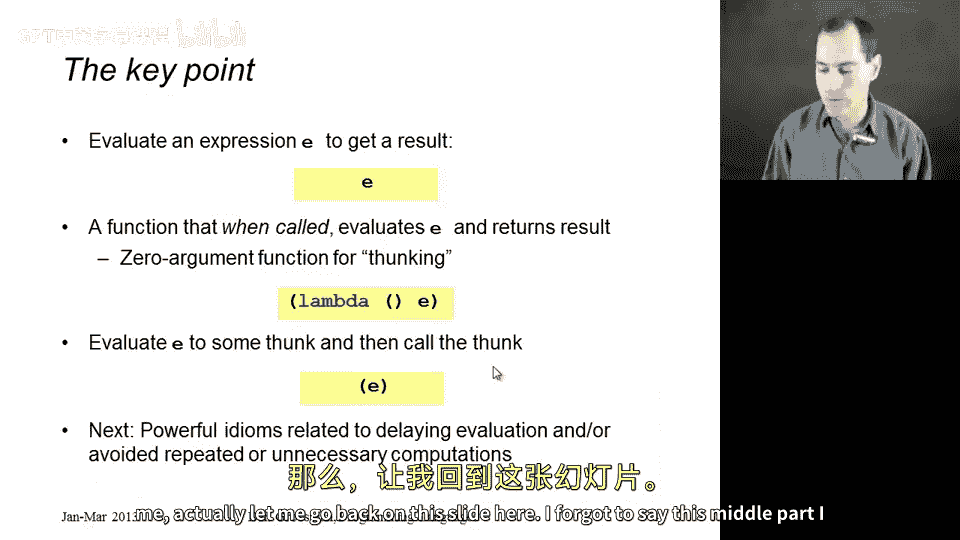

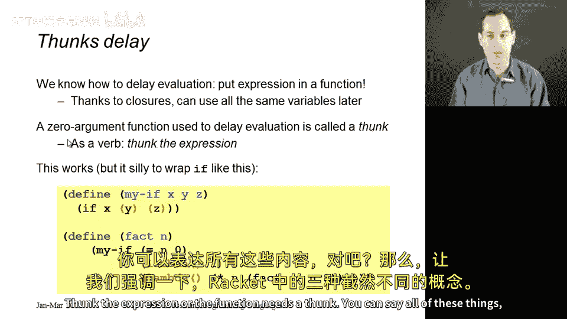

When you have some expression E， we evaluate it and we get a result。 So maybe E is plus 3，4。

 We evaluate that。 We get 7。But if instead we have a thunk with E in it。😡，This is a function。

That will not evaluate E at all until you call it。 And then every time you call this thunk。

 we will evaluate E and get the result。 So lambmbda， no arguments， plus 3。

4 is a procedure that when you call it。You get 7。 And how do you call a thk。

 It looks strange for people not used to parentheses。 But if you put E in parentheses。

 we evaluate E to get a thk。And then we call the thunk that evaluates the thunk's body。

 and that is our final result。😡，We've seen this。 This is why if you put 37 in parentheses。

 you get an error because 37 is not a thk。 and if you put something in parentheses。

 you're calling it with zero arguments。 But if you had lambmbda parenthesis parenthesis 37。

 then we could call it。 So you see here with parentheses around it。 and you would get back to 37。

 So we haven't done this in a useful way yet， the if it's built into rackcet is the right thing to use。

 but the upcoming segments are going to use thks to code up some very powerful things in racket to use the idea that often delaying or avoiding a computation is exactly what you want to do。

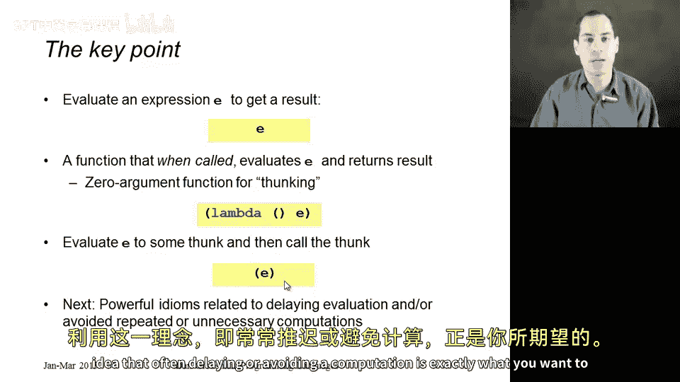