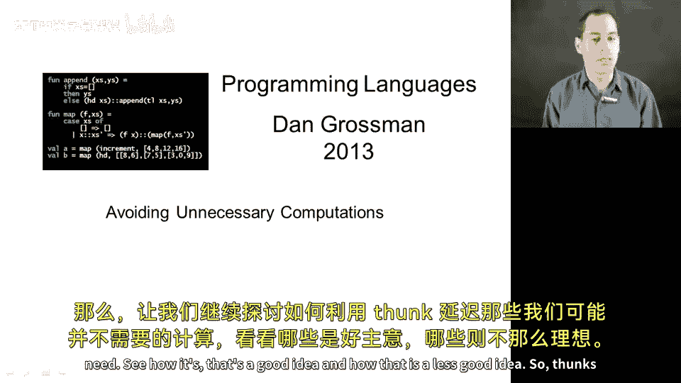
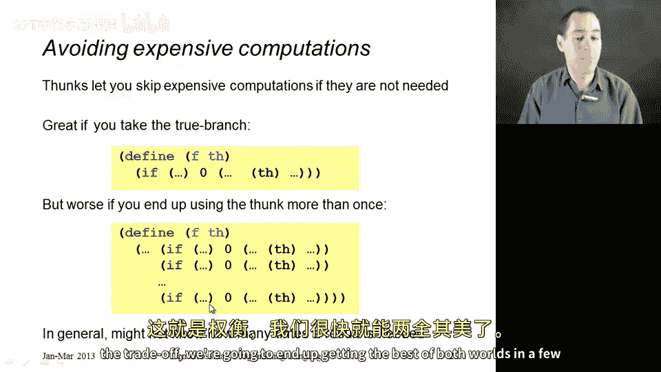
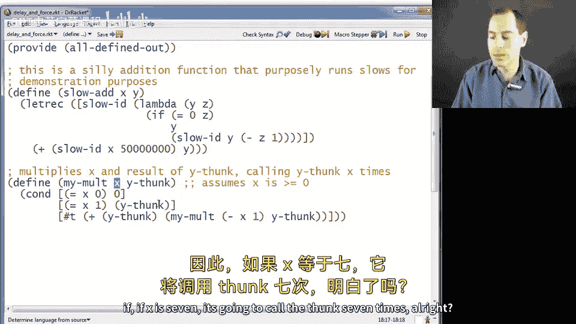
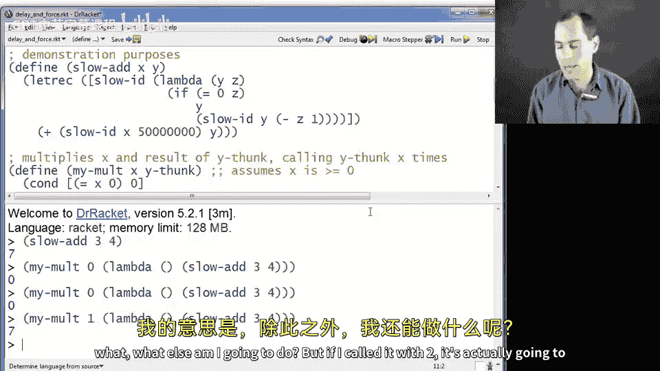
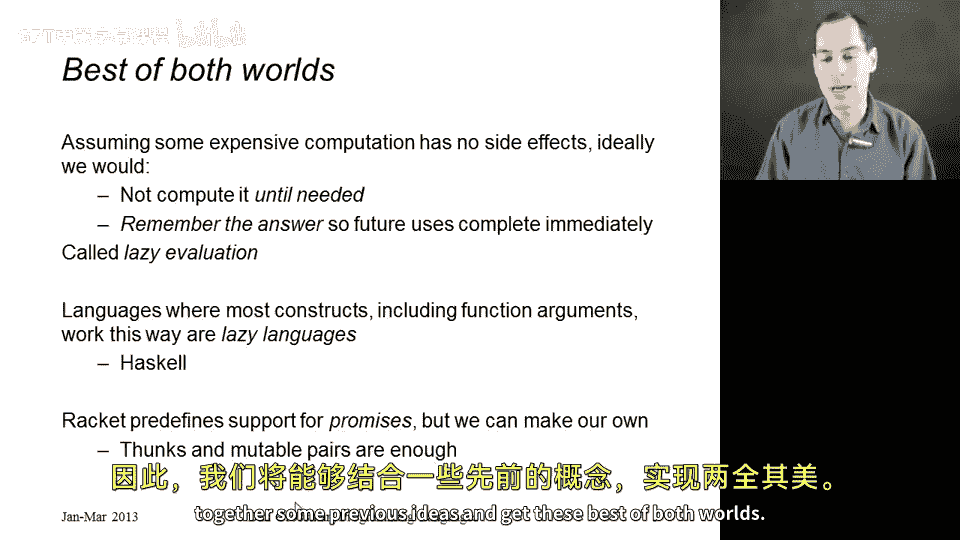

# 编程语言 A/B/C CSE341 Coursera：16：避免不必要的计算 🚀



在本节课中，我们将学习如何使用 thunk 来延迟可能不需要的计算。我们将探讨这种方法的优点与缺点，并通过具体示例理解其工作原理。最后，我们将介绍如何通过“惰性求值”结合 thunk 与记忆化技术，实现最佳性能。

---

## 使用 Thunk 延迟计算

上一节我们介绍了 thunk 的基本概念。本节中，我们来看看如何使用 thunk 来避免执行不必要的昂贵计算。

Thunk 允许你在不需要结果时跳过昂贵的计算。这在以下代码框架中非常有用：

```racket
(define (some-function thunk)
  (if (some-condition)
      (do-something-without-thunk)
      (thunk))) ; 仅在需要时调用 thunk
```

如果你不使用 thunk，而是直接传入昂贵计算的结果，那么无论是否需要，计算都会提前执行，造成浪费。

---

## Thunk 的局限性

然而，thunk 并非在所有情况下都是最佳选择。考虑以下场景：



```racket
(if condition1 (thunk) ...)
(if condition2 (thunk) ...)
(if condition3 (thunk) ...)
```

以下是这种情况的分析：
*   如果所有条件都为假，thunk 从未被调用，避免了计算，这是理想情况。
*   但如果多个条件为真，thunk 会被重复计算多次，这比提前计算一次结果更浪费性能。

这就是我们需要权衡的地方。接下来，我们将通过一个具体示例来演示这个问题。

---

## 具体示例分析

为了让问题更直观，我们创建一个执行缓慢的加法函数：



```racket
(define (slow-add x y)
  (sleep 1) ; 模拟耗时操作
  (+ x y))
```

`slow-add 3 4` 需要大约一秒才能返回结果 7。



现在，我们定义一个使用 thunk 的乘法函数 `my-mult`：

```racket
(define (my-mult x y-thunk)
  (cond [(= x 0) 0]
        [(= x 1) (y-thunk)]
        [else (+ (y-thunk) (my-mult (- x 1) y-thunk))]))
```

这个函数的工作原理如下：
*   如果 `x` 为 0，直接返回 0，不调用 thunk。
*   如果 `x` 为 1，调用一次 thunk 并返回结果。
*   如果 `x` 大于 1，则递归调用自身，每次递归都会调用一次 thunk。

让我们测试不同情况：
*   `(my-mult 0 (lambda () (slow-add 3 4)))` 立即返回 0，性能最佳。
*   `(my-mult 1 (lambda () (slow-add 3 4)))` 耗时约一秒，这是必要的计算。
*   `(my-mult 2 (lambda () (slow-add 3 4)))` 耗时约两秒，因为 thunk 被计算了两次。
*   `(my-mult 20 ...)` 将耗时约二十秒，性能急剧下降。

相比之下，如果提前计算 `slow-add` 的结果：

```racket
(let ([precomputed (slow-add 3 4)])
  (my-mult 20 (lambda () precomputed)))
```

那么无论 `x` 是多少，`slow-add` 都只计算一次，后续调用直接使用缓存值。但这样做的代价是，即使 `x` 为 0，我们也不得不先执行那耗时一秒的计算。

---

## 寻求最佳方案：惰性求值

那么，我们能否两全其美呢？答案是肯定的，通过**惰性求值**实现。

惰性求值的核心思想是：
1.  **延迟计算**：直到真正需要结果时才执行计算。
2.  **记忆化**：一旦计算结果，就将其存储起来。后续任何对同一结果的请求都直接返回存储的值，避免重复计算。

支持这种求值策略的语言称为惰性语言，Haskell 是其中最著名的例子。

虽然 Racket 本身不是惰性语言（函数参数在调用点会立即求值），但我们可以利用已学的知识——thunk 和可变对（`mcons`）——自己实现它。

在下一节中，我们将动手实现一个支持记忆化的惰性求值器，并重新审视上面的乘法示例，展示如何同时获得“零参数快速”和“多次调用高效”的优势。

---



本节课中，我们一起学习了使用 thunk 避免不必要计算的基本方法，分析了其优缺点，并通过示例看到了重复计算可能带来的性能问题。最后，我们引出了“惰性求值”作为结合延迟计算与记忆化的最佳解决方案，为下一节的实现做好了准备。