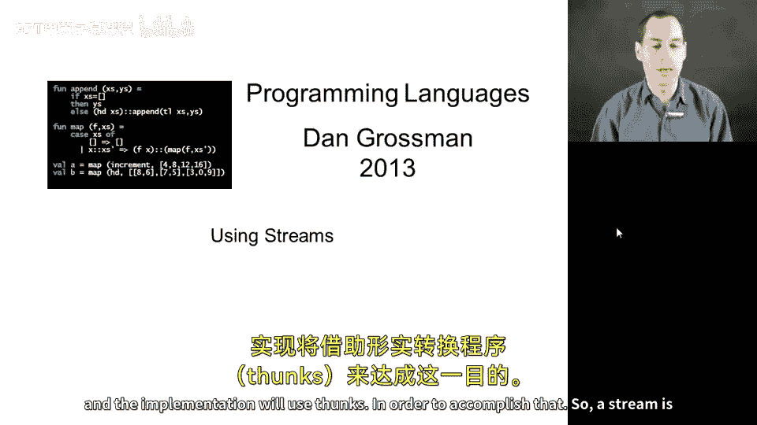
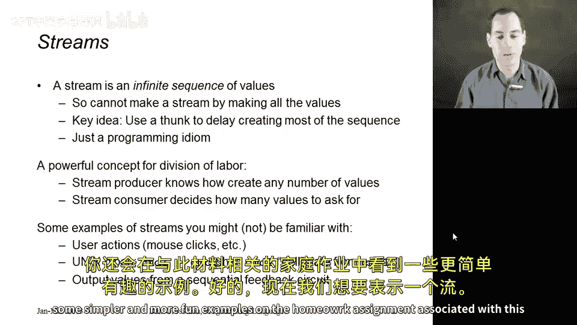
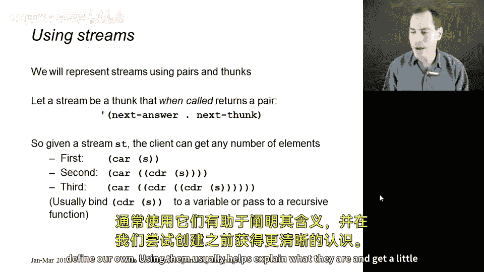
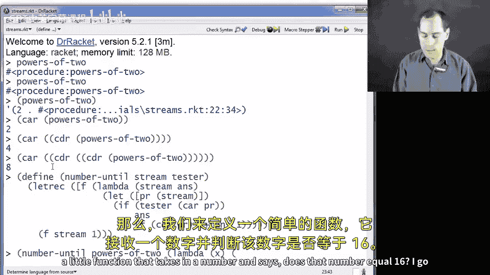
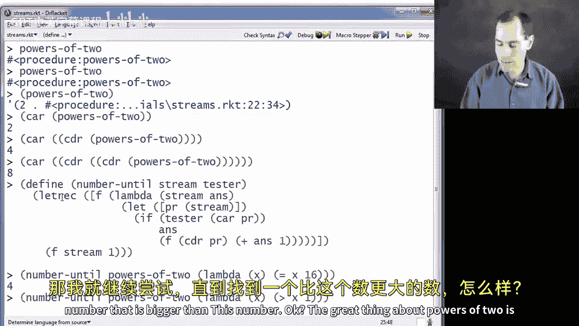

# 编程语言 A/B/C CSE341 Coursera：18：流的使用 🌀



在本节及下一节中，我们将讨论流。这是一种不同的编程范式，它也需要某种延迟求值的概念。其实现将利用 thunk 来达成这一目标。


## 什么是流？

在计算机科学中，我们使用“流”这个词来表示一个无限的值序列。它可以持续产生你所需的值，表现得像一个无限大的事物。然而，关于无限大的事物，你实际上无法真正创建它们。我们需要一种方式来表示可以永远持续下去的东西，而我们将使用的核心理念是：**使用一个函数来延迟序列大部分内容的求值，只生成其他计算所需的那部分前缀序列**。

我们不需要任何新的语言结构。这只是使用 thunk 等概念进行编程，但它是一种强大的概念，可以在许多不同的软件系统中以有效的方式分配工作。

其理念是：**生成流的程序部分知道如何创建你需要的任意数量的值，但不知道你需要多少**。而流的消费者可以在处理过程中请求这些值，而无需了解生成它们的任何过程。

事实证明，这在软件系统中经常出现。如果你不熟悉以下任何例子也没关系，但我还是想提一下，以便了解的人能明白。一种情况是，如果你需要实现代码来响应用户事件（如鼠标点击、键盘按下等），我们在课程早期看到过可以用回调函数处理，但另一种方式可以将其视为一个事件流。我们会根据需要请求每个事件，然后根据目前收集到的事件计算结果，而其他人则会在事件发生时生成它们。

如果你曾经在 Unix shell 系统中使用管道编程，你会发现第二个命令会根据需要从第一个命令中拉取数据，因此它将第一个命令视为一个流，而第一个命令的输出正在生成这个流。此外，这与电气工程和电路也有很好的联系：如果你考虑一个带有反馈的时序电路，你可以将其在不同输出线上发送的输出值视为形成一个无限长的序列，然后读取这些值的电路可以读取它们感兴趣的部分。总之，这些只是展示这是一个通用概念的示例，即使你觉得它有点抽象，你也会在与此材料相关的作业中看到一些更简单、更有趣的例子。



## 如何表示流？


我们想用一种不实际生成无限长列表的方式来代表流。以下是我们将采用的方法：**我们将流表示为一个 thunk**。

因此，一个流就是一个 thunk，但不是任意类型的 thunk。它是一个当你调用时，会返回一个序对的 thunk。其中，`car` 部分是序列中的下一个（第一个）元素，而 `cdr` 部分是一个代表从第二个元素到无穷的流。所以，它是一个流，当你使用它时，你会得到下一个值。

在本节中，我将向你展示如何使用这些东西。然后在下一节中，我们将看到如何定义自己的流。通常，先使用它们有助于解释它们是什么，并在我们尝试创建之前获得更好的理解。




## 使用流：一个例子

我已经加载了一个文件，其中包含我将在下一节展示的流。其中一个流是 2 的幂的无限序列。这个流返回的第一个元素是 2（我设置它以 2 开始），然后是 4、8、16、32，以此类推，因为我们不知道需要多少个 2 的幂。

当我提到 `powers-of-two` 时，正如你在这里看到的，我得到的只是一个过程，因为我们的流是 thunk，当你调用它们时，会返回一个序对。

那么如何调用一个 thunk 呢？你把它放在括号里：`(powers-of-two)`。看，我得到了一个序对，其第一个分量是 2，第二个分量是另一个过程（实际上也是一个 thunk）。

如果我想要序列中的第一个元素，我可以说 `(car ((powers-of-two)))`。如果我想要第二个元素，我需要调用 `cdr` 来获取另一个流。流是一个 thunk，所以我需要调用它，然后取它的 `car`：`(car ((cdr ((powers-of-two)))))`，这得到了 4。

如果我想要序列中的下一个元素呢？这个值是 4，`cdr` 是另一个流（一个 thunk）。所以你调用它，返回一个序对，然后取它的 `car`，就会得到 8。

当然，我们不会一直这样编程来获取 16 或 32。其理念是，我们会使用某种递归函数，将这个“下一个流”传递给递归调用。然后我们应用那个流来获取一个序对，取 `car` 得到下一个元素。因此，如果你想计算前 100 个 2 的幂的和，你只需要一个小的递归函数，在处理过程中使用这个流。

与其展示那个，我想展示一些更通用的东西。让我们定义一个递归函数，我称之为 `number-until`。

它将接收一个流和一个函数（我称之为 `tester`）。这个函数的作用是：**计算在处理流元素时，需要处理多少个元素，直到 `tester` 第一次返回真值**。如果 `tester` 从不返回真值，我们将进入无限循环。否则，我们将在第一次得到真值时停止，并返回我们已经处理过的元素数量。

我将用一个尾递归辅助函数来实现。这里有一个 `letrec`。我将接收当前的流（包含所有尚未处理的元素）、累加器（目前的结果），然后在这里放一些东西。然后，我将用初始的流和累加器（初始为 1）调用 `F`。

现在，`F` 的主体需要做的是：首先，调用那个流（我们知道流是一个 thunk）。如果我调用它，我应该得到这个序对：第一个元素和剩余元素的流。现在有了这个序对，让我们在 `car` 上调用 `tester`。如果返回真值，我就完成了，返回 `ans`。否则，用序对的 `cdr`（这是我的新流）和 `ans+1` 再次调用 `F`。注意，这里传递的是 `cdr`（一个 thunk），而不是调用它得到的序对，因为 `F` 期望一个流，然后 `F` 本身会调用那个 thunk 来获取序对。

```scheme
(define (number-until stream tester)
  (letrec ([F (lambda (stream ans)
                (let ([pr (stream)]) ; 调用流 thunk 获取序对
                  (if (tester (car pr))
                      ans
                      (F (cdr pr) (+ ans 1)))))])
    (F stream 1)))
```

现在，如果我调用 `number-until`，传入流 `powers-of-two` 和一个函数，该函数接收一个数字并判断它是否等于 16：



我得到 4。这意味着我遍历了流 4 次，直到得到等于 16 的数。

让我们再玩一下。继续直到我得到一个大于 1000 的数：





2 的幂的好处是它们增长得非常快，所以这尝试了 339 次。如果我提出一个 10 倍大的数，可能需要 343 次尝试；再大 10 倍，可能只需要 346 次尝试，因为 2 的幂增长得非常快。

## 编程注意事项

需要指出的是，在编程流时，你很容易在括号上犯很多错误。要仔细思考：**我是要传入一个流，还是要传入调用 thunk 后得到的序对**？如果我搞错了，在这里加了括号，向 `number-until` 传入了一个序对，那么在这里，你会在屏幕顶部看到，当你尝试将一个序对当作函数调用时，会得到一个很大的错误消息，比如“过程应用：期望过程，但得到了序对 (2 . #<procedure:...>)”。因此，你必须非常仔细地思考 thunk 和序对之间的区别。如果你能做到这一点，你就可以通过使用流和漂亮的递归函数来进行一些优美的编程，并获得有趣的结果。

## 总结

在本节课中，我们一起学习了流的概念。流是一种表示无限序列的强大方式，它通过 thunk 延迟求值，使得我们能够按需生成序列元素。我们了解了如何将流表示为一个返回序对的 thunk，并学习了如何使用递归函数（如 `number-until`）来消费和处理流。我们还讨论了在编程流时需要注意的常见错误，特别是区分 thunk 和调用 thunk 后得到的序对。掌握这些概念后，你将能够利用流进行更高效和灵活的编程。