# 编程语言 A/B/C CSE341 Coursera：118：记忆化技术

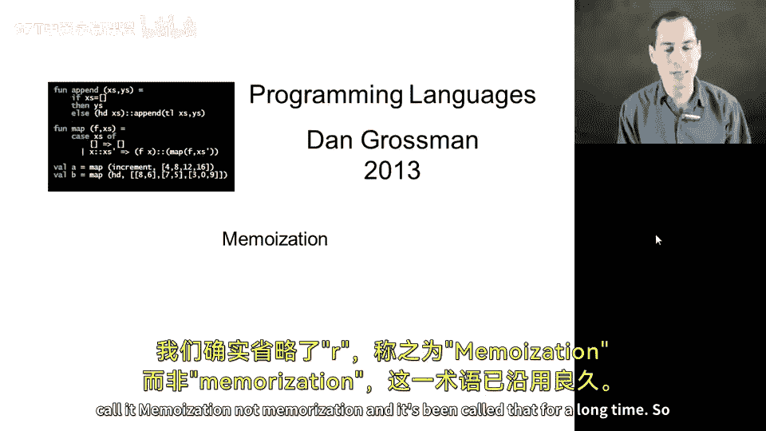

在本节课中，我们将学习一种称为“记忆化”的编程技巧。这种技巧可以帮助我们避免重复计算，从而显著提升程序效率，尤其适用于计算成本高昂的函数。我们将通过经典的斐波那契数列实现来具体演示这一技术。

## 核心概念

记忆化的核心思想是：如果一个函数没有副作用，并且不读取任何可能变化的外部数据，那么对于相同的参数，多次计算其结果是毫无意义的。我们可以通过维护一个**缓存**（或称为记忆表）来存储之前的计算结果。

这个想法与我们之前学过的“承诺”（promises，通过 `force` 和 `delay` 实现）非常相似。第一次计算时存储结果，后续调用直接使用存储的值。不同之处在于，记忆化需要处理带参数的函数，因此需要一个根据参数进行查找的表结构。

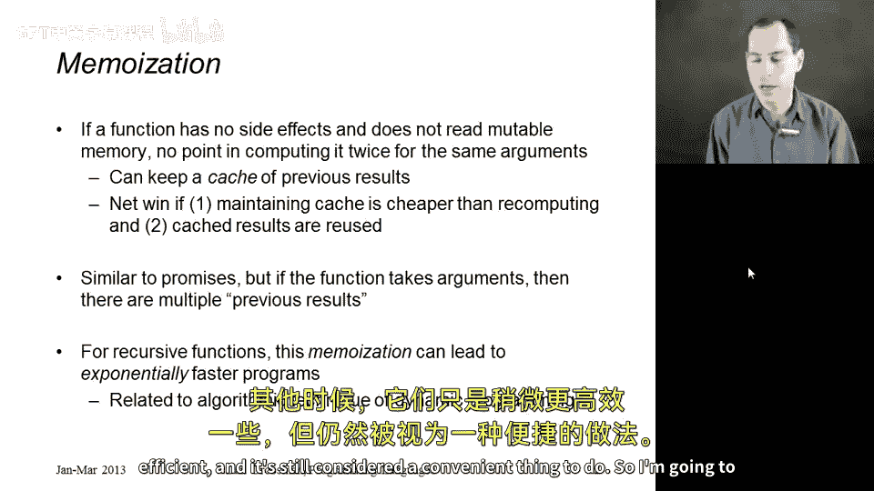

## 低效的递归实现

我们首先来看一个经典的、但效率低下的斐波那契函数实现。斐波那契数列的数学定义是：`fib(1) = 1`，`fib(2) = 1`，对于 `n > 2`，`fib(n) = fib(n-1) + fib(n-2)`。

以下是用 Racket 语言实现的代码：
```racket
(define (fibonacci x)
  (cond [(or (= x 1) (= x 2)) 1]
        [else (+ (fibonacci (- x 1))
                 (fibonacci (- x 2)))]))
```
这个实现虽然忠实于数学定义，但效率极低。计算 `fib(40)` 所需的时间大约是计算 `fib(30)` 的1000倍，因为它进行了大量重复的递归调用。

## 记忆化实现详解

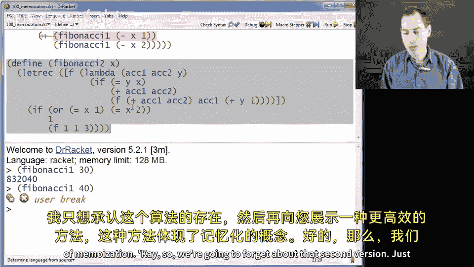

接下来，我们将展示如何通过记忆化技术来改造这个函数，使其变得高效。以下是实现记忆化斐波那契函数的完整代码，我们将逐行解析。

```racket
(define fibonacci
  (let ([memo null]) ; 初始化一个空的记忆表
    (lambda (x)
      (let ([ans (assoc x memo)]) ; 在表中查找参数 x
        (if ans
            (cdr ans) ; 如果找到，直接返回缓存的结果
            (let ([new-ans
                   (if (or (= x 1) (= x 2))
                       1
                       (+ (fibonacci (- x 1))
                          (fibonacci (- x 2))))])
              (begin
                (set! memo (cons (cons x new-ans) memo)) ; 将新结果存入表
                new-ans))))))) ; 返回计算结果
```

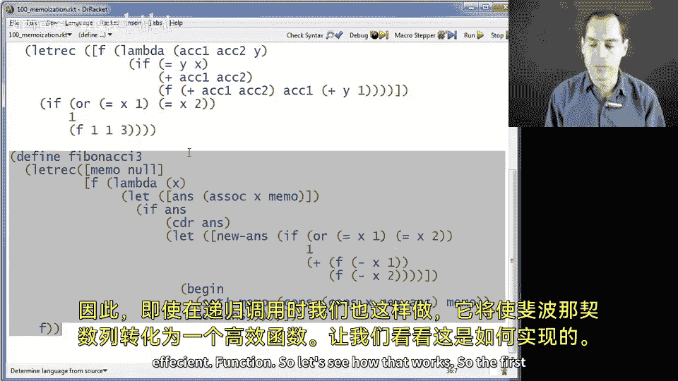

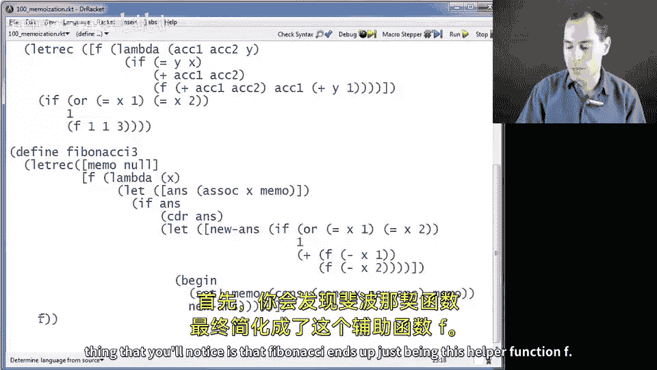

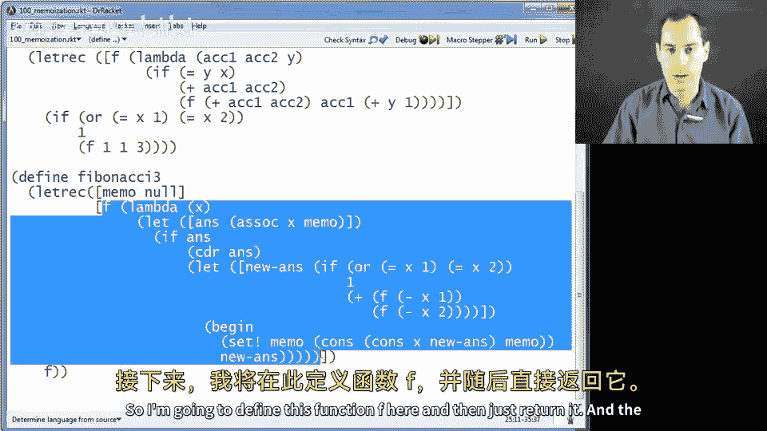

### 代码结构解析

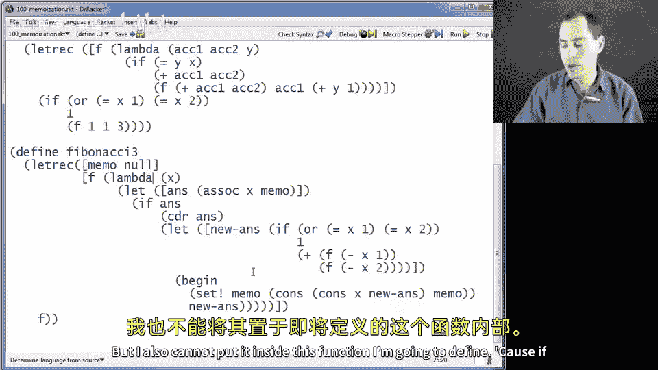

上一节我们看到了低效的递归实现，本节中我们来看看如何通过引入记忆表来优化它。

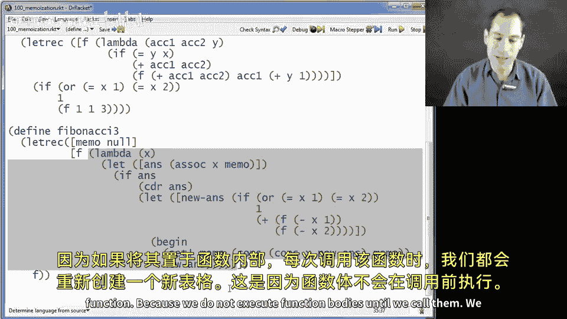

**1. 外层 `let` 绑定记忆表**
   *   代码 `(let ([memo null]) ...)` 创建了一个局部变量 `memo`，并将其初始化为空表 `null`。这个表对于函数是私有的，不会暴露给外部。
   *   将 `memo` 放在函数定义之外、`let` 表达式之内是关键。这确保了记忆表在多次函数调用之间是持久存在的，而不是每次调用都新建一个。

**2. 核心函数逻辑**
   *   函数主体是一个 `lambda` 表达式，它接受参数 `x`。
   *   首先，使用 `(assoc x memo)` 在记忆表 `memo` 中查找参数 `x`。`assoc` 函数会在一个由点对（pair）组成的列表中，查找其 `car`（第一个元素）与给定键（这里是 `x`）匹配的项。如果找到，则返回整个点对；否则返回 `#f`（假）。
   *   记忆表中存储的点对结构是 `(参数 . 结果)`。

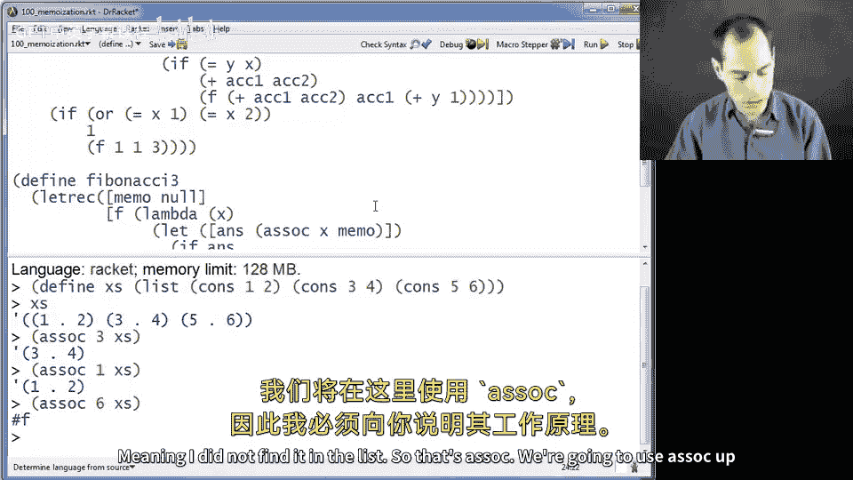

**3. 条件分支处理**
以下是函数执行的两种路径：
   *   **缓存命中**：如果 `(assoc x memo)` 返回了一个点对（即 `ans` 为真），则通过 `(cdr ans)` 直接取出该点对的 `cdr`（第二个元素），也就是之前计算好的结果，并立即返回。这样就完全避免了重复计算。
   *   **缓存未命中**：如果未在表中找到 `x`（即 `ans` 为假），则进入 `else` 分支进行计算。

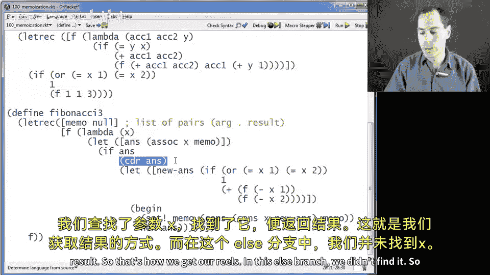

**4. 计算与存储新结果**
   *   在 `else` 分支中，使用一个内部的 `let` 变量 `new-ans` 来计算斐波那契值。计算逻辑与原始的低效版本相同：如果 `x` 是1或2，结果为1；否则，递归调用 `(fibonacci (- x 1))` 和 `(fibonacci (- x 2))` 并将结果相加。
   *   关键点在于，这里的递归调用 `fibonacci` 是已经被记忆化包装后的版本。因此，即使是递归调用，也会先查询记忆表。
   *   计算得到 `new-ans` 后，使用 `(set! memo (cons (cons x new-ans) memo))` 更新记忆表。这行代码将新的点对 `(x . new-ans)` 添加到表的最前面，并赋值回 `memo`。
   *   最后，返回 `new-ans`。

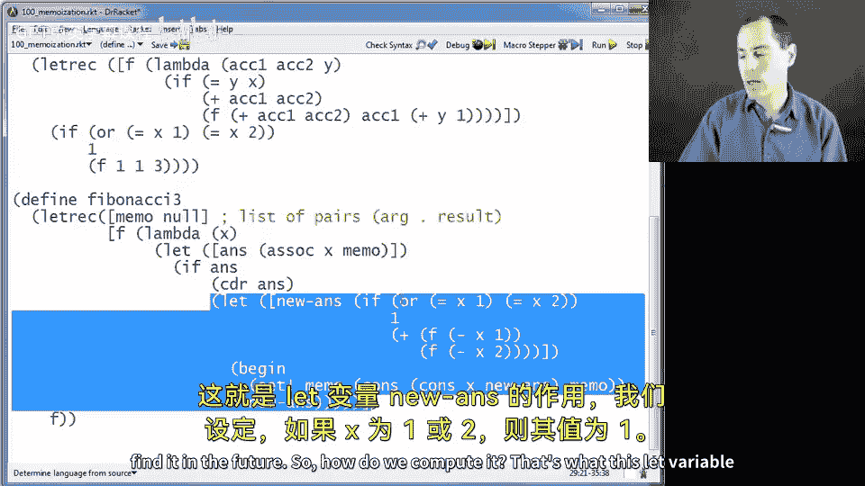

## 为何效率大幅提升

记忆化技术之所以能带来指数级的效率提升，关键在于它彻底改变了递归调用的性质。

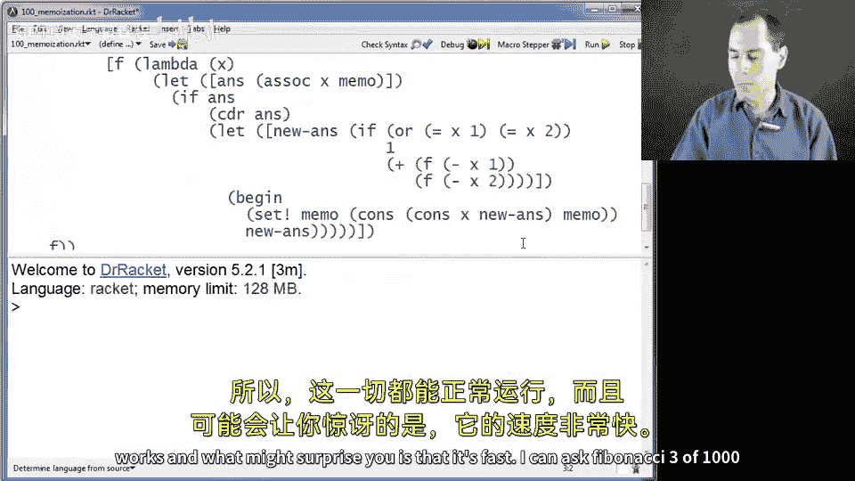

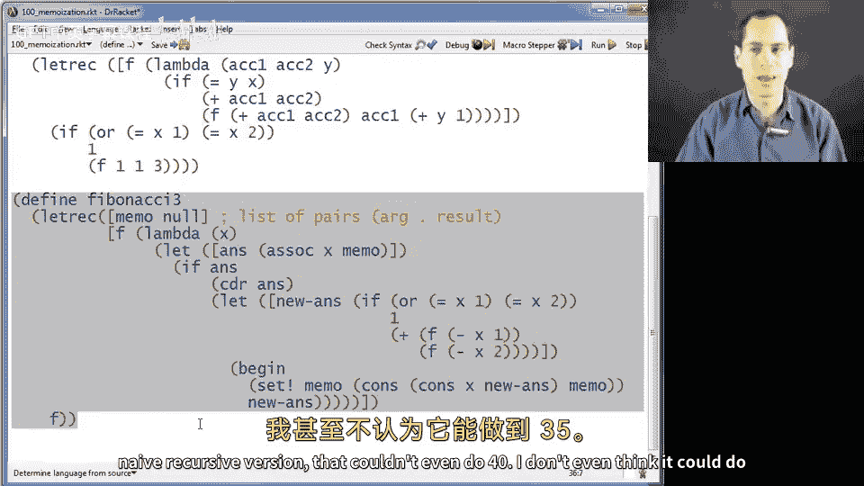

在原始的低效版本中，计算 `fib(n)` 会产生一棵巨大的递归树，许多子问题（如 `fib(n-2)`、`fib(n-3)` 等）被重复计算了无数次，导致时间复杂度约为 **O(2^n)**。

在记忆化版本中：
1.  首次计算某个 `fib(k)` 时，结果会被存入表中。
2.  之后任何需要 `fib(k)` 的调用（无论是来自顶层还是来自其他递归分支）都会直接在表中找到结果，时间复杂度为 **O(1)**（或近似 O(n) 的列表查找时间）。
3.  因此，每个 `fib(k)` 值在整个程序运行过程中**只会被计算一次**。总体的计算过程从树形递归退化为了类似自底向上的动态规划，时间复杂度降低为 **O(n)**。

例如，计算 `fib(1000)` 在原始版本中是完全不可能的，而在记忆化版本中可以瞬间完成。

## 总结

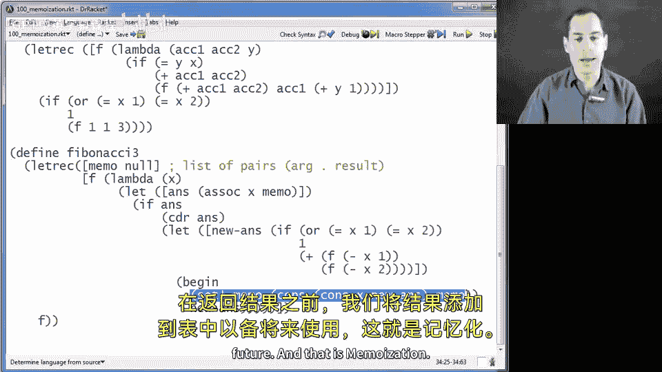

本节课中我们一起学习了**记忆化**这一重要的编程技术。我们了解到：
*   记忆化的核心是**用空间换时间**，通过缓存纯函数的计算结果来避免重复计算。
*   其通用模式是：在函数开始时检查缓存；若命中则直接返回；若未命中则进行计算，并在返回前将结果存入缓存。
*   我们通过将斐波那契函数从 **O(2^n)** 优化到 **O(n)** 的实例，深刻体会了这项技术如何带来巨大的性能提升。
*   记忆化是一种可以“机械式”应用的通用优化手段，适用于任何输入输出映射固定、计算成本较高的纯函数场景。