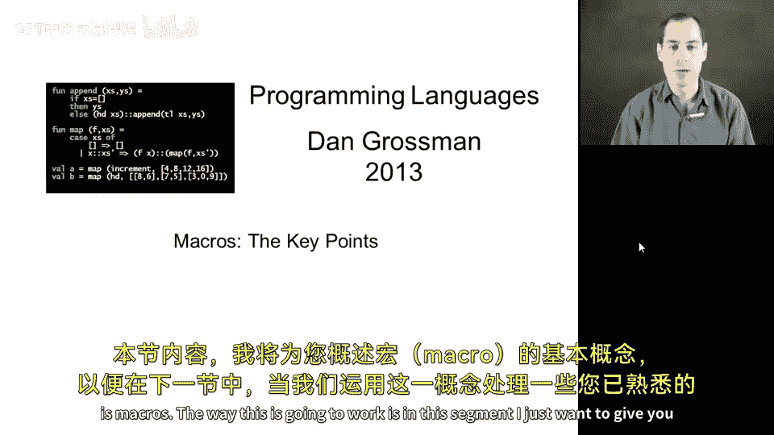
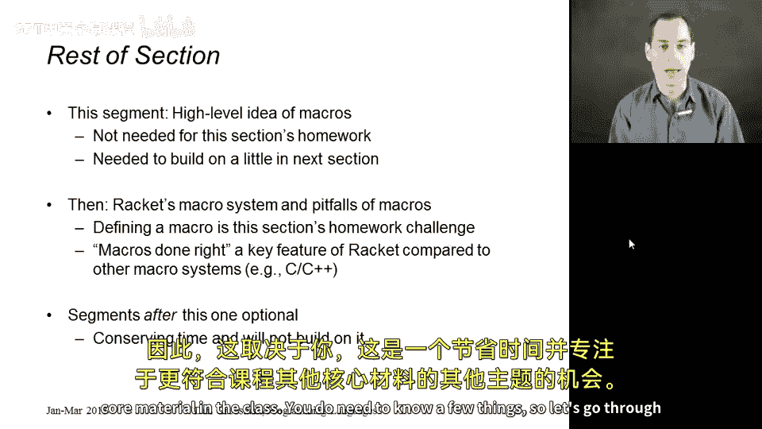
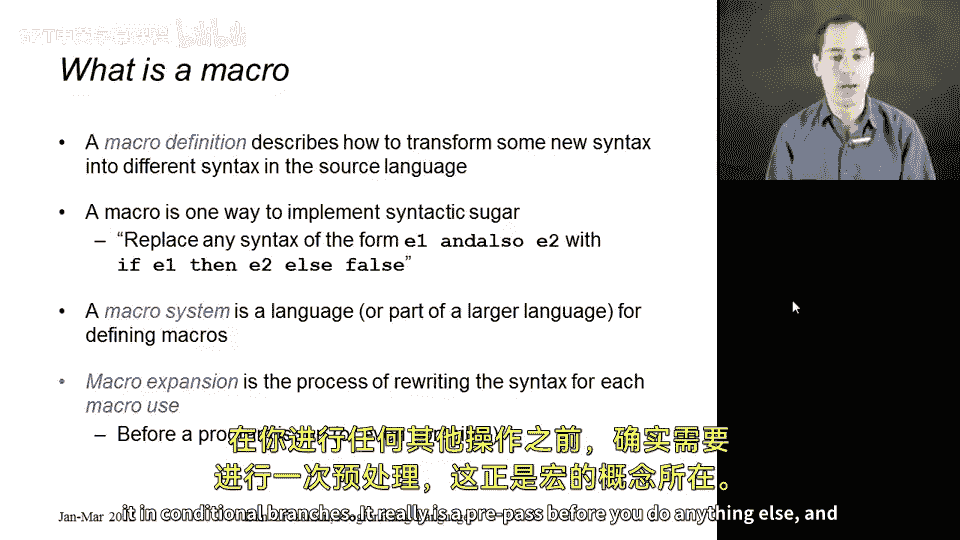
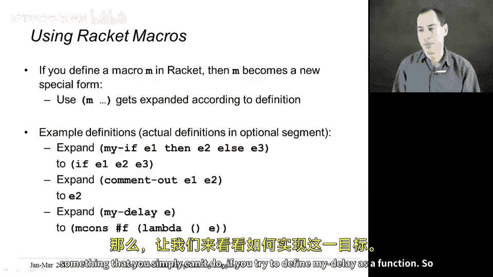
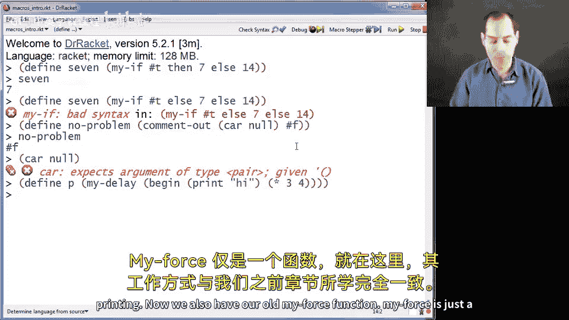
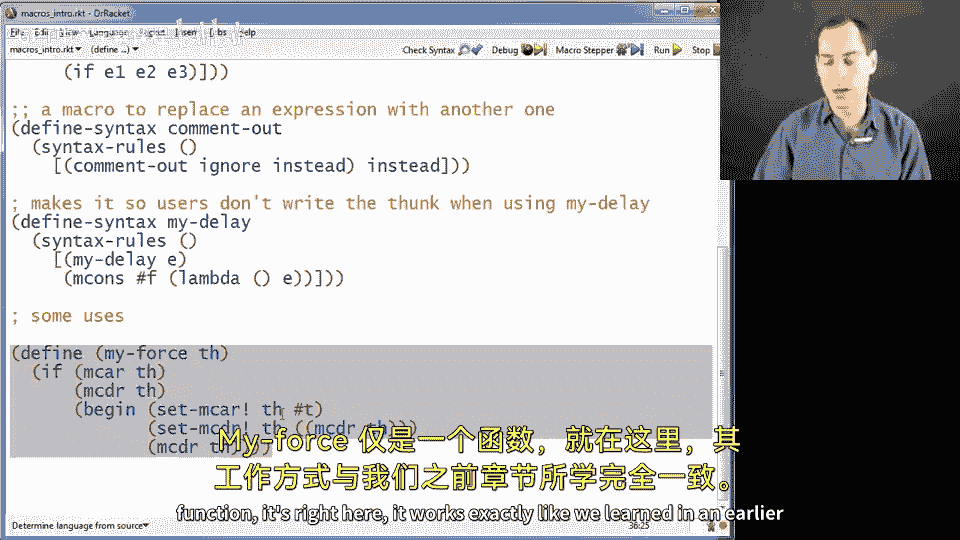
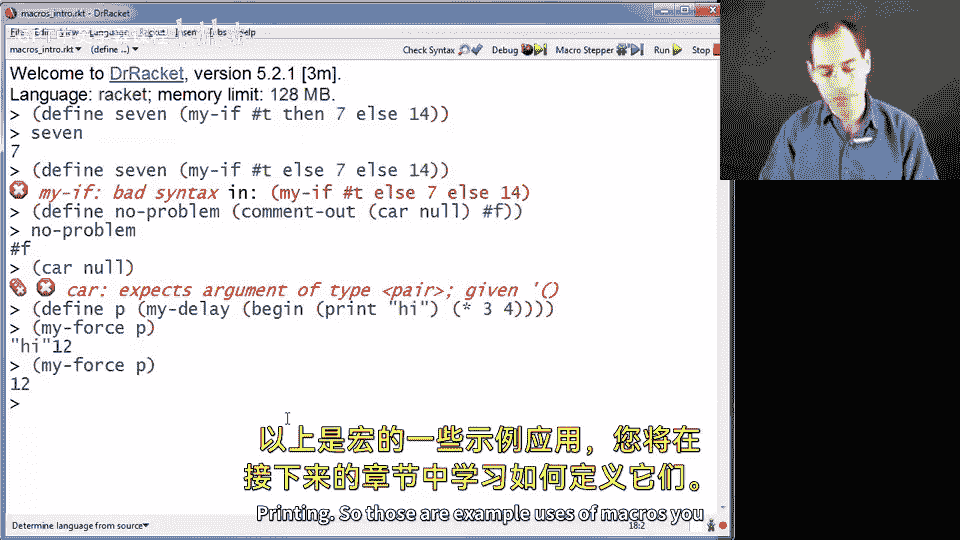
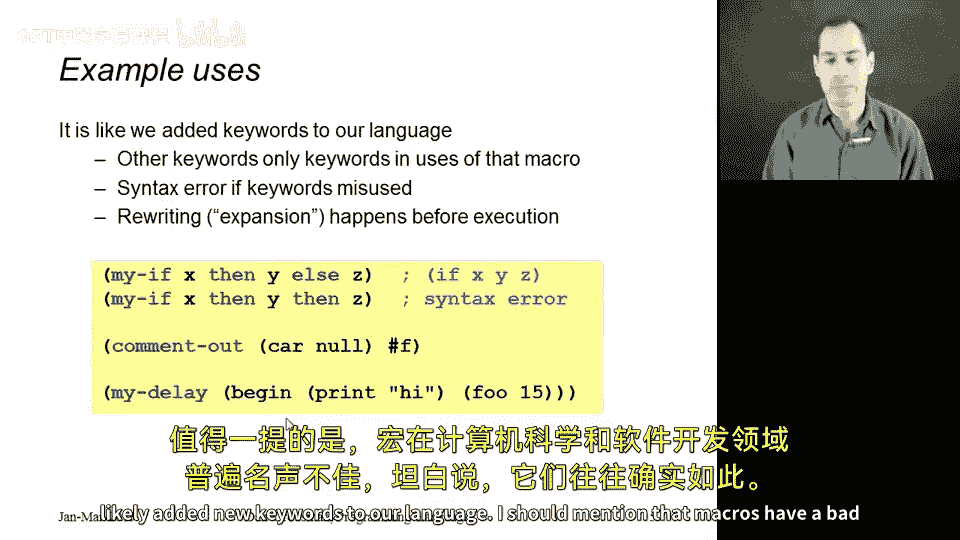
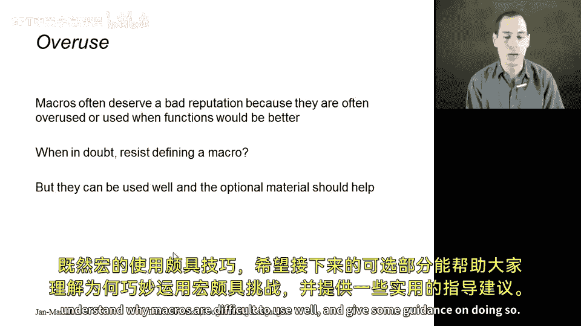
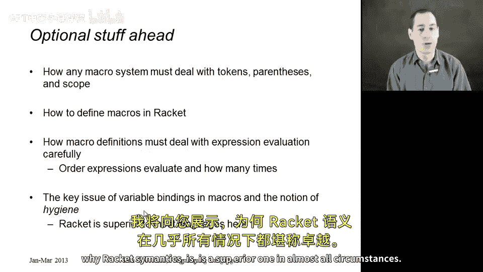

# 编程语言 A/B/C CSE341 Coursera：21：宏的核心要点 🧩

在本节课中，我们将学习宏的基本概念。宏是一种允许程序员扩展编程语言语法的强大工具。我们将了解宏是什么、它们如何工作，以及为什么在某些情况下它们比函数更合适。课程内容将保持简单直白，确保初学者能够理解。

---

## 什么是宏？ 🤔





上一节我们介绍了宏的基本概念，本节中我们来看看宏的具体定义。

宏定义描述了如何将某种新语法转换为源语言中的不同语法。你可以将宏定义视为向语言中添加更多语法糖。如果程序员可以定义自己的宏，他们就能通过引入新的语法糖来扩展语言的语法。

例如，我们可以创建一个宏，在 Racket 中添加类似 `andalso` 的关键字，这个宏会展开为我们已知的条件表达式，就像 ML 中的 `andalso` 是语法糖一样。

宏系统就是提供给程序员用于定义宏的一种语言。定义宏之后，其他人就可以像使用函数一样使用这个宏。当宏被使用时，会发生宏展开：根据宏定义中的规则，将使用处的语法转换为去糖后的版本。

宏系统工作的关键点在于，展开过程发生在我们课程中讨论过的所有其他步骤之前。在静态类型语言中，宏展开发生在类型检查之前；在任何求值之前，宏展开就已经完成。宏展开在函数体、条件分支等各处进行，它是在执行任何其他操作之前的一个预处理步骤。

---



## Racket 中的宏示例 📝

以下是几个宏的使用示例，后续的可选章节将学习如何定义它们。

**示例 1：自定义 if 语句**
假设有人不喜欢 Racket 的 `if` 语法，因为不清楚哪个部分是“then”，哪个是“else”。他们可以定义一个宏 `myif`，其语法为 `(myif e1 then e2 else e3)`。宏展开会将其转换为 `(if e1 e2 e3)`。

**示例 2：注释掉代码**
可以定义一个宏 `comment-out`，它接受两个任意表达式 `e1` 和 `e2`。宏展开会“丢弃” `e1`，只保留 `e2`。由于宏展开在所有求值之前进行，`e1` 永远不会被求值。

**示例 3：创建延迟求值（Promise）**
我们可以定义一个宏 `my-delay`，它接受一个表达式，并通过宏展开将其包装在一个 `lambda` 中，确保该表达式不会立即被求值。这是无法通过定义普通函数 `my-delay` 来实现的。

---

## 宏的实际演示 🎬



让我们通过一些代码示例来具体看看这些宏是如何工作的。

```racket
; 使用自定义的 myif 宏
(myif #t then 7 else 8) ; 展开为 (if #t 7 8)，结果为 7

; 使用 comment-out 宏
(comment-out (car null) #f) ; 展开为 #f，(car null) 不会引发错误

; 使用 my-delay 宏
(define p (my-delay (begin (print "hi") (* 3 4))))
; 由于宏展开，表达式被包装在 lambda 中，不会立即打印 "hi"
(force p) ; 此时会打印 "hi" 并返回 12
(force p) ; 再次 force，返回 12 但不会再次打印 "hi"
```

这些示例展示了宏的用法。本质上，宏就像为我们的语言添加了新的关键字。

---

## 宏的声誉与使用建议 ⚠️





宏在计算机科学和软件开发中名声不佳，坦白说，这通常是有道理的。宏经常被过度使用，或者在那些使用函数在风格上更为合适的场景中被误用。





因此，这里要传达一个重要的信息：**当你不确定宏是否有用时，很可能你不应该定义或使用它**。但是，如果你喜欢上面 `my-delay` 的版本，用户只需写表达式 `e`，而无需写 `(lambda () e)`，那么你真的需要一个宏，因为世界上没有任何函数可以拥有一个不被求值的参数。

既然宏可以被很好地使用，我希望接下来的可选章节能帮助大家理解为什么宏难以用好，并提供一些正确使用的指导。

---

## 后续可选内容展望 🔮



在后续的可选内容中，我们将讨论宏系统如何处理括号和变量等基本语义。我们将学习如何定义本节中使用的那些宏。我们将了解到，在定义宏时，必须格外注意哪些表达式在何处求值以及求值多少次。最后，我们将看到 Racket 比大多数宏系统做得更好的关键一点：当宏定义局部变量或使用宏定义作用域内的变量时，Racket 拥有合理的语义。这是大多数语言处理得不太理想（或者说采用了不同语义）的地方，我们将展示为什么在几乎所有情况下，Racket 的语义是更优的。

---

## 总结 📚



本节课中我们一起学习了宏的核心要点。宏是一种在程序求值、类型检查等所有步骤之前进行语法转换的机制，它允许程序员扩展语言的语法。我们看到了宏的定义、工作原理以及几个简单的使用示例。同时，我们也了解了宏可能被误用，因此需要谨慎使用。最后，我们预览了后续将深入探讨的宏定义细节和 Racket 宏系统的优势。