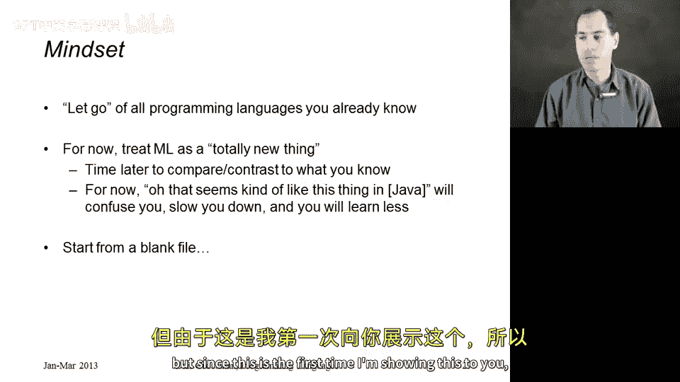
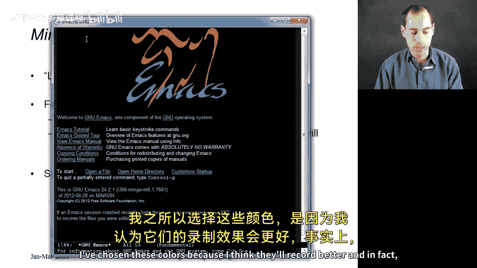
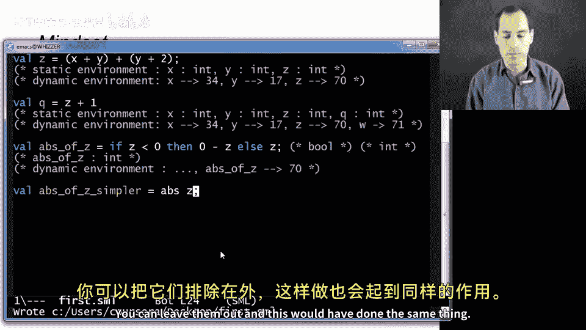
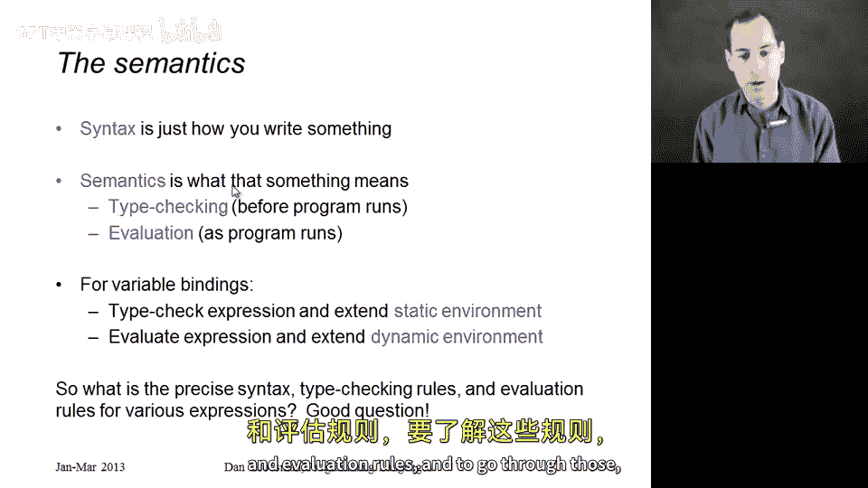

# 【编程语言 A⧸B⧸C CSE341 Coursera】华盛顿大学—中英字幕 p12 11_01_ml-variable-bindings-and-expressions -BV1bw4m1D7MM_p12-

All right， without much further ado， let's get started with programming in ML。

What I really hope you'll do as we start doing this is let go of any programming or any programming language you already know for now。

 treat ML is this totally new thing if you prefer don't even call it programming we'll have plenty of time later to compare and contrast what we're going to do an ML to things that you already know and I really think that if right now you try to take each thing that I write down and say oh。

 that's kind of like this thing I know in Java or in Python or in whatever it's going to confuse you and make things more difficult so it may seem like I'm going really slowly but focus on the words and the terms and how we're thinking about stuff rather than trying to guess what the answer is going to be as we go。

Alright， so I'll usually have things open for us in advance。

 But since this is the first time I'm showing this to you。

 what I'm gonna to do now is open the Emax editor。 So this is what it looks like right after I open it。

 Your colors may be different。 I've chosen these colors because I think they'll record better。

 And in fact， I'm going switch the size here as well so that it'll be easier for you to see。

 Now I'm just gonna open any file I want。 I'll usually have this predone， but again。

 I'm just I hit control X control F。 And now I'm just passing in path name。

 This file doesn't actually exist yet。 First do Sml。

 We're always going to use Sml for our file extensions。

Hit return and now I have this blank file here， by the way。

 another simple thing you can do is if you create the file ahead of time。

 you can literally take your mouse at least under windows and drag the file onto Es and it will open。

So here I am in a blank file and the first thing I'll do is write a comment， so this is a comment。

 this is our first program so comments like in every programming language I'm familiar with are just things that are ignored by anything except humans and in standard ML we start our comments with a round parenthesis and then a star and we end them with a star and then around parenthesis and yes you can nest comments inside of each other so that's just a comment we haven't written any program yet let's write a one line program Valal X equals 34。

 This program is going to create a variable and is going to have that variable hold 34 and because 34 is something of type int short for the English word integer X will be a variable of type in。

Okay， so what we see here is we are creating a new variable using the v keyword。

 so Valal is a special word in the language that says I'm about to introduce a variable。

X is the variable name we chose。 We could have chosen any thing there like Y or Fo or hello or Dan。

Equals is part of the syntax of declaring a variable。

 And then here between the equals and the semicolon to end it。

 I've put in expression and the simplest kind of expression we have is just an integer constant。

So let me do a second one， let's create a variable y that has value 17。Alright。

 now I'm going to save with control X， control S。 And now this is a program。 I didn't need a main。

 I didn't need a class。 I didn't need a method for today for this video。

 A program is just a sequence of these variable bindings。 So each of these is a binding。

 We have a sequence of them， and that's our program。If I want to run this program。

 I'm going to use the standard M Reple， the read aval print loop。

 We'll talk more about that in a couple videos。 But for now。

 let me just give you the basics of how you run this program。

 So I'm going to try control C control S， then hit return。

 and that brings up this other window where I can now say use。And then first do Sml。

 So the name of my file inside of quotation marks to make it a string， this function。

 although think of it as a command use， then a semicolon and then hit return。And sure enough。

 I get a message that it's opening that file and it tells me some things it says that it's created a value X。

 a variable x that contains 34 and has type int， a variable Y that contains 17 and has type int。

 and then this last line you'll always see this is actually the result of running U'。

 and you're free to ignore it。So I can now continue。 I could add more things to my file。

 but I can also just use this prompt to see things。 So if I type x semicolon， it'll say， oh。

 that's 34 it has type in。 If I said x plus 7 semicolon。 It'll say， oh， that's 41 and it has type in。

 if I say x plus 7 and forget the semicolon， it'll wait for me to continue some longer command。

 And so I can end it with semicolon or I could have split things on multiple lines and maybe added y to that and then semicolon and that would be 58 and so on。

 We'll have more to say about the reppl in a bit。 But for this video。

 what I want to do is just go back and continue writing our program and understand the exact meaning of what it means to have a sequence of bindings。

 So the nice thing about this sequence is that you can use earlier things in the sequence。

 So if I have x plus y plus y plus2。Now what will happen is when I go to create the variable binding for Z。

 it will be able to use the earlier bindings。Now an obvious question would be can you use later bindings and the answer is you cannot and that might seem very strange or unusual。

 but it has certain advantages that we'll talk about in a couple videos， but the rule。

 every programming language has different rules is that you can only use the earlier binding。

And the reason is that we can actually keep track of exactly what our program means as we go along。

 so I'm going to do this in comments， but this is exactly what the implementation of the language is doing when it sees all this code。

 So initially we don't have anything now it turns out we have a bunch of predefined functions and variables but we haven't defined anything yet。

 and now after we create this variable binding X。 what we have is what we have I'll call a dynamic environment。

 it's the environment you have when you're running the program and in that environment。

 let's say X holds 34。And then after the next one， we'll have a dynamic environment。Fiveron min。

 where x holds 34 and y holds 17。And that's why when we get to this third one。

We still have X holds 34 and y holds 17。 and so what happens is we get to this expression。

And we evaluate it in the current dynamic environment。So when you have an addition expression。

 you go and evaluate the two subpieces， so in this edition expression， the two subpieces。

 when you get a variable， you look it up in the environment， so we look up x， we get 34。

 we look up Y we get 17 together that's 51 over here we'll end up looking up Y again that will give a 17 add two more that's 19 and if my math is correct。

 we'll get what about 70 here。 So Z will in this environment now map to 70 and this is how we continue as we evaluate our program。

 So if next we had z plus 1。Then I'm just going to paste this down。

 we'd have everything we did have on our environment， and now W holds 71。

Now there's something that happens before any of this， and that is that our entire program， our file。

 our sequence of bindings is type checked。ML is a language with a type system。

 And if your program makes inconsistent assumptions about what's an int or tries to use a variable that's not defined。

 you get an error before you ever tried to run the program。

 And that is taken care of what I'll call the static environment。

 even though I'm showing this to second， this all happens before the program is ever evaluated before it's ever run。

 So what actually happened is the implementation first went through this whole program and said， oh。

 because 34 is an int， I know that that's built into the language。 X will have type int。

 it will hold something of type int and similarly as I go back through this sequence。 I say， oh。

 well X has type int and y has type int。Allright， and here now this is more interesting。

 The only reason that Z gets to also have type endt。Is because when I looked at this expression。

 when the type checker looked at this expression and said， well。

 addition has type int if both the sub expressionpresss on the two sides have type int。Similarly。

 this edition can have type in if x and y have type int， and when you get a variable。

 you type check it by looking it up in the static environment。

So the static environment acts a lot like the dynamic environment。

 except it just deals with what's an int or what's defined or what's not。

 And so it doesn't actually run the program。 All right So what really happens when you take this file is first everything type checks。

 then if that passes everything runs。 Now it may not look that way。 if I flip over to my reple here。

 and I'm always going to restart before I show you something after I've changed the file。

 It looks like it just figured out all together that x is a 34 and as type in y is 17 is type in。

 But I really like to think of the type checking as coming before the evaluation。All right。

 let me show you a couple more kinds of expressions， and then we'll wrap up this segment。First。

 let me show you a conditional。So here， let me finish writing it out and then I'll walk you through what's going on here。

 So I'm just creating another variable。 This one's called abs of Z。 and it says if z is less than0。

 then0 minus Z else Z。 And as you might imagine the way and if expression is evaluated is different than addition。

 It doesn't go and evaluate all the sub expressionpressions， it first looks at this first subexpress。

 Z less than 0。It looks up Z in the dynamic environment gets 70 takes0， asks less than that's false。

 So as a result it ignores this expression between then and else never evaluates it and instead evaluates just the thing after the L gets a result in this case 70 and so the result of the entire thing。

 this if will be 70 and will end up therefore putting the result as the value for abs of z。

 which is shorthand for the absolute value of z。 So in fact， in our dynamic environment here。

We'll have everything we had before。And then that abs of Z maps to 70。As for the type checking。

 the way we type check and if then else is the thing between the if and the then has to be something of type boole and indeed less than returns a bo short for Boolean。

 given two integer arguments， and then these two branches can have any type they want。

 but they have to have the same type in this case fortunately they both have type int and so the result of the entire if expression is type int。

 which is why abs of Z in our static environment indeed has type int， as does everything else。

 we've added to our static environment in this first file。And by the way。

 you know this is a real programming language with lots of built-in features like less than and plus and minus we didn't actually have to do it that way。

 there's a function defined for us called abs， which takes an in and returns its absolute value。

 This is the first time I'm showing you calling a function。

 you might be used to something like this and you can write it that way。

 but the parentheses don't actually matter， you can leave them out and this would have done the same thing。

Okay， so that's our first program。 Let me now get rid of this and just give you a little more sense of how the slides will work after I show you the code。

 So here's basically the program we just wrote。 I like to include it in the slides。

 So if you're looking through the slides， you don't have to flip back and forth。

 but we already saw all this。What we focus on here were variable bindings， and in general。

 the way we have a variable bindings we write at v， the name of the variable， the equal sign。

 and expression which I'm representing here in the middle of the slide with an E。

 and then a semicolon。And what I've just described is the syntax。

 syntax is how you write something down。 I haven't said what it means that we talked about with the code。

 and I have it here on the last slide of this little segment。 and that's the semantics。

 So syntax is how you write something。 semantics is what that something means。

 And we're dividing our semantics into type checking。

 which is what we do before the program runs to make sure there's nothing inconsistent。

 you don't use a variable that's not defined， you don't try to add something that's not a number。

 that sort of thing。 and then a evaluation， which is what happens when the program runs。

 And for these variable bindings， which is all I showed you here。

 you type check the expression that E after the equals。

 and use that to extend the static environment。When you evaluate the expression。

 that ends up extending the dynamic environment。So that's this meaning of variable bindings。

 but it seems clear that the meaning is going to depend on what kind of expression we have。

 So for each kind of expression， variables， additions。

 conditionals less than they're going to have their own syntax。

 type checking rules and evaluation rules。 And to go through those， you can go to the next video。

