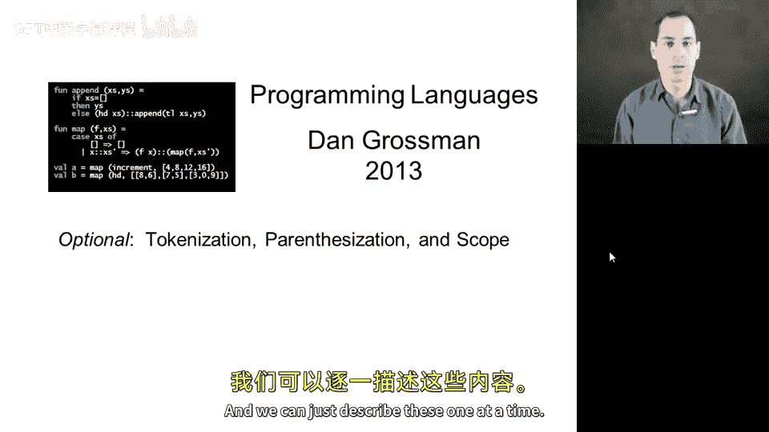
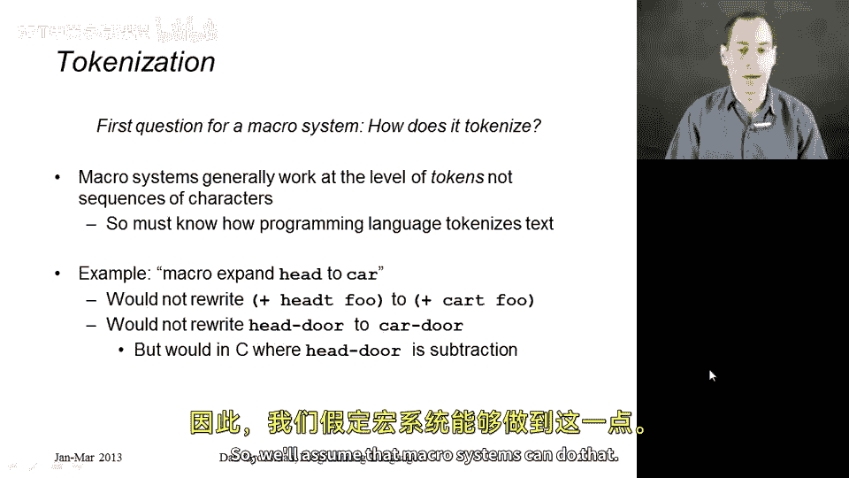
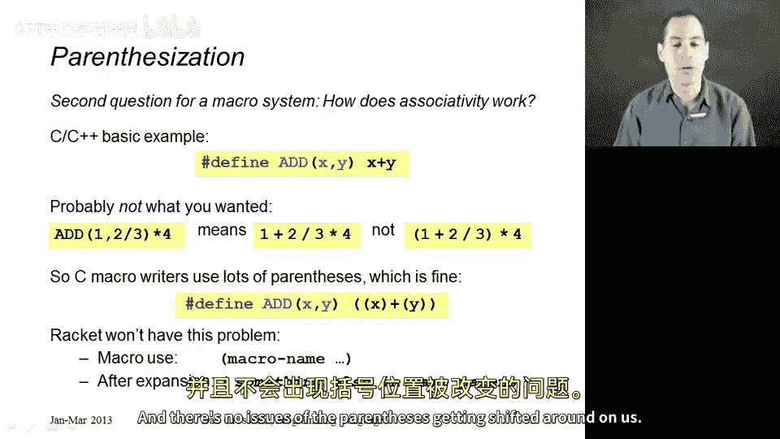
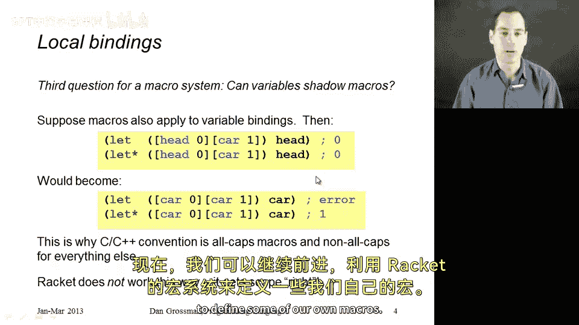

# 【编程语言 A⧸B⧸C CSE341 Coursera】华盛顿大学—中英字幕 p120 22_20_optional-tokenization-parenthesization-and-scope -BV1bw4m1D7MM_p120-

This segment is not yet going to get into the details of how we can define our own macros in racket because first I want to discuss three issues that come up in any macro system and discuss how macro systems in general and racket in particular deal with them I'll refer to these as how you break things into tokens。

 how you deal with parentheses and how you deal with local variables and scope issues when you're interacting with macros。

 and we can just describe these one at a time。

So the first question for a macro system is how does it look for uses of the macro。

 how does it know what is a use of the macro that needs to be expanded and what doesn't and pretty much all macro systemss take enough programming language details into account to work at the level of tokens instead of the level of characters so tokens is just a programming languages word that just means words instead of letters so a variable is a token。

 a keyword as a token， some arithmetic operators， a token we're not looking at the individual letters So an example will probably make this clear suppose your programming and racket and you really don't like car so it seems like a bizarre word to use for accessing the first element of a list well if that's how you feel I would recommend you to find a helper function that would have a different name and have the same meaning or semantics as car。

 but suppose instead you did it with a macro you define some macro that said anywhere I write。Head。

 H E D， I mean car and macro expansion will turn what I write as head back into car。

Okay that should work and what macros systemssems do not do is take something like the variable H EADT and turn it into the variable CAT。

 we don't want to turn head T into CART， that's not what we mean by replace head with CA。

 and so we have to understand enough about our programming language to understand that we should not do this。

😡，Now you might think this is obvious or trivial， but you do need to know a few things about your language right So in racket。

 we also would not take a variable head door and replace it with car door right。

 because it's the same reason right， but in C， the macro system for C would look at head door and would understand that that's not a variable that in C or in Java or anything else is a subtraction。

It's the head variable， minus the door variable。 and just because we don't have spaces doesn't mean those are not three separate tokens。

 three separate words， and the macro system has to understand where one token ends and the next begins。

All right， so we'll assume that macrosystems can do that。

Now， the second question is how does asciivity work。

 What parentheses are implicit or not So here I really get to pick on CNC plus plus if you've never seen them。

 don't worry about it， but in those languages you can define a macro like you see here at the top like that's add。

 So that's the name of my macro and says wherever you see add parenthesis， something comma。

 something else， replace it with x plus Y。And it turns out that if you do that in C or C plus+。

 if you call the macro here with two arguments1 and two slash3。

 and then you take the result of that macro and multiply it by4。

You would almost when you read the code， I think you would agree with me that what you kind of see is this thing on the right that we take one。

 we add to it two over three， and then we multiply by4。

 and that is not what you get in C andC plus plus macro system， you get the thing in the middle。

 it literally replaces the ad macro expands it to one plus2 slash3 and then because the next token after that is a star。

 when we run this code， it ends up doing this thing on the right and then adding one to it。

 which is very hard to see based on the code pre macro expansion。😡。

This is why when you see macros in CNC plus plus， tend to see them defined like this with lots and lots of parentheses。

 lots of extra ones just to make sure that sort of thing doesn't happen。

 and that's what you need to do in a language with that kind of bizarre macro system。

Racket doesn't have this problem。 And and racket， wherever we use a macro。

 it'll always be right after a left parentheses。 So it's like its own special form。

 And so after expansion， it's in that same position。

And if the thing we expand to has parentheses and we have parentheses。

 otherwise it's just going to be something like a number or a variable and there's no issue of the parentheses getting shifted around on us。

 so that's a good thing。

And the third thing we need to deal with with our macro system is how it interacts with potential variables that might shadow a macro definition。

 this is something that doesn't work well in CNC+ plus in most macro systemss。

 but the racket macro system understands this issue， comes up with a more reasonable semantics。

 and that's one of the reasons why I like showing the racket module system。

So let's go back to our example of we want to be able to write head。

 and so we defined a macro where we're going to replace every use of head with car。

So that macro has been defined somewhere， but maybe there's some code that doesn't know about it or doesn't care about it and just define some local variables that happen to be named head and car。

 So suppose I have this first let expression where I say let head be 0， car B1 and return head。

 Of course， I would expect a more complicated expression in the let body that would use both head and car。

 But this is a nice short example。 And we know that this would evaluate to 0。

 And it would evaluate to the same thing if we use let star because let and let star are the same if you don't use any of the same variables over again and don't use any of them in the expressions in the bindings before you get to the body。

Now， if we naively just replace every token head with car。

 then we were to replace both the variable uses and the variable definitions。

 so under the expansion down here you just see I've replaced all four heads with cars。

And now all sorts of weird things happen。The let is now an error。So we would do the macro expansion。

 and then we would get an error because when we evaluated this code。

 because you're not allowed to declare the same variable twice in the same lead expression。

In Let star you are， it's shadowing like ML's let binding， but now we get a different answer。

Because we replaced the head in the body with car。But that's now going to refer to this shadowed car。

 this inner one， and we're going to get one instead of zero。

 And so our macros are interfering with code that might not even know that the macro exists。

 and the great news is this does not happen in rackcet Raet has a more sophisticated semantics for macro expansion that gets scope to work out correctly And in racket head here。

 the local variable would simply shadow the macro， So the macro would not apply in here。

 and there would be no expansion we would get zero。

 which is what you expect since this code is trying to use a local variable and is not trying to use a macro。

So hopefully that gives you a sense that macro expansion is not trivial。

 it has some rather subtle issues， it has to be defined carefully。

 and now we can move on and use Raids module system。

 sorry macro system to define some of our own macros。

