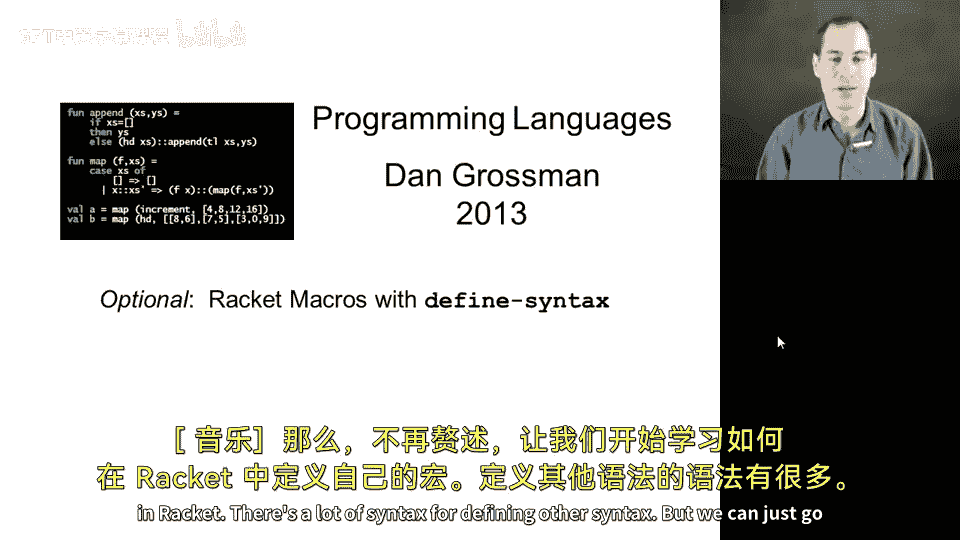
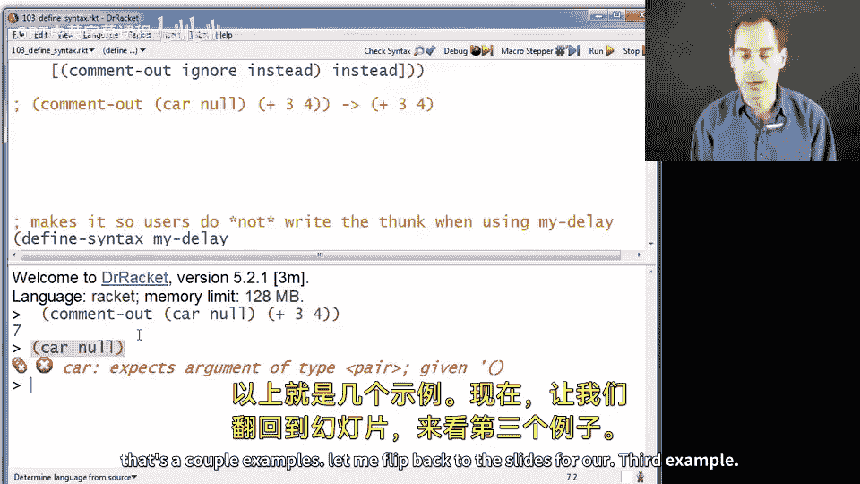
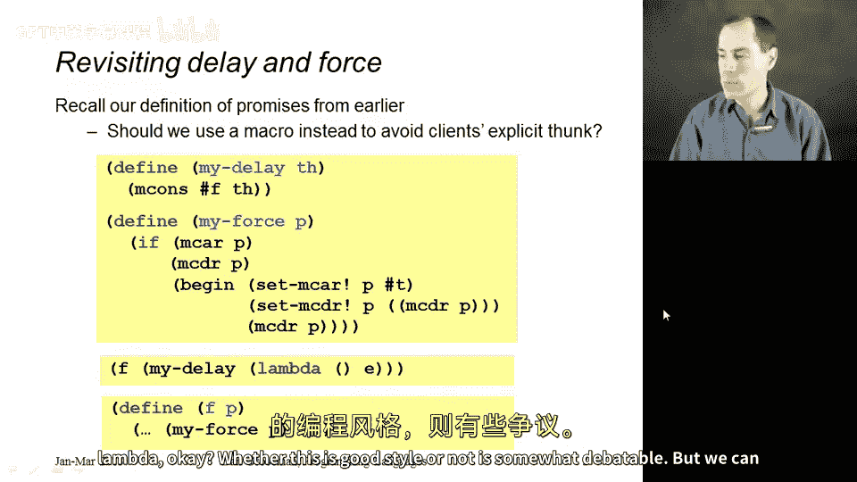
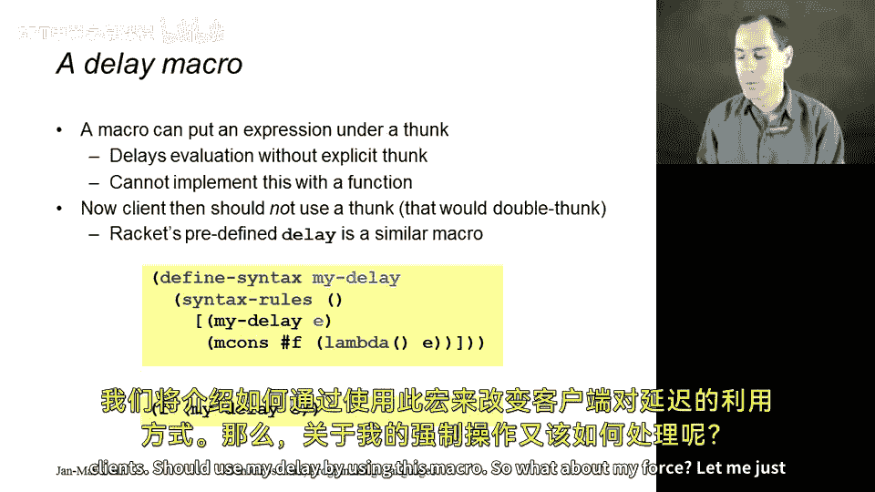
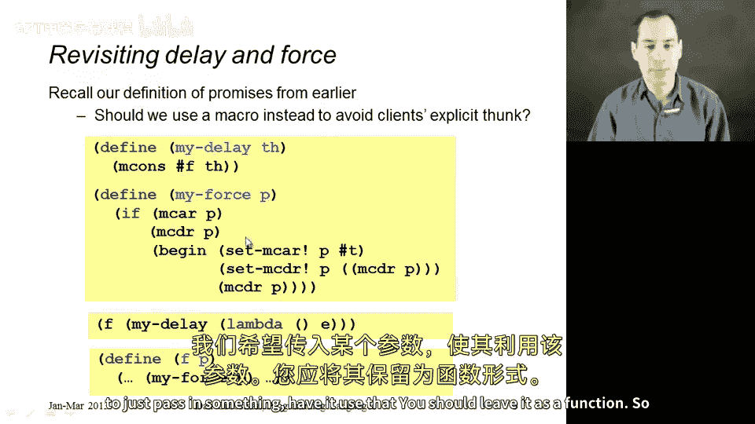
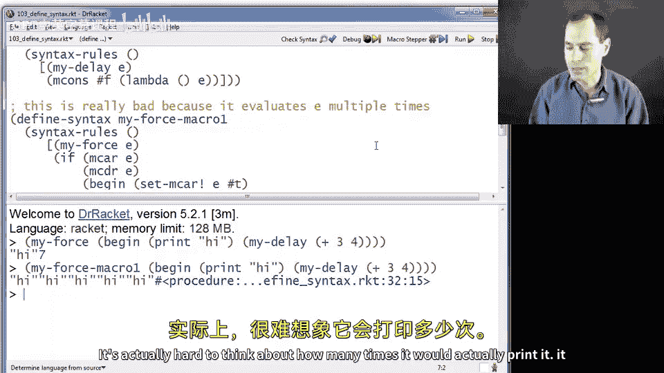
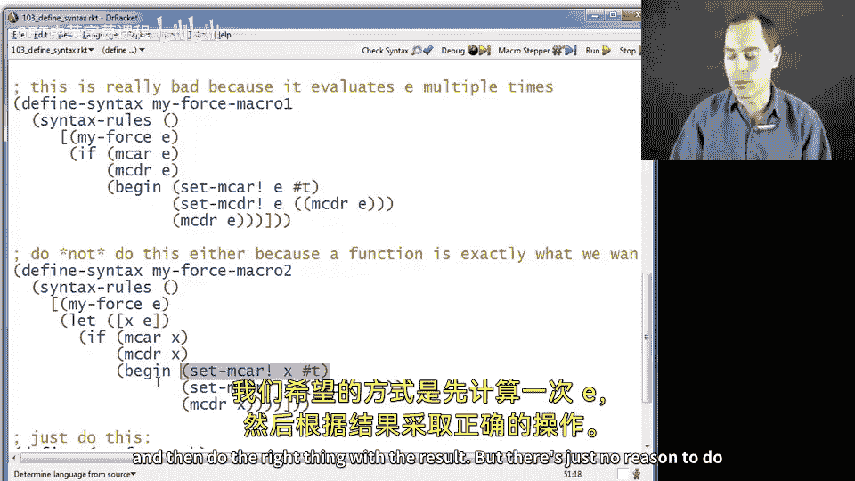
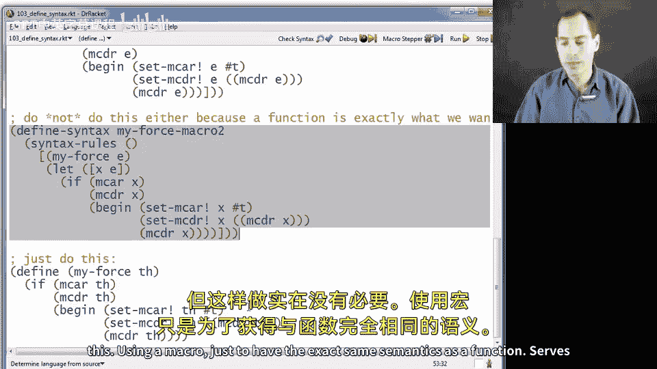
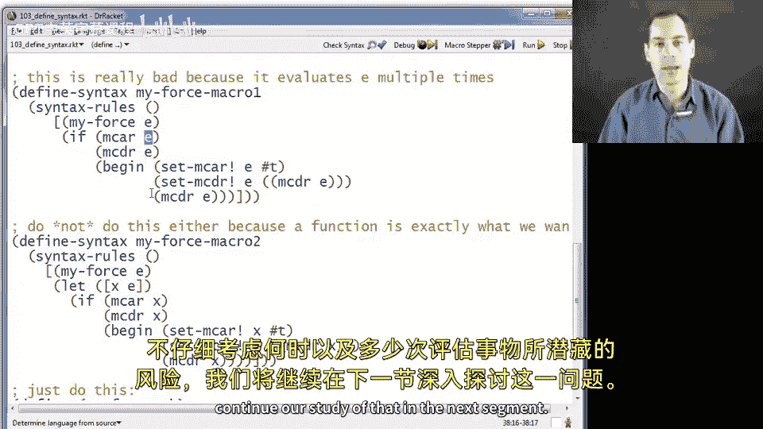

# 【编程语言 A⧸B⧸C CSE341 Coursera】华盛顿大学—中英字幕 p121 23_21_optional-racket-macros-with-define-syntax -BV1bw4m1D7MM_p121-

So now without further ado let's learn how to define our own macros and racket。

 there's a lot of syndax for defining other syndax。

 but we can just go through it line by line and we'll do the three examples that we used a couple segments ago when introducing the idea of macros。

So the first one I'm going to define is my own version of if where users will be able to write my if。

 some expression like fo then bar else Bas。 And， of course。

 the fo bar and bas could be any expression， arbitrarily deep as many parentheses as you want。

 and that will get expanded into if E fo bar Bas with the same expressions being expanded。

 So how do we tell racket that we want to have this macro。 We start with the defined syntax keyword。

 So it's not defined。 It's defined syntax because we're not defining a variable or a function。

 We're defining something different。😊，The name of your macro。 So my if。Then this other keyword。

 syntax rules， So we're going to give some rules for the syntax that's in parentheses like here。Okay。

Then。A list of the other keywords in this macro besides myF。So in this case， it's then and else。

 We need to tell it this because it doesn't know that we want then and else to be special words。

 whereas the other things， we want to be any arbitrary expression。

So now we have a list of cases we can use square brackets for this to delineate it。

 we could have had a second one here and then a third one。

 but in this case we always just want to expand the same way， no matter how MyF is used。

 so we're just going to have one that's fairly common， so we just have one thing in this list。

 but you need those square parentheses and now what we say is if you see something like this。

 expand it like this。So what does it mean to see something like this。

 It says if you see something in parentheses that starts with my if。Then has anything you want。

 quality1。And then the word then we know that we mean this particular word。

 not in anything you want because then is up in this list， then anything you want called E2。

 then exactly else because that's up in this list and then in E3。

Then it matches and the way to transform it is into this if E1 E2 E3。

 where kind of like pattern matching， except for defining a macro here。

 this E1 is whatever expression was here， this E2 is whatever expression was here and this E3 is whatever expression was here So this really does work if I say my if of true and plus 34 and 72。

 I'll get back7。If I remember to write then and else。If not， as you see there。

 you get an error message that says I know you're using the Myif macro。

 but none of the ways I know how to expand myif matched because the one rule we have requires then and else in positions3 and5。

 So there I get seven。 There's other things you could screw up。

 maybe you put then here and then it won't match and so on。

 so we really have to find our own macro to us。 It's not like myif is in the language。

 it will get expanded to an if and then evaluated whenever we use it。So let's do another one。

 and now let's do this comment out one。 So the idea here is that if you have something like comment out。

How about car of null and then plus 34 that this should macro expand to just plus 34 completely throwing away the first one。

 and so it's like you didn't have that first one there。So it's really the same idea， define syntax。

 the name of our macro syntax rules， we don't have any extra words here。

 but you still have to have the list， so just make it empty left parenthesis。

 right parenthesis our one case。And then when we see parenthesis common out one thing。

 and then another thing， This is like E1 and E2。 whatever those are。

 just replace it with the second thing。 You'll notice， by the way。

 I did not have these parentheses in here。 That would add a calling instead as a function。

 That is not what I want。 So let's try this one out。

 How about I just paste down here exactly what we had。 I think I'm missing。And then， delete this。

And I get 7。Keeping in mind that Cardial would be an error。

So that's a couple examples。 let me flip back to the slides for our third example I want to redo my delay in my force from when we studied promises。

 so here on this slide you see how we used to do it my delay and my force were functions my delay took a thunk return this m cons。

 my force took something that was one of these m cons is and then did the right thing for lazy evaluation。

So the way you would use this is if you had some function F here at the bottom that takes in a promise。

 a caller to F would have to write my delay of a thunk that when called evaluates E。

 and then F could force that thing。So what we could do is define a macro for my delay so that programmers don't have to write that Lambda。

 whether this is good style or not is somewhat debatable， but we can do this， it's no problem。

 a macro can pick up some syntax。

Put it under a lambda， and therefore it will delay evaluation because after macro expansion。

 it's inside a function and functions don't evaluate their bodies until you call them。

You cannot implement this as a function。 So here's how the macro looks。

 If we define my delaylay as a macro that takes some expression E and replaces it with M cons of false and a thunkk that evaluates E。

Then when we write just my delay of E， that will not evaluate E。

 it will return in m cons that has a funk in it that we can call later to evaluate E。

 And this simply cannot be done with a function。 There is no function in the world。

 that can take an argument E and not evaluate it because in racket functions always have their arguments evaluated before you evaluate the body。

 So if you want to do this so that programmers don't write the thk when they call my delay。

 a macro is really your your option。 that is your approach。Notice that having done it this way。

 we do not thunk the argument if the programmer comes along and does write Lambda parenthesis parenthesis E。

 well now we're going to have a double thunk。 we're going to have a thunk that when you call it returns a thunk。

 so you have to keep things straight， we are changing how clients should use my delay by using this macro。

So what about my force， Let me just go back here a second。 We have this function， My force。

 should it be a macro。What I want to argue is that it should not。 This is a perfectly good function。

We want to just pass in something。Have it use that thing。 You should leave it as a function。

 So let me show that with the code。 So here I've got my delay， just like we defined it。

 Suppose you try to do my force as a macro。

So you just said， all right， they can call my force with an E and I'll expand that。

 I will syntactically replace that with this if。What's the problem？

The problem is now whatever they passed in is going to get evaluated multiple times。

 That's not how the function works。 Let me show this to you。 If I call my force。

 this is the function version with some argument that has some side effect like printing high and then has a promise in it。

 my delay， This is a macro now。 So my delay of plus。3，4。Print high once evaluates the7。

 but with this first macro version。It print hide five times。

 It's actually hard to think about how many times it would actually print it。 It depends on this。

 But what we're doing is we're picking up this syndax and copying it into。

This expansion。Macros are hard to reason about， you don't want to do that。

Here's a second version of the macro that actually does the right thing。

 and it does it by taking in and E and creating a local variable。

That holds the result of evaluating E。 so that will evaluate E only once。

 and then we just use x everywhere。 And this macro will behave how we want。

 which is to evaluate E once and then do the right thing with the result。

 but there's just no reason to do this using a macro just to have the exact same semantics as a function serves no useful purpose。

 So that's why I don't mind my delay as a macro， but I don't want my force as a macro。

So what we've seen here are the basics of syntax rules， how to use define syntax to define macros。

 we've also started to see with this first My force。

 the danger of not thinking carefully about when you evaluate things and how many times you evaluate things and we'll continue our study of that in the next segment。

