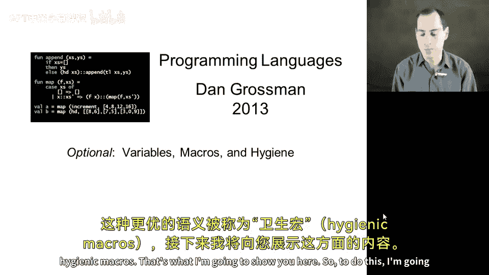
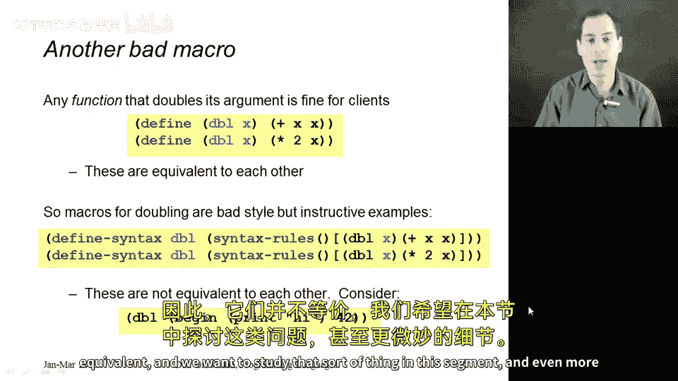
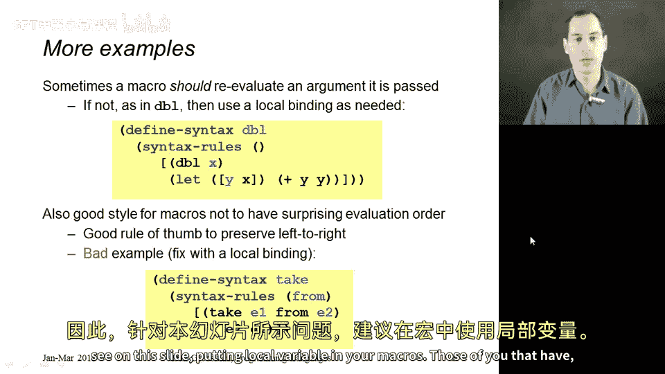
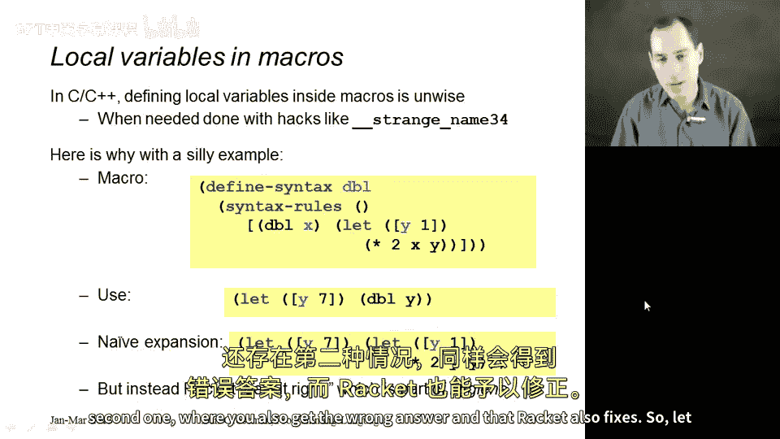
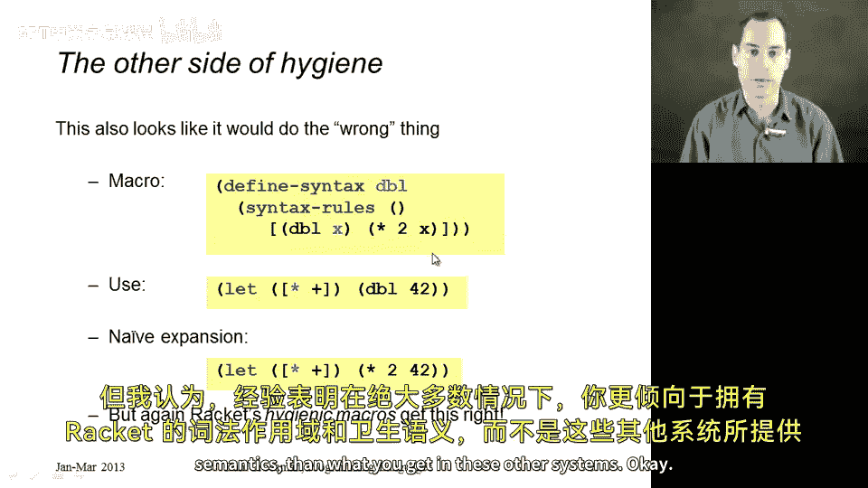
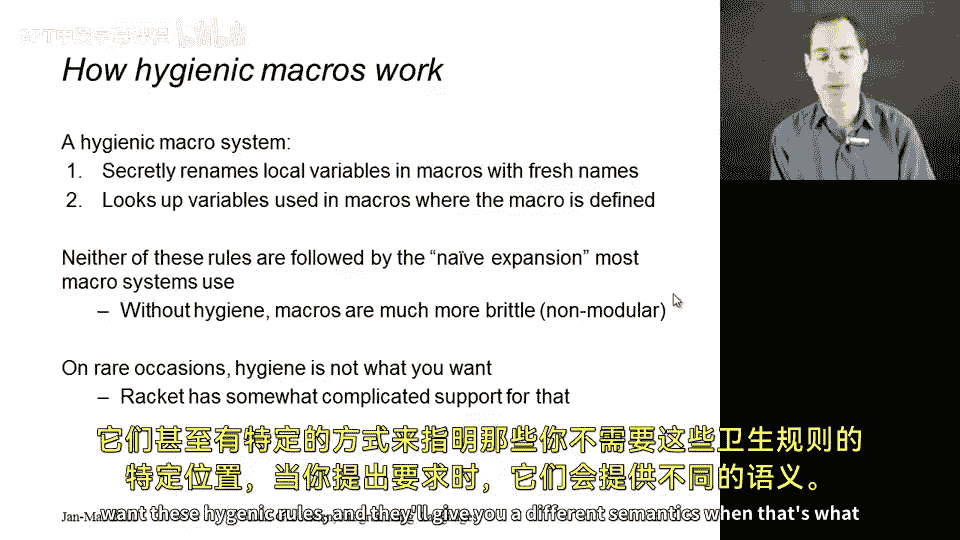

# 编程语言 A/B/C CSE341 Coursera：24：宏与变量、卫生宏



在本节课中，我们将学习宏如何与编程语言中的变量处理交互。我们将看到宏的语义与之前展示的简单宏展开不同。这种差异是积极的，它在变量可能遮蔽宏内内容的情况下表现更好。这种更优的语义被称为**卫生宏**。本节将展示相关内容。

## 宏与变量求值次数

上一节我们介绍了宏的基本概念，本节中我们来看看宏展开时如何处理变量求值。一个关键问题是宏参数可能被求值多次，这可能导致意外的副作用。

以下是两个实现“加倍”功能的宏版本，它们并不等价：

```racket
(define-syntax double1
  (syntax-rules ()
    [(_ X) (+ X X)]))



(define-syntax double2
  (syntax-rules ()
    [(_ X) (* 2 X)]))
```

如果使用 `double1` 宏并传入一个会打印信息的表达式，例如 `(begin (print "hi") 42)`，该表达式会被求值两次，导致信息被打印两次。而 `double2` 宏只会求值一次。

为了避免这种多次求值，可以使用 `let` 表达式将参数绑定到局部变量。以下是推荐的技术：

```racket
(define-syntax double3
  (syntax-rules ()
    [(_ X) (let ([y X]) (+ y y))]))
```

这个宏先将表达式 `X` 的结果绑定到局部变量 `y`，然后使用 `y` 进行计算，从而确保 `X` 只被求值一次。

## 宏与变量求值顺序

宏展开还可能影响子表达式的求值顺序，这可能与用户的预期不符。

考虑以下宏定义：

```racket
(define-syntax take-from
  (syntax-rules ()
    [(_ E1 E2) (- E2 E1)]))
```



用户可能预期参数 `E1` 和 `E2` 按照他们书写的顺序求值。然而，在 Racket 中，函数参数从左到右求值。因此，在宏展开后，`E2` 会先于 `E1` 被求值。

同样，可以使用 `let` 表达式来控制求值顺序，确保符合用户预期：

```racket
(define-syntax take-from-fixed
  (syntax-rules ()
    [(_ E1 E2) (let ([v1 E1]
                     [v2 E2])
                 (- v2 v1))]))
```

## 卫生宏的必要性 🧼

在 C 或 C++ 等语言的宏系统中，在宏内使用局部变量是危险的，因为宏展开时可能发生**变量捕获**，导致意外行为。Racket 的卫生宏系统解决了这个问题。

考虑以下有问题的宏定义：

```racket
(define-syntax double-bad
  (syntax-rules ()
    [(_ X) (let ([y 1]) (* 2 X y))]))
```

如果用户在已经定义了变量 `y` 的上下文中使用这个宏，例如 `(let ([y 7]) (double-bad y))`，在非卫生的宏系统中，宏内的 `y` 会捕获外部的 `y`，导致错误结果。Racket 的卫生宏通过重命名宏定义中的局部变量来避免这种冲突，确保得到正确结果 `14`。

## 宏与词法作用域



卫生宏的另一个重要特性是遵循**词法作用域**。宏定义中引用的自由变量（如 `*`）是在宏**定义时**的环境中查找，而不是在宏**调用时**的环境中查找。

考虑以下宏：

```racket
(define-syntax double-lexical
  (syntax-rules ()
    [(_ X) (* 2 X)]))
```

即使用户在调用宏的上下文中重新定义了 `*`（例如将其绑定为 `+`），宏展开时仍然会使用定义时的乘法操作，得到正确结果 `84`，而不是错误结果 `44`。这保证了宏行为的可靠性和可预测性。

## 卫生宏的实现原理

卫生宏系统通过两种机制工作：
1.  **重命名局部变量**：宏展开时，宏定义内的局部变量会被自动重命名为唯一的标识符，防止与调用处的变量发生冲突。
2.  **维护词法环境**：宏定义中引用的自由变量会在宏定义时的词法环境中进行解析，而不是在调用时的环境中。



这些机制使得在 Racket 中，开发者可以安全地在宏中使用局部变量，而无需担心命名冲突。虽然实现比简单的文本替换复杂，但它带来了巨大的便利性和可靠性。

需要注意的是，卫生规则虽然适用于绝大多数情况，但 Racket 也提供了在特定情况下绕过这些规则的机制，以满足更高级的元编程需求。

## 总结



本节课中我们一起学习了宏与变量交互时的关键问题。我们了解到宏参数可能被多次求值或按意外顺序求值，可以通过 `let` 表达式来控制。更重要的是，我们探讨了**卫生宏**的概念，它通过自动重命名局部变量和遵循词法作用域，避免了变量捕获和动态作用域带来的问题，使得在 Racket 中使用宏更加安全和直观。