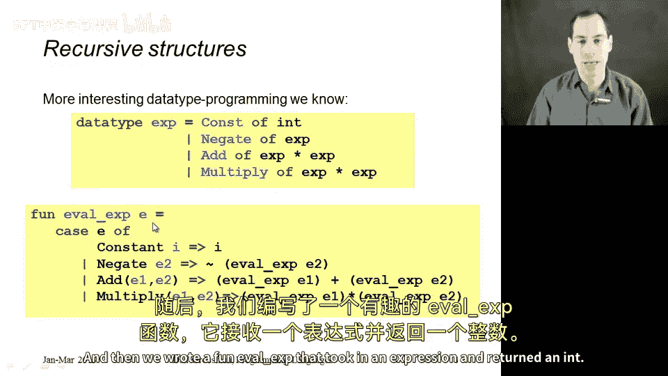
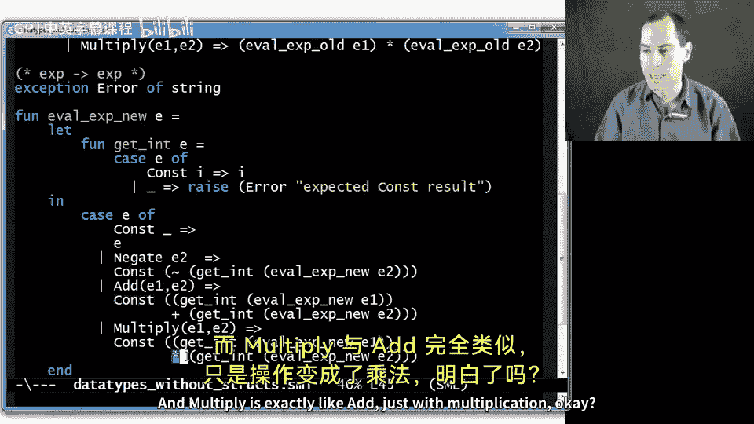
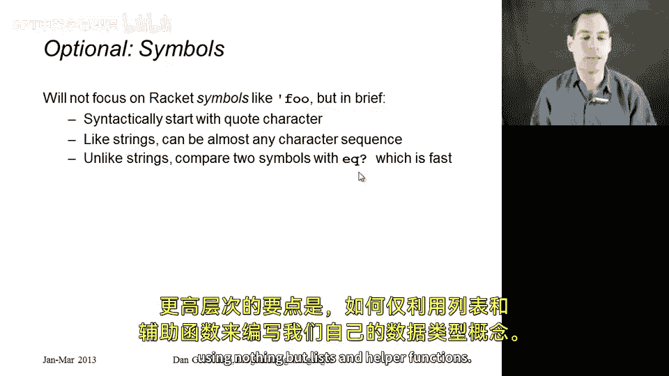

# 【编程语言 A⧸B⧸C CSE341 Coursera】华盛顿大学—中英字幕 p124 26_01_datatype-programming-in-racket-without-structs -BV1bw4m1D7MM_p124-

So in this segment， let's dive right in and see how in racket we don't need data type bindings and how we do analogous things in a dynamically typed language like racket。

So we don't need anything like data type bindings， depending what you want to do。

 there are different idioms that we can use。First， if you just need to mix values of different types。

 like having a list that might have some numbers in it and some strings in it。

 we can just do that and racks built in primitives。

 things like number question mark and string question mark will let us figure out what kind of values we have。

 There's no directly corresponding thing in ML。And then I want to show you how for more interesting recursive data structures。

 we could code up what we need just using con cells and lists。

 So this is connecting things we've already seen to a new setting。

 So I'm going to show you some M code for the purpose of contrast。😊，For example， suppose in ML。

 you wanted a list that could hold ints or strings and you wanted some computation such as summing up everything in that list where numbers are numbers and for the strings we take their length。

Well， you can't do that in ML， we know that in ML， every list has values that have exactly one type。

 but data type bindings let us get around this by introducing a new type like int or string like you see on the slide here that has two constructors。

 one for holding an int and one for holding a string and then you can write exactly the function I described and give it a type like in or string list to int。

 so by introducing a new type we can represent the sort of data we want。In racket。

 we can just do this naturally。 In some sense， every piece of data in racket already has a tag like this I and this S tag。

 It's built into the language。 So without defining any of our own data types。

 we can just mix numbers and strings or anything else we want and write the code that we need。

 So let me show you that。 Here is this function， Fun sum。 It takes in a list X's。 it uses con。

 which we've learned about， the list is empty returnturn0。 if it's a number。😊。

Then add together the car with calling funny sum on the cutter。 And finally， if it's a string。

 then add the length of the string。 There's the string length function provided in the standard library with calling funnyny sum on the cutter。

 Now， I don't have an else clause here， which is usually better style and racket。

 But this is a closer connection， a more direct translation， if you will， to the ML code。

 we see here on the slide。So that's our first approach。

Now let's talk about more interesting data types。 One of the more interesting things we did in ML is we defined a data type like you see here for trees of arithmetic expressions。

 and then we wrote a function eval X that took in an expression and return an int So here I actually want to show you this ML code because I'm going to change how we do it So here's the code I just showed you except I'm calling the function eval X old because I'm about to show you a different version and this code。

Takes an X and returns an int。 so for example， here at the bottom of the file。

 I have this test expression where I build up the tree multiply of negate of add of constant 2 and 2 and constant of 7。

 and if I call eval X of old with that test expression， it will evaluate to negative 28。

Okay so that's eval X old。 Now what I want to do is I want to define a different version that has type X arrow X。

 Now， this is going to be a little annoying。 Let me delete the comment here so we can see the code more easily。

 But the reason why I'm doing this is because when we get into bigger languages。

 things we want to evaluate that have more possible results then always returning an int。

 this is what you need to do， and it's a very natural approach。

 So the idea here is that if I call eval X new with the same expression。

I'm going to get constant of negative 28 right of type X arrow X。

 and so I'm always going to return a possible result expression。

 and in this simple case it will always be a constant， and that's why it'll be more cumbersome。

 but this is the programming pattern we'll need when the result might not just be a number。

 but it could also be a pair or a function or a string or a boolean or whatever。

So here's how I'm going to do this， first I'm going to have a little helper function that just says I expect you know take an expression。

 if it's a constant， get the underlying integer out， otherwise raise an exception。Now。

 how would I write my interpreter？I take an expression， if it's already a constant。

 then return the entire expression， not the thing underneath the entire expression。

 That's my base case。If it's a negation， then what I need to do is recursively evaluate the sub expressionpress E2。

Then I need to get the int out because negation expects there to be an integer result underneath。

Then I need to negate it。😡，And then remember， I need to return an expression， not a number。

 so I call the constant constructor to make a new one。The ad works similarly called eval X by E1。

 eval X E2， those both return Xs， so to get the numbers out call get in on each of them add them together and then call the cons constructor to put it back together。

 It takes a little getting used to， but it's actually extremely elegant， make recursive calls。

 get the underlying data， perform some operation on it， make an expression for your result。

 and multipize exactly like add just with multiplication。

So let's go back to the slides， summarize what we did。From now on。

 all of our eval something sort of functions are going to have a type like XBarrow X I've explained why and what we did is we made our base case return the entire expression like con 17 then recursive cases after doing the recursive call to get a result we made sure we had a cont we got the integer out from underneath and then we made a new cons to return the result again that will be more useful to us when we don't always return constant integers but we have multiple ways to return things。

So now what we're going to do is take that new approach and code it up in racket。

And we're just going to use lists to do it。 And we'll see that you can actually do this。

 And it's not too painful。 So I have it down here。 So the idea is we're going to implement the same kind of interpreter I just did with Eval X new。

 Now I don't have data type bindings。 So what I'm going to do is I'm going to find my own helper functions to make things that will act like constant negations additions or multiplies。

 What I'm going to do is just use lists where the first element of the list says what kind of list it is。

 All right， So here's a function constant， just a plain old racket function takes in an argument I and returns a list with two elements。

 The symbol constant and then I for now， just think of symbols as strings。

 I'll briefly mention at the end of this segment that they're not quite strings。

 but just think of them as strings。😊，The negate function will make a two element list with the negategate symbol。

Just quote， negate。 And then the argument。 a takes two arguments。

 E1 E2 returns a three element list with add E1 and E2 and similarly multiply。

 So these are just things that make lists that hold arguments where the first thing describes what we need。

Now we don't just need to make these things， we need to be able to test what kind of thing we have so how about some helper functions for that How would I test do I have one of those constant things I made with this first function up here。

😡，Well， I would just take something， assume it's a list。Ask， does its car equal。

 This is the built in E question mark function。 You can use it to compare symbols。

 Does the first thing in the list equal con。If so， I have a constant， if not， presumably。

 I have one of the other kinds of things。 Similarlyly。

 this negate function will ask is the car negate。 The addd function will ask is the car ad。

 the multiply function will ask if the car is multiply。

 What I'm doing here is defining my own functions to see what kind of thing I have and extract the pieces。

 So I'm not defining pattern matching。 We're not going to use pattern matching and racket。

 But this will be enough information， enough helper functions for me to easily write my interpreter。

 my eval X function。So now here are some functions that extract the pieces。

 If you knew you had a cont and you wanted the underlying integer。

 you could call this constants int function， which will just return the car of the cutter of E。

 The second element of the list。 because remember， the first element will be the symbol const。

 So then the second element will be that number I。Then we can have a gate that extracts the underlying thing。

 that's also the car of the cutter to get the first element of an ad that is also the car of the cutter。

 so we could just anywhere we want， right car of the cutter because it's just lists。

But these helper functions will make it much easier to read and much easier to understand what we're doing to get the second thing out of an ad while we need the car of the cutter of the cutter。

 similarly for multiply second element of the list to get the first subexpression。

 third element of the list to get the second subexpression because the first thing should be the symbol multiply。

 it would be more robust to recheck that we have the right kind of thing here。

 but we're going to trust ourselves as the programmer to have used these functions like Ks question mark in the gate question mark to make sure we have the right thing and then these helper functions to get the right thing。

By the way， if you find yourself doing car of C or of Cter a lot。

 there are built in functions for this。 I'll point you to the racket users' guide for how to learn how to use those。

 And now we've built up to actually defining our interpreter。 So it's just a big cons。

 Eval X takes in one argument， this con corresponds to our pattern matching in M。 If it's a constant。

 return the entire expression because remember this is our new way of doing these things。

 If it's a negate。😊，Get the piece out using the Negate E helper function we wrote。

Call Eval X on that。Get the underlying integer out， negate it using the minus operator。

Call the constant function we defined to return the new constant。That's the elegant pattern we saw。

 Add and multiply work similarly。 If you have an addd expression。

 then let's get the first sub expressionpression out。Call Eval X。

Get the integer underneath that cont。 and we're assuming here that we're getting a const back。

And then let's let that be V1。All right， do similarly to get V2， then add together V1 and V2。

 call the con helper function， and that's our result， multiply works exactly the same way。

 multiplying instead of adding。Okay， so what have we done here？

We have defined in racket using nothing but lists and symbols and car and cutter。

 our own helper functions that act like constructors making expressions。

 testing variants like K question mark and extracting data like Kt D int。😡。

Having all these helper functions is just better style than using car and cutter and cons everywhere。

 but we're essentially just using car and cutter and cons。

The result is a function Eval exp has the same recursive structure as in the ML code just without pattern matching。

But because we're in a dynamically typed language with no type system。

 there's no notion anywhere of what an expression is， except in comments。

 our own head and documentation。 The fact that there are four kinds of expressions， Con， negations。

 additions and multiplies is something that we are just keeping track of there's no data type binding to say that those are all the possibilities Now the code I showed you in this video does not have a lot of error checking if you try to get something out of an addition expression。

 but it's actually a multiply expression， it will just silently work。

 thats something we will fix in the next segment， But in terms of coding up what we need to get the job done。

 this has achieved what we need and using only features and racket that we already saw。

 Now there's one exception to that I did sneak in symbols I could have used strings instead。

 So just optionally the way you write a symbol and racket as I did in this segment is you just write quote and then any sequence of characters you want basically。

 and that is a symbol where。Stings are in double quotes。

 So what's the difference between a string and a symbol，  honestly not much。

 although they are different， the key thing you can do with symbols is you can use eke question mark to compare them to each other。

 Are these the same symbol。 quote food is the same as quote fo。

 quote food is different than quote bar。 And that's a very fast comparison whereas string comparison is slower because it has to actually look at all the characters。

 But we could have done it with strings。 the more high level point is how to code up our own notion of data types using nothing but lists and helper functions。

