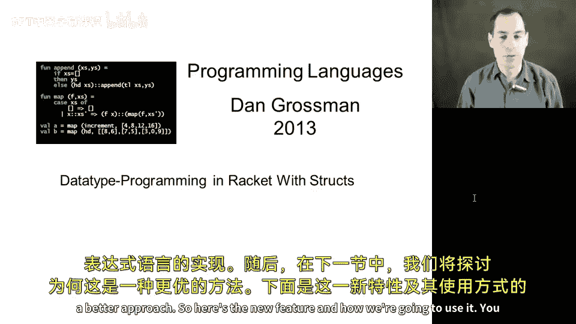
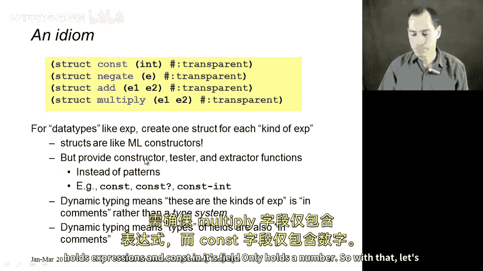
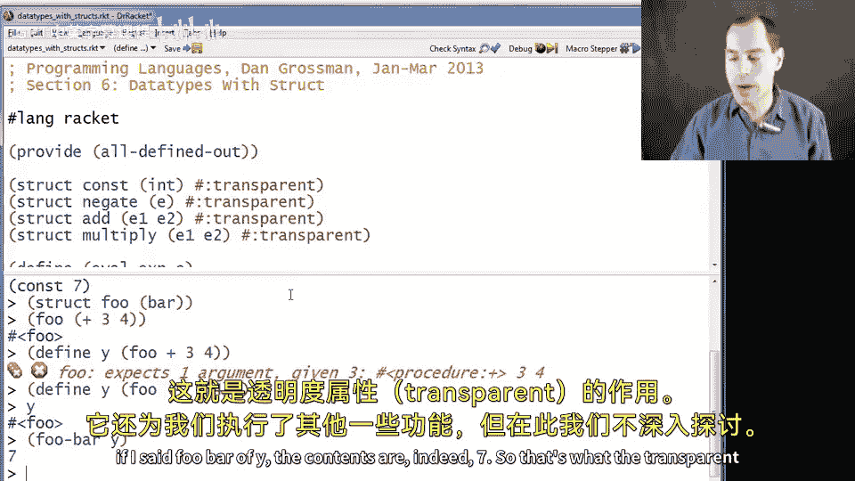

# 编程语言 A/B/C CSE341 Coursera：27_02：Racket 中使用结构体进行数据类型编程 🏗️



在本节课中，我们将学习 Racket 中的 `struct` 构造，展示其工作原理，并使用它来实现我们的小型算术表达式语言。下一节中，我们将讨论为何这是一种更好的方法。

## 概述 📋

本节将介绍 Racket 的 `struct` 特性，它类似于记录类型，但功能更强大。我们将通过定义结构体来重新实现算术表达式求值器，从而替代之前使用列表的方式。这种方法能提供更清晰、更安全的代码结构。

## 结构体定义与使用 🛠️

`struct` 是一种特殊形式，用于定义新的数据类型。其基本语法如下：

```racket
(struct 结构体名称 (字段1 字段2 ...) #:transparent)
```

例如，定义一个名为 `foo` 的结构体，它包含三个字段 `bar`、`baz` 和 `qux`：

```racket
(struct foo (bar baz qux) #:transparent)
```

当您定义这样一个结构体时，Racket 会自动创建一系列辅助函数。

以下是自动生成的函数及其作用：

*   **构造函数**：`foo`，一个接收三个参数（对应三个字段）并返回新 `foo` 结构体的函数。
*   **谓词函数**：`foo?`，接收任意表达式，仅当该表达式是由 `foo` 构造函数创建的结果时返回 `#t`。
*   **字段访问器**：`foo-bar`、`foo-baz`、`foo-qux`，每个函数接收一个值，如果该值是 `foo` 结构体，则返回对应字段的内容；否则会引发运行时错误。

## 应用于表达式求值器 ✨



上一节我们介绍了结构体的基本概念，本节中我们来看看如何将其应用于我们的算术表达式求值器。

我们将定义四个结构体来分别表示四种表达式：常量、取负、加法和乘法。

```racket
(struct const (int) #:transparent)
(struct negate (e) #:transparent)
(struct add (e1 e2) #:transparent)
(struct multiply (e1 e2) #:transparent)
```

这些定义类似于 ML 中的构造函数定义。每个定义都提供了一个构造函数、一个类型判断谓词和字段访问器。例如，对于 `const`，我们会得到：
*   `const`（构造函数）
*   `const?`（判断谓词）
*   `const-int`（字段访问器）

需要注意的是，在动态类型的 Racket 中，我们无需（也无法）在语言层面声明这些是所有可能的表达式类型，也无需声明字段的类型。这需要由程序员自己来确保，例如 `const` 的 `int` 字段应存放数字，而 `add` 的 `e1` 和 `e2` 字段应存放表达式。

## 实现求值函数 🧮

基于这些结构体定义，我们现在可以编写 `eval-exp` 函数。其逻辑与我们之前使用列表和 ML 的实现相同。

```racket
(define (eval-exp e)
  (cond
    [(const? e) e] ; 常量表达式直接返回
    [(negate? e) ; 处理取负表达式
     (const (- (const-int (eval-exp (negate-e e)))))]
    [(add? e) ; 处理加法表达式
     (let ([v1 (const-int (eval-exp (add-e1 e)))]
           [v2 (const-int (eval-exp (add-e2 e)))])
       (const (+ v1 v2)))]
    [(multiply? e) ; 处理乘法表达式
     (let ([v1 (const-int (eval-exp (multiply-e1 e)))]
           [v2 (const-int (eval-exp (multiply-e2 e)))])
       (const (* v1 v2)))]
    [#t (error "eval-exp expected an expression")]))
```

代码解析：
1.  如果 `e` 是 `const`，直接返回它。
2.  如果 `e` 是 `negate`，则使用 `negate-e` 访问器获取其子表达式，递归求值后，用 `const-int` 取出数字，取负，再用 `const` 构造函数包装结果。
3.  如果 `e` 是 `add`，则分别使用 `add-e1` 和 `add-e2` 访问器获取两个子表达式，递归求值并取出数字后相加，最后用 `const` 包装结果。
4.  `multiply` 的处理与 `add` 类似，只是将加法换成乘法。

运行示例：
```racket
(define x (add (const 3) (const 4)))
(eval-exp x) ; 输出 (const 7)
```

这种方法比使用列表更加方便和清晰，并且正如我们将在下一节强调的，由这些构造函数创建的值并不是列表，它们是不同的实体。

## 结构体属性说明 🔧

最后，我们来解释一下定义中的 `#:transparent` 属性。

这个属性不是必须的，没有它，之前所讲的所有关于结构体的功能依然成立。但是，如果没有 `#:transparent`，Racket 的交互环境（REPL）在打印结构体实例时，不会显示其内部字段值，而只会显示为一个抽象表示（如 `#<foo>`）。添加此属性后，打印时会显示具体内容，便于调试。



此外，结构体还支持 `#:mutable` 属性。如果使用它，Racket 会为每个字段额外生成一个修改器函数（例如 `set-foo-bar!`），允许你改变字段的值。这引入了可变状态，我们在课程中讨论过可变数据的优缺点。在本节后续内容中，我们需要的所有结构体定义都可以更好地在不使用可变性的情况下完成，因此我们不会使用这个属性。

## 总结 🎯

本节课中我们一起学习了 Racket 中 `struct` 的关键用法。我们了解了如何定义结构体，以及如何利用自动生成的构造函数、谓词函数和访问器函数来构建和操作数据。通过将其应用于算术表达式求值器的例子，我们看到了这种方法如何提供比原始列表更清晰、更结构化的代码组织方式。我们还简要介绍了 `#:transparent` 和 `#:mutable` 这两个属性及其作用。在接下来的课程中，我们将继续使用结构体来构建更复杂的程序。