# 【编程语言 A⧸B⧸C CSE341 Coursera】华盛顿大学—中英字幕 p128 30_05_what-your-interpreter-can-and-cannot-assume -BV1bw4m1D7MM_p128-

When we're writing an interpreter for some language B。

 an important question is what kind of errors programs in B might have and how our interpreter should check for them。

 so I want to cover that in this segment， this will help us distinguish between the language B that we're implementing and the language A in which we're implementing the interpreter and it's also a distinction that's important for your homework to know what kind of errors you need to check for。

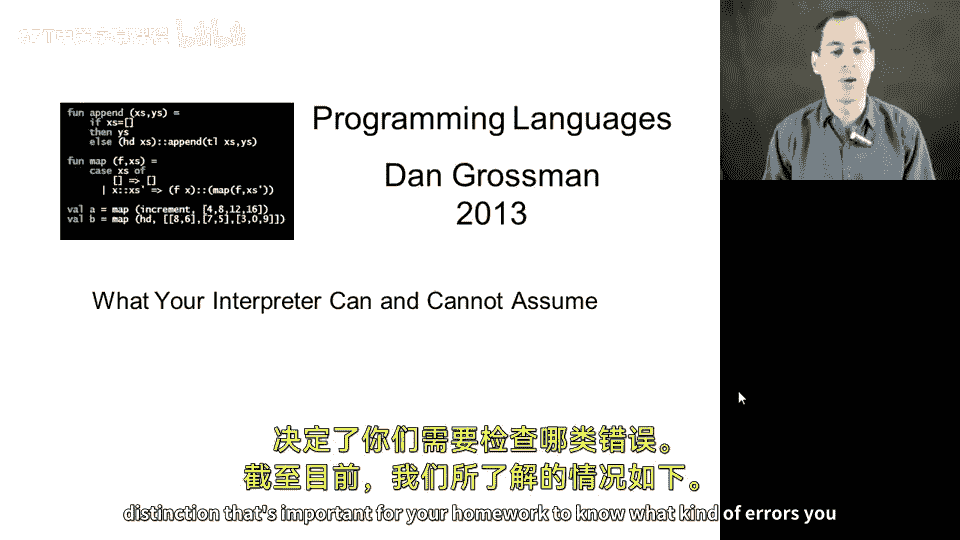

So here's what we know so far， we know that if we're going to implement some language B。

 we're going to define the syntax for that language， the abstract syntax using racketstructs。

Then the language B programmer will write directly in racket using constructors to write their language B programs and will implement our interpreter as some sort of recursive function like the Eval X that we've seen for our arithmetic expressions。

So now the important distinction I want to make is that the interpreter can go ahead and assume that the abstract syntax tree it gets is a legal B program that it makes sense as a syntax tree。

 and if it doesn't， then it's fine to just sort of crash and give a strange message。

But the interpreter must check， must not assume that the types of different data used in the language B program are correct。

 in particular， when it recursively evaluates a sub expressionpression。

 it needs to check the result for what kind of thing it got。

 So in this segment I'm going to explain what I mean by this。

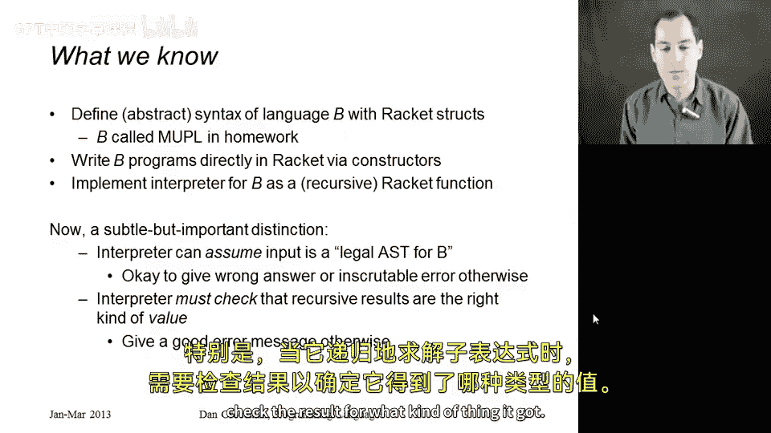

So what is a legal AST？So these are the sets of trees that the interpreter must handle and it's a subset of all the possible trees that rackcet would let us make。

 so racket is a dynamically typed language， so when I declare these fourstructs for cons negate add and multiply there's nothing except comments and documentation that indicate that this int field should hold a number。

 this E field should hold another expression which is another legal AST in this language E1 and E2 should be legal ASTs in this language and E1 and E2 for multiply should be legal ASTs in this language。

We in implementing our interpreter can go ahead and assume that we are given a legal AST and if we're not。

 then we'll just crash and that will be fine so we can assume that cont holds a number。

 negate holds a legal AST and add multiply hold two legal ASTs some examples where that is not the case are here at the bottom of the slide and this first example I have a multiply expression allegedly but if you look inside the second argument to add here is a string that does not make sense。

 this is not a program in language B and we don't have to worry about detecting this error Similarlyly a much more common error that language B programmers tend to make is writing negate of minus7 instead of negate of con of minus7 right negate of minus7 is not a legal program negate is supposed to have an expression inside of it so we should say negate of con of minus7 and again our interpreter can go ahead and assume that this sort of thing does。

And if it does happen， it can just give a bad strange message。

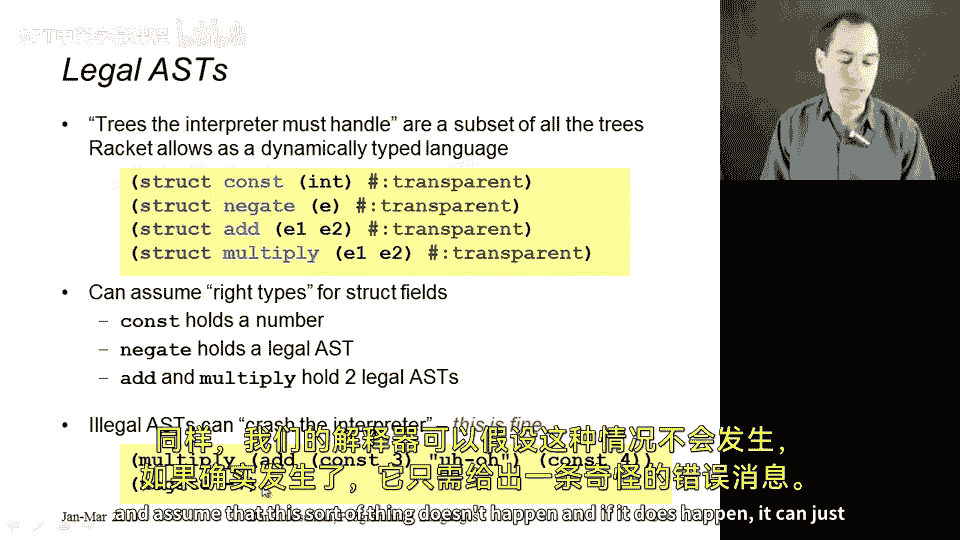

What's going to happen。 And what I'm about to show you in this segment is that our interpreter does return expressions。

 but not just any expressions。 If you think about the recursive result of any call to our interpreter of evaluating an expression。

 It's always something we call a value。 A value is a kind of expression that evaluates to itself。

If your interpreter ever returns something that is still an addition or a negation or a multiplication。

 your interpreter has a bug for our simple language。

 our interpreter would always return from any call， any recursive call， a constant like constant 17。

Where life gets more interesting is when our language has more than one kind of value。 so far。

 the only kind of value we have are constants。 But in the language you'll implement in your homework。

 we're also going to have pairs of values。 So not all pairs are values。

 but if the two components of a pair are themselves values， then the result is a value。

 You could also have booleions， you could have strings。

 closures are values will have closures in our homework。

 So when we recursively evaluate a sub expressionpression。

 we could get one of a number of kinds of values。 Any kind of expression that is。😊。

Something that's finished evaluating and it doesn't just have to be a number。😡。

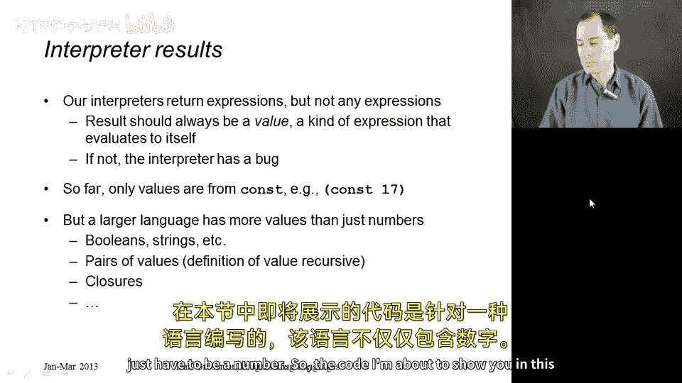

So the code I'm about to show you in this segment is for a language that doesn't just have numbers。

 it has booleions， it has numerical comparisons， and it has conditionals。

 so we're going to add to our language， bool， which has a B field which should always be true or false。

 an E nu field which has two subexs， these should be expressions that evaluate to numbers we see if they're the same。

 and then an if then else in the language we're implementing。So what if the program is a legal AST。

 so B is true or false， E1 and E2 are legal ASTs， E1 E2 and E3 are legal ATs。

 but when you run this program， you try to apply the wrong construct to the wrong kind of value。

 for example， suppose we try to add a con like con 17 to a Boolean like Bo of false。

This is something that your interpreter should detect and should give an appropriate error message explaining this is what happened。

 not in terms of tried to take car of something or didn't find something or whatever。

 you shouldn't be exposing your interpreter details。

 You should give a good error message for this kind of problem。

 So let's switch over to the code and see what I'm talking about。 So right here。

 I had the definition of my language。 And it's exactly what I told you on the slides。

 So I have constants， negations， additions， multiplies bulls， whether two numbers are equal。

 and an if then else。 Notice on the two numbers are equal。 These aren't numbers。

 they're not even constants。 They're expressions， subexpresss， that we evaluate。

 and then we compare the results。 just like for add， we have two expressions here that we evaluate。

 and then we add the results。

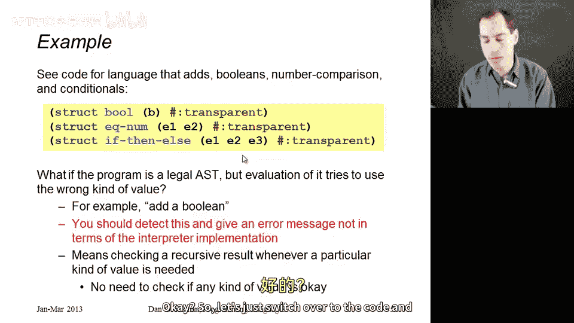

Okay so here are two test programs I want to consider this first test program right here is perfectly reasonable。

 it multiplies the negation of adding two and2 with adding seven and this should return minus 28 if you follow it all and notice that it's completely legal AST so you know add takes in two smaller expressions。

 thegate takes in one smaller expression， Cont always has a number and so on。

Here's a second test that is also a legal AsT。 but when you run it。

 you should get an error because it tries to use the wrong kind of value。 So it starts the same。

 It multiplies something that will eventually evaluate to the constant negative four。

 But then in this， if then else。I end up returning from the if then else true because when I evaluate this。

 I'm gonna to get true because I'm have a false here。 So I'll take the false branch。 I'll get true。

 And so I'm gonna try to end up multiply-4 and true。 Now， I haven't done that yet。

 If I just run this。 Test 1 is this abstract synax tree， Test 2 is this abstract syntax tree。

 these are both legal abstract syntax trees。 But if I have this version of eval X。 if I call test 1。

I should get minus 28， if I call test2， I should get an error message that's appropriate。

 like you tried to apply something that wasn't a number。Now going back to the examples。

 I have one other thing here， this is not a test， this is not something we have to handle gracefully or handle well in this program if you actually look at it right here。

 I have constant of true and that's just not a legal AST so we don't have to deal with this sort of thing and so if I called Eval X with nontest it's fine to just get a terrible message like expects number as first argument given true blah。

 blah blah this is just something that's basically the underlying implementation of getting stuck and reporting an error。

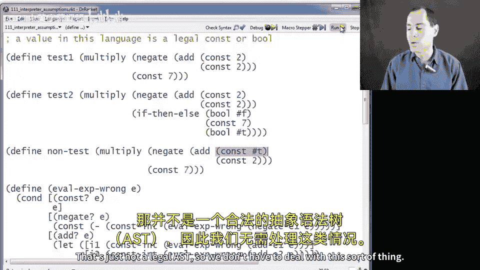

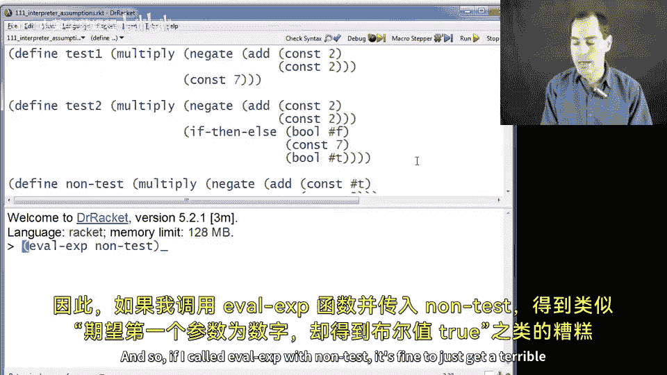

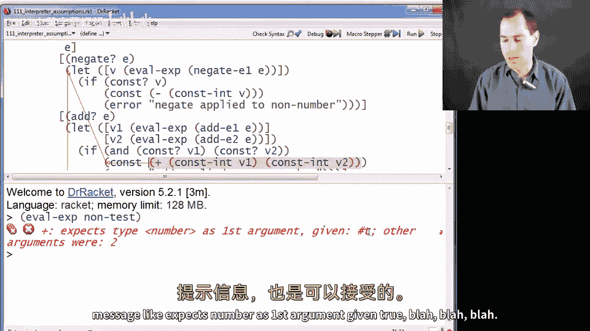

So that is the distinction。 Now， let me show you two interpreters。

 one that gets it right and one that gets it wrong。 So this first version。

 the wrong one is a perfectly fine interpreter for things like test1。

 It just does the wrong thing in terms of producing bad error messages for test2。

 So here's how it works。 It gets a little bigger because our language is bigger。

 takes in some expression， just has a big con with one branch for each kind of expression。

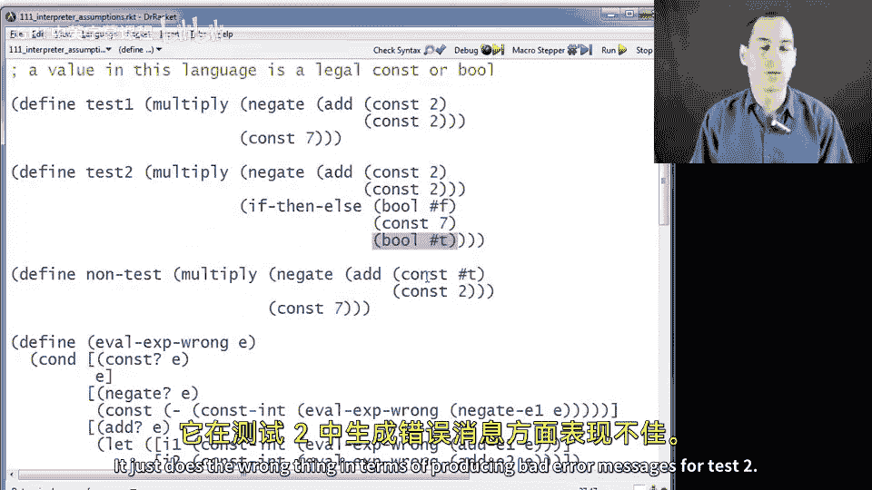

If E is itself a constant， we just return the entire thing whenever you have any kind of value。

 you just return it， that's the result of interpreting a value。😡，If instead， we have a negation。

Then what it does is it gets out the sub expressionpress， recursively evaluates it。

 gets the integer out， negates it。So now we have a rackcet number。

 and then we build up a value in our language by putting the Ks constructor around that。

 So what is wrong about this is right here， the call to Kant dash in。

 We are assuming that the result of the recursive call will be a cons。

 That is not the only kind of value in our language。 This is the assumption we should not make。

 We should check this recursive result to see if we get an inter。

The other cases are all similar if you have an ad。We get out the first field， recursively evaluate。

 wrongly assume that it will be a con。That would be the integer I1。 again。

 wrongly assume we'll get a cons back from E2。 That'll be the integer I2。

 add those two things together。 That will give a racket number。

 Put it in the cont constructor so that we have a value in our language。 And that's the result。

Multiply is the same， the exact same procedure， except with star instead of plus。

If we have a boolean， that is a value， so just like for cos we return the entire expression。

 for E we return the entire expression。Eum is exactly like add and multiply。

 assuming wrongly that its sub expressionpressions are constants。😡。

Then it gets out those two racket numbers， compares them with racks equal。

 That will give back true or false。Rackets true or false is not an appropriate thing for an interpreter to return。

 So we use the bull constructor because that's the appropriate result for an economic expression。

 And then for if then else。We grab the。First subexpression， recursively evaluate it。

 wrongly assume it's a boolean。If we get back true from reading out the B field of the Boolean。

 then we recursively evaluate the second subexpression。

 otherwise we recursively evaluate the third subexion， so there's a lot to like here。

 This interpreter is not terrible， it just doesn't do the error checking that we want okay so let me now show you the fixed version。

 this is better。 Some cases don't need error checking and some do。So if you have a constant。

 no problem just return it， we know we have a legal AST we're allowed to assume that。

 so this should be a perfectly fine value to return if we have a negation， okay。

 read out the neggate field， recursively evaluate it。But now， let that be some local variable V。

 and now check。If。It is a constant。Then read out the infield， negate it。

 build up a new constant return that， Otherwise give an appropriate error message。

 negate applied to non number， Similarlyly for add， read out the E1 field， recursively evaluate it。

 read out the E2 field， recursively evaluate it， make sure they're both numbers。😡，If they are。

 get out the corresponding numbers， Con V2， Con V1， add them together， build up a new constant。

 return it， otherwise appropriate error message， similarly for multiply。For bo。

 no error checking to be done， it's a value just return it for Im， it's just like add and multiply。

 we need those things to be constants， then it's appropriate to read out the underlying numbers。

 compare them with equal and return bo of that， which is the appropriate value in our language。

And for if then else， read out E1， recursively evaluate it and now check that it's a bo， right。

 We don't want a cons there。 That's an error。 If it's a cont or any kind of value except a bull。

 then give this error message。 Otherwise， we did recursively get the right kind of result。

 So read out the boolean and then either recursively evaluate E2 or recursively evaluate E3。

 And so that is why eval X on our first test， which was legal gave cons 28。

 but eval X on our second test。

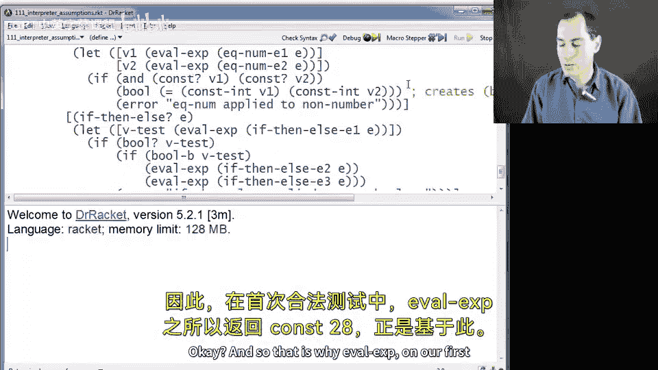

Gave a good error message， an Eval X on our thing that wasn't even a legal AST can just give a bad message。

Whereas our wrong version， Eval X Bng does just fine with the program that doesn't have an error。

 But if I give this 1， I get a bad error message。 and it's fine that on the one where I'm allowed to give a bad error message that I do。

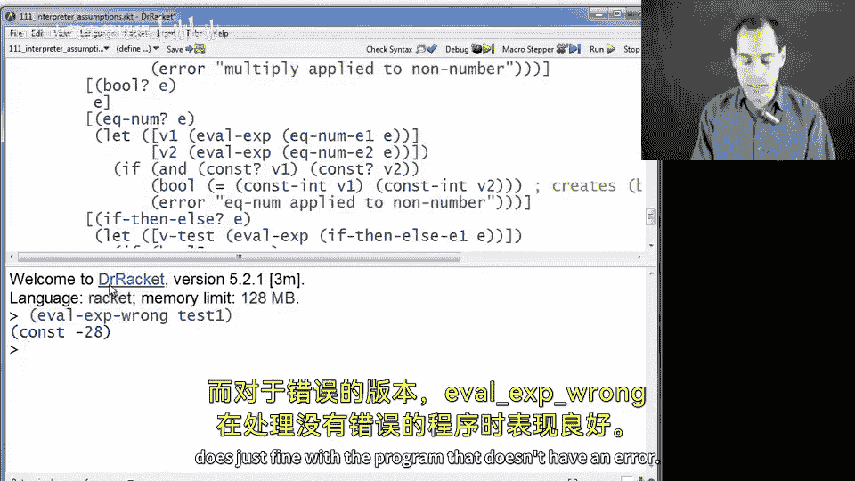

So that's the kind of error checking we need to do our interpreter。

 it all boils down to when you get a value as a recursive result back from your interpreter。

 you may need to check what kind of value you got。