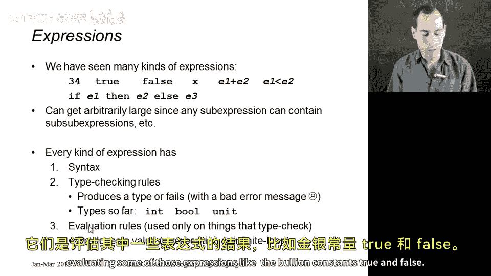
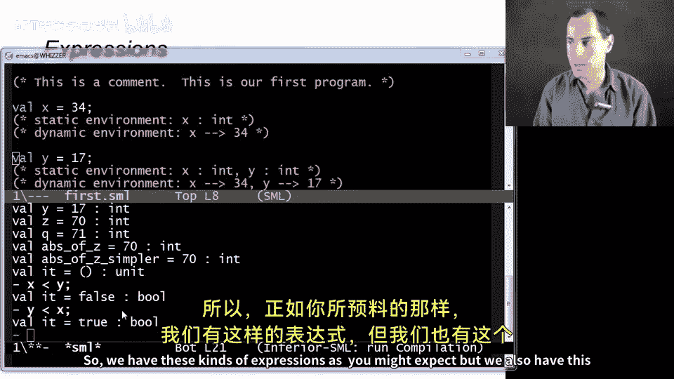
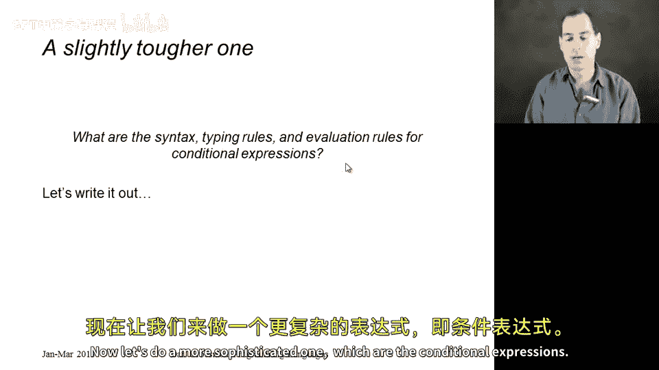
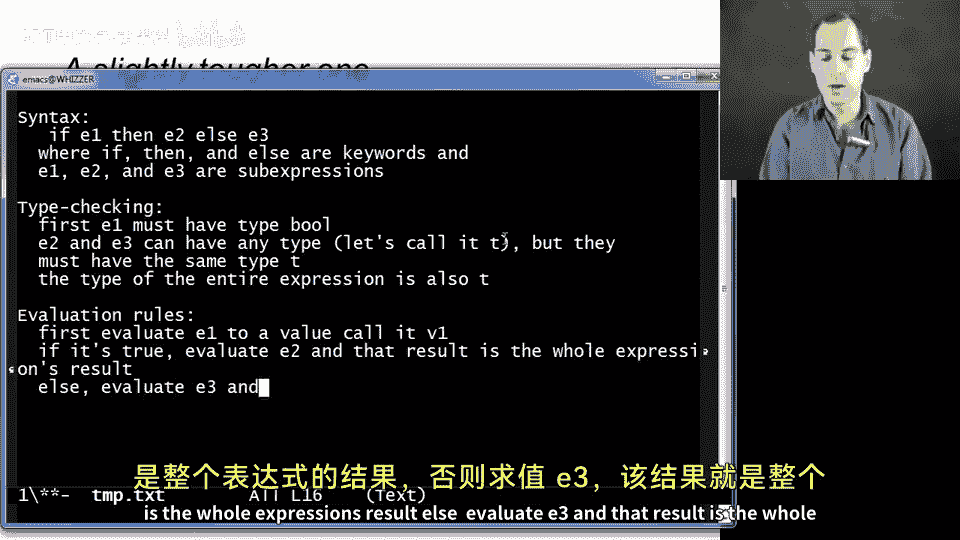
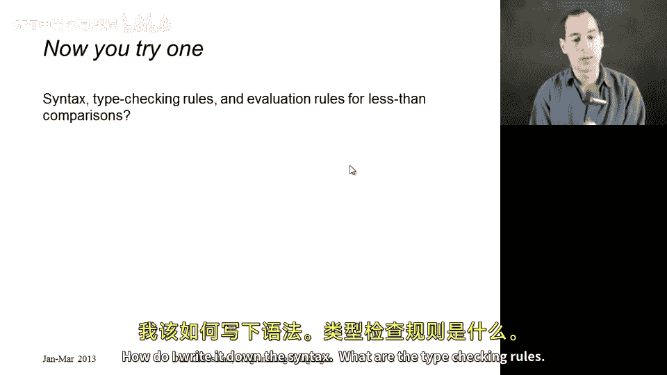

# 【编程语言 A⧸B⧸C CSE341 Coursera】华盛顿大学—中英字幕 p13 12_02_rules-for-expressions -BV1bw4m1D7MM_p13-

All right， in this segment， we're going to take the same program we had in our previous segment and we're going to look at those different kinds of expressions we saw more carefully and make sure we give them a precise semantics so we know exactly what they mean。

So we're going to take the same program we had before。

 you see it here on the PowerPoint slide and we're going to really focus in on those expressions that we had for each of the variables that we bound We're not doing this because I think you don't understand addition or what an integer is or how a conditional expression works。

 but because by giving the semantics to these things very carefully we'll be able to build on top of that and use this exact same ideas when we learn more sophisticated and interesting language constructs in the near future。

So if we look at this program， we see a bunch of different kinds of expressions either explicitly in the program like 34 or a variable x or an addition。

 as well as a couple things that we don't see in the program but would be the result of evaluating some of those expressions like the Boolean constants true and false so in fact I thought I would show those to you quickly if here's my program and I can go ahead and open the repple here。

 there really is a constant true just like there's a constant 42 and that's the result of things like conditional expressions。

 so three less than zero evaluates to the Boolean false。

And if I include those variables that I bound， then I can use those in less than expressions as well。

 And I can ask is X less than y。 turns out it's false。 But if I as ask is y less than x。

 that evaluates to true。 So we have these kinds of expressions， as you might expect。

ButWe also have this neat property that we can build expressions as big as we want。

 so certain expressions like addition less than in conditionals are built out of smaller subexpresss。

 and that can nest as deep as you want so you can have an addition inside of another edition。

 you can have a conditional inside of an addition， you can have an addition inside of conditionals and that can go as deep as you want。

 making expressions as big as we want。 So when we go to define the syntax and semantics of expressions。

 that definition is going to have to be recursive because we're going to have to define it in terms of those subexs。

So there's a really important methodology to what we're going to do right now。

 and that is for every kind of expression to ask ourselves the same three questions。

 what is the syntax I。e。 how do you write it down， What are the typing checking rules。

 in other words， what  type does an expression have， and what could cause it to fail to type check。

 in which case you get an error message。And then the third question is。

 what are the evaluation rules， assuming it does type check。

 how does it perform its computation in order to produce a result。

 And we're going to call that result a value。 Of course， expressions might not produce a result。

 They can also raise an exception at runtime or go into an infinite loop。Okay。

 so let's start with the simplest kind of expression I can think of。 which is a variable。

 So we're gonna ask three questions。 What is the syntax。

 The answer is it's any sequence of letters or digits or underscores。

 except the first thing in that sequence can't be a digit。

 The rules for variables in an L are pretty similar to what they are in many programming languages。

 The second question is what are the type checking rules。 This is when we're using a variable。

 not when we're defining it with a variable binding。

 but when we're using it as an expression or as part of a larger expression。

 So the answer is the way you type check a variable is you look it up in the static environment。

 If you find it， whatever type it has in the static environment， that's the type of the expression。

 And if you don't find it， it doesn't type check and you get an error message。

And then the third question was the evaluation rules here it's similar to the type checking rules。

 except we look the variable up in the dynamic environment and we use whatever value we find there。

We don't have to worry about it not being there because in ML， we only run programs that type check。

 so we know that variable will be in the dynamic environment。All right so that's variables。

 like I said， they're pretty simple， maybe even a little too simple。

 so let's next do addition expressions， and these are our first example where the expression has subexpresss inside of it。

 so the answers to all of our questions are going to have to rely on the answers to the questions for the subexpressions。

So first， what's the syntax of an addition expression。

 It's any expression where you have two other expressions with a plus symbol in between them。

That means you have an addition expression。 Okay， so what are the type checking rules。 Well。

 what you have to do， given an addition expression is you have to type check both of those subexs。

 E1 and E2。 And if they both have type int， then the addition expression has type int。

 If either of them does not type check or has a type other than int。

 then the entire thing does not type check。 See how the answer for the larger expression is built out of the answers for the smaller expressions。

And similarly for our evaluation rules， we're going to take those two subexpressions， E1 and E2。

 evaluate them to values， let's call them V1 and V2， whatever they might be。

 and then our overall result will be the sum of V1 and V2 and again thanks to type checking I know V1 and V2 will be ins so I know that it will always be possible to sum them。

Alright， so that's addition。 We all knew how addition worked。 Now。

 before I get to the more interesting one， which is conditional expressions。

 let me talk a little bit more about these values。 So remember。

 the result of evaluating something is a value。 So it turns out that every value is an expression。

 but not every expression is a value。😊，So what we have are these certain kinds of expressions。

 the values that are always going to evaluate to themselves。 So 42 evaluates the 42。

 Tru evaluates to true。 There's actually even one the result of that use command we use in the repple produces this value left parenthesis。

 right parenthesis that has type unit。 So for each of these types， there's a certain set of values。

 and those are the answers that we get when we have some expression of that type。

So we know how 34 works， its syntax is a sequence of digits， its typing rule is that it has type in。

 and its evaluation rule is that it's a value and like all values， it produces itself as its answer。

Okay， so those are the values。Now let's do a more sophisticated one。

 which are the conditional expressions and I thought it would be more interesting to write this out rather than just already have it up on the slide and since my typing is much better than my handwriting。

 I thought I would just open a text file in emax and write it there so the syntax for a conditional expression is if E1。

 then E2 L E3 where if then and else are keywords or the actual syntax that explains what this is what concept this is。

 and E1 E2 and E3 our subexpressions， so the same way in addition has two subexpressions。

 a conditional has three subexpressions。

Now the type checking is more interesting and is different than with addition expressions。

 so first E1 must have type pool， it must be true or false or a variable typepo or a comparison or some expression of typepo E2 and E3 can have any type。

Let's call it T。But they must have the same type T。

So you can't have a then branch of one type and an else' branch of another type because the result of our entire expression might be either of them。

 and what we need is the type of the entire expression is also T。And last。

 we have the evaluation rules。And here we first evaluate E1 to a value， call it V1。

Since it' type checked with typepo， I actually know that V1 will be true or false。 If it's true。

 evaluate E2。 and that result is the whole expressions。Result。Else， evaluate E3。

 and that result is the whole expressions result， and that is everything there is to know about the syntax。

 type checking rules and evaluation rules of an if expression。

So to finish up， let's have you do one which is to figure out what it is for less than comparisons。

 try to work through it on your own just on a blank piece of paper if you get stuck it's also in the reading notes associated with the lecture and then we can ask some questions about it as well so remember for all of these the details are less important than the fact that we always ask the same question how do I write it down the syntax what are the type checking rules and then what are the evaluation rules。

