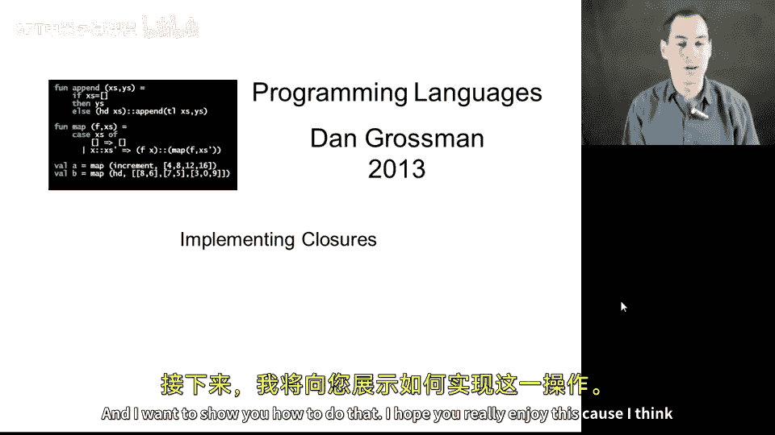
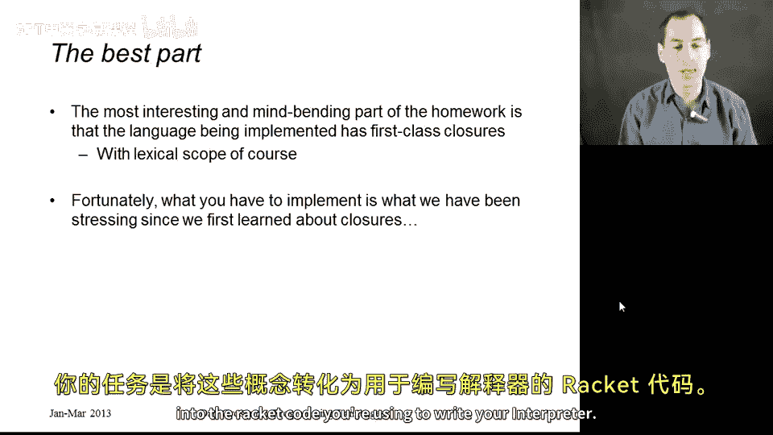
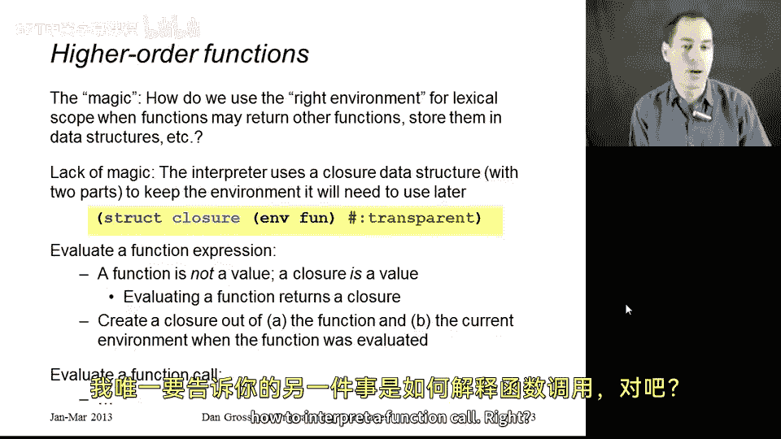
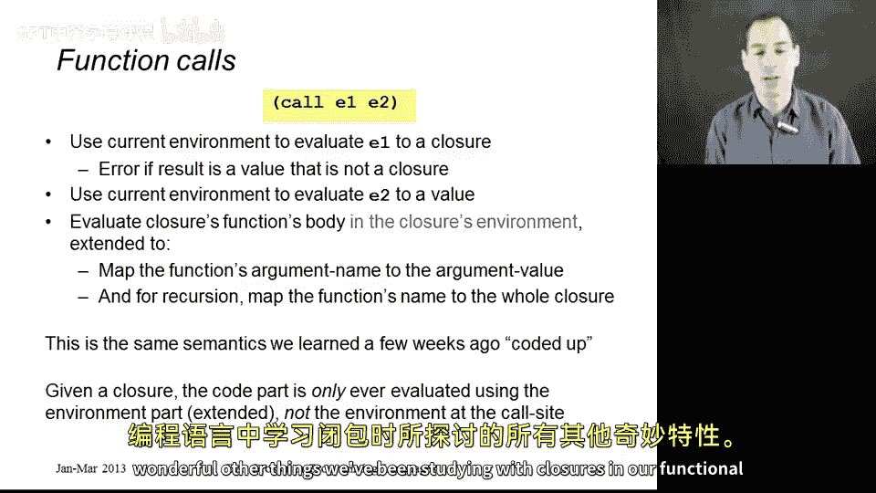

# 编程语言 A/B/C CSE341 Coursera：第32章：实现闭包 🧠

在本节课中，我们将学习如何在解释器中实现闭包。闭包是函数式编程中的核心概念，它允许函数“记住”其定义时的环境。我们将详细讲解闭包的实现原理，并通过具体步骤展示如何在解释器中处理函数定义和函数调用。

---



## 概述

上一节我们介绍了环境的基本概念，但实现闭包是编程语言中最有趣且最具挑战性的部分之一。闭包使得函数可以携带其定义时的环境，从而实现词法作用域。本节将详细讲解如何实现闭包，包括如何存储环境、如何处理函数调用以及如何支持递归。



---

## 闭包的实现原理

闭包的核心在于存储函数定义时的环境。当函数被调用时，我们使用这个存储的环境来解析函数体中的变量，而不是使用当前的运行环境。

### 闭包的结构

闭包是一个包含两部分的结构：
1. **代码部分**：包括函数的参数和函数体。
2. **环境部分**：函数定义时的环境。

在代码中，闭包可以表示为以下结构：
```racket
(struct closure (fun env))
```
其中，`fun` 是函数定义，`env` 是函数定义时的环境。

---

## 函数定义的实现

当解释器遇到函数定义时，它不会直接返回函数本身，而是创建一个闭包。闭包将当前环境存储起来，以便在函数调用时使用。

以下是处理函数定义的步骤：
1. 获取当前环境。
2. 创建一个闭包，包含函数定义和当前环境。
3. 返回这个闭包作为值。



例如，对于函数定义 `(lambda (x) (+ x y))`，解释器会创建一个闭包，其中包含函数定义和定义时的环境（包括变量 `y` 的值）。

---

## 函数调用的实现

函数调用时，我们需要使用闭包中存储的环境来解析函数体中的变量。以下是处理函数调用的步骤：

假设函数调用形式为 `(e1 e2)`，其中 `e1` 应求值为一个闭包，`e2` 是参数。

1. 使用当前环境对 `e1` 求值，得到一个闭包。如果 `e1` 不是闭包，则报错。
2. 使用当前环境对 `e2` 求值，得到参数值。
3. 获取闭包中存储的环境，并扩展该环境，将函数的参数名映射到参数值。
4. 如果函数支持递归，进一步扩展环境，将函数名映射到整个闭包（而不仅仅是函数定义）。
5. 使用扩展后的环境对函数体求值。

例如，对于闭包调用 `(closure-fun arg)`，解释器会使用闭包中存储的环境来解析函数体中的变量，并正确处理递归调用。

---

## 递归的支持

为了支持递归，我们需要在环境中将函数名映射到整个闭包。这样，在函数体中递归调用自身时，可以正确引用闭包及其环境。

例如，对于递归函数定义：
```racket
(define (factorial n)
  (if (= n 0)
      1
      (* n (factorial (- n 1)))))
```
在创建闭包时，环境会包含 `factorial` 到闭包的映射，从而支持递归调用。

---

## 总结

本节课我们一起学习了如何在解释器中实现闭包。闭包通过存储函数定义时的环境，实现了词法作用域，使得函数可以访问其定义时的变量。我们还详细讲解了函数定义和函数调用的处理步骤，以及如何支持递归。通过实现闭包，你的解释器将能够支持高阶函数和函数式编程的所有强大功能。

---



通过本节的学习，你应该能够理解闭包的实现原理，并将其应用到自己的解释器中。闭包是函数式编程的基石，掌握它将为你打开编程语言设计的新世界。