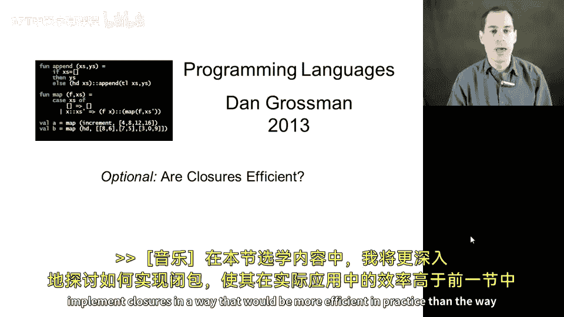
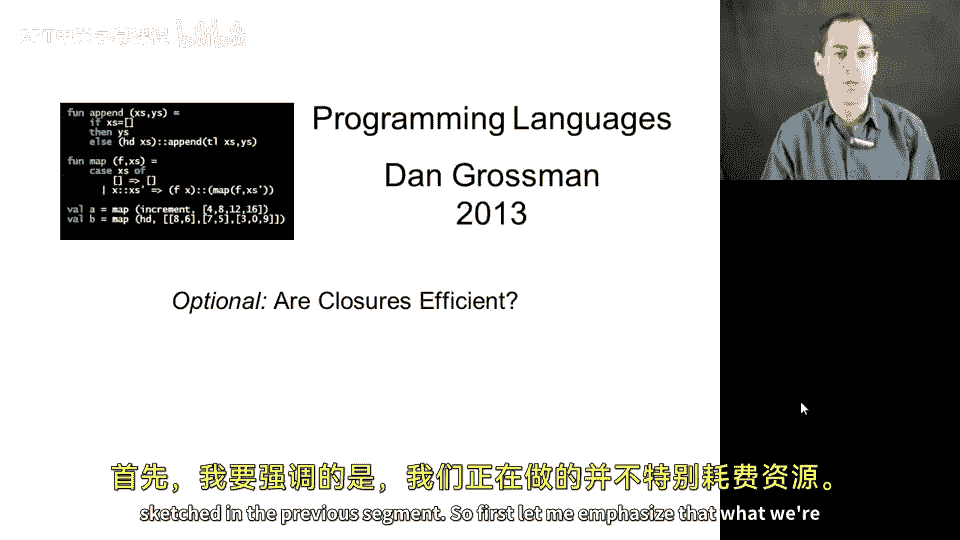
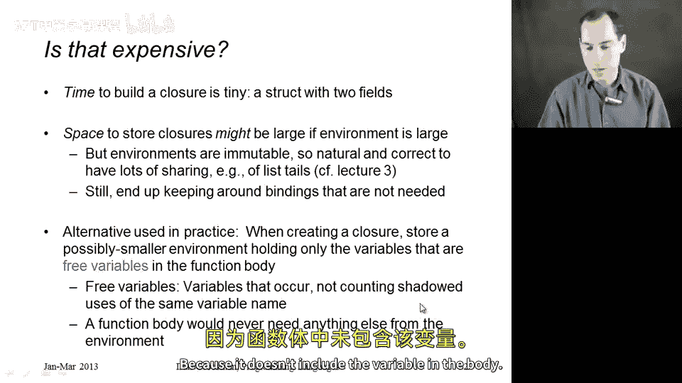
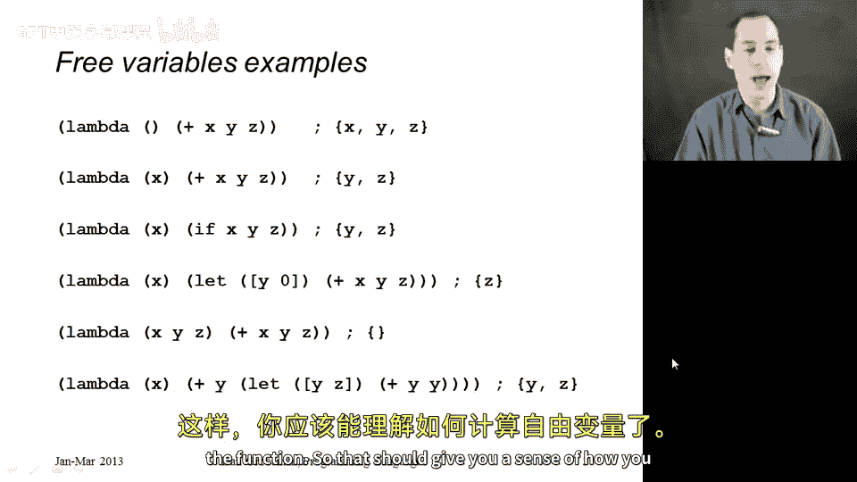
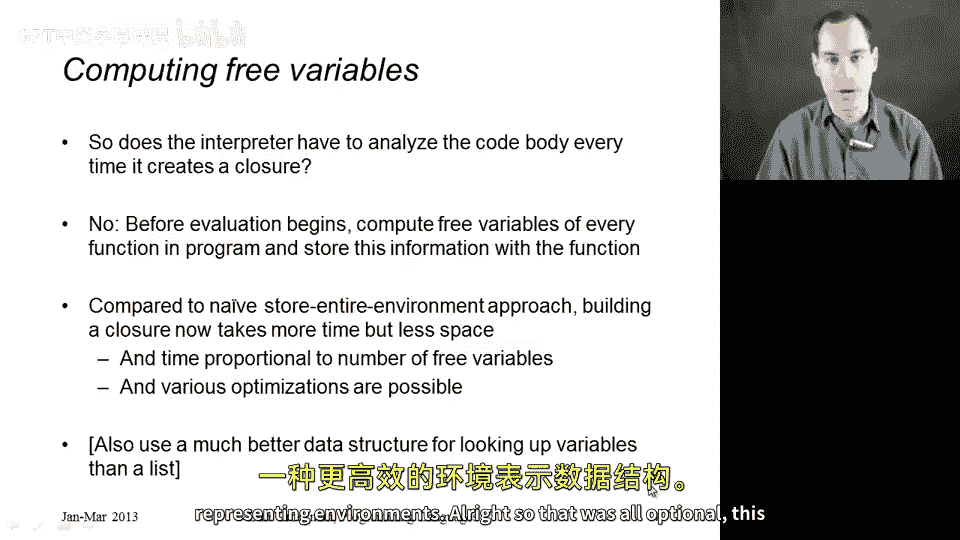
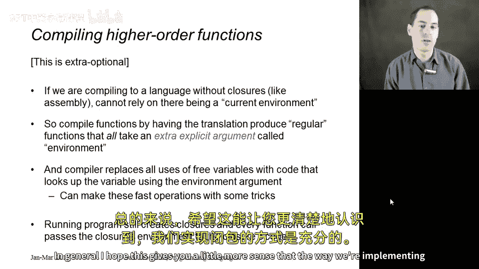

# 【编程语言 A⧸B⧸C CSE341 Coursera】华盛顿大学—中英字幕 p131 33_08_optional-are-closures-efficient -BV1bw4m1D7MM_p131-

In this optional segment， I'll discuss a little bit more how we could implement closures in a way that would be more efficient in practice than the way sketched in the previous segment。

 So first， let me emphasize that what we're doing is not particularly expensive。

 when we build a closure， we're just calling a constructor and initializing two fields。

 And when we're calling a function， we're just doing a couple things to pass the right environment to our interpreter function。

 So the time is actually quite cheap。 The problem with the way we're implement enclosures is actually one of space that what we're doing is we're storing with the closure。

 the entire environment at the point where the function was defined。

 So our different environments are actually sharing quite a bit because we're representing them as lists but those lists themselves are not how you would want to do it in a more efficient implementation。

 because it takes too long to look up variables， if you have to walk down a list。

 So the sharing is a little more difficult to get right in a more realistic setting。

 but the more problem。

Maic issue is just keeping things around that we don't need。

 that storing everything in any environment for any closure we might possibly use in the future could end up keeping around a lot of data in our program that we don't need anymore。

So an alternative that you can basically assume is used in practice in a language that supports closures is that when we create the closure。

 we need not store the entire environment， it suffices to just store a smaller environment。

 an environment that only contains those variables that the code in the function might possibly use。

And those variables are known as the free variables， not free as in don't cost anything。

 free as in not bound， not defined themselves in the function body。So the free variables。

 by definition are just the variables that are used somewhere in the function body。

 not counting anything defined in the function， the function parameters or any local variables。

And the neat thing about free variables is it is sufficient to store in the closures environment。

 bindings for all the free variables， nothing else could ever possibly be used by the function when you call it because it doesn't include the variable in the body。

So let me show some examples， it turns out that you can look at a function and via a simple recursive procedure over it。

 compute its free variables。 So in this first example， I have a zero argument function， it adds X。

 Y and Z， those are all free variables， they are variables that occur in the function body without being defined in the function body。

In this second example， since x is a parameter， the free variables。

 which I'm always writing here over a comment on the right， are just Y and Z， but not x。

In the third example， it's the same。 The free variables are Y and Z。 Now。

 whenever you call this function。You are going to use Y or Z， never both。

But the free variables are anything that might be used。

 we need to keep in the environment anything that ever could possibly be looked up when this function is evaluated。

 and so we need both Y and Z to be the free variables。

Notice it's only things that are defined outside the function body。 So in this fourth example。

 where y is now a local variable and x is a parameter， the free variables are only Z。

 So it's the set containing just Z。In this second to last example， there are no free variables。

 in fact， that's fairly common。All the examples I showed you before we got to closures when we were just doing firstclass functions that were not closures。

 all had no free variables。 This is what you have to do if you're in an impoverished language where functions are not allowed to use variables outside of their definition。

 it's fairly common to have no free variables， although if you're referring to earlier bindings in the file。

 even if they're at top level those tend to be things that are your free variables and therefore need to be stored in the environment created with the closure that you create when evaluating the function。

Finally， this last example is a little more sophisticated just to emphasize that you need to take shadowing into account if I look at this function。

 x is definitely not a free variable because it's a parameter。

 y is because of this first use of y here， the fact that there is a local variable Y means that these later occurrences of y do not count for y being a free variable。

 but this earlier one does， so y is one of the free variables of this function。

 so is z because I use z right here and z definition would be somewhere outside of the function。

So that should give you a sense of how you could compute the free variables。

Let me emphasize that what interpreters do not do is every time they create a closure。

 look at the function's body to find all the free variables。 that would be fairly expensive。

 if you had a big function， you would have to run over the syntax of that function at runtime to find the free variables that doesn't make sense as something to do instead there's a prepass something you can think of as part of a compiler step。

 if you like， that before evaluation begins before we start interpreting the program。

 we go ahead and look at every function in the program。

 compute that function's free variables once and store this information somewhere convenient such as with the function itself or perhaps you could do it on the side and some sort of table that had an entry for every function in the program so that when you then get to that function。

 you have stored somewhere okay the free variables are X and Y so I need to look up X and Y in the current environment and use that to。

Create a smaller environment to store with the closure。

So doing this will take a little bit more time than the approach we're taking of just take the entire environment and put it in the closure。

 but it's worth it because of the space savings that you get as a result。I should also add。

 by the way， as I mentioned before， that you can't look up variables efficiently by storing them in a list like we are in our homework assignment。

 you really want them in something that supports faster lookup time such as a balance tree or a hash table。

 but that's a simple matter of swapping in a more efficient data structure for representing environments。

All right so that was all optional， this last slide is even extra optional if there is such a thing。

 which is if you don't have an interpreter at all and you're actually compiling into from a language with closures to a language without closures。

 then what do you do？You don't have an interpreter anymore that takes in the environment as a parameter。

😡，So what you have to do is take every function in your program and compile it such that in the target language。

 it takes an extra argument， if it used to be an n argument function now it's an n plus1 argument function。

 and what you do is pass the environment as that extra argument。

So what we do is we translate our entire program such that every function takes one more argument。

And every function call passes one more argument。And if you do that consistently in your entire program。

 then the program itself is maintaining the environment。

Passing it everywhere it needs to go into every function at every call site。

 and this is a byproduct of how we've done the translation step so that the program itself is keeping track of environments。

So when you do it that way， you have to also change how you translate variables。

 so any use of a variable， just some use of x or y inside of a function now can't look up X or Y。

 it has to look up X or Y in that extra environment argument and you need to compile the code in such a way that says。

 oh， this used to be a use of a free variable so I will now look up that variable in this extra argument that was added as part of the translation step。

So those are the main changes， what's still the same is when you have a function value。

 you do still create a closure， you take the current environment。

 which is now just an argument that was passed to the current procedure that's executing and the function body and you do still build a closure。

 so that' part is still the same。In general， I hope this gives you a little more sense that the way we're implementing closures is sufficient。

 it's not too far off from how it's done in practice。

 but I wanted to give you a little insight into how things can be done more efficiently so that you weren't left with the impression that any implementation of closures has to be inefficient。

