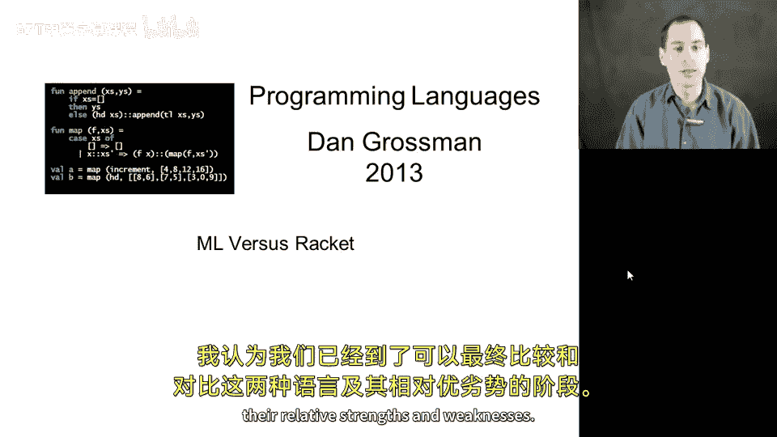
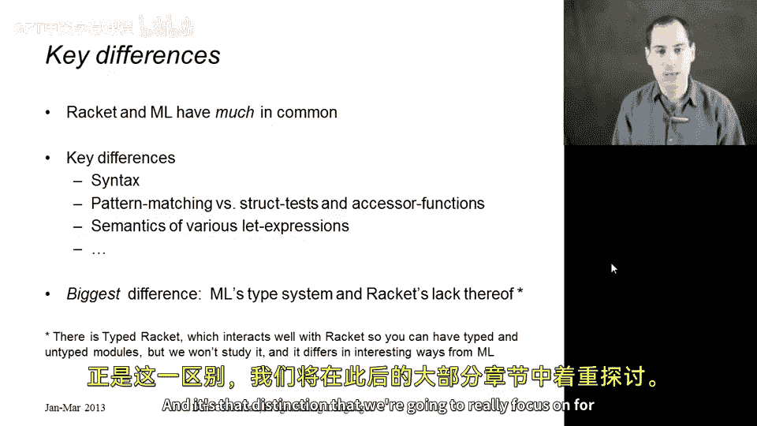
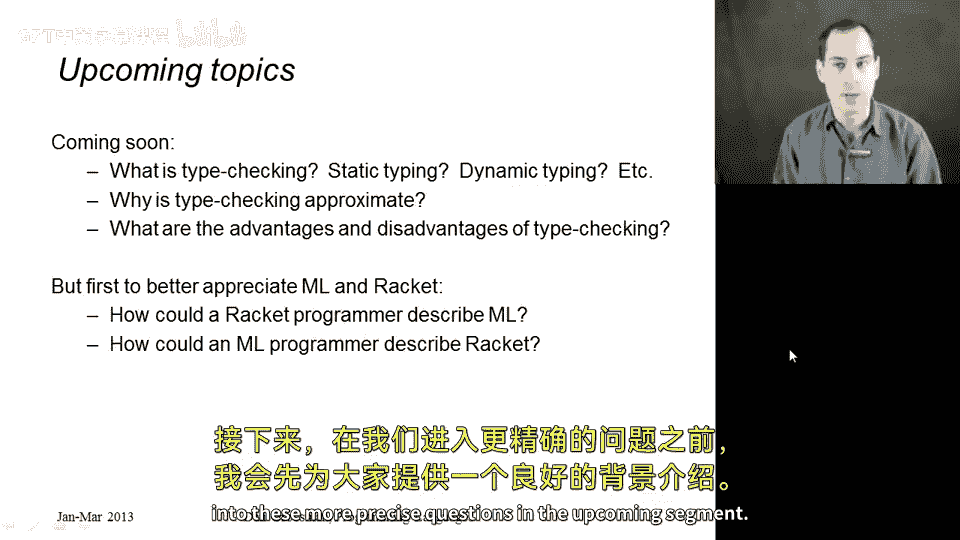
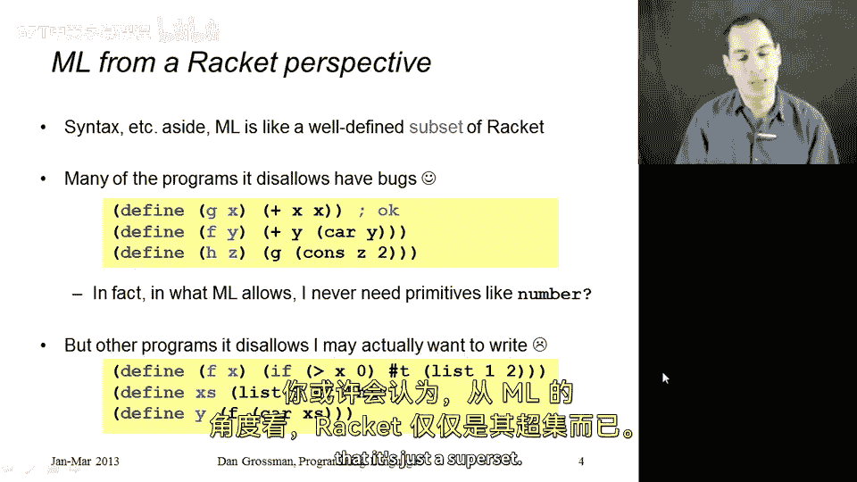
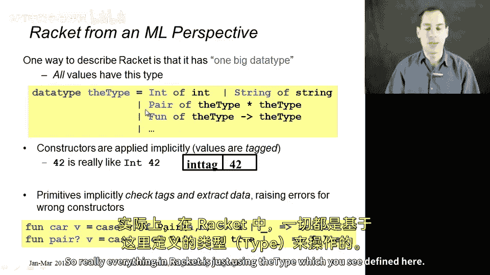
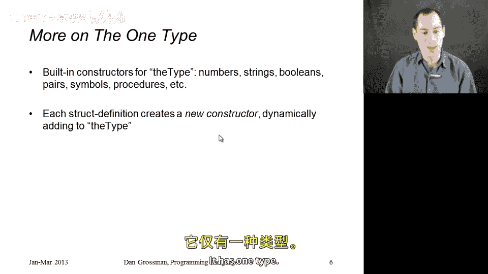

# 编程语言对比：第35章：ML与Racket对比

在本节课中，我们将比较和对比Racket与ML这两种编程语言，分析它们各自的优势和劣势。我们将重点关注两者最核心的区别：ML拥有一个在程序运行前就拒绝大量程序的**静态类型系统**，而Racket则选择更宽松，允许更广泛的程序，但代价是运行时可能出现更多错误。

---



## 🧠 从Racket程序员的视角看ML



上一节我们介绍了对比的背景，本节中我们来看看，一个熟悉Racket的程序员会如何看待ML的类型系统。

最自然的想法是：ML就像是Racket的一个**子集**。它接收所有Racket程序，然后通过类型系统剔除掉其中一部分，剩下的就是ML程序。这种视角有其优点。



以下是Racket程序员可能会欣赏ML类型系统的原因：

*   **捕获错误**：许多被ML拒绝的程序本身就有错误。例如，一个函数同时将参数传给`+`（加法）和`car`（取列表头）操作，这在Racket中必然导致运行时错误。ML能在你运行前就发现这个错误。
*   **消除类型检查**：在通过类型检查的ML程序中，你**总是**能静态地知道每个值的类型。因此，你永远不需要在运行时使用像`number?`这样的内置谓词来检查类型，这非常简洁。

然而，Racket程序员也可能对这个“子集”感到不满，因为它也排除了许多在Racket中完全正确、没有错误的程序。

以下是Racket中合法但ML不允许的例子：

*   一个函数在`if`表达式的不同分支中，有时返回布尔值，有时返回列表。
*   构建一个包含不同类型数据（如数字和字符串）的列表。
*   调用上述多态函数并得到正确结果。

Racket程序员会认为这些代码运行良好（例如返回`true`），但ML却不允许。

---

## 🔄 从ML程序员的视角看Racket

上一节我们从Racket的视角看了ML，本节中我们反过来，看看ML程序员如何理解Racket。



一种观点是Racket是ML的“超集”，但还有一个更有趣的视角：**可以将每个Racket程序都看作是一种特殊风格的ML程序**。

其核心思想是：Racket并非没有类型，而是**所有东西都属于同一个巨大的数据类型**。我们称这个类型为`the-type`。

在ML中，这个类型可以这样定义：
```ml
datatype the-type = Int of int
                  | String of string
                  | Pair of the-type * the-type
                  | Bool of bool
                  | Symbol of symbol
                  | Procedure of ... (* 表示函数 *)
                  (* ... 为每种内置数据添加构造器 ... *)
```
从这个ML视角看世界：

*   Racket表达式求值后得到的都是`the-type`类型的值。
*   Racket解释器会自动为你添加“构造器标签”。例如，你写`42`，实际上像是写了`Int(42)`。
*   每个传递的值都带有标签，标明其类型。
*   像`car`、`pair?`、`+`这样的函数，在底层实现中，都在对`the-type`值进行**模式匹配**，检查标签并执行相应操作或抛出错误。

因此，Racket中的所有操作都可以看作是在使用这个统一的`the-type`类型。

这种视角几乎涵盖了Racket的所有特性，除了`struct`。在ML程序员看来，Racket的`struct`定义是在程序**动态执行时**，向`the-type`数据类型**添加新的构造器**。这在ML中通常是不允许的（因为它会破坏模式匹配的穷尽性检查等），但在概念上是合理的。实际上，ML中的异常类型`exn`就是以类似方式工作的。

---



## 📝 总结

本节课中我们一起学习了从两种不同视角理解Racket和ML：

1.  **Racket视角看ML**：ML像是Racket的一个**安全子集**。它的类型系统能提前捕获许多错误，但代价是排除了一些在Racket中灵活但正确的编程模式。
2.  **ML视角看Racket**：Racket可以被视为一种特殊的ML编程风格，其中**所有值都属于一个巨大的、带标签的联合数据类型**（`the-type`）。Racket的动态特性，如运行时定义`struct`，相当于动态扩展这个数据类型。



这两种视角帮助我们更好地理解静态类型（ML）和动态类型（Racket）设计哲学的根本差异，为我们后续深入探讨类型检查、静态分析等概念奠定了基础。