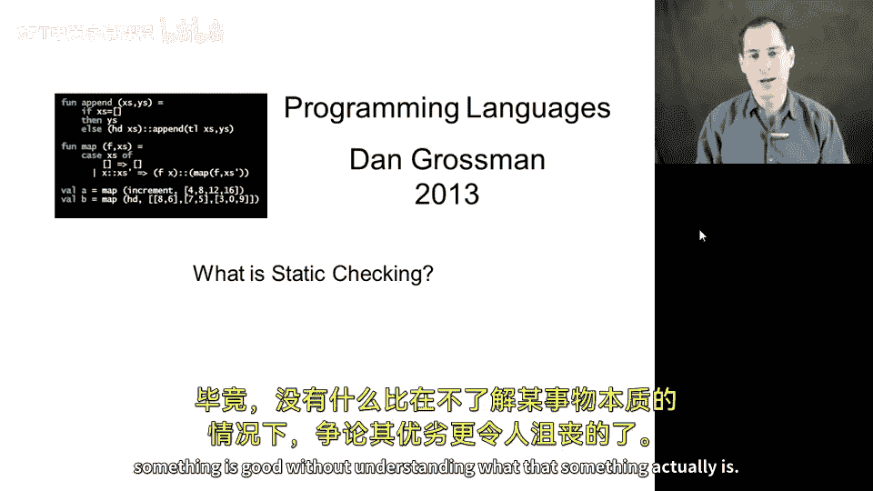
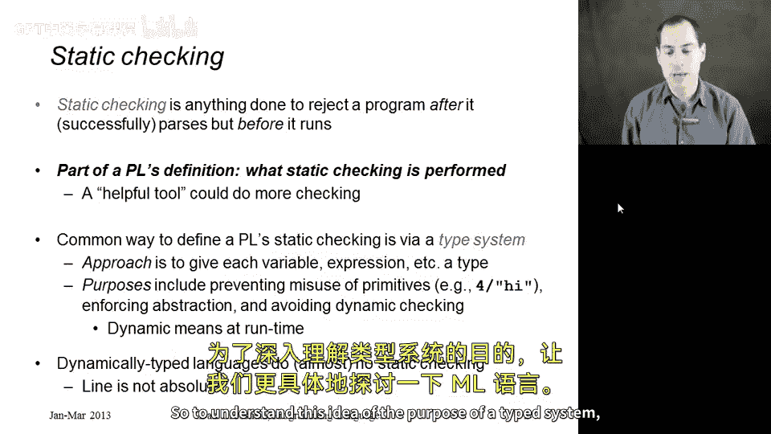
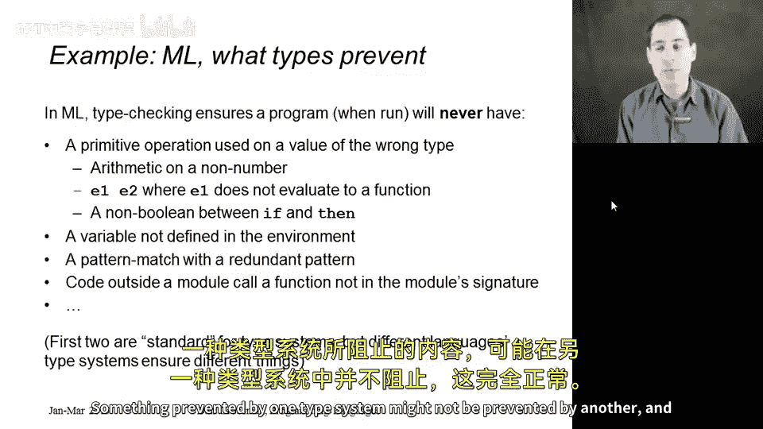
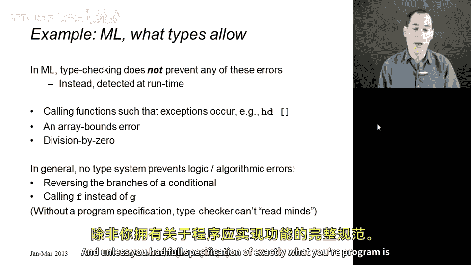
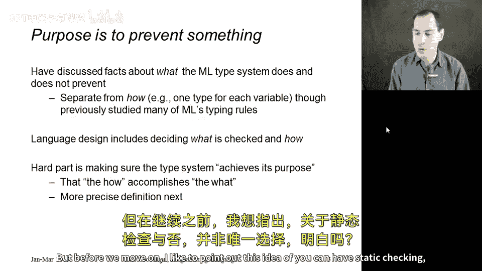
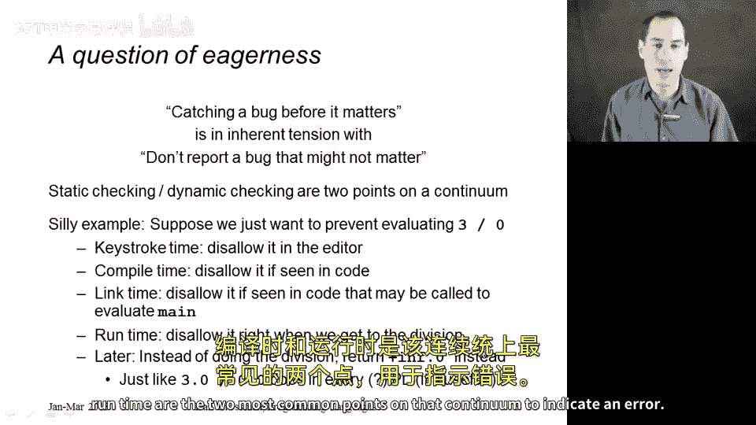

# 【编程语言 A⧸B⧸C CSE341 Coursera】华盛顿大学—中英字幕 p134 36_02_what-is-static-checking -BV1bw4m1D7MM_p134-

Let's now discuss what static checking is as part of a programming language。

 we absolutely need to do this before we discuss the advantages and disadvantages of having static checking。

 After all， nothing is more frustrating than arguing about whether something is good without understanding what that something actually is。

So I will define static checking as anything that is done to reject some set of programs。

 even though they successfully parse， but before you start running them。So we have the parsing。

 It's done。 We have the abstract syntax， and our language says， even though it parsed。

 this program is rejected for some reason， that rejecting process is the static checking and which programs are rejected and which ones are allowed to run is absolutely part of a programming language's definition。

 It's an essential part of the definition so that people know what the legal programs are。

Now you could do static checking in addition to a programming language definition。

 you could have some tools on the side that also detect bugs and warn you about them and that's a wonderful thing to do that's become very popular and I'm very much in favor of it。

 but here let's just focus on static checking as part of a programming language definition。

Now probably the most common way to have static checking as part of your language definition is via a type system。

And for type systems， I want to distinguish in this segment the approach they take from their purpose。

So the approach most type systems take is every variable gets a type。

 We use that to type check each expression， maybe functions have a type signature that we're interested in and so on。

 And that's all fine。 And then some programs type check and some don't。

 but what is the purpose of this。 We should be very clear about what a particular type system is trying to prevent。

For example， maybe it's trying to prevent you from passing a string to an arithmetic operation like division。

 That is one thing that a type system prevents。 It also prevents violating the abstraction of a module like an Ml's module system。

 It prevents having to do runtime checks like the number of question mark primitive and racket。

 It prevents using undefined variables and so forth。Okay。

 so a dynamically typed language is just the language that doesn't do this sort of static checking。

 Now it's not an absolute line。 Raet actually checks a couple things When you click the run button。

 it turns out you're not allowed to have an undefined variable， but there are very。

 very few things that it checks statically。 And so we tend to still call it a dynamically typed language。

So to understand this idea of the purpose of a type system， let's look at M a bit more specifically。

 Here I have a long list of things that M's type checker has the purpose of preventing。

 We know that if an M program runs， it will never have any of the following errors。

 It will never have a primitive operation used on a value of the wrong type。 For example。

 you'll never have E1 applied to E2 and have E1 not evaluate to some closure。

 you'll never have an if then else expression where the expression between if and then doesn't evaluate to a bo and so on。

 you'll never have a variable used that's not defined in the environment when the interpreter looks it up in the environment。

 it always finds it。

You'll never have a pattern match with a redundant pattern and so on and so forth。

 and a lot of these are standard to type systems， but they really are part of each programming language's definition and different languages can use their type system to prevent different things。

 something prevented by one type system might not be prevented by another， and that's okay。

It is also the case that no type system prevents everything。 so here are a number of errors。

 a number of bugs that ML's type system does not prevent。

It does not prevent calling the head function with the empty list。

It does not prevent array bounds errors。 We never saw arrays in M， but it has them。

 It makes sure that the subscripting into the array is always done with an int。

 but it does not make sure that that int is small enough to refer to an element that is actually in the array。

 And M's type system does not prevent a vision by0 and so forth。

 There's a bunch of errors like that that you could imagine a type system preventing。

 but most type systems in today's languages do not。Now， in general， even beyond those sort of things。

 you really can never expect a type system to find all of your bugs because it doesn't know what your program is trying to do。

Unless a static checker is given a full specification of exactly how your program is supposed to behave on all inputs。

 it cannot possibly read your mind about what the program is supposed to do。

So if you have a perfectly good if then else expression。

 except the then branch and the else branch are backwards， you put the wrong one in the wrong place。

 how is a type checker to know that you aren't supposed to do that？Similarly。

 if you have two functions of type int arrow int， F and G。

 and you call one when you meant to call the other one， again。

 that's just not the sort of thing that a type system is ever designed to prevent。

 So type systems and static checkers are pretty much not substitutes for the sort of testing and dynamic evaluation of programs that we come to expect unless you had some full specification of exactly what your program is supposed to do。

So I'm really emphasizing a particular view of type systems here。

 which is technically accurate and an important perspective on it。

 which is that the purpose of a type system is to prevent certain behaviors from happening at runtime。

And that's a separate issue from how the type checker is defined in terms of expressions of having types and how it's implemented in terms of some recursive procedure that runs over your program does type inference and all the rest of it。

So language design includes two issues first， what are you checking what is the purpose of your type system and then second。

 how are you going to enforce those things， how are you going to make sure that you never pass a string to the plus operator and the hard part of designing type systems is to make sure that they achieve their purpose that while being useful and flexible and the sort of language people want to use。

 that the how you do it correctly accomplishes the what what we'll study in the next segment is the exact definition of correctness and how to think about that。

But before we move on， I like to point out that this idea of you can have static checking or you can have static checking is not the only choice right that there's really a continuum of options here that fundamentally catching a bug early such as giving a type error before you've ever run the code in question is always an inherent tension with well maybe I shouldn't call that a bug because it's never going to matter。

 Programrs don't need to know that there's some reason that bug isn't going to occur and so on。

 And so static checking， a type system like you're used to and dynamic checking when you hit that bad operation at runtime are only two points on a continuum So to emphasize this。

 let me pick a strange example just so it's not something you're used to。

 S we wanted to prevent the bad thing we're trying to prevent is division by zero。

 so you would never have a program get to a point where it tried to take three and divide it by zero。

Let me give a range of ways you might prevent this。

 The extreme static end would be even before the normal compile time， like we've been talking about。

 what it would do is every time you try to even type a little bit of your program before it shows those characters on the screen。

 it would run some analysis to make sure that the program is currently construed could never divide by zero。

You see how that catches the bug even earlier than we're used to。

 we're used to while you type the program， and then you choose to compile it and it gives you an error message。

There are also things that are before runtime， but less eager than we're used to in our type systems。

 like maybe it allows each individual file to type check。

 but then it waits and right before you go to run the program。

 you have a particular main with a particular set of arguments。

 maybe even then it does some checking and says， you know， I think you might divide by zero。

 so I'm not going to let the program run。That would be more eager than the runtime we're used to。

 which is sort of how racket would do this that if you do slash space 3， space zero and parentheses。

 you would get some sort of error， and it seems like you would think that's as dynamic as you can go。

 you can't go past the division by zero， we learned in school that you're not allowed to divide by zero。

 it's an illegal operation。And yet， we could do betterer than that。

We could just somehow return some answer that indicates we divided by zero。

 return that to callers and have them deal with it。And that might sound strange。

 but it turns out it's exactly how floating point numbers work in pretty much every programming language because the people who do scientific computation decided that dividing by 0。

0 was actually a useful thing to do because if you return infinity，Then callers might not need it。

It might be that this computation， in the case where the denominator is 0。0。

 will end up getting canceled out somewhere else or you'll take some conditional that causes you not to end up using this variable。

 And so it turns out programming languages typically do this。

 And they could do the same thing with integer 0 if they wanted to， Because this issue of eagerness。

 When do you detect bugs。 and how do you turn them into errors is a language design choice。

 and you have a full continuum。 It just so happens that based on our experience and designing languages over the years。

 that compiled time and runtime are the two most common points on that continuum to indicate an error。

