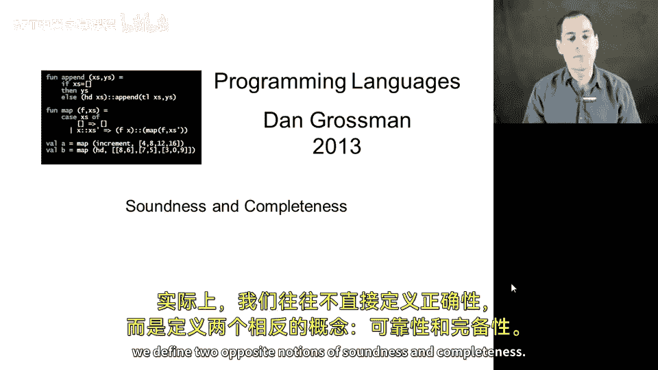
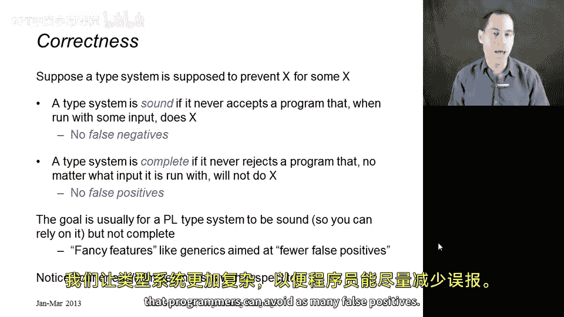
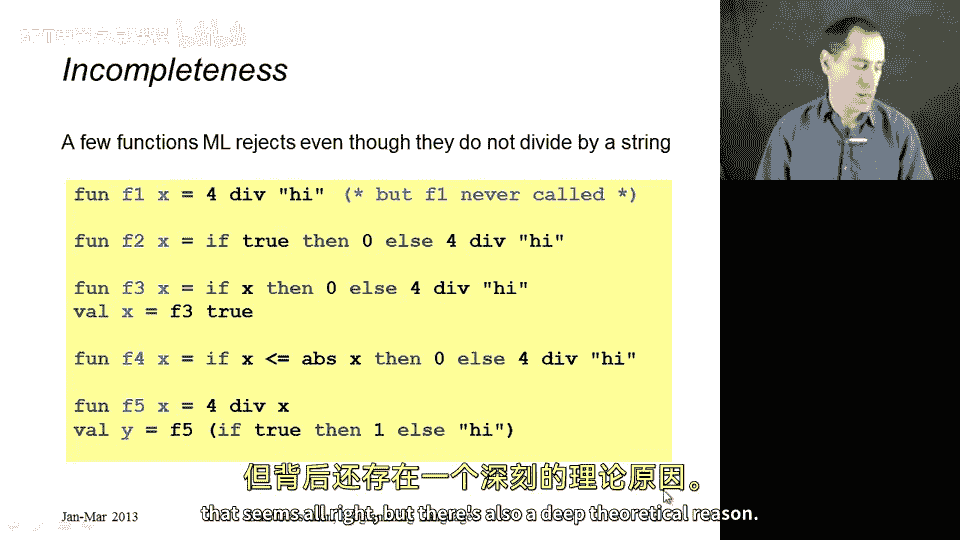
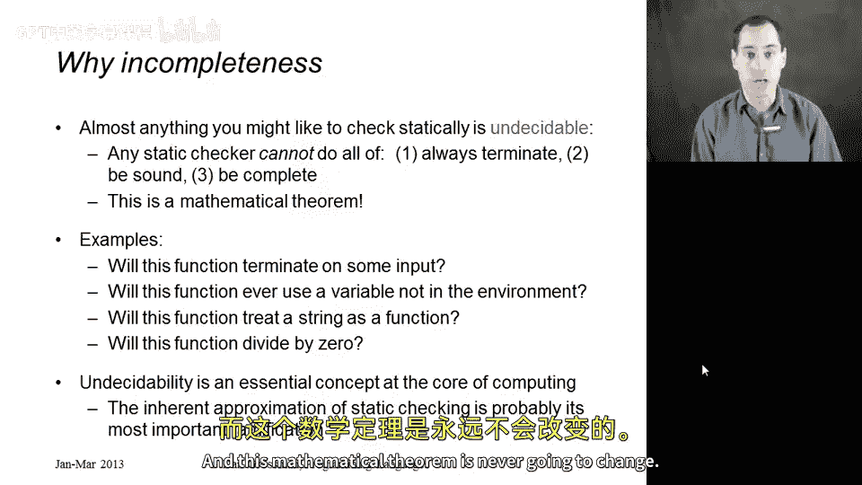
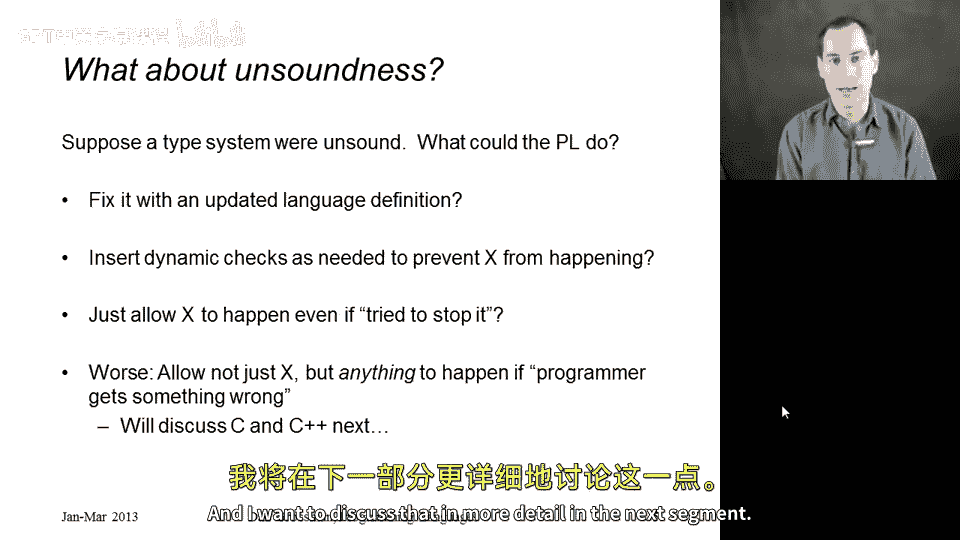

# 【编程语言 A⧸B⧸C CSE341 Coursera】华盛顿大学—中英字幕 p135 37_03_soundness-and-completeness -BV1bw4m1D7MM_p135-

In this segment I want to give a precise definition of what it means for a type system to be correct。

 and it turns out we don't tend to define correctness。

 we define two opposite notions of soundness and completeness。

So the way I will present this is that we have now learned that type systems are supposed to prevent things。

And let's say there is some X， some property X that a type system is supposed to prevent。

 such X could be that you do not pass a string to addition or do you do not look up an undefined variable。

 It could be one of those things， It could be a set of those things， it's just X。

 and the definition of whether a type system is correct。Is in terms of that X。

 we have to know what the type system is trying to do before we know if it successfully does it。

So given that X， we say that a type system is sound if it never accepts a program that when run with some input would do X。

It is sound if it actually prevents the thing it was supposed to prevent。A related term。

 a synonymous term for this is that there are no false negatives。

 false negatives come from medicine and statistics， the term。

 and the idea is that the type checker is a test like a medical test， the program is the patient。

 the type checker is the test， and we are testing for could it do X。And if we come back and say， no。

 it cannot do X。It's negative for x。But it actually could。That's a false negative。

And a sound type system， by definition， is one that has no false negatives。All right。

 now let's talk about completeness。 A type system is complete if it never rejects a program that would not do X。

So this is about not having false positives。If our type checker is a medical test。

 the program is the patient and we say you have the X disease。

But you don't actually have the disease。 We said you did。 That's the positive， and we were wrong。

 That's the false， and a complete type system would never report false positives。

So it turns out that the type systems we generally define for our programming languages are designed to be sound。

 and the language designers and theorists spend a lot of time checking and ensuring and writing down proofs。

 hopefully that they actually are sound so you can rely on the fact that if your program passes the type checker。

 it does not have the disease that is supposed to be prevented。

And then all of our fancier type system features like generics。

 are often aimed at reducing the number of false positives。

 that our type systems do have false positives， they reject programs that would not actually do the thing X that's trying to be prevented。

 and we make our type systems fancier so that programmers can avoid as many false positives。

So let's see some examples in ML of things that get rejected that even though they don't do the bad things。

 so these are examples of false positives， there are no examples of false negatives in ML because ML's type system is sound for preventing。

 as I show here on this slide a number being divided by a string that we never pass a string to the division operator。

So the first example of a false positive is suppose you have this function F1。If F1's never called。

 then the fact that calling it would divide by a string doesn't matter， that ML is not so lenient。

 it reports that the entire program has the dividing by string disease。

The second example is arguably even more of a false positive because the four divided by the string high is in a part of the program that could never execute。

 if you look at this conditional it's if true， so we're always going to return zero。

 people can call F2 with whatever argument they want。

 we are never going to get the division by a string that is being reported by the type system。

Of course， you might imagine the type system can probably detect this case with F2。

 but let's kind of combine the two ideas we've seen so far and see why type systems can't do this in general。

 F3 could end up doing the L branch， it depends what its argument X is。

 but suppose in the program F3 is only ever called with true。If you only ever call F3 withdrew。

 then this code will never execute， but we expect type checkers to give this sort of error message。

F4 is a more interesting example in my opinion， so it turns out here F4 is exactly like F2 that F4。

 no matter what you call it with， as long as it's an ant and we have a type system for that。

 will always take the true branch because it turns out that x is always less than or equal to the absolute value of x。

 but would we expect our type checker to reason about that just to avoid giving us a false positive。

And here in this last example， we see that we once again have an issue where we are never going to divide by a string。

Because even though X could be a string， if you look at the call here where I have if true。

 then 1 else high， the again reason about the fact that the thing between the if and the then will always evaluate to true。

 then you know the denominator up in the body of F5 will always be a number。

So these are just examples， and you know you might understand pragmatically that we don't expect type checkers to avoid all these false positives。

 and that seems all right， but there's also a deep theoretical reason。

So it turns out that almost anything X that you want to prevent statically。

 you cannot prevent without having false positives。This is the notion of undecidability。

 which is a core idea in computer science。It turns out that for many， many， many properties X。

 pretty much any nontrivial property X of a programming language。

 a static checker cannot do all of three things。 It cannot always terminate and be sound and be complete。

 So if you want a static checker that always terminates and programmers do like their type checkers to terminate。

 then you have to have false positives or false negatives or both。

And so we've made the design decision in most programming languages to say we will not have false negatives。

 but due to this mathematical theorem that holds for any fully powerful programming language。

 we're going to have to have some false positives in order to make sure that our type checker always terminates。

So it doesn't matter what you're trying to prevent pretty much if you want to prevent functions that don't terminate。

 if you want to prevent using a string as a function， if you want to prevent division by zero。

 none of these things can be done， always terminating with no false positives and no false negatives。

So undecidability is at the heart of computer science。

 it's something I encourage everyone to learn about in a course on the theory of computation。

 we're not going to learn why this is true in this course， but I would argue。

 in my biased opinion as a programming languages person。

That the inherent approximation of static checking。

 the fact that all of our static checkers will either have false positives or false negatives。

 and so we choose to let them have false positives given the choice is the most important ramification for software development of this theorem。

 that this is the thing that affects all of our software development every day。

 and this mathematical theorem is never going to change。

So what if we did want to have false negatives， What if we did have a type system that were unsound that claimed to prevent X。

 but there were programs that the T checker accepted。

 and it actually when you ran those programs X could happen What could the programming language do Well。

 first， maybe it was just a mistake in the design of the language and we should update the language to either to come up with a more restrictive type system that rejects more programs to eliminate all of those false negatives。

If that's not what you're going to do， then maybe even though you quote unquote。

 usually prevent X or you make a real good attempt to prevent X， maybe you should。

 as a fallback option， continue to have dynamic checks for X。

 the sort of dynamic runtime checking that racket does。

 you could still have if you had an unsound type system that tried to find some bugs。

 but didn't always find all of them。Worse than that。

 significantly worse than that would be to just allow X。

 say even though this is a bad thing that makes no sense。I didn't prevent it statically。

 I'm not going to check it dynamically。 So I'll just let it happen。

 Maybe you're reading a variable from the environment。 It's not in the environment。

 So an okay thing to do would be to return maybe some default value like 0。

 scripting languages tend to do that。 We might see such a thing like that in Ruby。

 Although Ruby doesn't quite go that far， usually。But the worst thing you could do is say， well。

 I tried to prevent X， but I didn't always do it。 and if X actually happens。

 I'll let the program do anything。I'll let the program be like any program in the world。

 maybe even one that deletes all the files on your computer or sends a virus out on the Internet or anything else。

 And this is exactly the sort of approach that CNC+ plus take with their type system。

 and I want to discuss that in more detail in the next segment。

