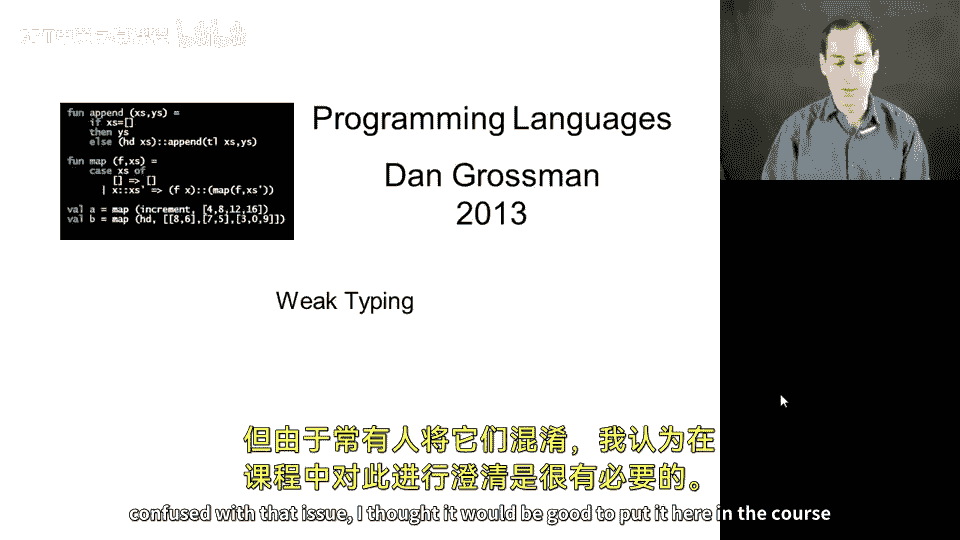
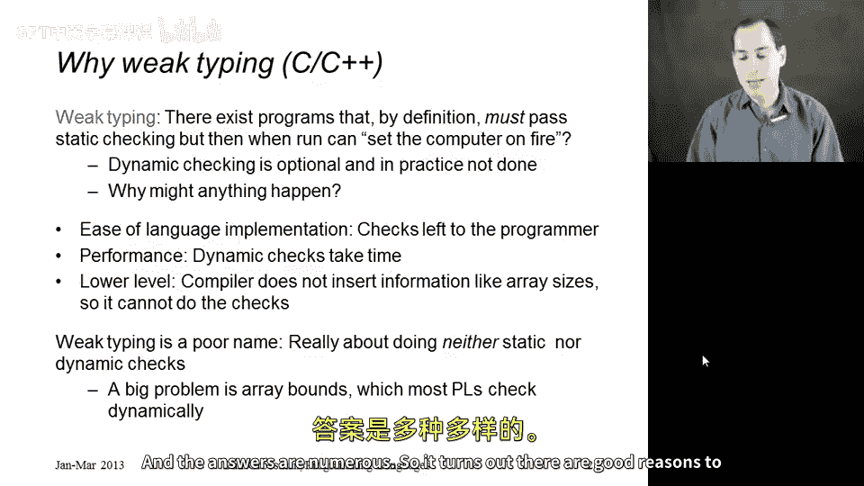
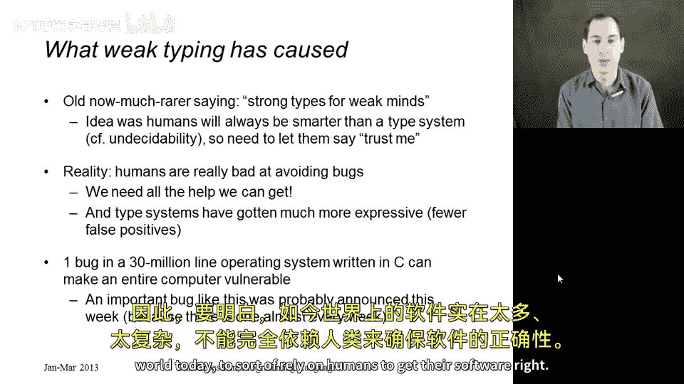
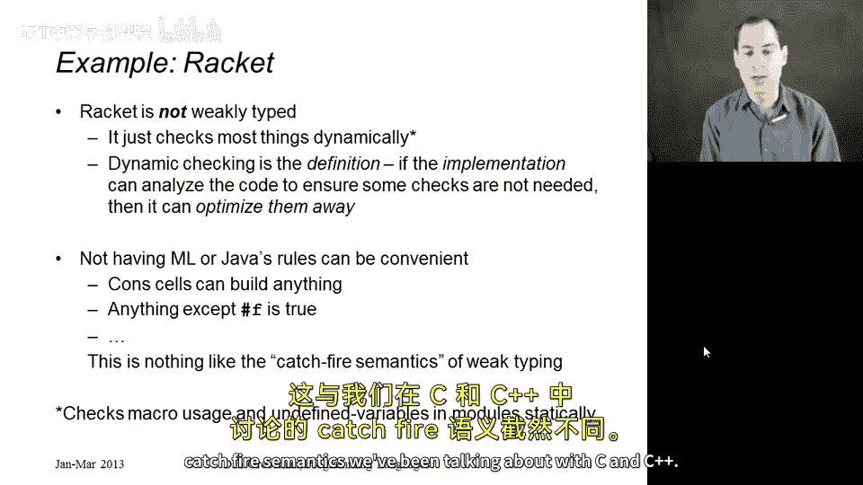
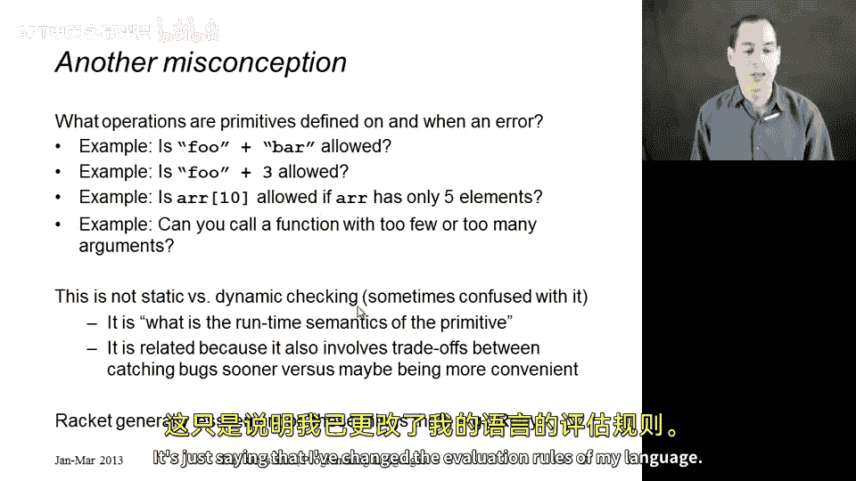

# 编程语言 A/B/C CSE341 Coursera：38：弱类型与相关概念辨析 🧩

在本节中，我们将简要探讨弱类型的概念。这是一个与静态类型和动态类型不同的独立话题，但由于它常与后者混淆，因此有必要在此澄清。

## 概述

我们将首先定义弱类型，并将其与静态/动态类型进行区分。接着，我们会探讨弱类型存在的原因及其利弊。最后，我们会澄清一些常与弱类型混淆的其他语言特性。

## 弱类型的定义 🔥

上一节我们介绍了静态与动态类型，本节中我们来看看弱类型。

弱类型，通常以C和C++的类型系统为代表，可以描述如下：存在一些程序，根据语言定义，它们能通过静态检查。但当程序运行时，它们被允许执行任何操作。形象地说，它们被允许“点燃计算机”，即允许程序崩溃、损坏数据、成为病毒或删除所有文件等。

核心思想是：存在一些执行无意义操作的程序，而本应在灾难性后果发生前捕获这些错误的动态检查是可选的。在C/C++的实际实现中，这些检查通常不被执行。

## 弱类型存在的原因 ⚙️

如果你只使用过Racket、Python、ML或Java编程，这听起来可能很疯狂。为什么允许语言实现不进行这些检查？原因有很多。

以下是使用C/C++在某些场景下的合理理由：
1.  **易于实现**：这使得语言更容易在各种计算平台上实现。检查工作留给了程序员。
2.  **性能**：如果不进行动态检查，不仅节省了执行检查的时间，还无需在程序中存储用于动态检查的各种标签和大小信息，从而节省空间。
3.  **低级控制**：如果需要一个让程序员能控制数据表示等细节的语言，就不能有需要程序员无法控制的额外字段的动态检查。

需要强调的是，“弱类型”这个名字并不贴切。它实际上与类型系统关系不大，而关乎于：你试图防止某些不良属性X，但既不进行静态检查，也不进行动态检查。如果X发生，计算机被允许“着火”。

当你意识到C/C++程序出现无法解释的行为（或许不包括“点燃计算机”）的最大原因之一是**数组越界访问**时，就能明白这其实不完全是类型问题。数组越界在这些语言中通常不被检查，但大多数人并不认为数组边界与类型系统相关。

## 观念的演变 🤔

几十年前，有些人曾是弱类型的支持者，当然也有很多人反对。支持者有一句名言：“强类型是为弱智准备的”。其观点是，只有当你认为计算机比人类更聪明时，你才会想要强类型（弱类型的反面）。但我们知道计算机并非更聪明，静态检查也永远不会完美，因此总需要聪明的人类想出一些绕过检查的方法。他们认为，人类应该能够说“相信我，我说这是对的”，如果错了，计算机可以做任何事。

然而，传统的观念已经发生了很大变化。现实中，我们认识到人类非常不擅长避免错误，我们需要一切可能的帮助。如果我们能编写一个计算机程序来为我们进行一些检查，这是一种很好的责任划分：编写静态或动态检查器的人可以专注于让检查正确无误，编写应用程序的人可以专注于应用程序的逻辑，并依赖强类型编程语言提供的自动检查。

公平地说，传统观念的改变也因为我们的类型系统变得好得多。它们更灵活，拥有多态性、子类型等特性，使得在强类型系统中编程更容易，且不会感到束手束脚。

在我看来，弱类型的论点在现代软件的规模和复杂性面前站不住脚。如今的操作系统包含数千万行C代码。如果你写的是200或1000行C代码，我理解“人类可以通过仔细检查来消除大部分甚至所有错误”的论点。但当你面对3000万行代码，并且其中任何一行都可能导致整个应用程序执行任意行为时，我认为期望不需要保证某些错误和可预防的属性在软件中不可能发生，是荒谬的。

## 澄清：Racket不是弱类型 ✅

我想强调的是，Racket**不是**弱类型的。这只是一个定义问题。Racket是动态类型的，它在运行时检查许多事情（例如不将数字当作过程使用），但这与不进行检查有本质区别。

在Racket中，语言定义规定这些错误将在特定时刻被检测到，并引发一个错误。在语言实现中，如果实现能通过某些分析证明某些检查永远不会失败，那么这些检查可以被移除。语言定义要求这些检查必须存在。如果检查失败，必须通过异常或程序错误来指示。这与C/C++的“着火”语义完全不同。

## 易混淆的概念：操作语义的灵活性 🔄

最后，让我谈谈另一个话题，它既不是弱类型，也不是动态类型，但常与它们混淆。这就是**基本操作能做什么**的问题。

在某些语言中，如果你尝试用`+`操作字符串，会得到一个类型错误（在ML中是运行时错误，在Racket中也是）。但在其他语言中，`+`可能意味着字符串连接。也许在那些语言中，尝试将字符串和数字相加是一个错误。还有一些语言中，这不是错误，它会将数字转换为字符串，最终得到一个像“F003”这样的四字符字符串。

还有其他一些我习惯认为是错误的情况，在某些语言中却不认为是错误：
*   如果我访问一个只有5个元素的数组的第10个元素，在某些语言中，这不是错误，你只会得到`null`或空列表之类的东西。
*   如果你调用一个函数时传入错误数量的参数，在Racket中这是一个错误。但不同的语言可以做出不同的选择：它可以说，如果你传递了太多参数，我们就忽略多余的；如果你传递的参数太少，我们可能为所有缺失的参数传入默认值（如79）。

你可以通过这种方式定义你的语言，使其更灵活，并决定更少的事情是错误。但这实际上并不是静态检查与动态检查的问题。我们有时认为在这些事情上更宽容的语言“更动态”，但从技术上讲，它们并非如此。这里发生的一切只是我们改变了语言中基本操作的求值规则。

如果你改变语言的求值规则以允许更多的参数、更多类型的东西，你是在增加灵活性，你是在以**牺牲及时发现错误为代价**来增加合法程序的数量。相反，即使那不太可能是程序员的原意，程序也会默默地继续执行。

静态检查（更早发现错误）和动态检查（更晚发现错误）之间的一些权衡在这里也适用。在这里，我们甚至更加“动态”，在宣布似乎出了问题的事情上更加延迟。但这根本不是静态检查或动态检查，这只是说我改变了语言的求值规则。

## 总结

本节课中我们一起学习了：
1.  **弱类型**的定义：允许通过静态检查的程序在运行时执行任意（可能有害的）操作。
2.  弱类型存在的原因，包括性能、低级控制和历史因素。
3.  随着软件复杂度的增加和类型系统的进步，支持强类型（进行充分检查）的观点已成为主流。
4.  明确了Racket等语言是**动态类型**（进行运行时检查），而非弱类型。
5.  区分了与弱类型易混淆的另一个概念：**语言操作语义的灵活性**（改变基本操作的求值规则），这本质上是定义了什么是合法程序，而非检查策略。

理解这些区别有助于我们更清晰地思考编程语言的设计与选择。