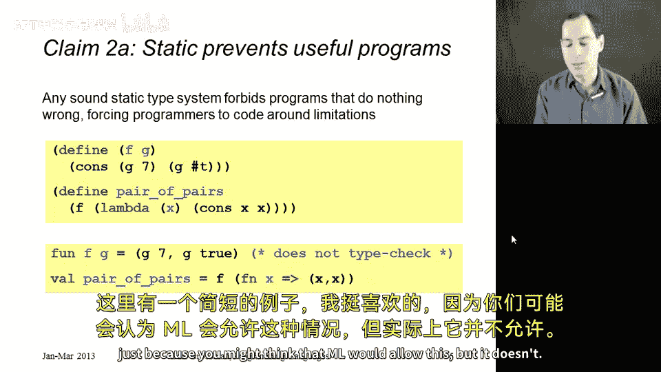
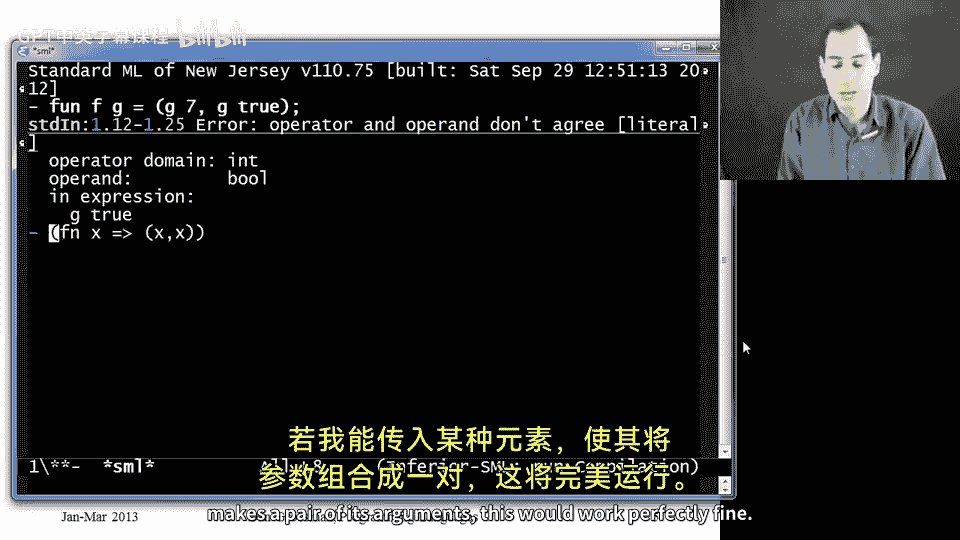
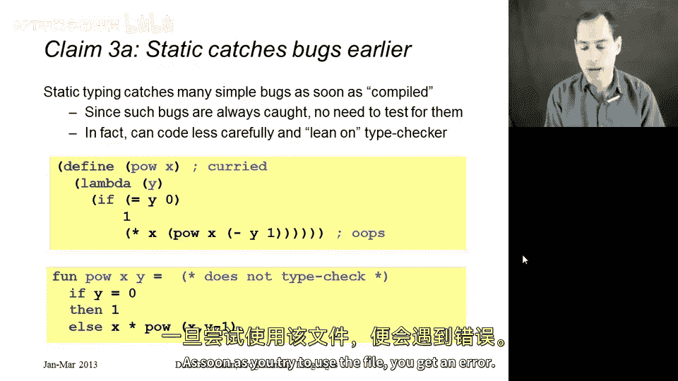
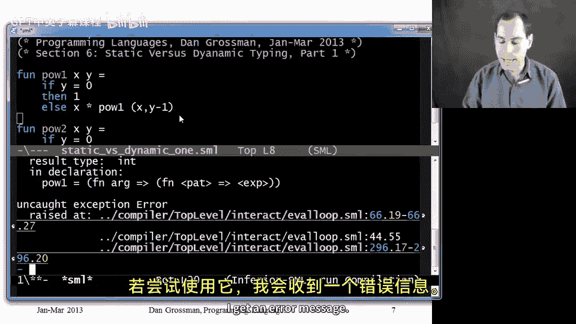
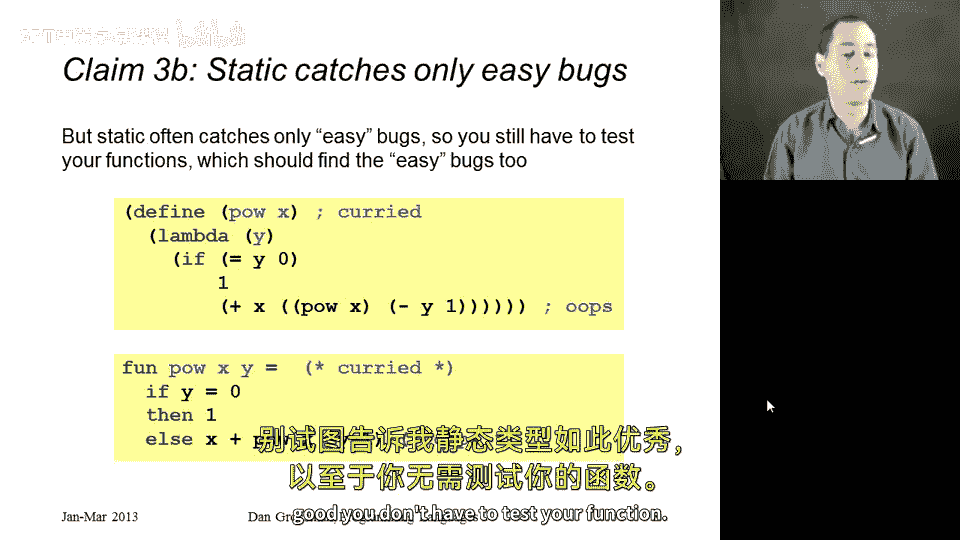
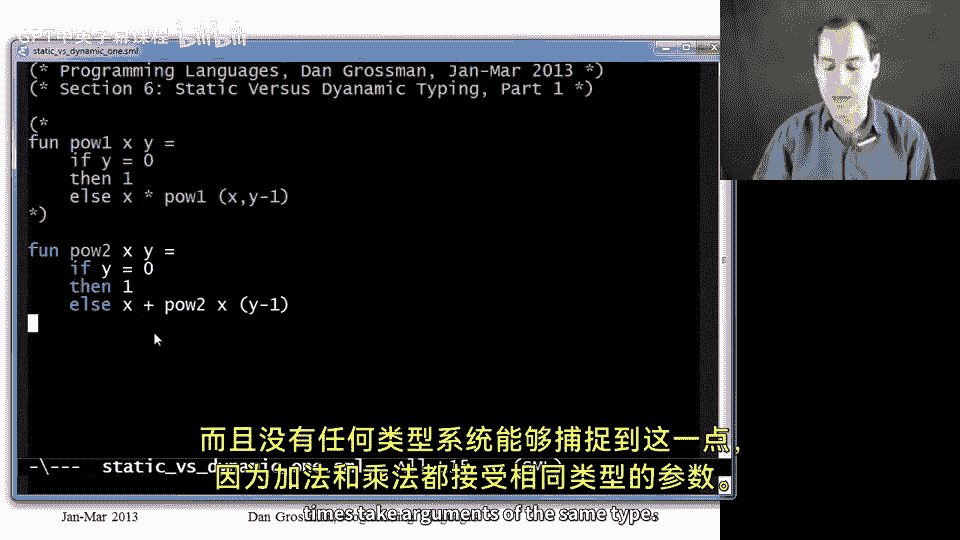
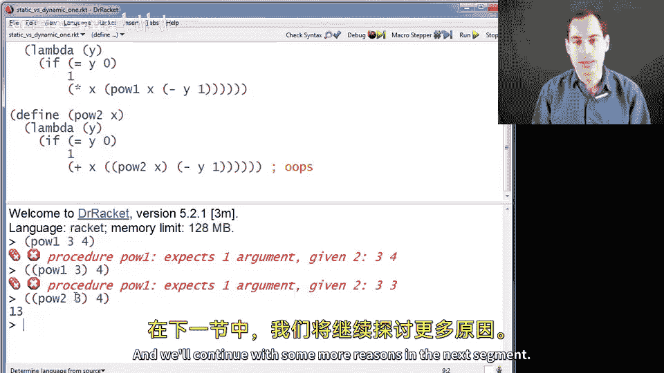

# 编程语言 A/B/C CSE341 Coursera：137：静态类型与动态类型对比（第一部分）🚀

在本节课中，我们将探讨静态类型检查与动态类型检查各自的优劣。请注意，我们不会得出一个绝对的结论，而是通过分析双方的观点来理解各自的优势与不足。大多数编程语言实际上同时采用静态和动态检查，因此关键在于理解在何时、对何种内容进行检查的利弊。

## 概述

本节将介绍静态类型与动态类型系统的三个核心对比点：便利性、表达能力以及错误捕获的时机。我们将通过具体的代码示例来阐述这些观点。

## 便利性对比

首先，我们来看一个支持动态类型系统的常见论点：动态类型系统通常被认为更加便利。

以下是动态类型语言（如Racket）的一个例子：

```racket
(define (f y)
  (if (> y 0)
      (+ y y)
      "hi"))
```

在这个函数中，根据条件，`f` 可能返回一个数字，也可能返回一个字符串。在Racket中，你可以直接这样做。

相比之下，在静态类型语言（如ML）中，要实现类似的功能，你需要显式地定义一个数据类型来包装这两种可能性：

```ml
datatype t = Int of int | Str of string

fun f y = if y > 0 then Int (y + y) else Str "hi"
```

然后，在使用这个函数的结果时，Racket提供了内置的原语（如 `number?`）来检查类型，而ML则需要程序员使用模式匹配来提取数据。因此，对于这类程序，动态类型似乎更加方便。

然而，静态类型的支持者会反驳：真正的便利在于，静态类型系统能确保函数接收到的参数已经是正确的类型。例如，一个计算立方值的函数：

```ml
fun cube x = x * x * x
```

在ML中，你可以确信 `cube` 函数只会被传入整数。而在Racket中，你需要自己添加运行时检查来验证参数类型，否则错误只能在运行时被发现。

## 表达能力对比



动态类型系统的另一个优势是：静态类型检查有时会拒绝一些逻辑上完全正确的有用程序。



考虑以下ML代码，它尝试定义一个高阶函数：

```ml
fun f g = (g 7, g true)
```

ML的类型系统会拒绝这段代码，因为它无法推断出一个函数 `g` 能同时接受 `int` 和 `bool` 类型的参数。即使逻辑上，如果传入一个合适的多态函数（如 `fn x => (x, x)`），这是完全可行的。

而在Racket中，相同的代码可以顺利运行：

```racket
(define (f g)
  (cons (g 7) (g #t)))

(f (lambda (x) (cons x x)))
; 返回：((7 . 7) (#t . #t))
```

因此，静态类型检查在这里似乎阻碍了程序的编写。

静态类型的支持者则会指出：Racket之所以能做到这一点，是因为它在底层为所有数据都附加了类型标签，并在每次操作前进行动态检查。在ML中，程序员可以通过自定义数据类型来获得相同的灵活性，同时还能精确控制哪些地方需要类型标签和动态检查，从而在性能和安全性上获得更多控制权。

## 错误捕获时机对比



支持静态类型检查的一个最强有力的论点是：它能在更早的阶段捕获错误。

在ML中，如果你在编写函数时犯了类型错误，编译器会立即报告。例如：

```ml
fun pow1 x y = if y=0 then 1 else x * (pow1 (x, y-1)) (* 错误：应为 currying 调用方式 *)
```

这段代码会因为调用方式错误而无法通过类型检查。错误在编译阶段就被捕获。

而在Racket中，类似的逻辑错误只有在运行时执行到特定代码路径时才会暴露：



```racket
(define (pow1 x)
  (lambda (y)
    (if (= y 0)
        1
        (* x (pow1 x (- y 1)))))) ; 这里 pow1 被错误地传入了两个参数
```

你需要运行测试才能发现这个错误。



然而，动态类型的支持者会反驳：静态类型检查主要捕获的是那些简单的、容易通过测试发现的类型错误。对于更深层的逻辑错误，静态类型系统也无能为力。例如，下面的ML函数能通过类型检查，但逻辑是错误的：

```ml
fun pow2 x y = if y=0 then 1 else x + (pow2 x (y-1)) (* 应为乘法，却错误地使用了加法 *)
```

调用 `pow2 3 4` 会得到错误的结果 `13`。这种逻辑错误，无论是静态还是动态类型系统，都需要通过测试来发现。因此，既然无论如何都需要测试，那么动态类型系统在早期捕获错误的优势就被削弱了。

## 总结



本节课我们一起探讨了静态类型与动态类型系统的三个核心争议点：
1.  **便利性**：动态类型在编写灵活代码时更方便；静态类型通过保证类型安全减少了运行时检查的负担。
2.  **表达能力**：动态类型系统允许编写一些静态类型系统会拒绝的、逻辑上有效的程序；静态类型系统则通过赋予程序员对类型标记的精确控制来换取安全性和潜在的性能优势。
3.  **错误捕获**：静态类型检查能在编译期提前发现许多类型错误；但双方都同意，对于复杂的逻辑错误，充分的测试都是必不可少的。



这些观点都有其合理性，选择哪种类型系统往往取决于项目需求、团队偏好以及对开发效率与软件可靠性之间的权衡。在下一节中，我们将继续探讨更多的论据。