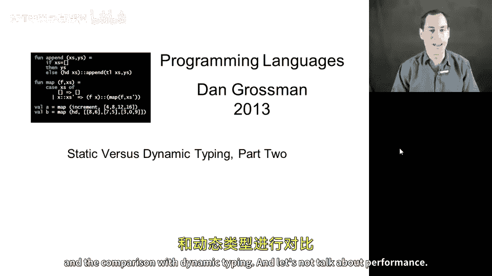
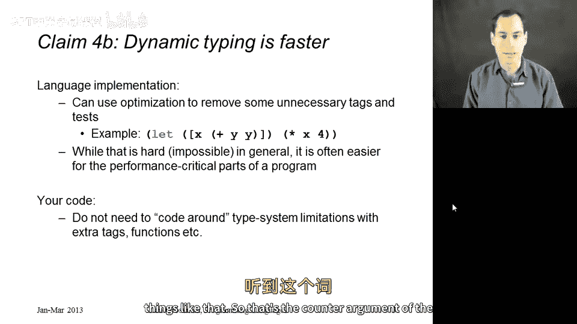
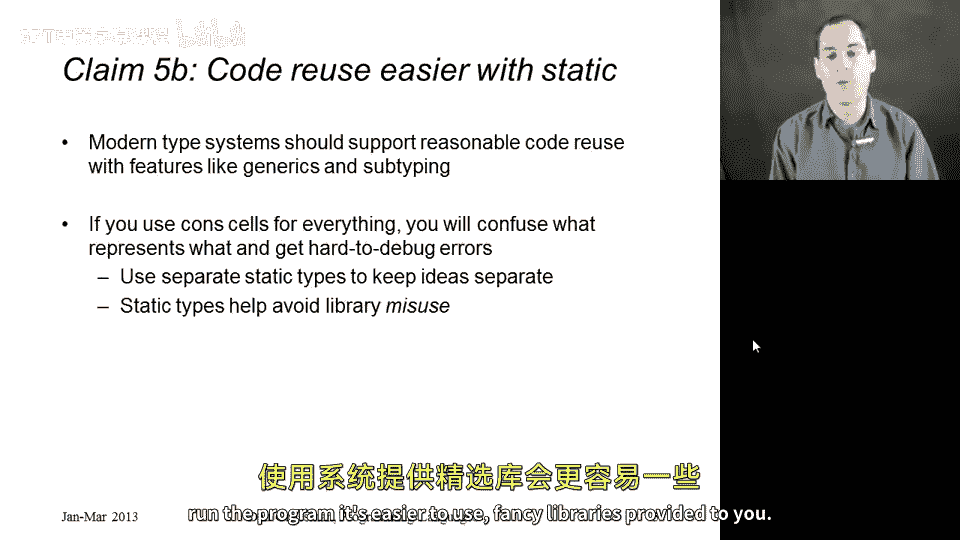
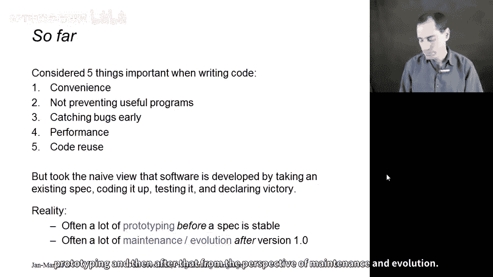
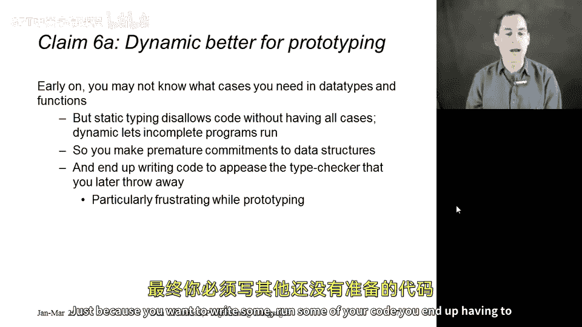
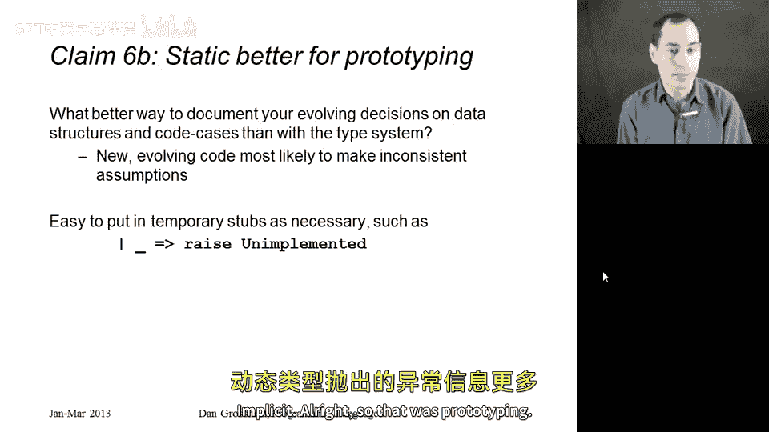
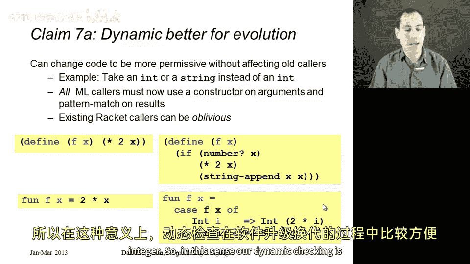
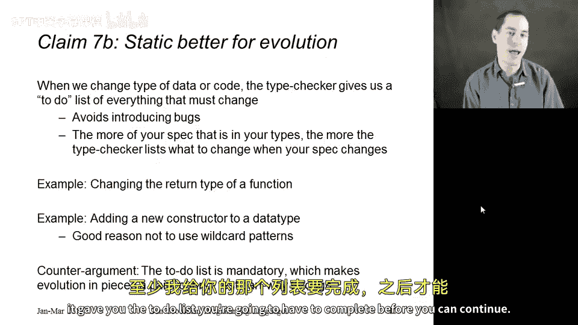
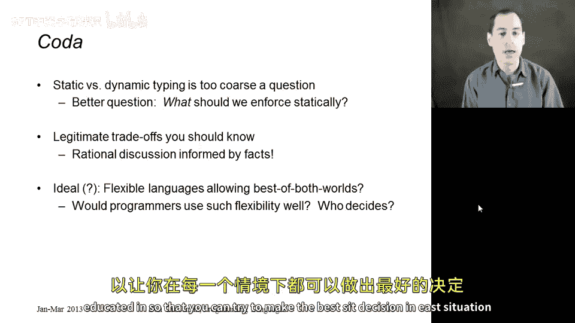

# 【编程语言 A⧸B⧸C CSE341 Coursera】华盛顿大学—中英字幕 p138 40_06_static-versus-dynamic-typing-part-two -BV1bw4m1D7MM_p138-

So let's continue our discussion of reasons for and against static typing and the comparison with dynamic typing and let's next talk about performance。

 so a lot of people who prefer languages with static type systems argue that they can lead to faster programs while still preventing the sort of errors that checking is supposed to prevent the idea is not just that you save the time of not having to check all those things like addition checking that its arguments are numbers but you don't have to pay the space and time cost of having the data there to do the checks in the first place。

 So in ML we can pass to the addition function， an actual number but in racket we have to pass something that has a field indicating it's a number and then a separate field holding the actual number so that leads to increased performance as well as the fact that in our own code we don't find ourselves checking things we don' find ourselves asking number question mark or string。

InQuion mark， we rely on the type system to guarantee that we get particular types of data in particular places。

Now， the dynamic typing people would push back on this。 They would say yes， yes。

 The definition of racket requires all these type tests。 but for performance。

 it's usually only a small portion of your program that matters。

 And there's nothing in the language definition that says the language implementation has to perform every check。

 There are many situations， perhaps particularly more common in those inner loops， if you will。

 where performance matters that it wouldn't have to check。 Look at this example。

 little snippet of code here。 According to the definition。

Plus will check its two arguments to make sure that theirre numbers。 but in this situation。

 a smarter implementation could see I'm passing the same argument twice。

 and so I only need to check one of them。And similarly， when I then multiply x by4。

 I know four is a number， I shouldn't have to check that one。

 and I know x is a number because if it's not a number。

 then I never would have been able to successfully complete this edition and so you could look at code like this。

 which might have four or so checks in theory and see that would be pretty easy for a compiler in practice to get this down to one。

So in addition to relying on compiler optimization to get rid of many of the type tests that might actually hurt performance in your own code。

 you don't find yourself coding around the type system。

 you don't have to have redundant checks or redundant pieces of code。

 you can just do what you want without having to make calls to constructors and things like that。

 so that's the counterarment of the performance thing。

Let's move on to our next argument， which makes code reuse better。 We all like reusing code。

 reusing libraries as much as we can to avoid having to duplicate functionality and have more work for ourselves。

 and you can argue that dynamic is better here because without a restrictive type system。

 you're just going to be able to call the same thing more often。

Suppose you had a bunch of library functions that work over cons cells。 Well。

 since con cells can be used for any kind of data in ML。

 whether or not the content's all the same type， whether it's a list or just some other kind of tuple。

 will' be able to reuse those library functions more often。

And in aesthetic statically typed language， even very basic things we like to use。

 like trees and lists and arrays and hash tables end up having very complicated static types in order to allow reuse and sometimes don't even allow all the reuse that we might want。

So that's the argument from the dynamic side， the static people would argue that in fact it's not so bad in today's modern type systems that they support enough code reuse that we can write reusable libraries for things like lists and sets and trees and tables。

 and sure those libraries may have complicated types， but it should not be complicated to use them。

 and we only have to write the library once。They would also argue that if you are using con cells for everything。

 you're probably going to introduce a lot of bugs because it's going to be very hard to keep track of which things are actually which type。

 And without those type error messages， you have two logically different things that you happen to be implementing with con cells。

 And if you pass them to some function， say in the wrong order， you just get strange error messages。

 So they would argue that it's actually easier to reuse code。

If you have a type system that's good at pointing out where you're doing it wrongly。

 by getting good error messages before you run the program。

 it's easier to use fancy libraries provided to you。😡。

Okay， so that's five arguments so far。We've gone over them。

 we've tried to give both sides as fairly as I could think to do。

But those five arguments all worked in sort of the conventional way of looking at software。

 the way we do on our homework assignments， which is you have some spec that you need to implement。

 you write some code， maybe you test it， and they say， great。

 my software is working and it's working either in a language with static typing or dynamic typing。

But that's not the way most software is developed， there's， in reality。

 usually a portion early in the development of the software where you're not even sure what the spec should be and you're doing what's called prototyping of trying things out as the specification is evolving。

And then after you've released your software， you have a first version that's working。

 there's a whole lot of maintenance and evolution as you decide that the semantics of your application needs to change。

 you need new features， you need to fix bugs that made it through your test suite and so on。

 and so I want to now consider static and dynamic typing from the perspective of prototyping and then after that from the perspective of maintenance and evolution。

So let's do prototyping。 A lot of people feel that dynamic typing is better for prototyping and the argument is it's early in developing your application。

 You're not really sure how you should represent your data。

 how many cases you need are these all the constructors from my one of type or am I going to have to add more all of this sort of stuff and if you're programming in a language with a lot of static typing it's going to not let you run your code until you have all of the cases written down and everyone has to agree you get type error messages whereas the dynamic approach lets you prototype the part you have written knowing full well that you have to go back and write the rest later So if you're an aes static typing world just to be able to run your code。

 you end up having to make a bunch of premature commitments to things。

 things that you're not even sure right you're not sure you're going to keep you end up writing a lot of code that you're going to later throw away just because you want to write run some of your code。

 you end up having to write other。

Code that you're really not ready to write。Okay， the static people say actually。

 prototyping is when I appreciate my static type system the most。

 as my ideas are evolving on what type of data I need， how many cases there are， etc。

 what better way to not just document， but have something checking my documentation。

 than to have a type system。That when I'm evolving code and I'm still coming up with how to arrange things。

 that's exactly when I make mistakes and I pass a string when I mean an int。

 and I need a type checker to help me guide me through that process and give me that assistance。😡。

As we're having to write a bunch of code， just be able to run other parts of a code。

 it's really not that big of a deal in practice， they would say if you have some function that isn't implemented yet。

 but your type checker needs it， well just implement it to raise an exception and a language like ML。

 a function that always raises an exception can have any type。Similarly。

 for not handling all the cases on your data type， it's easy to add a wild card pattern and have that branch raise an exception。

 That may be error prone， but it's no more error prone than the dynamic checking approach。

 which just does that for you implicitly。

，So that was prototyping。 Now， let's talk about after your software is written。

 It's released and you're looking to make changes for the next version of your software。

 So let's take an example where the dynamic approach is certainly more convenient。

Suppose I have a function that used to always return an int when given an int and it had to take an int。

 but now I want to let it also take a string in which case it'll give back a string。

 so I have an example here in racket in version1 of the software function F takes a number and doubles it in version2。

 it still does that for numbers， but if given a string I want to append that string to itself it's a silly example that fits on one slide。

😡，So this works great in racket and the great thing about it is no callers that used to work are now broken。

 The function still works exactly like it used to in all the old use cases。

 it just provides additional functionality。 So this is what is usually called a backwards compatible change right in Ml。

 this is not going to work very well。 if in version1， you had a function of type int arrow int。 Well。

 now you're going to have a function that has to take in some one of type and returns that same one of type and this is not going to be backwards compatible。

 It's going to break all the existing users of your function because they are now going to have to use a constructor to call your function and use pattern matching on the result to get out the underlying integer。

😊，So in this sense， dynamic checking is more convenient for software evolution。

But wait the static static typing people say， actually I love having that static type system when I go to make changes to my program。

 maybe not in that example that was a little bit annoying。

 but when I change the type of something in my code。

 the type checker is great exactly because it tells me all the things that no longer type check even in the example on the previous slide it gives me a list it prints out all the places that I was calling F and I could just go in and make those changes and know that I got them all when my program again type checks。

 In fact， let's take a slightly different example where we end up changing the return type of some function。

If I change the return type， just the return type of some function。

 the rackcet code continues to compile just fine， and I'm going to have to have enough tests to go in and find all the places I was calling that function and catch all the runtime errors because I'm assuming the wrong thing about the result。

Whereas in ML， the type checker gives me the to do list I need。

Another example in ML is suppose you have a data type， and you need to add a new constructor to it。

 You forgot some kind of arithmetic expression for your arithmetic expression language。 Well。

 if youre good about using pattern matching everywhere and not using the wild card pattern for your last case。

 you will get warnings about inexhausted pattern matches exactly where you need them and you don't have to worry about forgetting to change some other part of your code when you add that constructor。

So that's all extremely useful。 The dynamic people would argue it's a little annoying that that to do list as friendly and flexible as it is is mandatory。

 What if you wanted to do half the to do list， then run some tests and then the other half Well ML doesn't like that it wants your whole program to type check but at least it gave you the to do list you're going to have to complete before you could continue。

Okay， so just to finish up， I've given now seven arguments both for and against static checking versus dynamic checking。

 and I'd just like to argue that I really think it's too coarse a question。

 I don't think it really makes sense to say， oh， static checking is always better or dynamic checking is always better。

 a better question is probably for this software that I'm writing。

 what do I want to check statically dealing with the false positives that inevitably result。

 and what do I not want to check statically and I'm willing to rely on testing and actual running the software to detect those problems。

In answering that question， there are legitimate tradeoffs and I've now spent two videos trying to give rational fact-based reasons and examples rather than spouting sort of opinions not based on precise technical arguments coming from the true concepts of programming languages and it seems that you know if there's arguments on both sides maybe the ideal would be that languages would support both and you wouldn't have to choose between ML and racket racket in fact is trying to do that with its typed racket in variant where some of your files can use types and some of them can't but I would say that in many ways trying to provide the best of both worlds is both still an open research problem。

 there are things that are not easy to do in designing languages for that。

 as well as it's not clear if given both we've really made the problem any easier programmers would still need to decide when writing a library or using a library。

 is this the sort of thing where I want to type check or guiding me as I go along。

And detecting errors early or is this something I want to delay。

 it's not clear who should make that decision or exactly what design criteria you would use。

 And that's why I like to leave static versus dynamic typing as sort of a classic question with a classic set of tradeoffs that you should be well educated in so that you can try to make the best decisions in each situation that arises。

