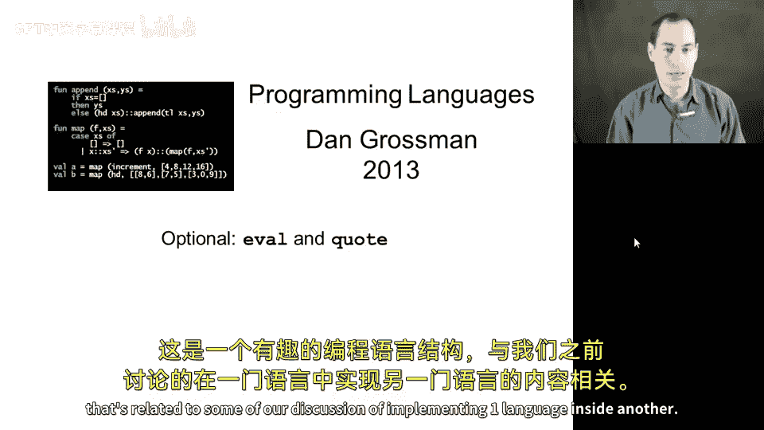
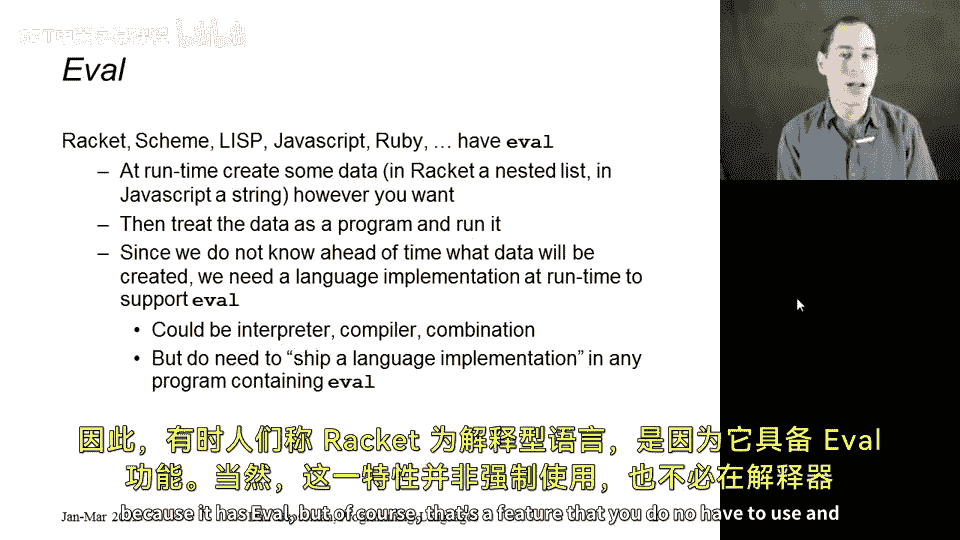
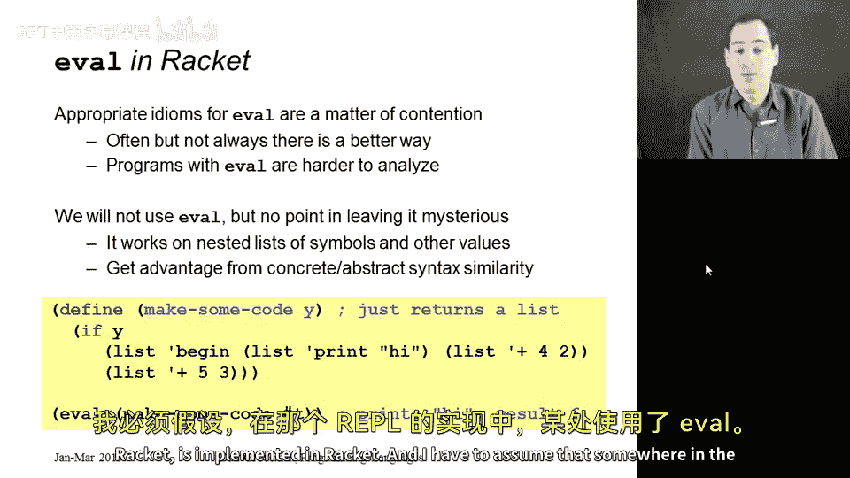
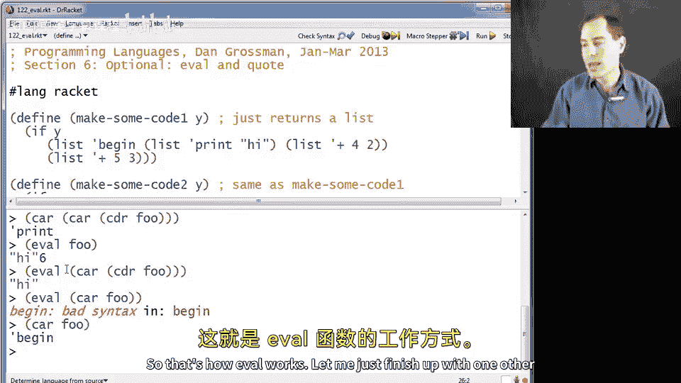
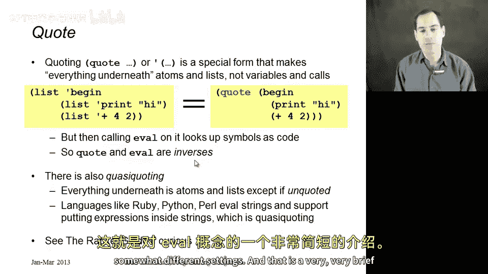

# 编程语言 A/B/C CSE341 Coursera：第41章：可选内容 - Eval 与 Quote 😊



在本节课中，我们将要学习 Racket 语言中的 `eval` 和 `quote` 这两个概念。`eval` 允许我们在程序运行时构建并执行代码，而 `quote` 则提供了一种便捷的方式来构建表示代码的数据结构。我们将通过简单的例子来理解它们的基本用法和工作原理。

## 什么是 Eval？🤔

`eval` 是 Racket 以及许多其他编程语言中存在的一个有趣的语言构造。它的核心思想是：在程序运行时，我们可以构建一些数据（例如列表），然后将这些数据视为一个程序并执行它。

在 Racket 中，我们构建的数据通常是包含数字、符号和嵌套列表的列表。`eval` 函数的作用就是接收这种表示程序语法结构的数据，并将其作为 Racket 代码来运行。这意味着，我们可以在一个 Racket 程序的运行过程中，动态地构建并执行另一个 Racket 程序。

## Eval 的实现与“解释型语言”的误解 🛠️

由于程序在运行前无法预知会构建什么样的数据传递给 `eval`，因此运行时环境中必须保留完整的 Racket 实现。如果 Racket 是用解释器实现的，那么 `eval` 可以直接使用这个解释器来执行代码。如果 Racket 是用编译器实现的，那么程序就需要附带足够的编译和运行能力。

这导致很多人认为，拥有 `eval` 功能的语言必须用解释器实现，并称之为“解释型语言”。这种观点有一定道理，但从技术上讲并不完全正确。Racket 虽然因为拥有 `eval` 而有时被称为解释型语言，但 `eval` 只是一个可选的特性，其实现并不必然依赖于解释器。

## 如何使用 Eval？💻

现在让我们看看 `eval` 的实际用法。我们将通过一个简单的例子来演示。

以下是构建代码数据的函数：

```racket
(define (make-some-code-1 y)
  (if y
      (list 'begin (list 'print "hi") (list '+ 4 2))
      (list 'begin (list 'print "bye") (list '+ 5 3))))
```



这个函数根据参数 `y` 的真假，返回不同的列表。这些列表看起来就像 Racket 代码。

例如，调用 `(make-some-code-1 #t)` 会返回列表 `(begin (print "hi") (+ 4 2))`。这只是一个普通的数据列表。

我们可以使用 `eval` 来执行这个列表所代表的代码：

```racket
(define f (make-some-code-1 #t)) ; f 现在是数据
(eval f) ; 这会打印 "hi"，并返回值 6
```



`eval` 将列表 `f` 作为程序执行：先执行 `(print "hi")` 打印字符串，然后计算 `(+ 4 2)` 得到结果 6。

我们也可以只执行列表中的一部分：

```racket
(eval (cadr f)) ; 这会执行 (print "hi")，只打印 "hi"
```

但是，如果尝试执行一个不完整的表达式（如 `(eval (car f))` 即 `'begin`），则会出错，因为它不是一个合法的程序。

## 使用 Quote 简化代码构建 ✨

上一节我们看到了如何用 `list` 和 `'`（引号）手动构建列表。但像 `(list 'begin (list 'print "hi") ...)` 这样的写法非常繁琐。

为此，Racket 提供了 `quote` 这个特殊形式。`quote` 会将其后的所有内容视为字面的列表和符号，而不是要执行的代码。

比较以下两种写法：

```racket
; 繁琐的写法
(list 'begin (list 'print "hi") (list '+ 4 2))

; 使用 quote 的简洁写法
'(begin (print "hi") (+ 4 2))
```

`quote`（通常简写为 `'`）使得编写待 `eval` 执行的代码变得非常方便。从数学意义上说，`quote` 和 `eval` 是互逆的操作。

`quote` 的局限性在于，它内部不能进行任何计算。所有内容都会原封不动地变成数据结构的一部分。



## Quasiquote 与 Unquote 🔄

如果我们需要在构建代码时嵌入一些动态计算的结果，就需要用到 `quasiquote`（通常简写为 ``` ` ```）和 `unquote`（通常简写为 `,`）。

`quasiquote` 类似于 `quote`，但它允许我们用 `unquote` 标记出其中需要立即求值的部分。

例如：

```racket
(define x 10)
`(begin (print "value is: ") (+ ,x 5)) ; 这会构建列表 (begin (print "value is: ") (+ 10 5))
```

这里，`,x` 会在构建列表时被求值为 `10`，然后结果 `10` 被放入列表的相应位置。这样，我们就能动态地将变量的值嵌入到代码结构中。

## 与其他语言的对比 🌍

最后，我们来对比一下 Racket 的 `eval` 与大多数脚本语言（如 Python、Perl）中 `eval` 的区别。

在脚本语言中，`eval` 通常接收一个**字符串**，字符串的内容是具体的程序代码。`eval` 需要先解析这个字符串，然后再执行它。

Racket 的方法（接收列表）和脚本语言的方法（接收字符串）各有优劣：
*   **字符串形式**可能更方便直接键入代码。
*   **列表形式**（得益于 Racket 具体语法和抽象语法的相似性）更便于组合和操作代码片段，因为列表是 Racket 中的一等公民，可以轻松地使用函数进行构建和变换。

脚本语言中也存在类似于 `quasiquote` 和 `unquote` 的概念，例如在字符串中嵌入表达式求值的结果（常称为“字符串插值”）。这体现了同一种思想在不同语言环境下的应用。

## 总结 📚

本节课我们一起学习了 Racket 中 `eval` 和 `quote` 的核心概念。
*   **`eval`** 允许程序在运行时将数据结构作为代码执行，实现了元编程能力。
*   **`quote`** 提供了一种简洁的语法来构建表示代码的列表数据。
*   **`quasiquote`** 和 **`unquote`** 则进一步允许在构建代码时嵌入动态计算的值。



虽然 `eval` 功能强大，但在实际编程中需要谨慎使用，因为它可能带来安全性和复杂性上的挑战。理解这些概念有助于我们更深入地认识编程语言的表达能力与实现机制。