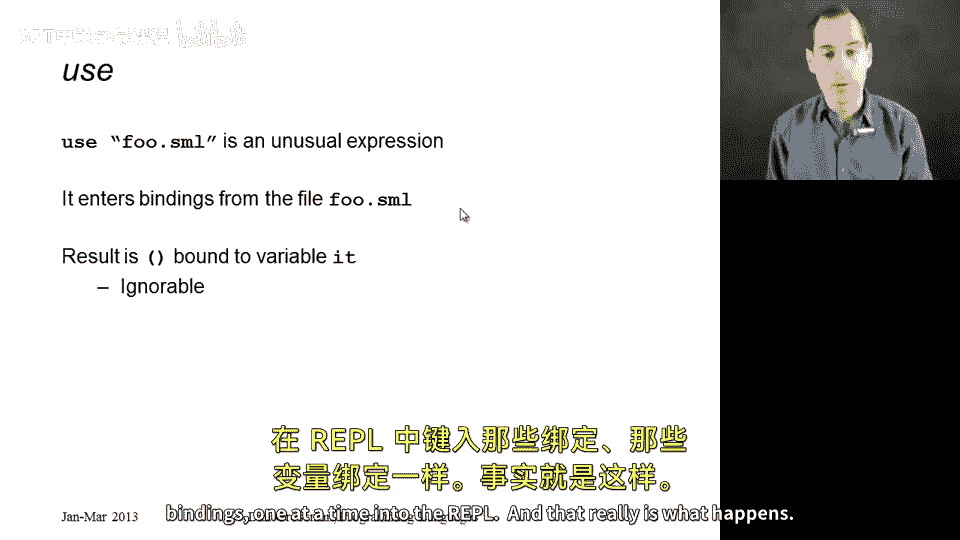
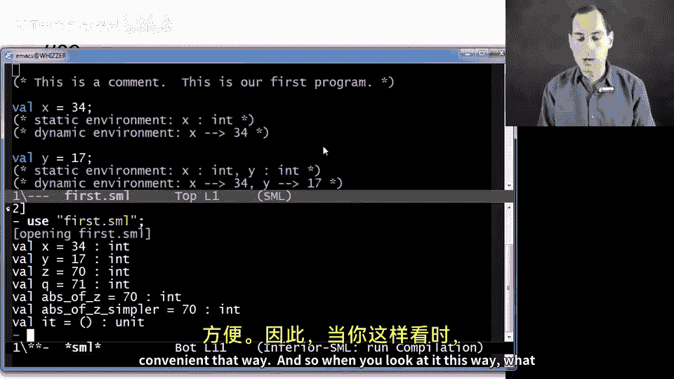
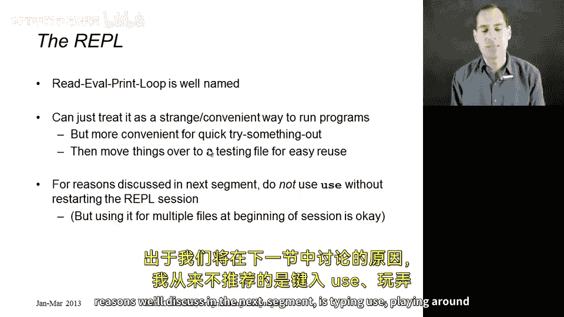
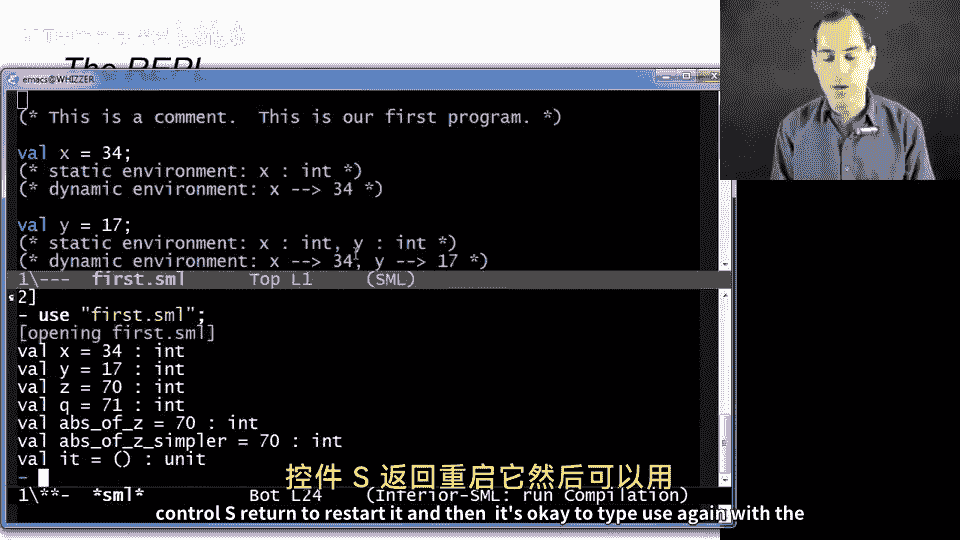
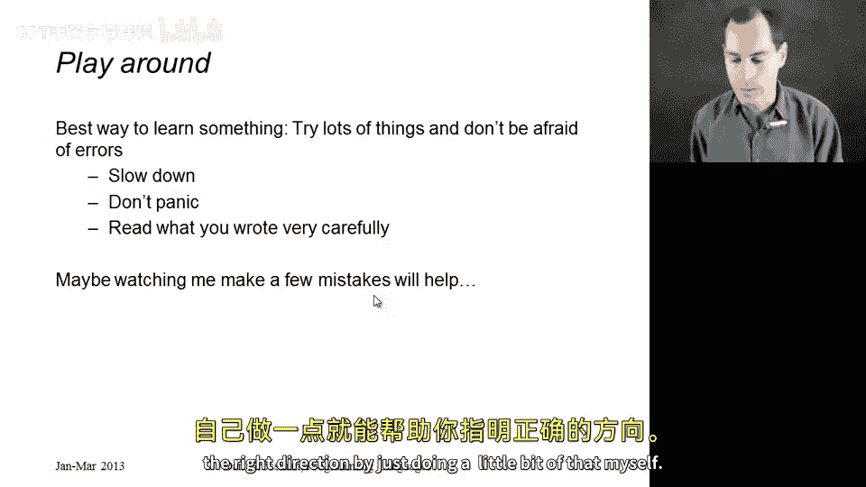
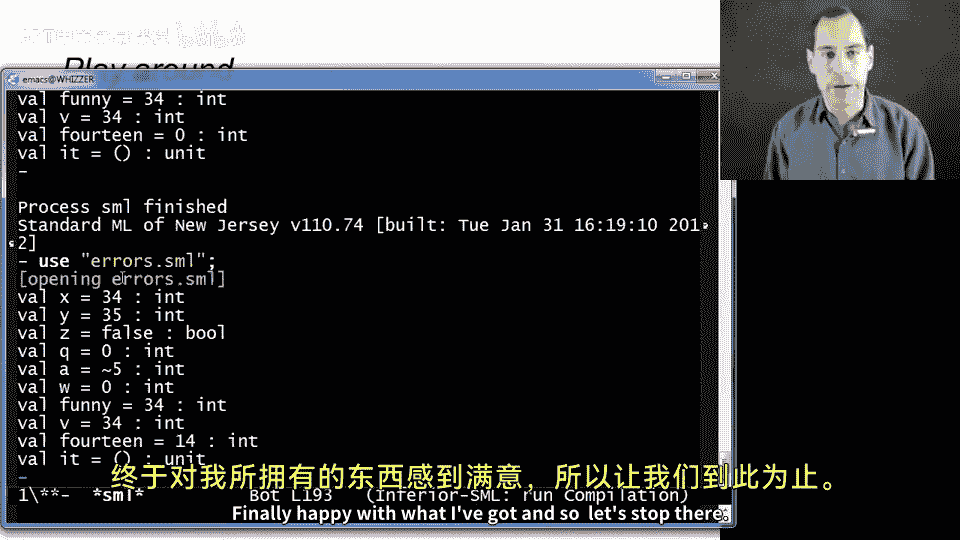

# ML编程：第13章：REPL与错误处理 🐞

在本节课中，我们将学习两个非常实用的主题：如何有效地使用ML的REPL（读取-求值-打印循环），以及如何处理和理解ML中的错误信息。我们将通过具体示例，帮助你掌握调试程序的基本技能。

## 概述

上一节我们介绍了ML的一些核心概念。本节中，我们来看看如何在实际编程环境中运行和测试我们的代码，并学习如何解读和修复常见的错误。

## 使用REPL运行程序





REPL代表“读取-求值-打印循环”。它的工作流程是：读取你输入的代码，对其进行求值（如果类型检查通过），打印结果，然后循环回到提示符等待下一次输入。

在ML中，我们通常使用 `use` 表达式来运行程序文件。你可以将 `use` 理解为：它读取指定文件的内容，并像你手动在REPL中逐行输入这些绑定一样执行它们。

例如，对于一个包含多个变量绑定的文件 `first.sml`：

```sml
val x = 34
val y = 17
```





你可以手动在REPL中输入每一行，也可以使用以下命令一次性加载：

```sml
use "first.sml";
```

`use` 命令会批量执行文件中的所有绑定，并显示每个绑定的类型和求值结果。这是一种非常方便的运行程序的方式。

## 高效使用REPL的技巧

在编程过程中，你可能会反复测试某些代码。为了提高效率，建议将你的测试用例整理到第二个文件中。然后，你可以先使用 `use` 加载主程序文件，再使用 `use` 加载测试文件。

需要注意的是，**不建议**在同一个REPL会话中重复使用 `use` 加载同一个文件。这可能会导致环境状态混乱，难以理解。正确的做法是：



1.  结束当前REPL会话（例如，使用 `Ctrl+D`）。
2.  重新启动REPL。
3.  再次使用 `use` 命令加载文件。

这样做可以确保每次都在一个干净的环境中开始测试。

## 理解与调试错误

编程中难免出错。错误通常分为几类：
*   **语法错误**：代码不符合ML的语法规则。
*   **类型错误**：代码语法正确，但违反了类型系统的规则（例如，将整数用于需要布尔值的条件判断）。
*   **运行时错误**：代码通过了类型检查，但在执行时出现问题（例如，除以零、无限循环或产生非预期的结果）。

调试的关键在于定位错误的根源。ML的错误信息有时可能不够直观，尤其是类型错误信息。这需要一些练习来掌握解读技巧。

以下是调试的基本步骤：
1.  **查看错误信息**：注意错误发生的行号。
2.  **检查相关代码**：错误有时发生在报告行号的**前一行或附近**。
3.  **理解错误类型**：根据信息判断是语法、类型还是运行时错误。
4.  **逐步修复**：一次只修复一个错误，然后重新测试。

## 常见错误示例分析

让我们通过一个包含多个错误的示例文件 `errors.sml` 来实践一下。我们将逐一修复其中的问题。

**错误1：`if` 表达式缺少 `else` 分支**
*   **错误信息**：`syntax error: inserting ELSE ID`
*   **问题代码**：
    ```sml
    if true then 42 (* 缺少 else *)
    ```
*   **修复**：ML的 `if-then-else` 是一个表达式，必须同时包含 `then` 和 `else` 两部分。
    ```sml
    if true then 42 else 0
    ```

**错误2：使用关键字作为变量名**
*   **错误信息**：`replacing FUN with WILD`
*   **问题代码**：
    ```sml
    val fun = 10
    ```
*   **修复**：`fun` 是ML中用于定义函数的关键字，不能用作变量名。需要更换变量名。
    ```sml
    val funny = 10
    ```

**错误3：绑定语句缺少 `val` 关键字**
*   **错误信息**：`unbound variable or constructor: x`
*   **问题代码**：
    ```sml
    val x = 5
    y = x + 1 (* 这里本意是新开一个绑定，但缺少了 `val` *)
    ```
*   **修复**：每个新的变量绑定都需要以 `val` 开头。
    ```sml
    val x = 5
    val y = x + 1
    ```

**错误4：`if` 的条件表达式类型错误**
*   **错误信息**：`test expression in if is not of type bool`
*   **问题代码**：
    ```sml
    if y then ... (* 假设 y 是整数 *)
    ```
*   **修复**：`if` 的条件部分必须是布尔（`bool`）类型。
    ```sml
    if y > 0 then ...
    ```

**错误5：`if` 表达式两个分支类型不一致**
*   **错误信息**：`types of if branches do not agree`
*   **问题代码**：
    ```sml
    if true then 34 else x < 4 (* then分支是int，else分支是bool *)
    ```
*   **修复**：`then` 和 `else` 分支必须具有相同的类型。
    ```sml
    if true then 34 else 0
    ```

**错误6：负数的错误语法**
*   **错误信息**：`expression or pattern begins with infix identifier: -`
*   **问题代码**：
    ```sml
    val a = -5
    ```
*   **修复**：在ML中，负号 `-` 是二元操作符。表示负数应使用波浪号 `~`。
    ```sml
    val a = ~5
    ```

**错误7：整数除法的错误操作符**
*   **错误信息**：`operator and operand don‘t agree [real * real] * int`
*   **问题代码**：
    ```sml
    val result = x / w (* 假设 x, w 是整数 *)
    ```
*   **修复**：`/` 用于实数（`real`）除法。整数除法应使用 `div`。
    ```sml
    val result = x div w
    ```

**错误8：运行时错误——除零异常**
*   **错误信息**：`uncaught exception Div [divide by zero]`
*   **问题代码**：
    ```sml
    val w = 0
    val result = x div w (* 当 w 为 0 时 *)
    ```
*   **修复**：确保除数不为零，或在代码中进行检查。
    ```sml
    val result = if w <> 0 then x div w else 0 (* 示例处理 *)
    ```

**错误9：逻辑错误——结果不符合预期**
*   **现象**：程序能通过编译和运行，但最终的计算结果不是你想要的值。
*   **问题代码**：
    ```sml
    val fourteen = 17 - 7 (* 程序员本意是 7 + 7 *)
    ```
*   **修复**：仔细检查你的算法和逻辑。类型检查器无法发现意图错误，需要你通过测试来验证。
    ```sml
    val fourteen = 7 + 7
    ```

## 总结

本节课中我们一起学习了如何高效地使用ML的REPL环境来运行和测试程序，并深入探讨了各种类型的编程错误及其调试方法。

记住以下几点：
1.  使用 `use “filename.sml”;` 来加载和运行文件。
2.  为保持环境清晰，建议在重新加载文件前重启REPL。
3.  遇到错误时，不要慌张。仔细阅读错误信息，定位到具体行号，并检查附近的代码。
4.  错误信息是编译器的“最佳猜测”，最终需要你根据编程知识来判断真正的错误原因。
5.  即使程序通过了类型检查并成功运行，也**必须**验证输出结果是否符合你的预期。



调试是一项通过不断实践才能熟练掌握的核心技能。不要害怕犯错，每一次修复错误的过程都是你进步的机会。