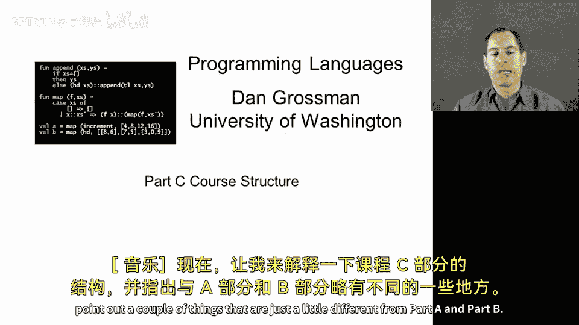
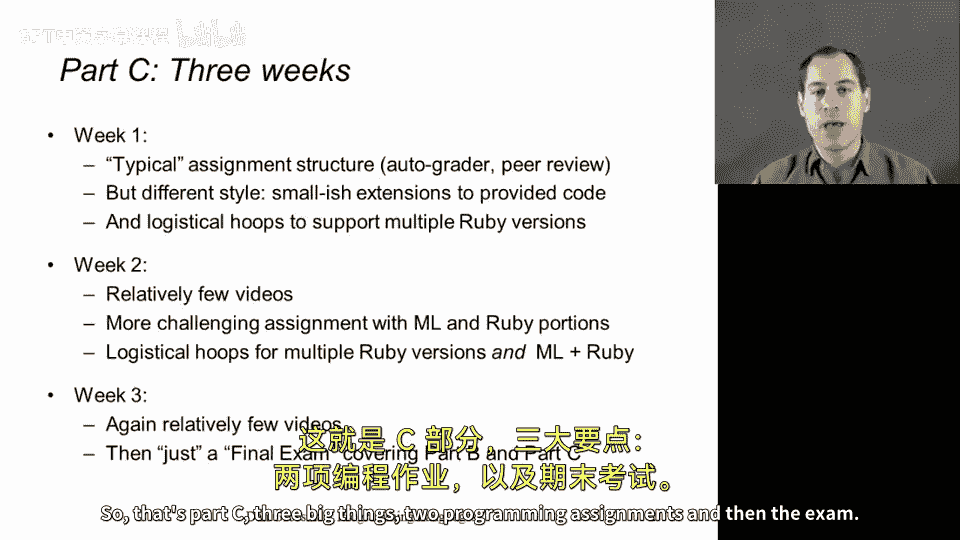

# 编程语言：C部分：课程结构详解 🧭

在本节课中，我们将详细解析C部分的课程结构，并指出它与A、B部分的一些关键差异。

## 概述

C部分课程将持续三周，包含两次编程作业和一次期末考试。整体结构与之前相似，但在作业形式、技术细节和内容侧重上有所不同。

## 第一周：熟悉与适应 🔄

上一节我们介绍了C部分的整体框架，本节中我们来看看第一周的具体安排。

第一周的内容看起来会与你之前经历的类似，因为这是课程的第一周，你需要完成一些软件安装工作。

随后，你将照常观看教学视频，并完成一次包含自动评分和同伴互评环节的编程作业。但有两个差异值得注意：

以下是第一周作业的两个主要特点：
1.  **作业风格截然不同**：我们主要会提供给你几乎所有的代码。本次作业的智力挑战在于理解这些代码，然后在**不改变我们已提供代码**的前提下，通过添加额外代码来修改它。作业说明中会详细解释这一点，但我想提前指出，它的感觉会与之前的作业大不相同，在之前的作业中，你主要是基于少量提供的代码，然后自己编写整个程序。
2.  **Ruby版本支持**：对于Ruby作业，在不同的操作系统上使用不同版本的Ruby，其难易程度相对不同。我们希望支持你使用稍有不同的Ruby版本，这不会影响作业的智力内容。但我们希望自动评分器使用与你相同的版本，以避免出现我们的评分代码与你的代码预期不一致的任何问题。因此，当你提交作业时，会看到版本选择，这可能会带来一点困惑，但希望说明足够清晰，我们可以澄清任何仍然令人困惑的地方。

## 第二周：核心挑战 🧠

了解了第一周的安排后，接下来我们进入第二周。这一周的视频内容会少很多。

我们曾经将第二周和第三周的内容合并，后来在逻辑合理的地方将其一分为二。尽管视频相对较少，我们仍会引入一些非常关键的概念，这些概念将成为一次更具挑战性的家庭作业的重点。

对于那次编程作业，除了第一周就有的多版本Ruby支持外，还有一个不同点：在该作业中，你需要提交**ML代码和Ruby代码**以供自动评分。

该作业背后的理念是，将一些ML代码移植到Ruby，并采用面向对象的风格。因此，你需要提交两个不同的文件进行自动评分。然后，在进行同伴互评时，为了简便起见，我们只对Ruby部分进行互评。当你进行到那一步时，也会看到这些操作细节。

## 第三周：总结与考核 📝

在完成了前两周的学习和作业后，第三周我们将学习剩余的内容。

第三周包含剩余的教学内容，正如我所讨论的，主要是关于子类型化以及比较泛型的子类型化。**本周没有编程作业**，因为第二周的编程作业足以完成相关练习。

然而，在第三周，我们将进行**期末考试**。这次考试不仅涵盖当周的材料，实际上将重点考察B部分和C部分的概念。这两个部分都相对较短，大约各有三周左右的材料。就像我们在A部分结束时有一次考试一样，现在我们将对A部分之后的内容进行另一次考试。和往常一样，当你参加考试时，我会提供所有说明、一份模拟考试以及关于该考试的更多信息。

## 总结

本节课中我们一起学习了C部分“课程结构”的详细安排。

这就是C部分的内容：三件大事，两次编程作业，然后是一次考试。之后，我们就完成了《编程语言》这门课程的学习。