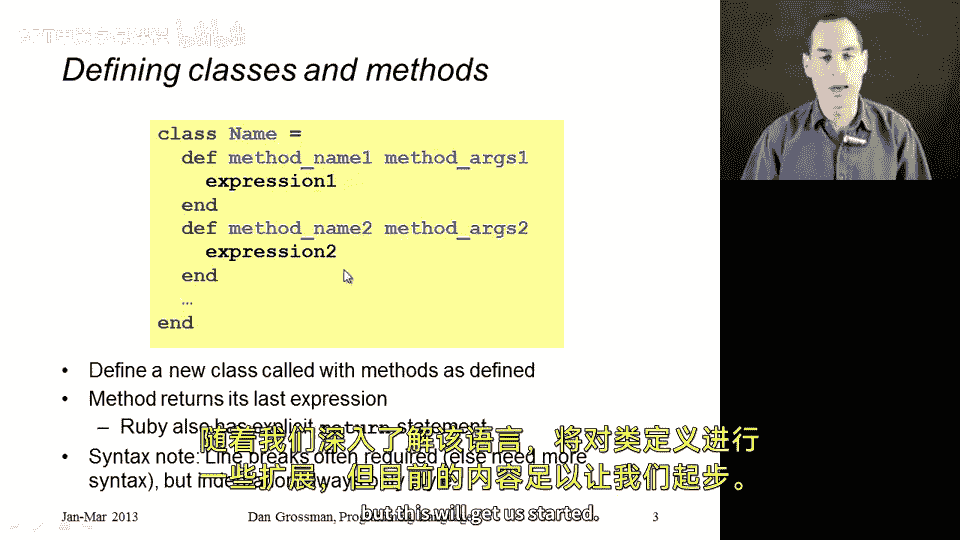
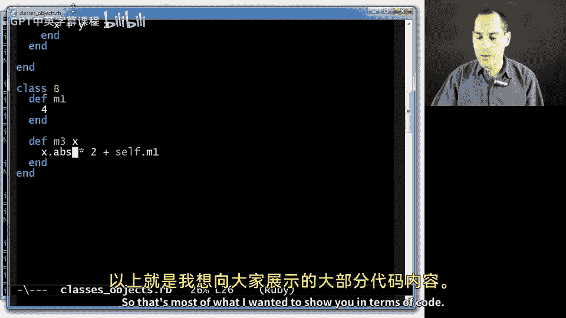
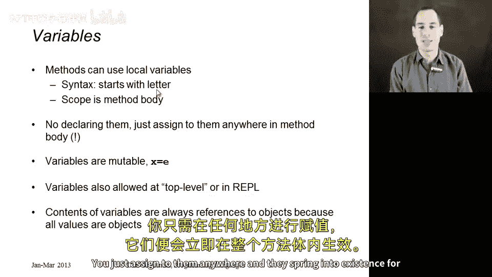
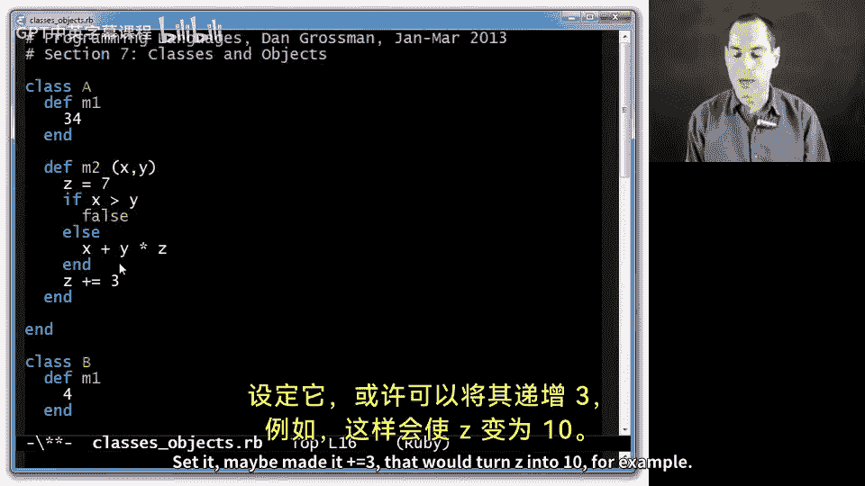
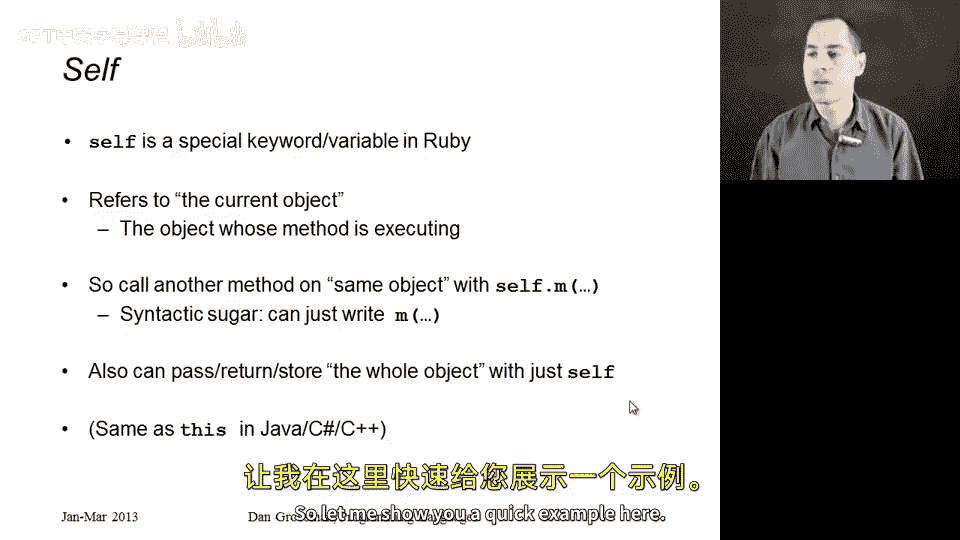
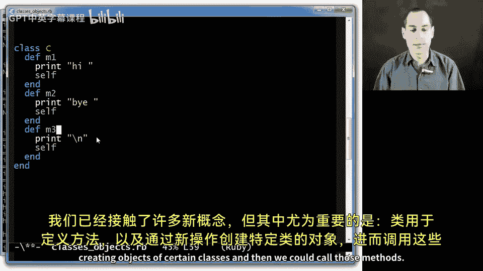

# Ruby编程：第4章：类和对象 🧱

在本节课中，我们将要学习Ruby语言的核心概念：类和对象。理解它们是掌握Ruby的关键。我们将从基本规则开始，然后通过编写代码来展示它们是如何工作的。

## 概述：Ruby的核心规则

Ruby语言遵循几个核心规则。首先，所有值，即任何表达式计算的结果，都是一个指向**对象**的引用。其次，对象之间通过调用**方法**进行通信。方法类似于函数，但属于特定对象。有时我们也说向对象“发送消息”，这与调用其方法是同一回事。

每个对象都拥有自己的私有状态（我们将在下一个视频中详细展示）。此外，每个对象都有一个**类**，类决定了对象的行为。类包含了定义对象方法的重要代码。

如果你接触过其他面向对象编程语言，这些概念可能看起来很相似。但Ruby在这方面更为纯粹：所有东西都是对象，对象只拥有私有状态，而行为则由其类定义。

## 定义类

首先，我们需要学习如何定义类，因为我们将使用类来创建对象。以下是定义类的基本语法：

```ruby
class ClassName
  def method_name
    # 方法体
  end
end
```



关键字 `class` 后跟类名（必须以大写字母开头），然后是方法定义。方法定义以 `def` 开头，后跟方法名和可选的参数列表。

让我们来看一个具体的例子。

## 示例：创建类A

我们创建一个名为 `A` 的类，并为其定义两个方法。

```ruby
class A
  def m1
    34
  end

  def m2(x, y)
    z = 7
    if x > y
      false
    else
      x + y * z
    end
  end
end
```

在 `m1` 方法中，我们直接返回数字 `34`。在 `m2` 方法中，我们定义了一个局部变量 `z`，并使用了条件语句。注意，在Ruby中，换行符有时具有语法意义。在这个 `if-else` 语句中，分支需要放在单独的行上。

现在，我们可以使用这个类来创建对象并调用方法。

```ruby
a = A.new
puts a.m1        # 输出: 34
puts a.m2(3, 4)  # 输出: 31
```

调用 `A.new` 会创建一个属于类 `A` 的新对象。然后，我们可以使用点符号 `.` 来调用该对象的方法。例如，`a.m2(3, 4)` 会执行 `m2` 方法，由于 `3` 不大于 `4`，所以执行 `else` 分支，计算 `3 + 4 * 7`，结果为 `31`。

## 示例：创建类B与理解 `self`

接下来，我们创建另一个类 `B`，并引入一个特殊的关键字：`self`。

```ruby
class B
  def m1
    4
  end

  def m3(x)
    x.abs * 2 + self.m1
  end
end
```

在 `m3` 方法中，我们调用了参数 `x` 的 `abs` 方法（求绝对值），然后乘以2，最后加上 `self.m1` 的结果。

`self` 是一个特殊的关键字，它总是指向**当前正在执行其方法的那个对象**。因此，`self.m1` 意味着调用当前对象自身的 `m1` 方法。

让我们测试一下：

```ruby
b = B.new
puts b.m1        # 输出: 4
puts b.m3(5)     # 输出: 14
```

计算过程：`5.abs` 是 `5`，`5 * 2 = 10`，`self.m1` 返回 `4`，所以 `10 + 4 = 14`。

需要注意的是，类 `B` 的对象没有 `m2` 方法，类 `A` 的对象也没有 `m3` 方法。每个对象的行为完全由其类定义的方法决定。



## 语法细节回顾

上一节我们介绍了类和对象的基本用法，本节我们来回顾并补充一些重要的语法细节。

以下是关于方法调用和变量的关键点：

*   **方法调用**：表达式 `e.m` 会先计算表达式 `e` 得到一个对象，然后调用该对象的 `m` 方法。
*   **参数括号**：对于无参数的方法，括号是可选的（例如 `a.m1` 或 `a.m1()`）。对于带参数的方法，通常需要用括号将参数括起来，并用逗号分隔。虽然有时括号也可省略，但为了清晰，建议始终使用。
*   **局部变量**：方法内部可以定义局部变量（如 `z = 7`）。变量名以小写字母开头。Ruby中的变量不需要预先声明，在赋值时即被创建，其作用域为整个方法体。变量是可变的，它们存储的是对某个对象的引用。

## 方法链与 `self` 的返回值





`self` 不仅可以用来调用方法，其本身作为一个表达式，就代表当前对象。利用这一点，我们可以实现一种称为“方法链”的常见编程风格。

考虑下面的类 `C`：

```ruby
class C
  def m1
    print “hi “
    self
  end

  def m2
    print “bye “
    self
  end

  def m3
    print “\n”
    self
  end
end
```

注意，每个方法在执行打印操作后，最后一行都返回 `self`（即对象自身）。这意味着方法调用后返回的还是同一个对象，因此可以在其基础上继续调用其他方法。

```ruby
c = C.new
c.m1.m2.m3.m1.m1.m3
# 输出:
# hi bye
# hi hi
```



这并非特殊的语言特性，仅仅是利用了方法的返回值。因为 `c.m1` 返回 `c` 自身，所以我们可以紧接着调用 `c.m2`，依此类推。这种链式调用在Ruby中是一种常见且优雅的写法。

## 关于代码格式的说明

在结束本章之前，有两点关于代码格式的说明：

1.  **分号**：Ruby语句之间的分号 `;` 通常是可选的。当表达式位于不同行时，换行符本身就足以分隔它们。如果要将多个表达式放在同一行，则需要用分号分隔。
2.  **缩进**：与某些语言不同，Ruby中的缩进**纯粹是为了代码美观和可读性**，不会影响程序的语义。你可以自由选择缩进风格。

## 总结

本节课中，我们一起学习了Ruby中类和对象的基础知识。

我们了解到，**类**是用于定义对象行为的蓝图，通过 `def` 关键字在其中定义方法。使用 `ClassName.new` 可以创建该类的一个新**对象**。对象通过调用方法（使用 `.` 操作符）来执行操作。

我们认识了特殊关键字 `self`，它代表当前对象，可用于调用对象自身的其他方法（`self.method_name`），并且 `self.` 前缀通常可以省略。我们还看到了如何通过让方法返回 `self` 来实现流畅的**方法链**调用。



记住，在Ruby中，一切皆对象，对象的行为由其类决定。这是理解后续更高级Ruby概念的重要基石。