# 【编程语言 A⧸B⧸C CSE341 Coursera】华盛顿大学—中英字幕 p147 6_04_visibility -BV1bw4m1D7MM_p147-

In this segment I want to talk a little bit more about which parts of a Ruby program can access and use which other parts of a program。

 since that's an essential aspect of any programming language， as we know。

 hiding things is essential for modularity and abstraction that's why we studied， for example。

 the mod system in ML and object ored programming languages generally have various ways to take what Ruby calls instance variables。

 methods， classes， etc ce， and make them available to only part of a program。

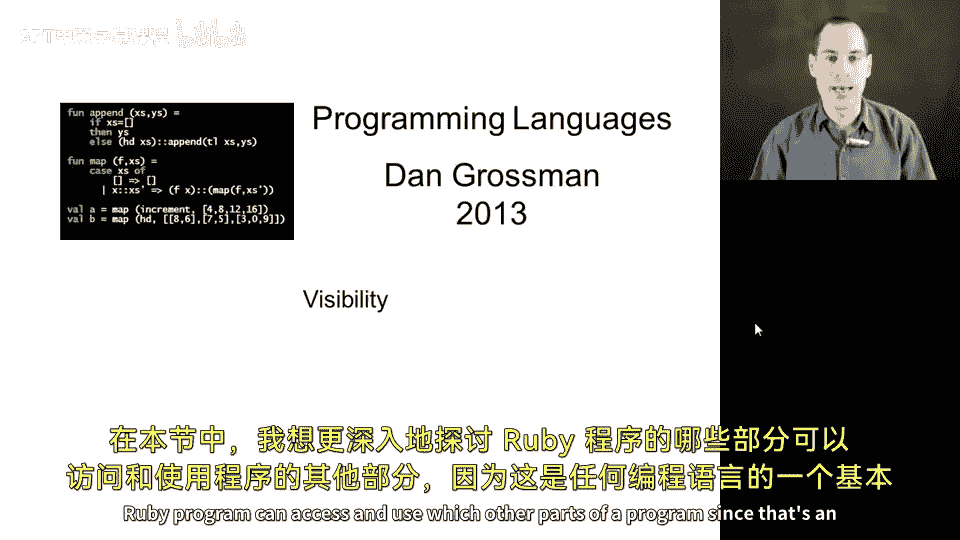

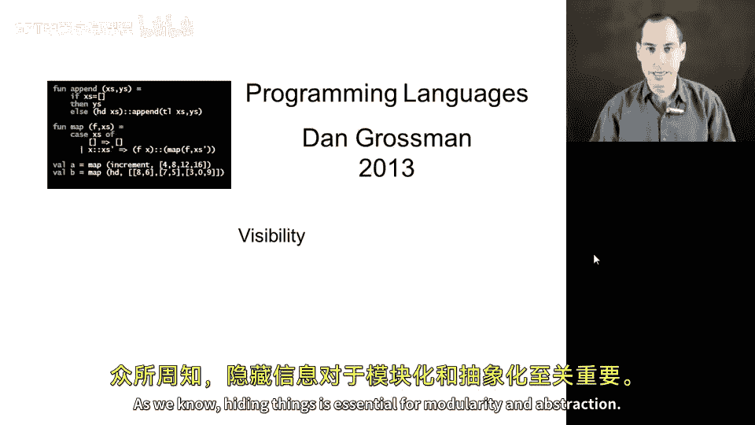

So we can use Ruby as a good example of the sort of decisions that languages tend to make。

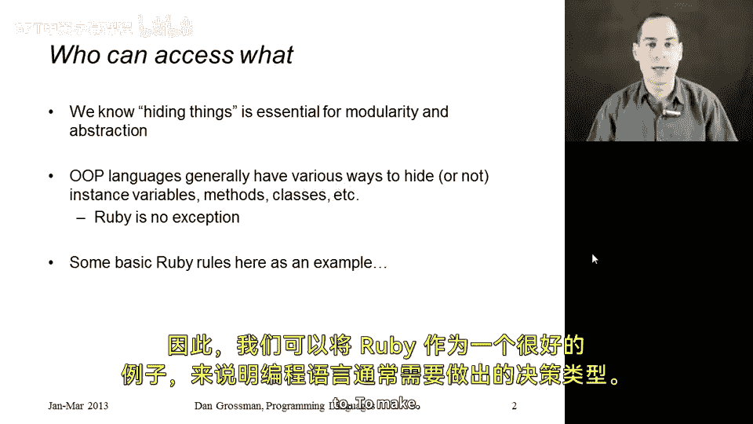

So Ruby does one thing that I actually like quite a lot。

 which it emphasizes that object state is always private。

 so instance variables can only ever be accessed by methods on the actual object that has that instance variable。

 not even another object of the same class。 So as a result when we access or assign to an instance variable。

 we always write atF， we never write E dot at fo because you're not allowed to access at fo for any object other than self and so self dot would be redundant and you're not even allowed to write it。

So to make object state publicly visible， when that is what we want。

 when we want the outside world to know the contents or be able to update the contents of an instance variable。

 then we need to define our own methods to do that and we can do that explicitly and these methods are usually called getter methods when they return the contents of a field and setter methods when they update the contents of the field so in Ruby we could very easily return the contents of the fo instance variable with a method like getF whose expression just looks up the contents and returns it and similarly setF could take some argument X and assign to the instance variable because the method is allowed to access atF and in this way we can provide access via the setF method。

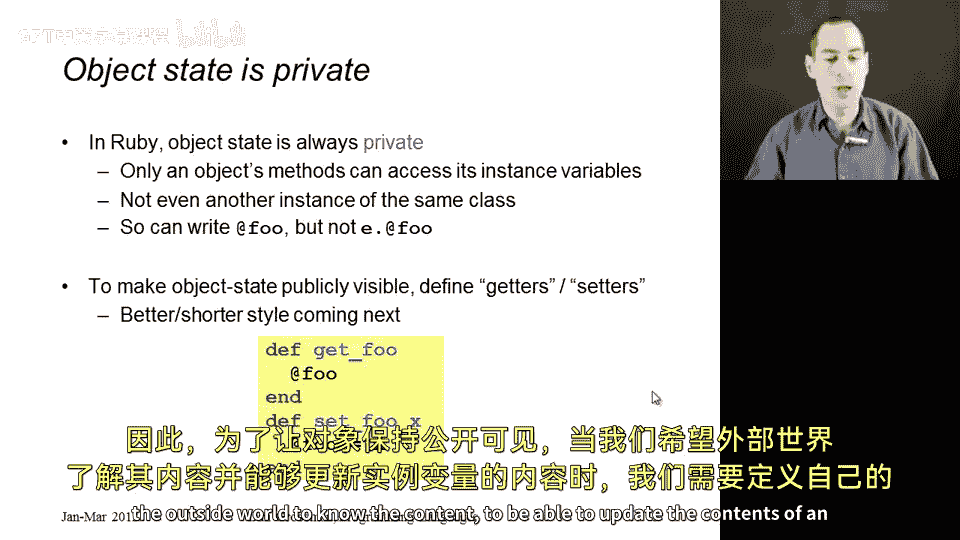

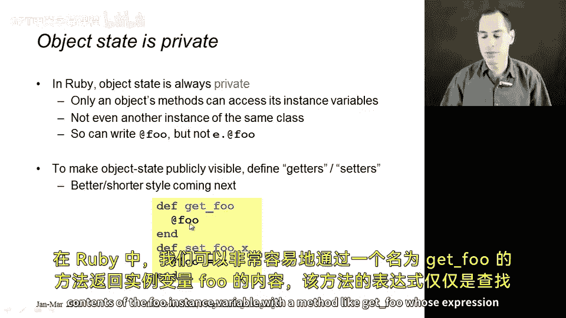

Now that said， this is common enough in Ruby that there's some built- in support for it。

 and furthermore， the conventional names are slightly different than I showed on the previous slide。

 The convention in Ruby is that if you want to getter method for the instance variable at F。

 just call the method fo， and if you want a set method call it fo equals。

 it turns out in Ruby you're allowed to have a method end with the equals character and that's the convention for a setter method。

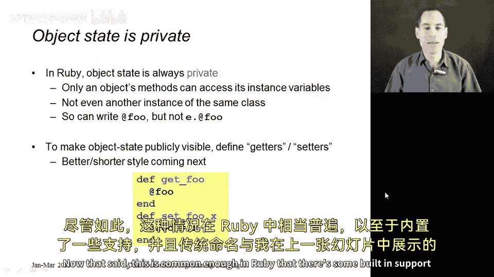

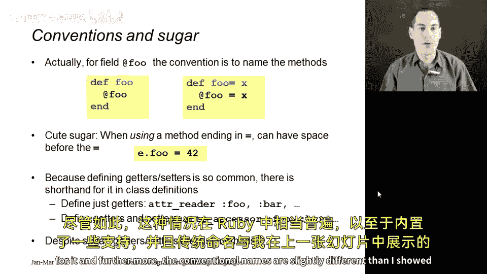

This convention actually goes one step further。 There's a cute piece of syntactic sugar in Ruby。

 which is if you do have a method that ends in equals。 when you write a call to that method。

 you're allowed to have white space space characters between the nonequals character and the equal。

 So it turns out in Ruby， you can write E dot fo space equals some expression。

 And that's the exact same thing as fo without the space。

 It is literally a method call to the fo equals method。 Nothing more。

 It just makes using setters look nicer。😊，Furthermore。

 people felt that writing getters and setters like this was three lines long and that was just too long so there are other ways you can accomplish the same thing in Ruby if you want getter methods fo and bar for instance variables at fo and at bar you can just write adder underscore reader short for attribute reader colonfoa separated and then the names of all the methods proceeded with colons that you want getter methods for and I'm not going to explain what the colons mean and why this is the exact syntax but you're welcome to use this shorter form and if you want getters and setters。

 you just say adder underscore accessor and if you said colon fo that would define both the method foo and the method fo equal but these are just shorthand versions all we are doing are defining getter and setter methods for accessing the instance variables in a way that makes them truly private to the object and it's only the methods that are giving the outside world in indirect。

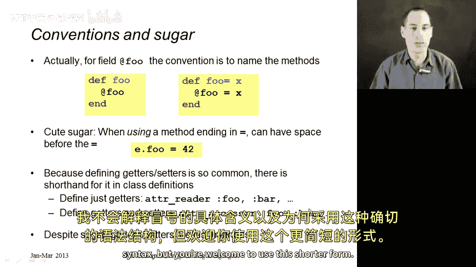

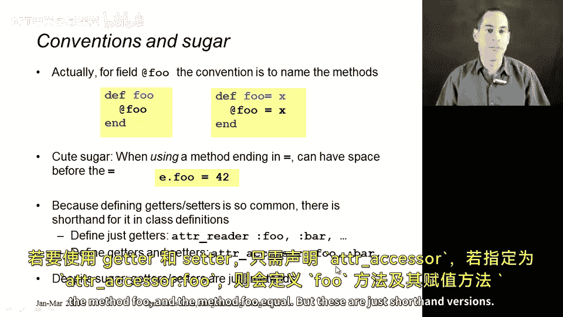

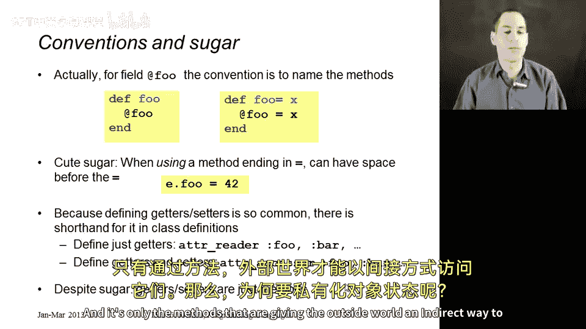

Way to access them。So why private object state， Well。

 it turns out most people would agree that requiring these instance variables to be private to just the object makes the language more in an objectoriented programming style。

 that it lets you focus on the interface to an object。

 what methods you can call without knowing how the object is actually represented。Why is that good。

 it's for all of our normal abstraction and modularity reasons that way later the class implementation could change and clients are not messed up by there being different instance variables or different implementations of the same methods。

In fact， it hides from clients how the actual instance variables are storing the data。

 I have a cute example here on the slide where maybe I give clients a method Celsius tempemp equal。

 which they would probably assume was a set method for an instance variable， Celsius temp。

 but maybe internally the class finds it much easier to store temperatures in Kelvin。

 and it simply implements this set method by writing to a Kelvin temperature instance variable in appropriately shifted value。

😡，In fact， you can do this for different classes that represent internal state in entirely different ways。

 and this is related to the idea ofduct typing that we'll talk about in a slightly future segment。

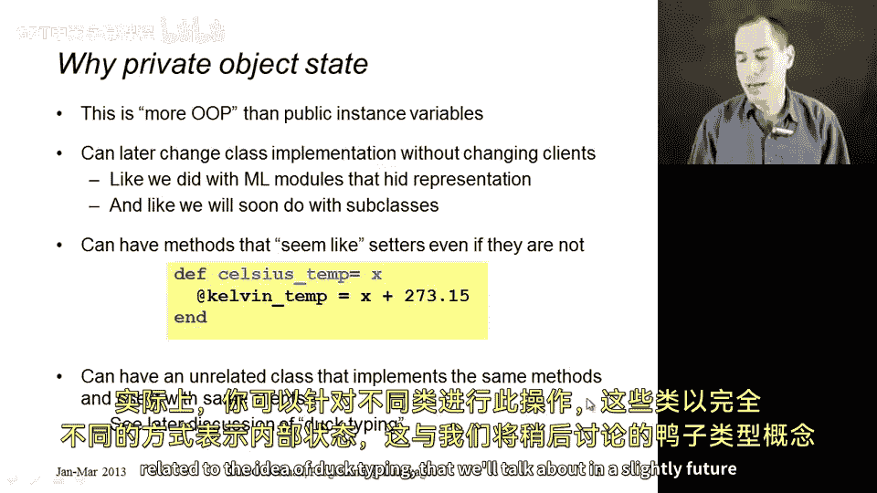

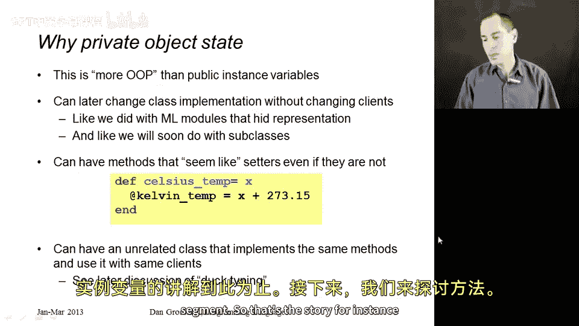

So that's the story for instance variables now let's talk about methods。

 so it turns out Ruby has three different viibilities。

 three different rules that it can apply to methods。

 and you can choose for each method which one you want。

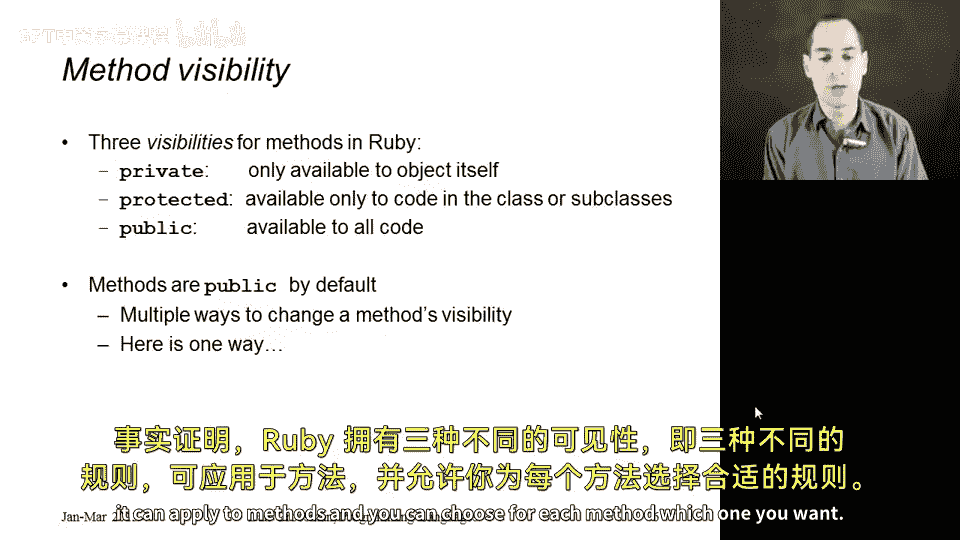

So you can have private methods， which just like private instance variables。

 can only be used by other methods of the same object。You can have protected。

Which cannot be used by just anyone。 A protected method can only be used by objects of the same class or any subclasses。

 And we still have to discuss subclasses。 So it doesn't have to be the object itself。

 but it does have to be the same class or a subclass。

 and then there's public and a public method can be called by anyone who has access to the object。

 If you have the object。 It has a public method M。 you can call M on it。

So the default for methods is public， and that makes some sense the entire purpose of an object is the call methods on it。

 but there are various ways， there's always various ways in Ruby。

 various ways to change the visibility of an object。

 let me just show you one way here on this next slide。

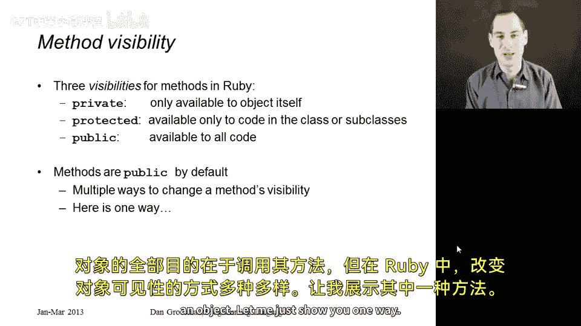

So when you define some class food and you're gonna have a bunch of method definitions， the default。

 as I mentioned， is public。 So when you start defining methods， all those methods will be public。

 but in your class definition you can use the keyword protected and once you write that word in between methods。

 then all the following methods will have the protected visibility instead of public。 and similarly。

 you could then switch back to public so it's a keyword as well。

 and then that would make these the method definitions after this public be public and there's a keyword private。

 So basically what you do is when you have a method definition to figure out its visibility you find the most recent use of protected public or private and that's what it is and at the beginning of the class it's like there's an implicit public to get things started。

So that's really the entire story on method visibility to the extent I want to get into it。

 there is one detail， which is four private methods。

 it turns out since the only methods that are going to be able to call that method are methods on the same object。

 you can always just write M or M of AGs， because as we know that shorthand for self。m。

 that's a short way of writing a method call on the same object。

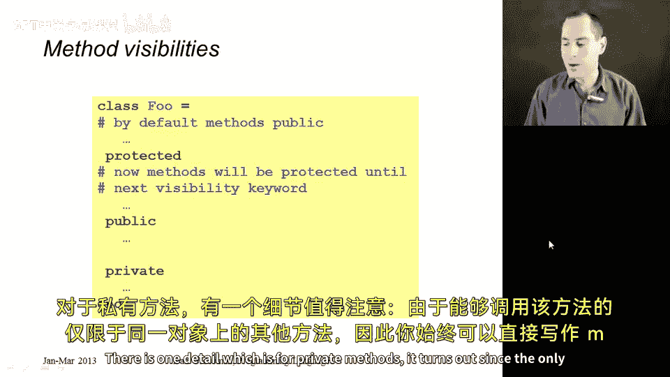

But for private methods， that's the only call that is allowed。

 And so Ruby actually forces you to use the shorthand。

 Any other object here would not be allowed by in the visibility rules。

 You would think it would allow self dot just because you wanted to remind yourself that it was a call in the same object。

 but in fact， Ruby does not allow it even syntactically。

 you cannot write the self dot on a private method。

 you just have to call the method with the short form that does not indicate which object you're calling the method on。

 and that's everything we need to know about method visibility in Ruby。

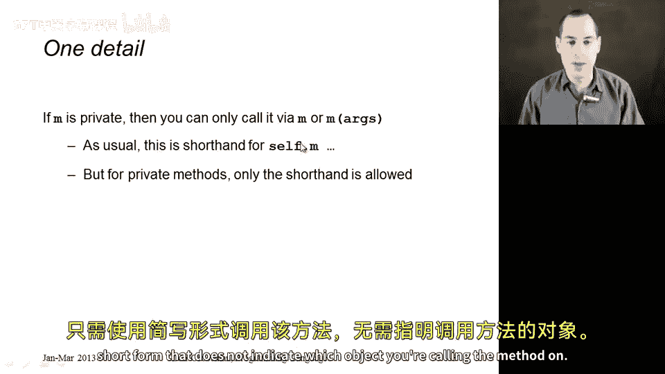