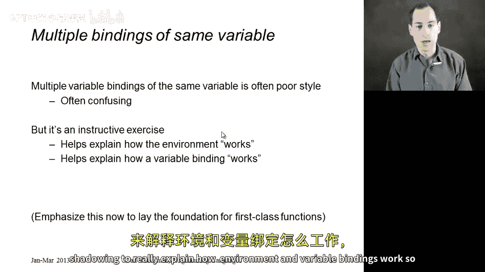
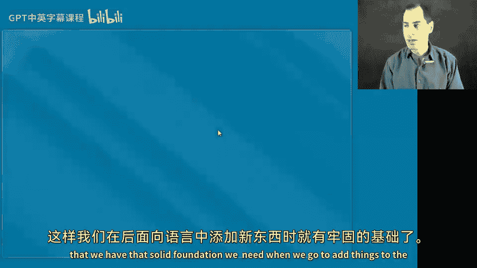
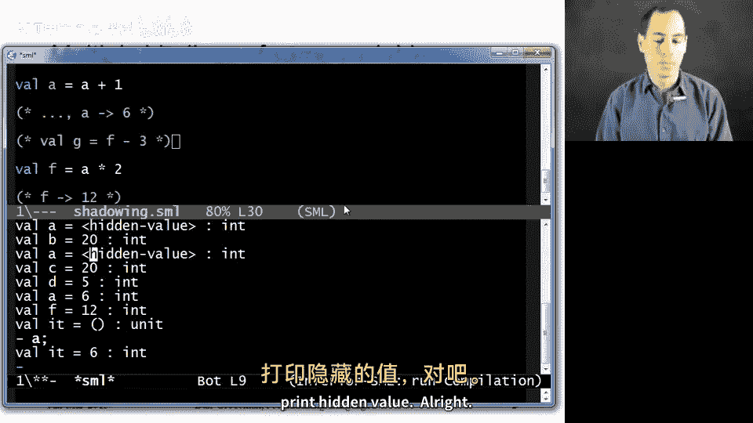
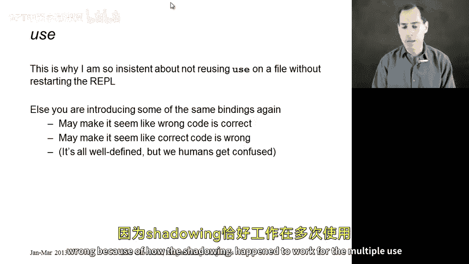

# 编程语言 A/B/C CSE341：15：变量遮蔽

在本节课中，我们将要学习变量遮蔽的概念。变量遮蔽是指在一个环境中添加一个变量，而该变量在添加之前已经存在于该环境中。我们将通过这个概念来深入理解环境和变量绑定的工作原理，为后续学习更复杂的语言特性打下坚实基础。

## 概述

变量遮蔽是理解静态作用域和变量生命周期的重要概念。它不涉及新的语法或求值规则，而是帮助我们巩固对现有规则的理解。通过分析遮蔽现象，我们可以清晰地看到变量绑定如何在不同环境中被创建和覆盖。

## 变量遮蔽的基本原理





上一节我们介绍了环境和绑定的基本概念，本节中我们来看看当同一个变量名被多次绑定时会发生什么。

首先，我们在环境中添加一个绑定 `a = 10`。此时，在静态环境中，`a` 的类型是 `int`；在动态环境中，`a` 被绑定到值 `10`。

```ml
val a = 10
```

如果我们在文件中继续写下 `val b = a * 2`，那么 `b` 的值将是 `20`。

```ml
val b = a * 2 (* b 的值为 20 *)
```

## 遮蔽的发生

现在，有趣的事情发生了。如果我们写下 `val a = 5`。

```ml
val a = 5
```

需要重点强调的是，`b` 仍然被绑定到 `20`。实际上，如果我接下来写下 `val c = b`，即使在此刻的环境中 `a` 映射到 `5` 且 `b` 映射到 `20`，我们最终会得到一个环境，其中 `a` 映射到 `5`，`b` 映射到 `20`，`c` 也映射到 `20`。这是因为我们求值表达式 `b` 时，会在动态环境中查找它并得到 `20`，然后扩展动态环境，使 `c` 映射到这个结果。

`b` 之前是通过求值 `a * 2` 创建的，但这已不再相关。那是在 `a` 映射到 `10` 的环境中发生的，我们得到了 `20`，然后扩展了环境，使得 `a` 映射到 `10` 且 `b` 映射到 `20`，故事到此为止。`a * 2` 这个事实已不再相关。

同样需要强调的是，`val a = 5` 不是一个赋值语句。在 ML 中，绝对没有办法改变或突变之前环境中 `a` 映射到 `10` 的事实。我们得到的是在后续环境中，`a` 现在被遮蔽了。我们在一个不同的环境中有了一个对 `a` 的不同映射，现在 `a` 是 `5`。

## 更多示例

让我们做更多示例来确保理解。如果我现在说 `val d = a`，我最终会得到一个包含我之前所有绑定的环境，并且现在 `d` 映射到 `5`，因为在此刻的环境中 `a` 映射到 `5`。

```ml
val d = a (* d 的值为 5 *)
```

如果我现在说 `val a = a + 1` 呢？再次强调，这不是赋值。变量绑定的工作方式是，我们在当前的动态环境中求值表达式。所以 `a` 映射到 `5`，我们加 `1` 得到 `6`，然后我们创建一个新的动态环境，其中 `a` 映射到 `6`，同时包含我们之前拥有的一切。但现在我们遮蔽了 `a` 映射到 `5` 的较早环境，以及 `a` 映射到 `10` 的更早环境。

```ml
val a = a + 1 (* 新的 a 值为 6 *)
```



确实，如果我们现在说 `val f = a * 2`，`f` 将映射到 `12`。

```ml
val f = a * 2 (* f 的值为 12 *)
```

## 无法进行前向引用

同样需要强调的是，你不能做的一件事是前向引用，原因相同。所以如果我这里有这段代码，它将无法通过类型检查。原因是当我必须去检查表达式 `f - 3` 时，`f` 还不在环境中。所以当我在静态环境中查找它时，它不在那里，我会得到一个类型错误信息。

```ml
(* 错误示例：前向引用 *)
val f = f - 3 (* 类型检查错误：f 未定义 *)
```

## 交互环境中的注意事项

这也是为什么我坚持要求你不要对同一个文件多次使用 `use` 命令的原因。因为如果你对同一个文件多次使用 `use`，你将重复该文件第一次使用 `use` 时存在的所有绑定，并且这些绑定在你第二次对文件使用 `use` 时仍然存在。虽然在 ML 中允许这种遮蔽和重新引入绑定，但这可能会非常令人困惑。也许你删除了一个绑定，但由于之前的 `use` 它仍然存在；或者也许你有一些奇怪的遮蔽，使得你的代码看起来是正确的，而实际上由于多次 `use` 语句导致的遮蔽工作方式，它是错误的。

## 总结

本节课中我们一起学习了变量遮蔽。我们了解到，变量遮蔽是向已包含某变量的环境中再次添加同名绑定的行为。关键点在于：
1.  **`val` 绑定不是赋值**，它创建新的绑定并可能遮蔽旧的，但绝不改变旧的绑定。
2.  表达式的求值**总是基于当前的动态环境**。
3.  被遮蔽的变量在其作用域内**不再可访问**。
4.  **前向引用**是不允许的，因为绑定在定义后才进入环境。
5.  在交互环境中，应避免对同一文件多次使用 `use`，以防止由意外遮蔽引起的混淆。



理解遮蔽对于掌握静态作用域和构建对程序状态变化的准确心智模型至关重要。