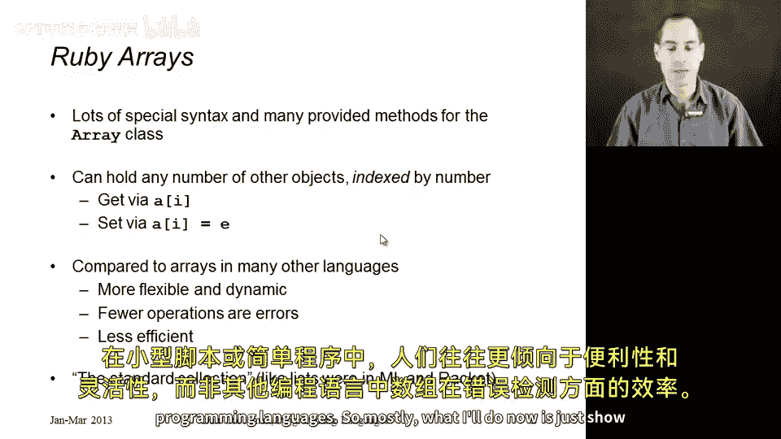
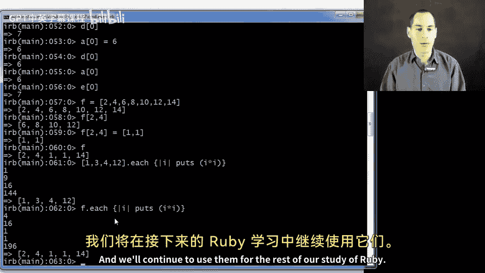

# 【编程语言 A⧸B⧸C CSE341 Coursera】华盛顿大学—中英字幕 p152 11_09_arrays -BV1bw4m1D7MM_p152-

Let's now discuss arrays， these are the most common data structure in Ruby programs so we can't do too much more Ruby programming without them。

 and as we'll see in the next segment， they're also an excellent vehicle foresee seeing how Ruby supports higher order programming and functional programming styles。

So there's lots of special syntax and many provided methods for the array class。

 you'll probably want to consult the documentation to find things that you're interested in。

 We'll just scratch the surface here and show you some of the possibilities。

 What an array is is basically something that holds any number of other objects and is indexed by some number。

 So you can get the third element or the fifth element or the zeroth element and there's special syntax to get the Ih element where a is some array object。

 you write I in brackets after the a that just sends the message to a that you want the Ih element and you can set the I element with the corresponding set method where you write a bracket I equals E Now arrays are common in many programming languages。

 This is the common syntax for them， but compared to other languages。

 Ruby's arrays are much more flexible and dynamic。 they let you do almost anything almost nothing you can do with an array is actually an error they just come up with。

Some sensible thing to do。 and as a result， arrays can be used for almost anything in Ruby。

 any kind of data structure， even though they might not be the most efficient thing。

 often in small scripts or simple programs， people prefer the convenience and flexibility over the sort of efficiency and error detection of arrays and other programming languages。

 So mostly what I'll do now is just show you a whole bunch of examples using IRb so that we get the hang of it。

 So first of all， you can make an array with just comma separated values inside of brackets。

 So a is now a variable that holds the array with four elements where the second element is7 and the zeroth element is3 like in most programming languages。

 arrays start counting their index positions from zero。 So if you say a sub4。

 that's not actually in the array in many languages， you get an array bounds error for this。

 but Ruby just gives you back the nil object and the same would happen if we as for the thousandth element of the array。

If you ask for the size of the array you get the number of elements currently in it that is4 let's see you would probably think that-1 would return nil since that's clearly outside the bounds of the array。

 but now Ruby interprets negative indices of just counting from the current end of the array。

 so I minus-1 will return 9 and I minus-2 will return 7 whereas I minus-4 will return 3 and I-5 will return nil and so on。

So we can also update array elements。 So if we say a sub1 equals 6。 now if we print out the array。

 we see that indeed6 is in the first index position。

 What if you assign to something outside the bound。 Surely this is an error right， Nope。

 it's happy to assign to that and what's even stranger is we now have a fourth an index4 and an index 5。

 you'll see that it filled in enough array entries with nil objects in order to make room for that 14。

 we added to the sixth position。 So if I assign to the 100th position。

 I would now have an array with 10001 entries in it。 so indeed， if you now ask a dot size。

 you see that the length， the size is now7。We're in a dynamically typed language so we can put absolutely anything in this array。

 how about putting a string in AC sub3， we could put an instance of any class。

 any kind of object into our array， and that will work just fine。As I mentioned。

 there's lots of operations and methods defined on arrays。

 We've even defined some of the arithmetic operators on arrays in ways that you might imagine is reasonable。

 So for example， if I take an array like a and I add to it。

 another array that just dependss things onto to the end so B is in fact now this let's see I guess nine element array which is different than a which is still this seventh element array。

 I can't possibly show you everything you can do with arrays。

 but here's one that I discovered which is kind of nice。

 the pipe operator takes two arrays and returns an array containing the elements of either like plus but it removes any duplicates。

 so in fact， you get back in array here that just has three elements，3，2， and1。

 because any other elements would be duplicated in the result。Okay。

 so that kind of shows you the flexibility of arrays。 Now。

 let's see how we can use them for all sorts of things。 So given that arrays are so flexible。

 there's no reason for separate tuples in Ruby。 Let's if you want to topple， just use an array right。

 So here's a three element tuple that。You know， is false the string high and 7。

 and you can get the last thing out of it with triple bracket2。 So this is a perfectly good tuple。

 So why would you do anything else？ But more than that。

 arrays also can have sizes that are growing or shrinking or chosen dynamically。

 So let me show you a different way to make an array not on this line。

 but on the next one here I just want to emphasize that we could have some number x that could be computed at runtime。

 So x is 20 from some arbitrary computation。 and then you can say array dot new of x。 right。

 and you get an array of length 20。 Now， if you wanted to initialize the elements。

 you can do that with blocks。 this is the subject of the next segment。

 but here's a different version that's also an array of 20 elements， but they're all initialized to0。

 or you can even make different elements initialize to different things。

 Here's a 20 element array of0-1 minus-2 up to。Or I guess down to-19。So arrays can be tuples。

 they can be things of arbitrary size。 What else could they be Well it turns out they make perfectly good stacks。

 So a stack is something with operations push and pop where things are pop in last in first out order。

 These are ubiquitous in computer science。 We saw call stacks earlier in the course。

 So if we just take our old array a here。 It turns out that all arrays have a method push。

 which pushes which adds an element to the right side。

 So you'll see I just pushed5 onto the right there。 I could push 7， and now if I pop。

 I get a7 back and array no longer a no longer has that7， I could pop again and I would get a5。

 I could pop again， I would get a 14， and now my array is shorter。

 So I'm essentially using an array as a stack and ruby's arrays are so flexible。

 why would you define your own stacks when you can just use these push and pop methods。

So if we can do stacks， can we use Qs， So a queue is like a stack except instead of things coming off in the reverse order that they were put on。

 they are taken off in the same order they were put on。

 So it is like queuing up the person who gets in line first gets served first and a properly functioning Q。

 So I still have this a， I could push 11 that will put things on the right。

 the way to pull something off the left off the beginning is the shift operator。

 it's called shift because when I say a dot shift like pop。

 I get one of the array elements back here a3。 but everything's been shifted over and indeed now a sub0 is not three anymore。

 it's 6 and a sub1 is7。 And if I shift again， then a sub1 is the string high。

So if I use a combination of push and shift， I have a cubee。

I could also put things on the front of the line。 So if you want to skip ahead to the front of the line。

 you can unshift with 19。 And now my array， indeed has a 19 on the front。 And if I do a shift。

 I get the 19 out。 So arrays support all of these things。

So now that we've seen that they're that flexible， you can put things on the front on the back。

 you can slice them， you can dice them， you can grow them， you can shrink them。

 Let's talk about aliasing。 So arrays are objects。 So our previous discussion of aliasing still applies。

 if I say something like D equals a then D is this array and a is this array and as we'll see in just a second。

 they are aliases。 But if I did something like E equals a plus。This empty array。

 Well the plus operation always returns a new array。 So E has all the same contents。

 but E is not alias with A And D。 So let me show that to you。 All right， So D bracket 0 is 7。

 All right， If I now assign into a sub0，6。 then D sub 0 is now 6。 A sub 0 is now 6。 but E sub0 is 7。

 So that's our aliasing story。 Always nice to have a short example to show what is an alias and what is not。

😊，Let me just show you a few more things to wrap things up， there's tons more to learn about arrays。

 Let me show you one more array about 2，4，6，8， 10，1214。

So it turns out what if you wanted part of this array。 So there's these things called array slices。

 So you could say I want elements 2 through 4， and you would get back a new array with 6，8，10 and 12。

Which is， let's see， elements，2，3，4。 I'm surprised that oh， it I see。 it starts at element 2。

 and it gives me four elements。 So that's fine。 Here is something a little stranger。

 You can actually assign this way。 when you assign in。

 you don't have to put the same number of elements。So， after I do this。F is shorter。 I replace 6，8。

10 and 12 with  one and one， showing yet again that arrays are this very flexible data structure。

 They're really an arbitrary mapping from numeric indices to values。

 And that's how you have to think of them。😊，Finally。

The most common thing to do with a collection of data is to do something to all of them。

 map over them， do a reduce over them， see if something's true of any of them。

 and that's really what the next segment is about， but to give you a little precursor that you really can do things with arrays。

 here's a little array with four elements。😡，And I could say to each of them。Let's print i times I。

 and I have to explain the next segment what this means， but there did actually print all of them。

 and of course， I could do that with any array， for example， F。

So that's your flexibility over arrays， you'll have to consult the documentation to find more methods in general。

If you can think of a general method over arrays that probably lots of people would want。

 not just you， it's probably already defined find in the library and it's a good idea to look it up。

 other than that， remember that arrays can be good for Ts， lists， stacks， cues。

 and what are called arrays and other programming languages and we'll continue to use them for the rest of our study of Ruby。

😡。

