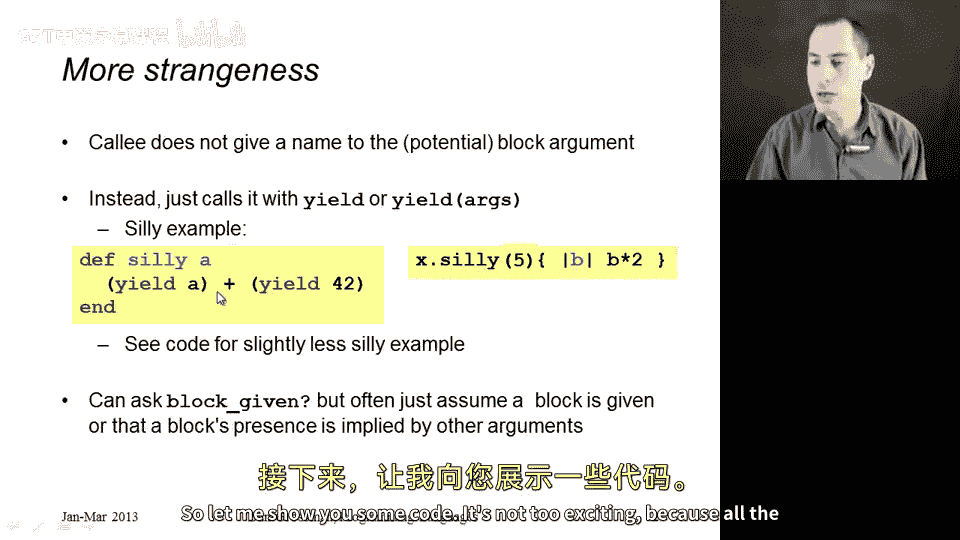
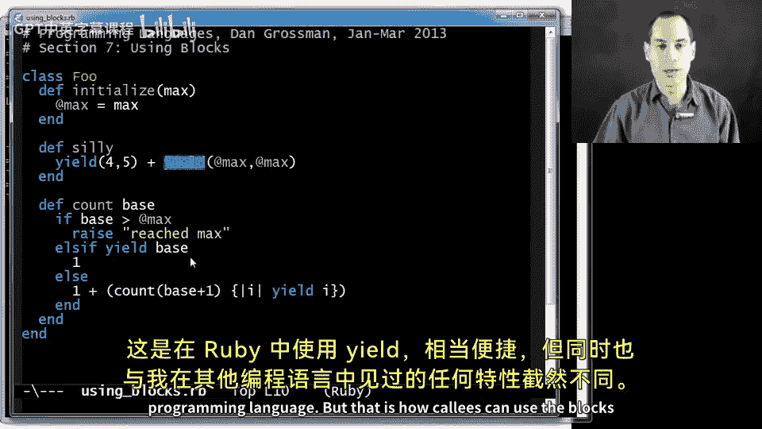

# 【编程语言 A⧸B⧸C CSE341 Coursera】华盛顿大学—中英字幕 p154 13_11_using-blocks -BV1bw4m1D7MM_p154-

Usually in Ruby， we use blocks， just like we saw in the previous segment。

 you have some method defined in the standard library that takes a block。 You pass a block。

 you get all the benefits of functional programming。

 but there's nothing special about things built into the standard library。

 We can define our own methods that use blocks that callers give to us。

 So this is also a little bit strange in how it works。 Remember， when callers send a block。

 They just put it next to the other arguments， they can send0 or they can send one and it's treated differently than all the other arguments。

 It's strange on the callee side as well。 The callee does not have a name for that extra block argument。

 It's just either is there or it's not。 And to call it， you use the Ruby keyword yield。

 yield in terms of let the block that presumably is there。 Now run。If you want to pass it arguments。

 then you pass them with the yield keyword。 So there is no name for the block other than yield。

 So here's an example on the left。 You could define a method silly。

 it takes in one argument A But then if you look at its body。

 you'll see that it is also assuming that it is given a block。

 and it is calling that block both with the argument a and with the argument 42 and then adding the results together。

 So that's the definition of the method， we could call it with something like you see on the right。

 if x were an instance of the class that had the silly method。 we could pass it 5 for a。

 and then this block， and it would end up returning， I think，94 or something。

 if you do your arithmetic correctly。 and I'll show you another silly example like this over an emax and then a slightly less silly example。

 and this is how you use blocks。 noticeice in such a case。

 if some caller does not pass a block will get an error when we try to call yield。

What if they pass a block that expects a different number of arguments well there we don't get an error。

 it just either passes too many arguments or too few and the block kind of does the corresponding right thing and I'll try to show you that。

But that is how you use blocks。 Now there is one other primitive that is useful if your method wants to do different things whether or not it is given a block。

 have some sort of default behavior if no block is given like the all question mark in any question mark methods we saw for a。

 then there's a primitive block given question mark that as you might imagine evaluates to true。

 if there is a block that was passed by the caller and false if otherwise。

 but we often just assume a block is given like in the silly method above。

 or at least assume based on other information we have such as the contents of the regular arguments that we were given。

So let me show you some code， It's not too exciting because all the examples I could think of were you actually want blocks。

 we would just be reimplementing things defined in the standard library。

 but here's a little classF that when you create an object， it sets some max field。

 some max instance variable and then what you do， this is the interesting method here。

 I'll show you sillyian in just a second is when you call the count method with some number presumably base if base is greater than max。

 that's an error。

Otherwise， count also assumes rather implicitly that it takes a block。😡，And if that block。

Returns true when past base， then we will return one。Otherwise。

 I want to add one to recurring on count of base plus one and essentially with the same block。

 So what count is doing is it's starting at base and it's counting how many times you have to go from base to base plus1 to base plus 2 to base plus3 before yielding with that value returns true。

 So it's counting how many steps you have to go before you get it true and it's stopping when you get to max。

Now， the one thing that's strange here is in this recursive call。

 somehow I just want to pass the same block I was given。There's no way to do that。

 but you can do it in what looks to me a lot like unnecessary function wrapping。

 except it's necessary here。 What I can do is I can pass to the call lead。

 to the recursive call a block that when called will'll call the block that I was given。

 which is how I yield， and I just pass along the same argument。So that is how count works。

 Sly is a little bit more like the silly example I showed you on the slide。 It just takes a block。

 presumably passes it two arguments 4 and 5， and then calls it again passing the instance variable max in both cases。

 So let me show you a quick couple of examples and then we'll declare success here。

 So let's load that file。 So using blocks do RB。 Allright。

 And now let's just create an instance of that class with a nice big max like 1000。 Allright。

 And now if I call the silly method， I need to pass it a block。 if I don't。😊。

I get an error message when it tries to yield and I get an error message say no block given。 So。

 allright， let's give it a block， A comma B and about two times a minus B。 And I'll get back 10003。

 And the reason why two times a minus B， let me just show you， if you pass it in 4 and 5。

 that's going to give you 3。 And if you pass in 100 and 100， that's going to give you 1000。

 when you add them together， you get 10003。And now let's try this count method remember。

 so the idea is to start at some base like 10 and keep going and count how many times you have to try this block。

 starting at 10 then 11 then 12 and 13 until you get something true。 So this little equality here。

 I'm going to have to start at 10 and go up to and including 34 before I get true。

 And so that will have to take 25 times。 So it's a little example where you can think of this block as a callback that's going to get called with 10 then 11 then 12 and 13。

 and it works exactly as we expected。 So there you go， that is using yield in Ruby。

 which is fairly convenient， but also unlike anything I've ever seen in another programming language。

 but that is how call can use the blocks that callers pass。

