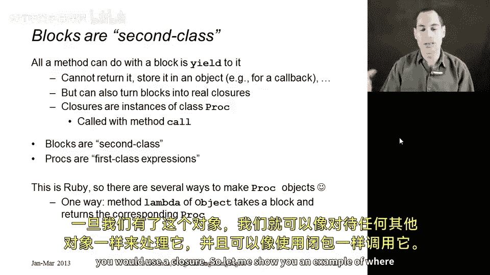
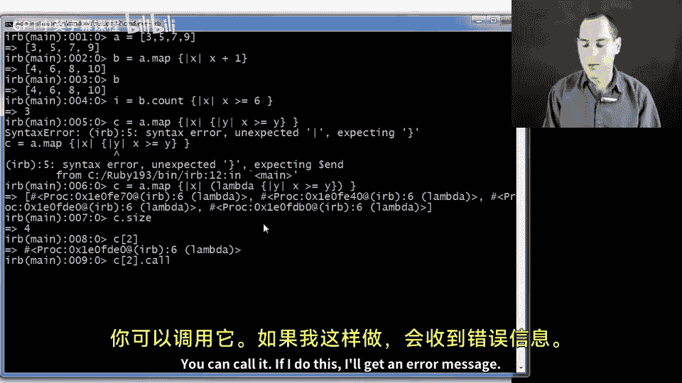
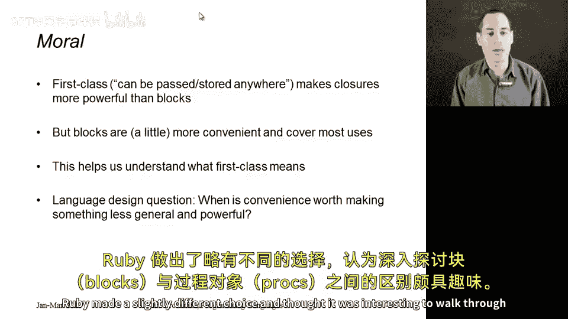

# 【编程语言 A⧸B⧸C CSE341 Coursera】华盛顿大学—中英字幕 p155 14_12_procs -BV1bw4m1D7MM_p155-

In this segment I want to show you procs， which are a lot like blocks。

 except procs are actual objects and have all the power of function closures。

 and I want to do this to demonstrate an example of what it means to be a first class expression in a programming language。

So let's go back to talking about blocks with a be as an boy and remind you that they are different。

 They are not objects， almost everything in Ruby is an object。

 but blocks are not because the only thing you can do with a block that you are given when someone calls some method you're defining is yield to it。

 you can yield to it to call it as many times as you want， but you cannot return it。

 you cannot store it in an object， you cannot put it in an array or anything like that。

Now there is a way to turn blocks into objects and that's what I'm going to show you in this segment。

 but what that does is it creates an instance of a class called Proc with a Pas and Peter。

And then that object has a method call that you use to essentially invoke the code and call the closure。

So in a programming language， we say something as a first class expression when it can be the result of a computation。

 it can be returned by a function or method， it can be stored in an object and can be passed around just like numbers and objects in anything else we have in our language and if you cannot do that。

 then we say it's a second class expression So in Ruby， blocks are second class。

 they're not really expressions， you can't put them where you put expressions。

 but instances of the proc class are first class。So that's the distinction and now I just need to show you how to make these proc objects and this being Ruby。

 it turns out there are several different ways， I'll just show you one。

 and that is that there is a function in the object class， so it's available everywhere。

 it's actually part of every class's definition and believe it or not the name of this method is Lambda。

Lambda takes a block， we give it a block just like we could pass a block to any other method like each or map or times。

 and it returns an instance of Proc， and it does it via one of the other ways that you can make instances of proc in the language that you can learn about on your own if you're curious。

So once we have that， then we have this object that we can treat absolutely as any other object and then call it just like we would use a closure。

 so let me show you an example of where that is a little useful and let me start by showing you why you don't usually need this so suppose I had something like an array 35。

79 if what I wanted to do was map across that array。

 some computation like add one to every element I would just do that with a block。

I don't need a first class expression to do that。 That's how blocks work very well in Ruby。

 And so I would just get back an array B that's 4，6，8，10。 And if I wanted to then count。

 this is a method I don't believe I've shown you before。

 this takes a block and counts how many times when it's called on all the elements in the array。

 it returns true。 So if I say how many times is x greaterd and equal to 6 on the array B。

 then I get 3 because it's true for 6 and 8 and 10。 and it's not true for4。

 And I don't need any first class functions for any of this。

But suppose I wanted to create an array of closures。So what I want to do。

 but it's not going to work is to create a third array， C。That contains。

 So I want to map across of it。 But then what I want to put in each array position is a closure is a block。

 And this is what doesn't work that says x greater than equal to y。

 So what I want to do is I want an array where the Ih position is a little function。😊。

That takes in an argument Y and returns true if what was in a at that position is greater than or equal to the argument past it。

And this just won't work。 I'm just going to get a syntax error here because blocks can't do this。

 You can't put a block here。 We need an expression， but I told you how to turn blocks into objects。

 You can just write Lambda。 This is just a method call。

 And so I'll put unnecessary parentheses in here。 The result of this method called is an object。

And so now C is an array。 It has a size， It has four elements。

 and each element is an instance of the proc class。 and the repple is printing it in this funny way。

 So once you have an instance of the proc class， what can you do with it。

 You can call it if I do this， I'll get an error message because the proc， I created。

 there expects one argument， But if I pass in something like 17， then I'll get false。 because。

What is in there， what was in the second position， which I think is an eight is not greater than an equal to 17。

 but if I pass in7， then I get true。So now what I really have in C is an array of closures that I can use via the call method。

 So now I could take that array， and I could count。How many times？

If I take what's in the x position of C and call it with5， I get true。

 and the answer is three times because6 is greater and equal to 5。

80 is greater than equal to 5 and 10 is greater than equal to 5。 And if I did this with 50。

 I would get 0。So that's what you can do with firstclass closures that you cannot do with blocks。

 So what's the moral of the story here。 The moral of the story is that firstclass closures。

 these things that I call prox， Pas and Peter， are more powerful than blocks。

 They are firstclass expressions that you can really use anywhere， even store and data structures。

 this is what you want for idioms like callbacks， but it turns out that blocks with Bas and boy are more convenient in the common cases。

 just when you're calling map or count or collect or select or whatever。

So this helps us understand what first class means。

 which is often something people don't understand when programming languages people talk about it。

And it raises an interesting language design question。 why did Ruby do this？

 Why did they go to this trouble of making the secondclass blocks so convenient that we couldn't actually use them as closures and then have to create a separate thing this thing we can create with the method Lambda that then have the full power of closures and it's a tradeoff。

 It's a question of when is it worth it to make the common case more convenient at the expense of having to learn something different for when the common case doesn't quite meet your needs。

 and most languages simply provide firstclass closures as the only thing and try to make them as convenient as possible。

 Ruby made a slightly different choice。 and I thought it was interesting to walk through the distinctions between blocks and prox。

