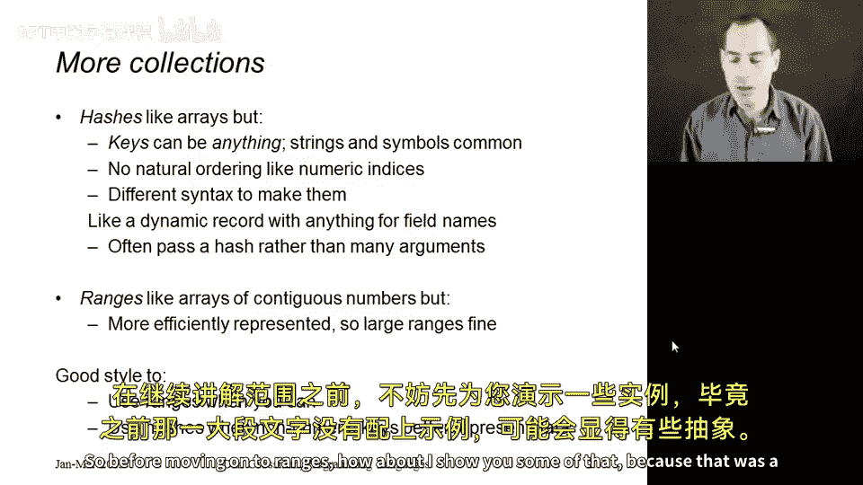
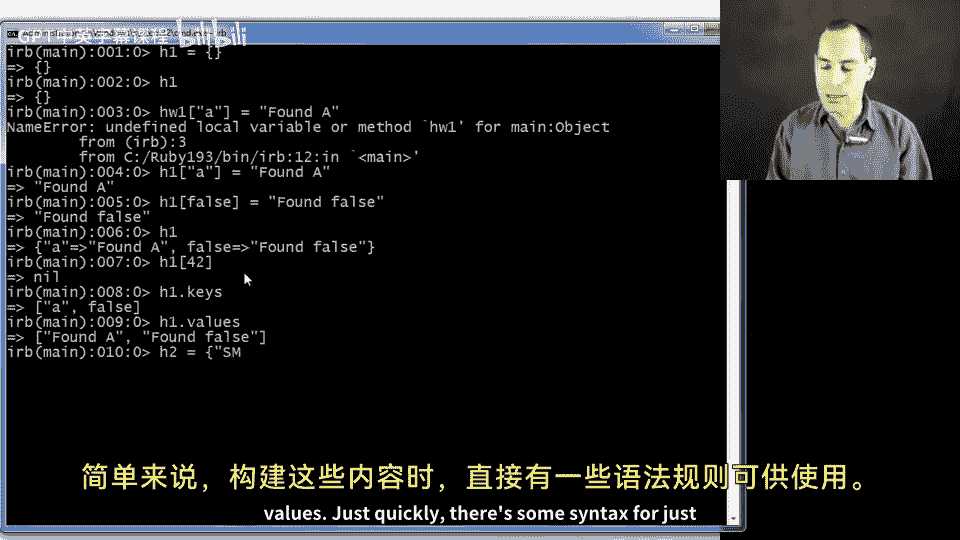
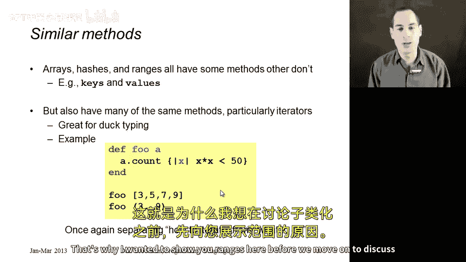

# 【编程语言 A⧸B⧸C CSE341 Coursera】华盛顿大学—中英字幕 p156 15_13_hashes-and-ranges -BV1bw4m1D7MM_p156-

In this segment I want to talk about two other classes that are defined in the Ruby standard library。

 hashes and ranges， they're both similar to arrays in many ways。

 and they're very common in Ruby programs so it's worth showing them。

 but much more interesting from the concepts of programming languages is how we conceive how they interact with duck typing to provide something that's very much like functional programming and the benefits of higher order functions。

So hashes are a lot like arrays， except the keys can be anything。

 so I like to think of an array as a mapping from keys to values where the keys are numbers。

 the key two returns the value that's an index2 and the key4 returns a thing that's an index4 in hashes。

 you do have keys and values but the keys can be anything。

 and it's common for them to be strings or symbols， but there can be any object at all。As a result。

 there's no natural ordering。 we think of the elements of an array as sorted2，3，4，5。

 but with hashes since the keys can literally be anything。

 we give that up for the flexibility of having any sort of key。

 and there's naturally different syntax for creating hashes。

 But then once we have them a lot of the same methods work。

 including the bracket syntax for getting something out or setting something in it。

 So you can also think of a hash as really a record where the field names can be anything and the field contents can be anything。

 And so we often use hashes where we need a little data structure with a bunch of pieces where we want indicative names for the pieces。

 For example， if you needed to pass a lot of configuration options to a method often that method will take those arguments as part of a single hash value。

 So before moving on to ranges， how about I show you some of that because that was a lot of verbiage without showing you an example。

So you can build an empty hash with just brace brace。

 You could also do this with hash dot new same thing in this case。

 And then so H1 now has currently has nothing in it。 But I could put something in it like a arrays。

 You can just assign to any position。 But here I could make the key a string。

 And then I could map that to some other string like found a。

 no need for these things to be the same type。 And， of course， I meant H1， not H W1。 Okay。

 I could also have in the same hash， something indexed by false。A totally different object。And now。

 if I print H1， you'll see it prints as a mapping in braces。

 the key string A goes to the string found a， and the key false goes to the string found false。

 And it prints with these fat arrows equal greater than sign。 like arrays。

 you could ask for indices that don't exist。 And you just get back the nil object。 unlike arrays。

 it has some methods defined that are not defined on arrays， like keys。

 which returns an array of all the keys currently in the hash and similarly values。

 which returns an array of all the values currently in the hash。

 So it's just a mapping from keys to values。 Just quickly。

 there are some syntax for just building these things directly。 let me hit return here。 So I could。😊。

If I can type this out well enough， create a little mapping where I have three strings for keys and three numbers for values。

Okay， and I get this little mapping， And I could ask， you know， S M L， and I would get。

 I don't know why I keep thinking it's H W。 There we go。 I could also ask H2 dot size。

 and I would get3。 There are three mappings in that hash。 You might imagine。

That various iterators are defined on hashes， but each takes a pair of a key and a value All right。

 so that's a difference， but it's a different class。

 it defines the each method differently so you know maybe I could do something like print out the key value pairs and some reasonably nice way and on each two that would print them out in one per line as you see here。

Okay， so that's hashes。 it's actually common sometimes to use symbols。

 which we write colon foo instead of strings like foo for the keys， that's a more efficient approach。

 but you do see both in Ruby programs and that's hashes。

Now let's go back to the slides and talk about ranges。

 It's the other one I wanted to show you So ranges act a whole lot like as of contiguous numbers。

 but they're more efficiently represented。 so for example just here I could make the range one to a million and that was very fast and this is not actually some huge object that's an array with a million elements。

123，4 up to a million it would be if I called it2 a method which creates an array out of a range。

 but just the range is just this little object that acts like the contiguous numbers from  one to a million。

 it's just an object you can think of it as having a lower bound in an upper bound。

 something that would have something like two instance variables if we knew how it was implemented instead of a million but like as。

 a lot of things are defined on it， a lot of methods are defined on it so for example。

 if I wanted to add up all the numbers from1 to 100 I could call inject which you might remember is rubby's name。

For reduce。 and I'll get the sum of the numbers from 1 to 100， which is actually 5。

So that's kind of neat， and now we just have three different things， arrays hashes and ranges。

 and we can talk about when is it better style to use one or another。So in short。

 use ranges when you can because they're more efficient and they express better。

 I mean the numbers from 2 to 10 or from x to y where x and y are variables that we look up to create numbers and use hashes when numeric keys make your code too hard to understand that when you really do have a mapping from some kind of set of strings to some other values or something like that。

 then a hash is the right thing to use。So to finish this up。

 let's talk about how we have these three things that do have some different methods。

 like we saw hashes have a keys method and a values method。

 but they also have a lot of the same methods。So in particular。

 most of the methods that arrays have ranges also have。

So it turns out this is particularly nice for bothduct typing OOP style programming and for the benefits of higher order functions。

 So let me show you a quick example of that。 supposeupp I define a method F that takes in some a。

 Now when I defined P， I was really thinking of a as an array that's why I called it a and I call it count method and because I want to count in this array。

 how many values x have x squared less than 50。 you could have whatever sort of arithmetic property you wanted to have in there。

 And sure enough， if I call P with an array like 3，5，7，9， I will get。

 I think3 because three squared is less than 55 squared less than 50 and7 squared is less than 50。

 and that's great。😊，But because ranges also have a count method which takes in a block and works the same way。

 I could just as well call fo with the range 3 to 9。 And if I do， I think I'll get back 5， because 3。

4，5，6 and 7 are all squared less than 50， but 8 and 9 or not。 This is really duct typing。

 I can call fo with any method that has any object， excuse me。

 that has a count method that can take a block and do an appropriate thing with it。

And in terms of functional programming， this is what I emphasize back when we studied ML。

 higher order functions for iterators are really good at， it's a separation of concerns。

 one part of your code can implement the code that does the iteration that knows how to iterate over some data and another piece of your code can use that iterator to compute something useful。

So here are computing something useful is foo， and we have two things that know how to iterate。

 We have the count method in the array class， which presumably walks down the array one element at a time。

 and we have the count method in the range class， which does something different。

 which does not actually have the entire array but just goes through the numbers from the lower bound up to the higher bound。

 So this is the same separation of concern I emphasize in M now seen in an object oriented programming context。

 So I always like to see the same concepts come up in different settings。

 that's why why I wanted to show you ranges here before we move on to discuss subclassing。

