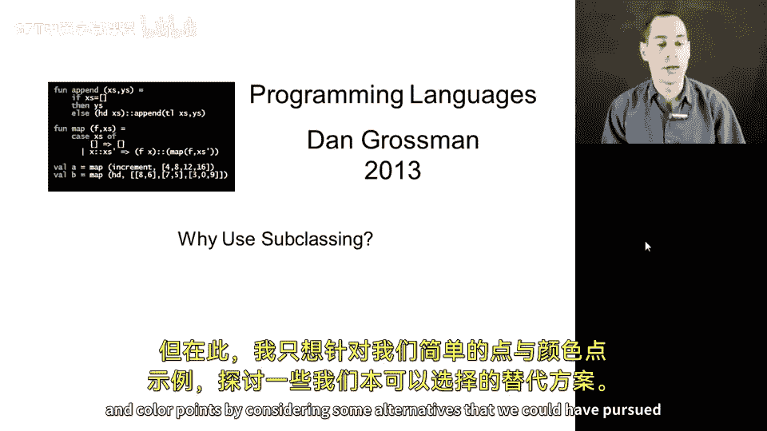
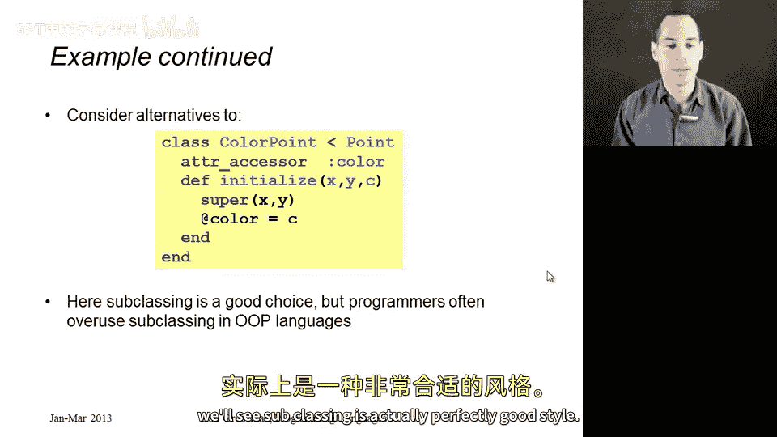
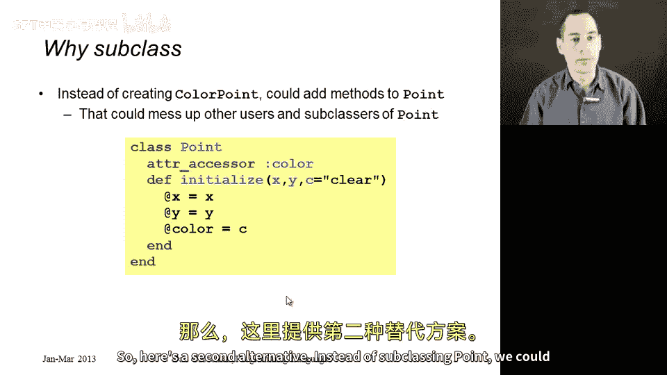
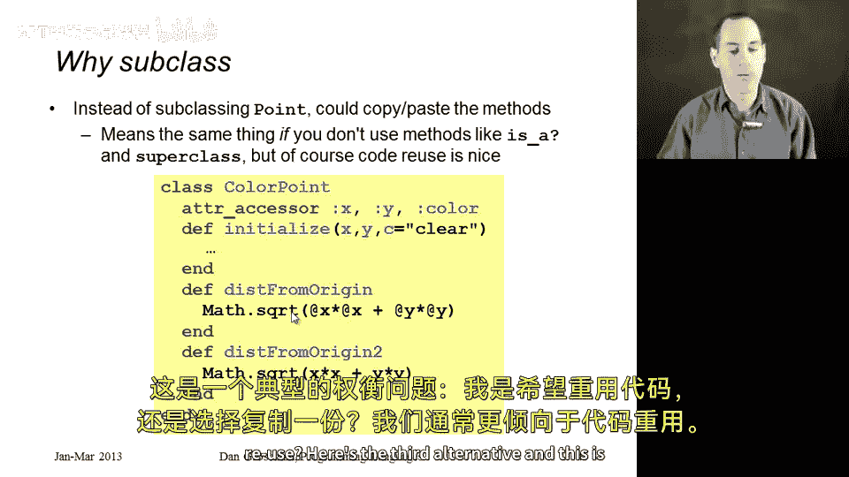
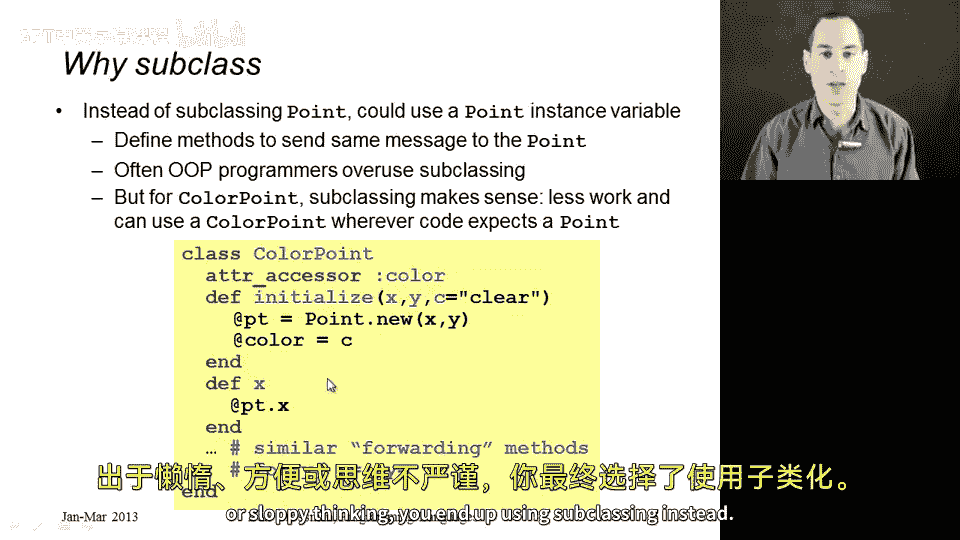

# 【编程语言 A⧸B⧸C CSE341 Coursera】华盛顿大学—中英字幕 p158 17_15_why-use-subclassing -BV1bw4m1D7MM_p158-

The question of when it is good style to use subclassing is an important one。

 and you could have an entire course on object oriented design。

 but here I just want to answer the question for our simple example of points and color points by considering some alternatives that we could have pursued instead。

So remember what we did is we had a point class that had several methods to like getters and setters for X and Y as well as from distance from the origin methods。

 and we wanted a different class that was very similar。

 that was a color point class that had all of that。

 but also had a getter and setter for a color property。

 and then we had to change our initialized method to make sure that that color was properly initialized。

So it turns out here subclassing worked very well， it was convenient to reuse all that code from point。

 but in general， once programmers learn subclassing， they do often tend to overuse it。

 most people would agree that in large OOP applications。

 there tends to be more subclassing than there probably should be。

 so let me show you what else you could do rather than subclassing in order to get code reuse。

 even though in this case， as we'll see subclassing is actually perfectly good style。

So here's the first alternative， since we're in a dynamic language where we can change class definitions anywhere in our program。

 what if we instead of creating a color point class just went and added new things to the point class so go into the point class we know we can do this anywhere in our program add the color and color equal getter and setter methods。

 change the initialized method by providing a default argument for the color field。

 all the old uses of the initialized method， all the old calls to new will continue to work。

 we'll just be creating a new instanceense variable that people didn't know was there before。

So you can do this。 You can get away with this in Ruby。 it's often bad style。

 If some other library wrote the point class， you could be messing up all sorts of invariance by going in and changing it。

 you're now requiring every point in your system to have these color properties。

 even if many of them don't need it。 and it's kind of a non-modular change。

 if you add a color field and someone else adds a Z coordinate and someone else adds a string。

 which is the name of the point。 you're just bloating your objects with all these different things。

 and that's if they're separate。 if they interact in any way。

 if any of the methods assume the other ones don't exist。

 then you get into conflicts and all sorts of strange things should happen。

 So this will work particularly for these sort of simple examples。

 but it's not a particularly modular change。 if we want to in any way。

 keep the idea of a color point separate from the idea of a point。

So here's a second alternative。Instead of subclassing point。

 we could just copy and paste the methods。 Now we wouldn't be relying on point at all。

 So things would be very separate in modular， we would just define a class color point。

 And since it sets a short class， there isn't too much to it。 You know， it almost fits on the slide。

 I omitted the details of the initialized method here。

 And we would just say a color point has three getters and three setters for X Y and color。

 It has an initialize， it has this disk from origin method。

 which I literally copy and pasted from the point class and disk from origin2。Now。

 what's good about this is that now points and color points are completely separate。

 Any changes anyone makes to the point class will have absolutely no effect on how any instance of colorPo behaves。

 And the obvious disadvantage is that I copyied and pasted code。

 So I'm not getting any code reuse if there was some bug in disform origin。

 I just duplicated that bug if someone adds good new functionality to point。

 I would have to go in and copy that over here， Otherwise I wouldn't be able to use it。

 So this is a typical tradeoff of do I want to reuse code or do I want to make a copy And we generally prefer code reuse。

Here's the third alternative， and this is the one that people in object or languages tend to do too little of。

 which is instead of subclassing point， what if instances of color point had inside of them an instance of point in an instance variable as part of their private state。

So here's how this would work， I would just define a class color point。

 the superclass would just be an implicit object， I'm not going to use anything from the superclass explicitly here。

I would have color getters and setters。But then the other instance variable I would have is PT here short for point。

 and I will initialize it here in the initialized method to hold a point。So now my methods。

 x x equal y， y equal disk from origin， disk from origin2， will not work as they did before。

 but I could just forward the message， just make a nested method call to the underlying point。

So when someone had an instance of colorPo and they called the X method。

 that would be this code that you see here， that would just the body would just send the same message。

 would just call the X method on the underlying point。Now。

 the good thing about this is it encapsulates inside of colorPo， the fact that there's a point。

 it's an implementation detail。 it would let us change certain things。 for example。

 if in color points， we wanted the X and Y coordinate to be called F and bar。

 then we would just change the names of these methods and it wouldn't matter that the methods were called something different in the point class。

The disadvantages are twofold。 First of all， it's not nearly as convenient code reuse right I have to create all these methods just the passive method to some underlying thing。

😡，But much more interesting is that now a color point really is not a point。

 The is a method that we saw in Ruby actually agrees with me。

 It's this totally separate thing whose internal representation happens to include an instance of point。

So this is an even bigger deal in languages with static type systems where it matters to us whether an instance of color point can have some type that instances of point also have and here they would not it's less of a big deal in a dynamically type language like Ruby。

 but if you see code like this for something like color point it is actually inferior style。

 subclassing works really well here， a subclass says I really do want to inherit all the methods from point I'm just like a point except I have some new things and I need to change the definition of the initialized method and that's why even this third alternative for color point it an inferior one but as I mentioned before oftentimes in Ruy programs that are in other object or any programming languages。

 you should be doing something like this， but sort of out of laziness or convenience or sloppy thinking you end up using subclassing instead。

