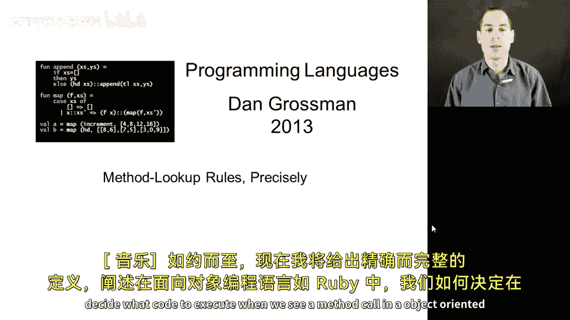
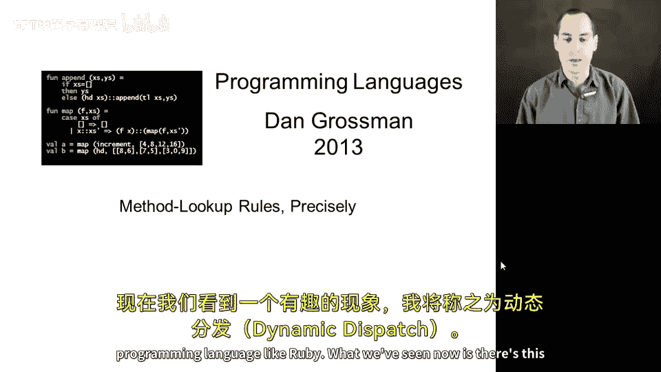
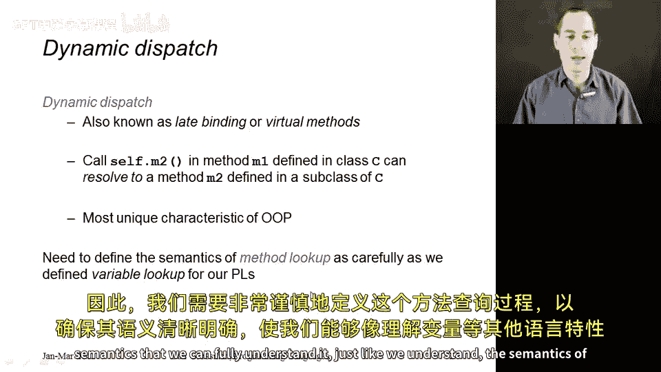
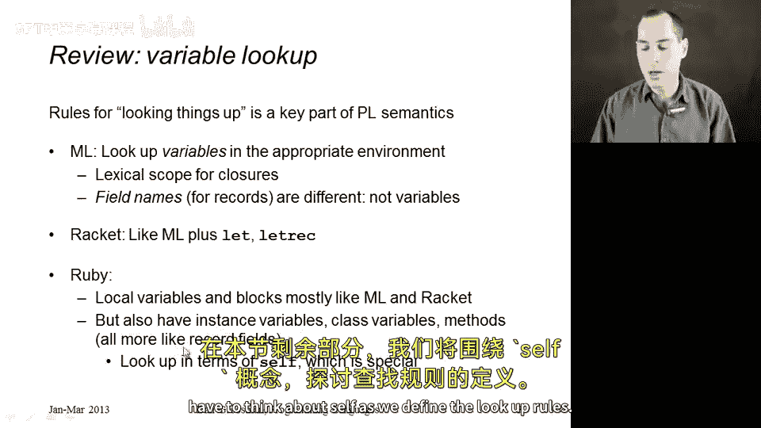
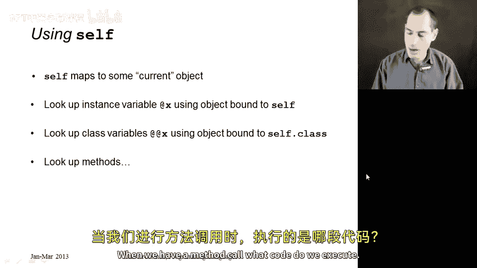
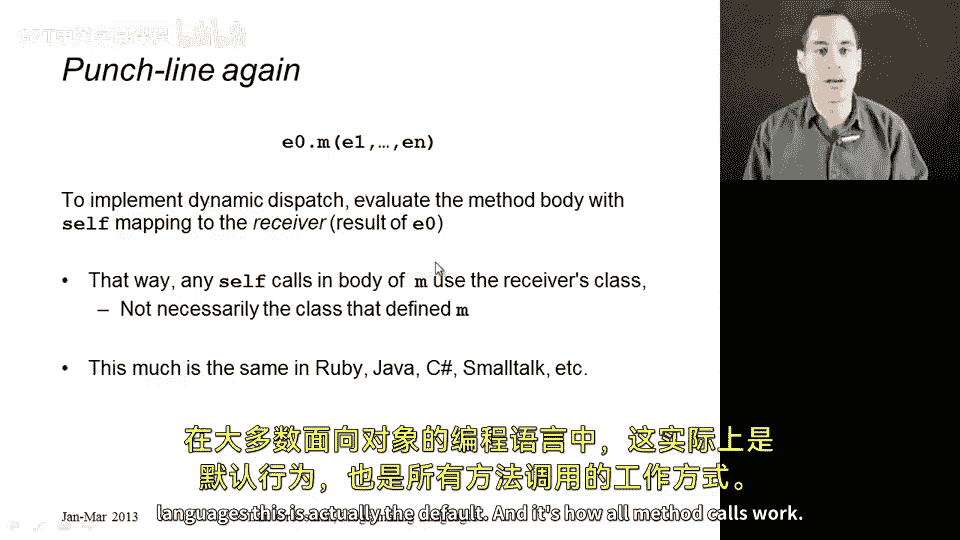
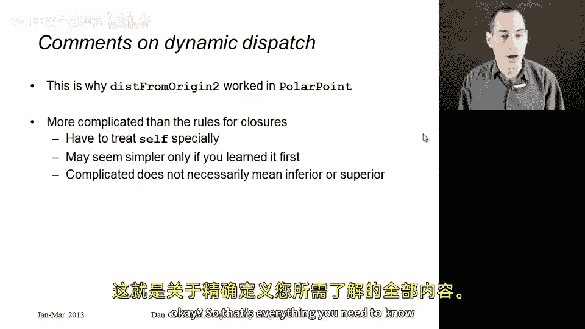
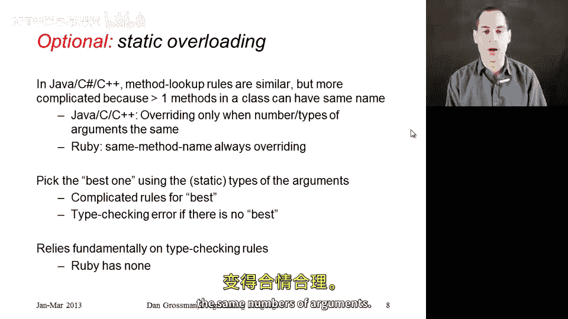

# 【编程语言 A⧸B⧸C CSE341 Coursera】华盛顿大学—中英字幕 p160 19_17_method-lookup-rules-precisely -BV1bw4m1D7MM_p160-

As promised， I now want to give a precise and complete definition for how we decide what code to execute when we see a method call in an object oriented programming language like Ruby。

 What we've seen now is that there's this interesting thing， which I'll call dynamic dispatch。

 it goes by other names that essentially mean the same thing like late binding or virtual methods and what this refers to is the fact that when we call a method on self like self do M2 from some other method。

 say M1。

We might end up looking up code that is in some subclass of C because the self objectject has a different class that used overriding to replace M2 with some other method different than the M2 that was originally defined in class C。

 This is the most unique characteristic of object oriented programming。

 the ability to do this dynamic dispatch is what makes programming with objects the most different from programming with something else like closures or just ordinary functions。

 So what we need to do is define this method lookup procedure very carefully so that we can see that it has such crisp semantics that we can fully understand it。

 just like we understand the semantics of other language features like variables and so on。

So it's worth reviewing for just a second that the rules for how you look something up are often sometimes the most important rules in the semantics for programming language。

 so when we studied ML， we talked a lot about the environment and we used variables and we looked them up in certain environments。

 our whole discussion of lexical scope was really about how you look things up。

Let me also point out that the rules for variables only applied to variables。

 So in ML we also had field names， remember records that had fields， those things are not variables。

 and when we asked for the F field of some record， we looked up the contents of the fo field using that record。

 So different things can have different lookup rules。

You can also have different kinds of lookup rules， for example， in racket。

 we saw multiple different kinds of lead expressions。Now， in Ruby。

 variables work pretty much like ML and rackcet。 They're slightly different scope rules。

 blocks have lexical scope and so on。 But instance variables。

 class variables and methods work differently。 they're a little bit more like ML record fields。

 And in each case， the rules for how you look up an instance variable or a class variable or a method all have to do with this notion of self。

 which is a special thing in an object oriented language that refers to the current object。

 So the rest of this segment we're going to have to think about self as we define the lookup rules for these sorts of things。

😊。

So let's do the easy ones first in Ruby， there is always some object that is bound to self。

 we can think of that as the current object or the self object， whenever a method is executing。

 it's part of some object that is bound to self。So when you see in some method an instance variable use like at X。

 what we do is we take the object bound to self and we look up at x in it。

 It really is like the fields of a record in this case， the object bound to self is like a record。

 If we find it， we return it if we don't find it， we return n， that's how instance variables work。

Class variables like at X work the same way， except instead of looking them up in the object bound to self。

 we look them up in the object bound to self's class。

 and that's how all the instances of a class are sharing the class variable。

 and it's as simple as that。Now， the more interesting one and the more sophisticated one。

 the one that has dynamic dispatch involved is how we look up methods when we have a method call what code do we execute。

 and here on one slide， although it's a little complicated， is the answer。

So here is the semantics of a method call in an OO language like Ruby。

 So I have some call E0 dot M with N other expressions。

So the first thing I do in a nice eager evaluation setting is I evaluate the n plus one subexpressions。

 and that is going to give me n plus1 objects， Ob 0， which is the result of E0 up to object n。

 which is the result of E。 we'll have references to those n plus1 objects。 And as usual。

 this is a recursive definition。 So if any of these n plus1 objects involved cell or method calls or whatever we would complete those calls。

😊，So now we have these n plus one objects。 Ob 0 is special。 We call it the receiver of the method。

And it has a class because every object has a class。 So let's let the class of Ob0 be C。

 And now what we're going to do is we're going to use C to find the code to execute。

 Here's how we do it。 If the class C itself defined a method M， then that's the one we pick。

Otherwise， we check the super class of C。 And if it defined an M， that's the one we pick。 Otherwise。

 we check its super class， its superclass and so on。

 all the way up to the top of the super class hierarchy object or basic object or whatever the last one is in the definition of Ruby。

 The first time we find one， that's the code we call。 If we don't find one。

 Then we call a different method instead， it's called method missing。

 We follow the same recursive procedure。 And if no class is defined method missing。 Well。

 it turns out the object class does。 and its definition is to print out an error message saying there is no such method M。

😊，So now we know what code to call， but now how do we call it？😡，Well。

 the first step here in evaluating the body of the method is what you would expect。

 you evaluate the body of the method in an environment where the formal arguments to the method。

 the thing in the method name are bound to the objects Ob1 up through Ob N。

But when we're evaluating the method body， self is bound to ob0。

We evaluate the method body in an environment where self refers to the object we were calling the methadone。

And it turns out that simple rule in blue here properly implements dynamic dispatch。Okay。

 so the punch line， again， which follows from the definition on the previous slide。

 I that to implement dynamic dispatch， when you evaluate a method body， you map self。To the receiver。

 to the thing you called the methadone。That way。Anything in M that uses self。

We'll use the receiver's class。which might be a subclass of the class that defined M。 and that way。

 if the body of M calls some other method like M2， we will start looking for M2 in Ob zeros class。

 not in the class that defined M。 and this is how every object oriented programming language works。

 actually in C+ plus it depends what kind of method definition you have。

 but it still has support for this and in most object orientnate programming languages this is actually the default。

 and it's how all method calls work。😡。

So a couple comments on this， if you take this precise definition and you go back to our example with polar point。

 you will see that you get exactly the right answer with these rules that was merely an example of what I've now given you the precise semantics for when we call disk from origin2 with a polar point disk from originig2 was defined in point。

But its calls inside its body， we still started the lookup procedure with the polar point class when self was bound to an instance of polar point。

The second thing I would say is， I believe it's a statement of fact and not an opinion that this rule for method calls is simply more complicated than the rule we had fore closures。

 the rules I had a couple slides ago， just had more words， more cases。

 they had to treat self as a special thing， different from other variables different from the normal sort of functional language environment。

And I think it's fine to say that this is a more sophisticated semantics。

 a more complicated semantics， where you have variables which are treated one way and self。

 which is treated a different way。 Now， it may seem simpler to you if the first programming language you learned was an object or any language。

 If you studied this before you studied function closures you've just had more time to get used to it。

😊，And the reason why I feel okay saying this as a statement of fact。

 as opposed to an opinion is I'm not saying it's better or worse。

 I'm not saying that complicated necessarily means inferior。

 I'm also not saying that complicated means superior， right。

 I'm just saying that when you have to treat self-specly different from your other things。

 you have a more complicated semantics for method call than ML and racket had for function call。

So that's everything you need to know about the precise definition。

 Let me finish up here with one optional topic for those of you who have seen a statically typed object oriented language like Java or C sharpharp or C+ plus。

 the rules I've shown you in this segment are essentially correct This is how Java and C sharpharp work。

 but those languages have another complication， and that is that in those languages。

 a class can have multiple methods with the same name。

They just takeThe different methods with the same name can just take different number of arguments or even the same number of arguments。

 but with different types。So in Java and CNC++， just because you have another method with the same name as a method defined in the superclass。

 you might not be overwriting， you're only overwriting if you take the same arguments with the same types。

 whereas in Ruby， anytime you use the same method name you're actually overwriting。

So in Java and C sharp， you can have multiple methods with the same name。

 either because you inherit some and define others yourself or just because one class defines multiple methods with the same name。

 It's a little weird sounding， but they decided this was convenient。

 So now when you have a method call， you have to not just find a method named M。

 you have to pick the best one。 and the rules for best take up many。

 many pages in the language specification。 they're very complicated。

 sometimes it's a tie and there is no best one and you get a typeche error message。

 So it would take me probably about half an hour to teach you the actual rules for this。

 but fundamentally these rules are using the results of the type checker in order to know the types of the arguments in a method call。

 So this sort of static overloading， which is what it's called when you have multiple methods with the same name。

 fundamentally does not make sense in a dynamically typed language like Ruby。

 So even though in Ruby and in Java we have dynamic dispatch。

Only in a language with static overloading and static types。

 do we have this extra complication where it makes sense to have multiple methods with the same name and the same number of arguments。

