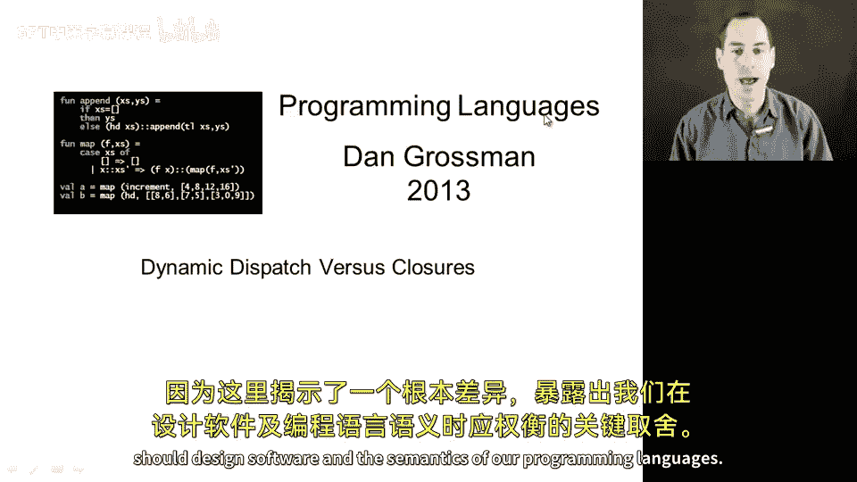
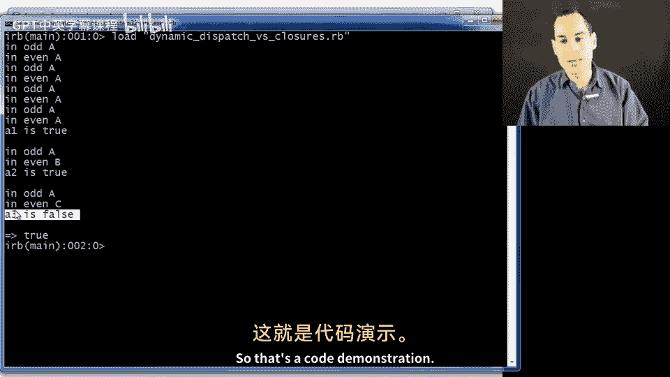
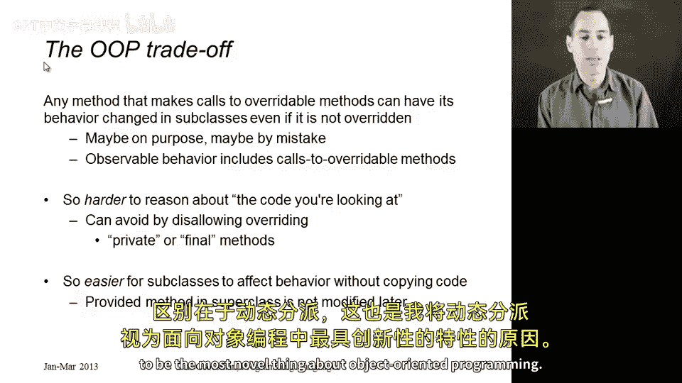

# 【编程语言 A⧸B⧸C CSE341 Coursera】华盛顿大学—中英字幕 p161 20_18_dynamic-dispatch-versus-closures -BV1bw4m1D7MM_p161-

What I'd like to do now is compare how dynamic dispatch works with how closures work because there's a fundamental difference that exposes a key tradeoff in how we should design software and the semantics of our programming languages so let me actually show you some ML code that uses closures it's a contrived example but it's short and it demonstrates what I want to demonstrate so suppose I have two mutually recursive functions even in odd they're mutually recursive because even and these both only work for non-negative numbers by the way。

 if x is0 then even is true， El it calls odd with x minus1 and odd takes a number x and if x is0 that's false otherwise it calls even with x minus1 and because I want to really see how these are using each other when we call them how about I add in some print statements like in even and then just the semicolon and then return and similarly with odd I'll write print in odd so that we can just see when。

these functions get called。 So as you might imagine， if I call odd with 7， as I do right here。

 it's going to print in odd and even in odd and even probably eight times， I would guess。

 and then return the appropriate value， which is true。 so we'll see that。 And we evaluate a1。

 A1 will end up true and we'll print8 times。But now suppose we shadow even。So down here。

 we have a different function even that does a much quicker algorithm， right This one just takes x。

 divides it by  two and sees if x mod 2 is0， this is a constant time operation rather than the silly recursion up here。

Well， now if here we call odd。Absolutely nothing will be different。

Because even though we shadowed even for the rest of the file。When we evaluate this call to O。

 we will evaluate in the environment where odd was defined。 So O will。

 when it gets to this call even， call this even up here at the top。

 even will call odd O will call even and we should see no difference。

 And you might look at that and say， well， that's a bummer， right。

 maybe it would be nice if when someone comes up with a better definition of even。

 it would improve the definition of odd even if the better。

 even writer did not know that O was using even。On the other hand， and this is the tradeoff。

 if someone decided to shadow the earlier， even with this third version that just the something completely different。

 just always returns false or some other thing that maybe works for them， but is not what we needed。

 then it's actually a very good thing that this call to odd for a3 will be completely unaffected by the fact that there's a different definition of even here。

 So in general， what's going on here is the recursion with even an odd is closed once we create a closure which even sounds like closed。

 we're done。 and you can shadow odd， but if you call this function here。

 it will always behave the same way because closures use lexicalco。 So without further ado。

 let's run it， I've got everything keyed up here all I need to do is hit return to use this。

 and then let's see what happened。 So sure enough， all three times there were three calls the odd I saw in odd and even an odd and even an odd and even an odd and even。

Printings like I expected。 And then in all three cases， A 1 is true。 A 2 is true， is true。

 and a 3 is true。 Okay， so that's just a blast from the past with M L。

 But now let's see some similar code in Ruby and how it behaves completely differently when we use dynamic dispatch。

So here's some ruby code。 I have a class A。This class A has two methods， even and odd。

 and they use the same silly mutually recursive feature。 They each print something。 And then in even。

 if x is 0 than true， else， self dot。X of-1， right， A method called to the odd method。 and similarly。

 the odd method calls the even method。 So those are just two methods in a class。

 So if we did something like make a new instance of the class A and call its odd method with 7。

 We would see8 printings in even an odd and even an odd。

 And then here I have a little thing to print out the result here that a1 is。

 and I would hope to see the answer of true。Right that indeed，7 is odd。 Same as the previous code。

Now， let's do subclassing and overriding， which we know has dynamic dispatch。 So here's a class B。

 which you can see is a subclass of a。 And here I override even。To be this faster algorithm。

And what this will do is even though Class B inherits class A's definition of odd。

Thanks to dynamic dispatch， when an instance of B。Has a call to odd that calls even。

 It will be this even because that's what dynamic dispatch is all about。 So when we do this。

 if we have a B dot new， like you see down here with this A2。

 you will actually see that will'll get the correct answer and it will be faster。

 This is only going to print out one thing， right， because we call odd once。

 It prints maybe two things。 it calls even and then we're immediately done。Okay。On the other hand。

 if you have a different subclass here C that has an even that does the wrong thing just always evaluates the false。

 then when we make a C object and call its odd method。

 it will also have dynamic dispatch it will also use this even method and we'll just get the wrong answer。

 So let me show this just to show you that I'm telling the truth。

 it's already here let's just load it and sure enough with a1， we ended up doing lots of printing。

 that was the normal way and then a1 was true。With a2。

 that was in the subclass B with dynamic dispatch。 We called odd， which we inherited from class A。

 But then when it called self dot even thanks to dynamic dispatch。

 we ended up in our new definition of even。 And that's why we immediately returned true。

And then for the version in C， we again have dynamic dispatch。

 but that's a problem because in that third version。

 that means we actually end up getting the wrong answer because O called a version of even it was not expecting and does not do what odd needs in order to get the right answer。

So that's the code demonstration。 Why am I showing this to you。

 Because I think this is an essential trade off when you're using subclassing and overriding。

See， if you have a method in some class that makes calls to other methods that can be overridden。

Then the behavior of the method can change in subclasses。Now maybe that's on purpose。

 like in class B， and maybe that's by accident or not what you want， like in class C， but either way。

 the observable behavior of this method you're defining includes the fact that it calls methods that might be overridden。

So this is both a problem and an opportunity。😡，It's a problem because it makes it much harder to reason about the code you are looking at in ML。

 our closures were closed。 I could look at that definition of odd and know how it would behave。😡。

With the object oriented version with dynamic dispatch， I had to say， well。

 and then it calls an even method which might change in a subclass。

So in an object oriented programming language， if this is not what you want。

 if you want to reason about code。😡，In isolation， you should somehow disable overriding or not call methods that can be overridden。

 There are various ways to do this in languages in Ruby。

 we can make methods private right and that might help because then subclasses cannot use them even there are also ways in languages like Java to mark a method final。

 which is a special keyword that says you cannot override this and whether that's good or bad style is often debated because it is less objectoriented to disallow overriding。

 but it makes it easier to reason about code in isolation。

 and it in some ways makes things more modular。Now what's good about dynamic dispatch and the ability to override things is that a subclass can affect behavior without having to copy code we were able to override the even method and have it affect the odd method in ways that even the original writer of odd was not anticipating so this can often let us do things without having to modify code that was provided by others in libraries but it's rather brittle the fact that we could change odd by overriding even relies on some details of how odd is written。

 it might stop working if someone modify the odd method but it does allow more code reuse and whether that code reuse or code abuse use depends on the situation nonetheless semantically as I've emphasized here。

 closures and objects are fundamentally different and the difference is dynamic dispatch which is why I。

Consider dynamic dispatch to be the most novel thing about object oriented programming。

