# 编程语言 A/B/C CSE341 Coursera：21：在 Racket 中手动实现动态分派 🧠

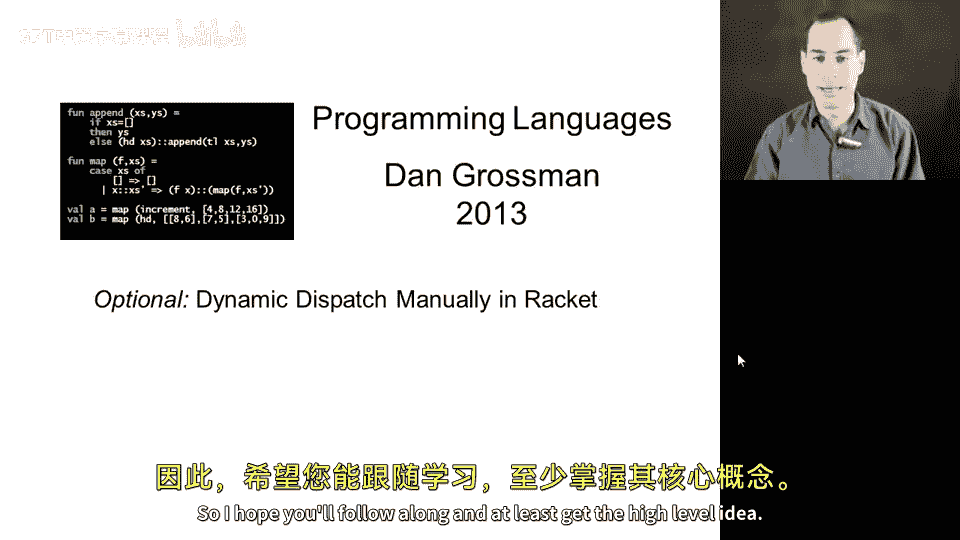

在本节课中，我们将学习动态分派的核心概念。我们将通过手动编写 Racket 代码来模拟面向对象编程中的动态分派机制，而不使用 Racket 内置的类和对象功能。这有助于我们深入理解动态分派的语义，并展示如何用一种语言的构造来实现另一种语言的特性。

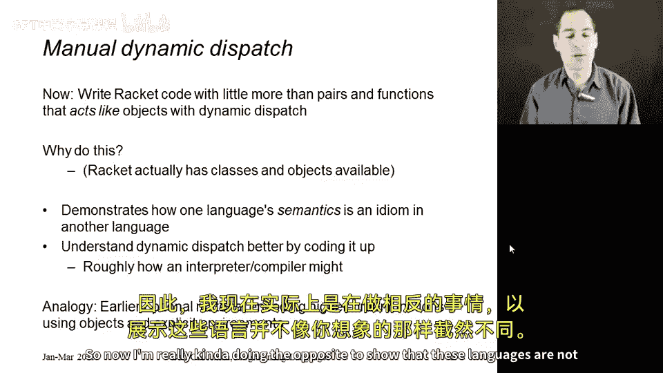

## 概述 📋

动态分派是面向对象编程中的一个关键特性，它允许在运行时根据对象的实际类型来决定调用哪个方法。本节中，我们将通过 Racket 代码手动实现这一机制，从而揭示其背后的工作原理。

## 对象的结构 🏗️

首先，我们需要定义对象的结构。在 Racket 中，我们可以使用结构体（struct）来表示对象。每个对象包含两个部分：字段列表和方法列表。

```racket
(struct object (fields methods))
```

字段列表是一个可变对（mutable pair）的列表，每个对包含字段名和当前值。方法列表是一个不可变对（immutable pair）的列表，每个对包含方法名和一个函数。这个函数接受一个额外的参数 `self`，用于引用当前对象。

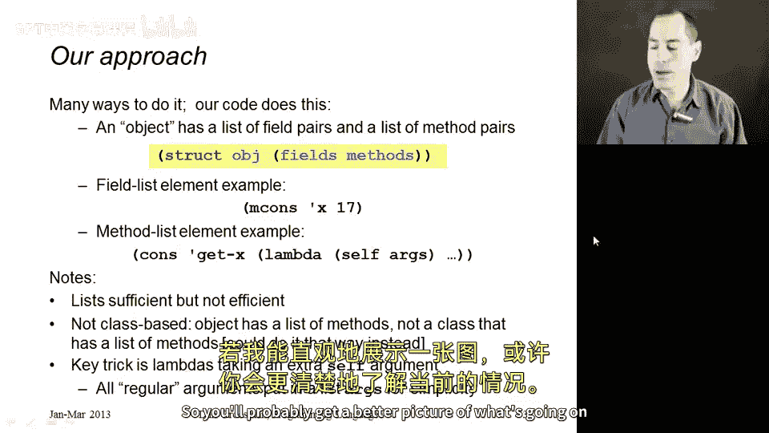

## 核心操作函数 ⚙️

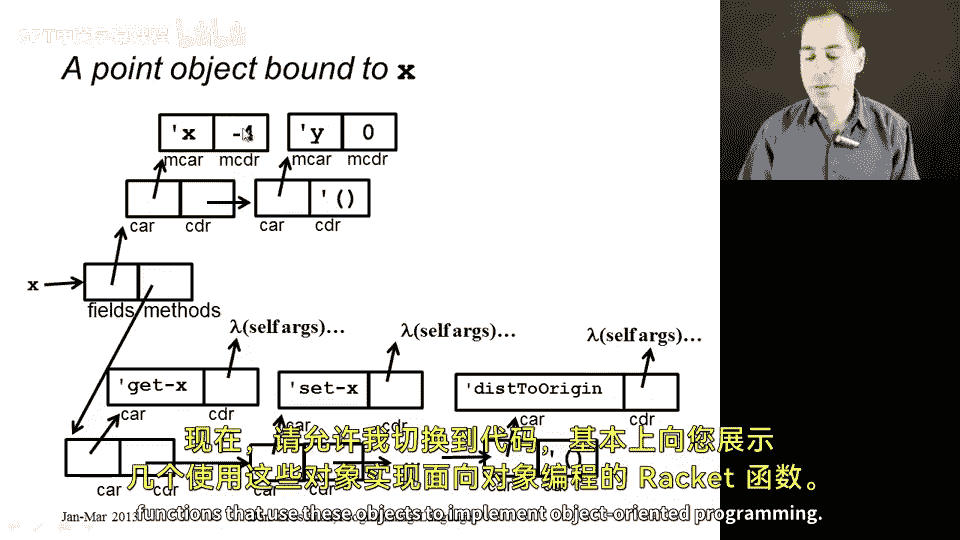

上一节我们介绍了对象的基本结构，本节中我们来看看如何操作这些对象。以下是三个核心函数：获取字段、设置字段和发送消息。

### 获取字段（get）

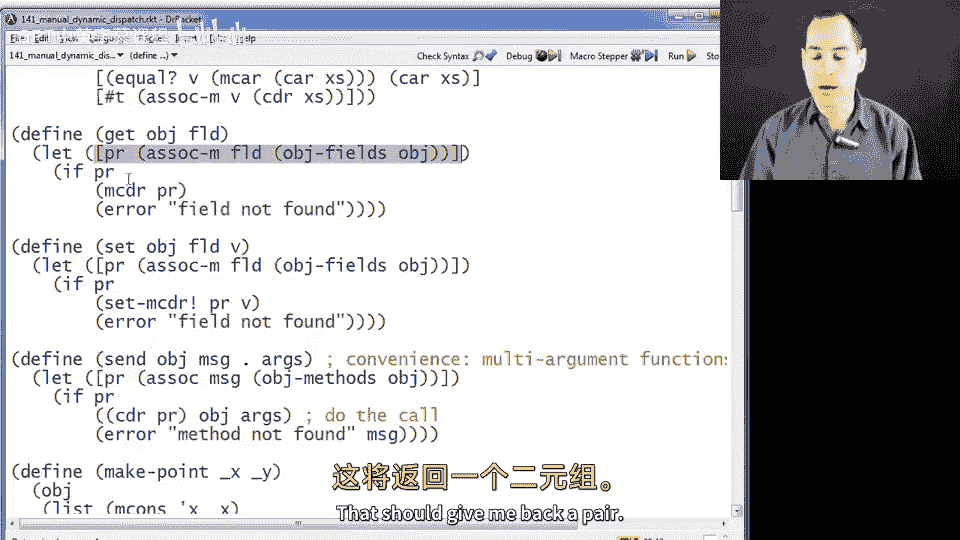

`get` 函数用于获取对象中指定字段的当前值。

```racket
(define (get obj field)
  (let ([pair (assoc field (object-fields obj))])
    (if pair
        (mcdr pair)
        (error "Field not found"))))
```

### 设置字段（set）

`set` 函数用于更新对象中指定字段的值。

```racket
(define (set obj field new-val)
  (let ([pair (assoc field (object-fields obj))])
    (if pair
        (set-mcdr! pair new-val)
        (error "Field not found"))))
```

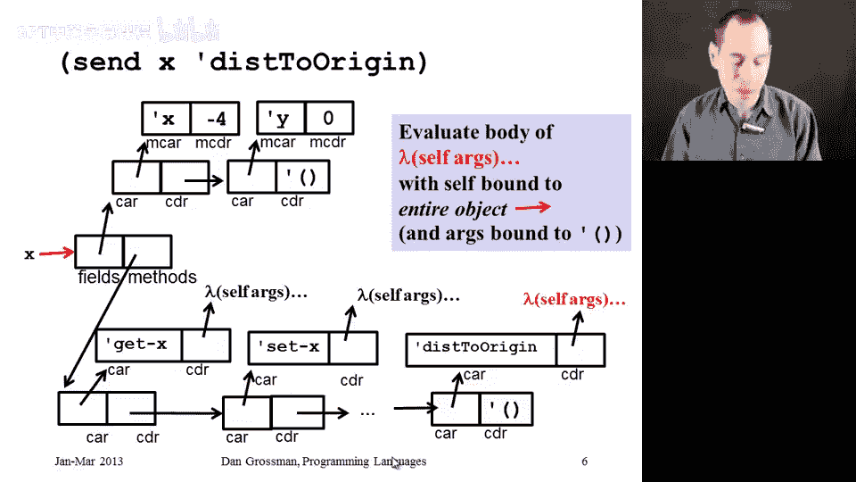

### 发送消息（send）

`send` 函数是动态分派的关键。它调用对象的方法，并将对象本身作为第一个参数（`self`）传递给方法。

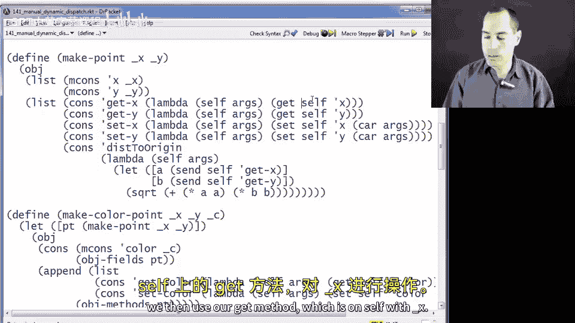

```racket
(define (send obj msg . args)
  (let ([pair (assoc msg (object-methods obj))])
    (if pair
        (apply (mcdr pair) obj args)
        (error "Method not found"))))
```

## 创建对象 🛠️

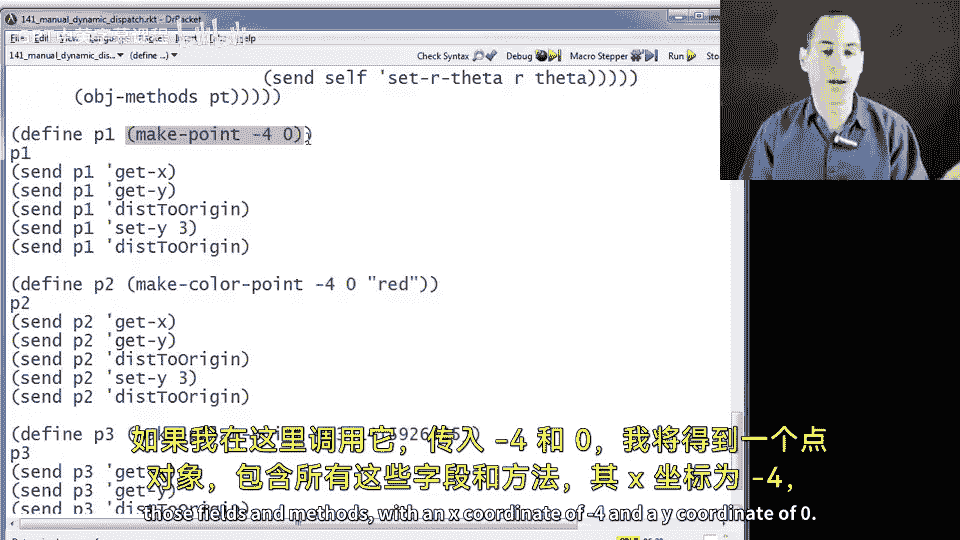

现在我们已经定义了操作对象的基本函数，接下来看看如何创建具体的对象。我们将创建一个表示二维点的对象。

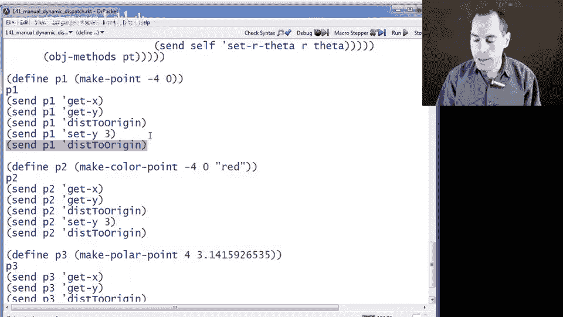

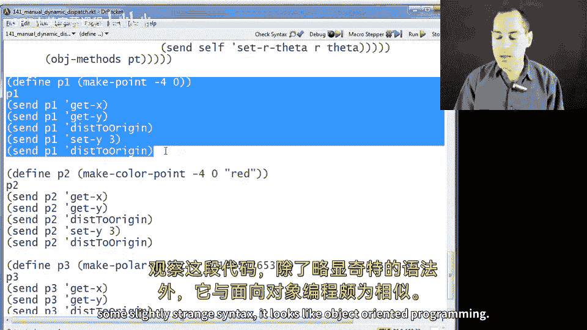

以下是创建点对象的函数 `make-point`：

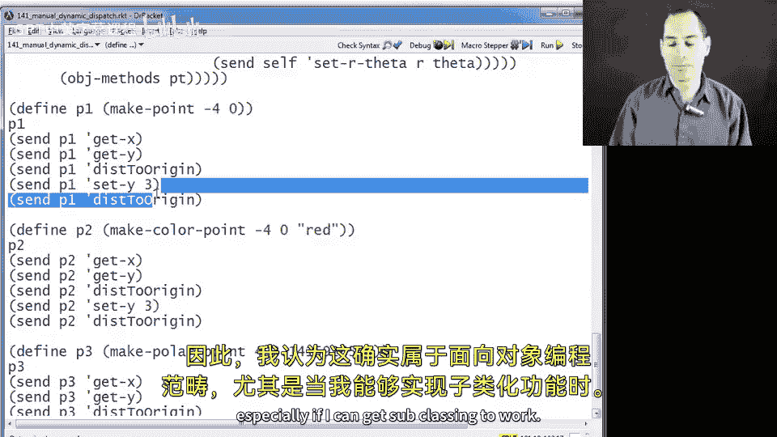

```racket
(define (make-point _x _y)
  (object
   (list (mcons 'x _x)
         (mcons 'y _y))
   (list (cons 'get-x (lambda (self) (get self 'x)))
         (cons 'get-y (lambda (self) (get self 'y)))
         (cons 'set-x (lambda (self new-x) (set self 'x new-x)))
         (cons 'set-y (lambda (self new-y) (set self 'y new-y)))
         (cons 'dist-to-origin
               (lambda (self)
                 (sqrt (+ (expt (send self 'get-x) 2)
                          (expt (send self 'get-y) 2))))))))
```

## 动态分派与子类化 🔄

动态分派的真正威力在于支持子类化和方法重写。我们可以创建一个 `polar-point` 对象，它继承自 `point` 对象，但使用极坐标（半径和角度）而非直角坐标（x 和 y）来表示位置。

以下是创建极坐标点对象的函数 `make-polar-point`：

```racket
(define (make-polar-point r theta)
  (let ([base-obj (make-point 0 0)]) ; 基础点对象，字段值不重要
    (object
     (append (list (mcons 'r r)
                   (mcons 'theta theta))
             (object-fields base-obj))
     (append (list (cons 'get-x (lambda (self)
                                  (* (get self 'r)
                                     (cos (get self 'theta)))))
                   (cons 'get-y (lambda (self)
                                  (* (get self 'r)
                                     (sin (get self 'theta)))))
                   (cons 'set-x (lambda (self new-x)
                                  (let* ([y (send self 'get-y)]
                                         [new-r (sqrt (+ (expt new-x 2) (expt y 2)))]
                                         [new-theta (atan y new-x)])
                                    (set self 'r new-r)
                                    (set self 'theta new-theta))))
                   (cons 'set-y (lambda (self new-y)
                                  (let* ([x (send self 'get-x)]
                                         [new-r (sqrt (+ (expt x 2) (expt new-y 2)))]
                                         [new-theta (atan new-y x)])
                                    (set self 'r new-r)
                                    (set self 'theta new-theta)))))
             (object-methods base-obj)))))
```

关键点在于，我们通过将重写的方法（如 `get-x`）放在方法列表的前面来实现覆盖。当 `send` 函数查找方法时，它会找到列表前面的这个版本。同时，`dist-to-origin` 方法（定义在基础 `point` 中）会调用 `get-x` 和 `get-y`，由于动态分派，它会调用极坐标点对象中重写后的版本，从而正确计算距离。

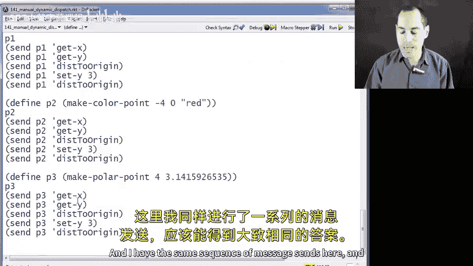

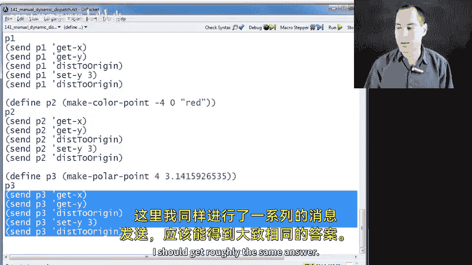

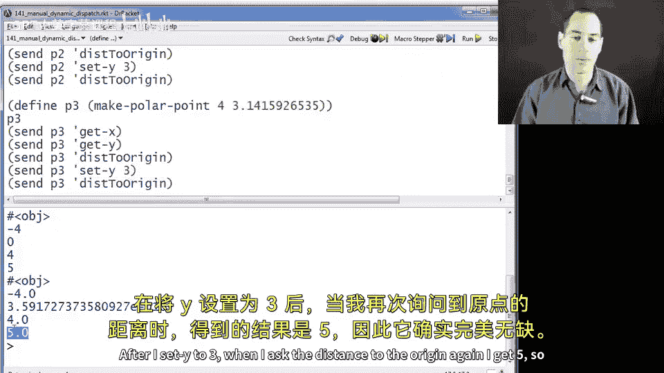

## 类型系统的思考 🤔

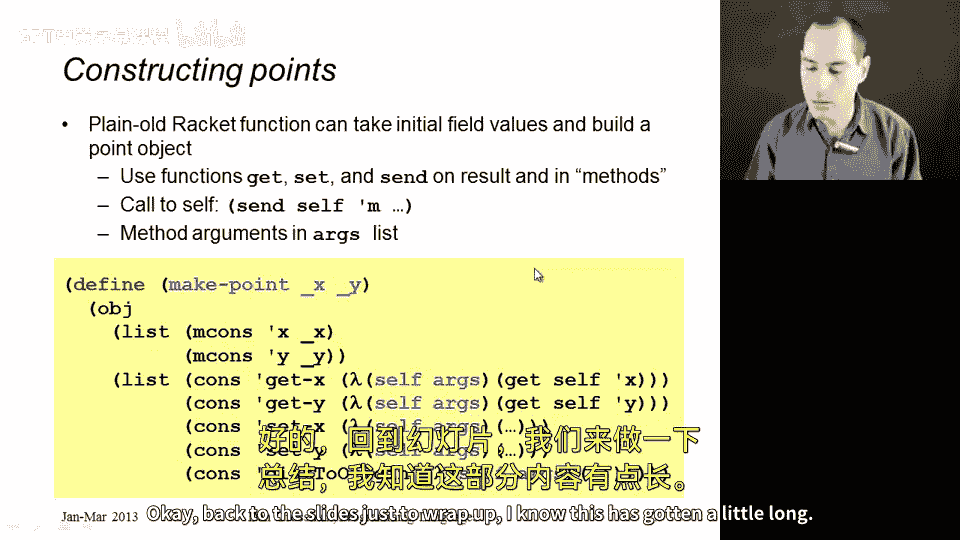

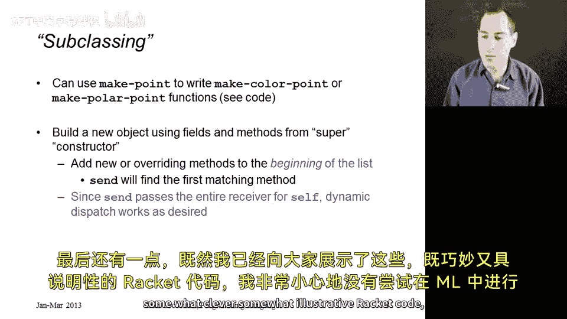

我们能够在 Racket 中相对轻松地实现动态分派，部分原因在于 Racket 的动态类型系统没有对此进行限制。相比之下，在 ML 这样的静态类型语言中，由于其类型系统（特别是缺乏子类型）的限制，手动编码实现类似的动态分派会非常困难。这就是为什么像 OCaml 和 F# 这样的 ML 家族语言需要将对象作为语言内置的原生特性来支持。

这个例子也说明，有时类型系统可能会阻碍在不同编程范式之间切换，但它们通常能很好地支持其设计目标内的编程风格。

## 总结 🎯

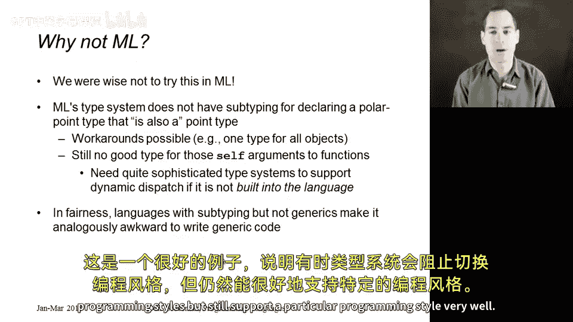

本节课中我们一起学习了动态分派的核心机制。我们通过手动编写 Racket 代码，使用结构体、字段列表、方法列表以及一个关键的 `self` 参数，成功地模拟了面向对象编程中的动态分派和简单继承。这个过程揭示了动态分派的本质：方法调用在运行时根据接收消息的对象来决定执行哪个函数体。虽然这个实现效率不高且不包含完整的类系统，但它清晰地阐释了概念，并展示了编程语言语义之间可以相互实现的有趣可能性。