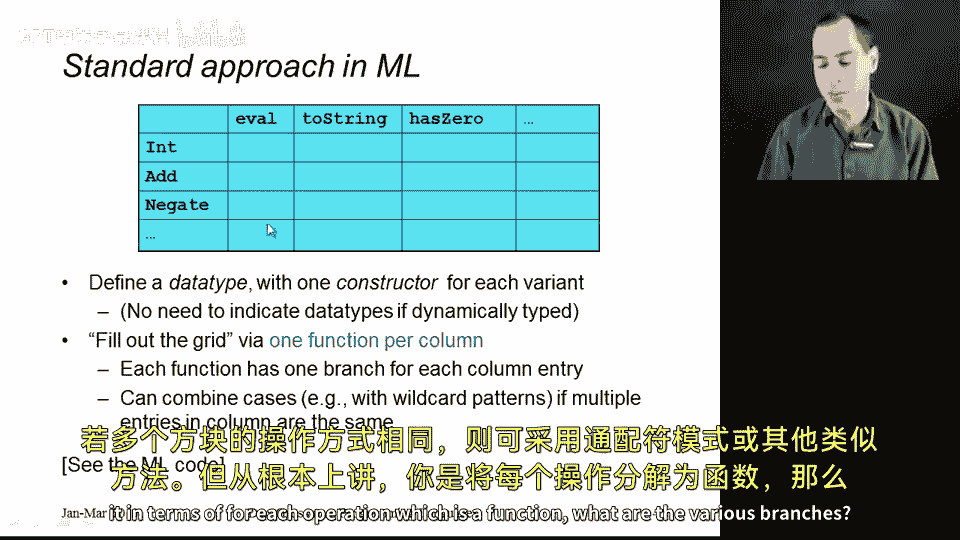
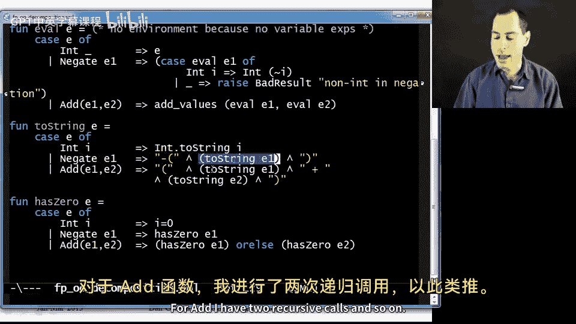
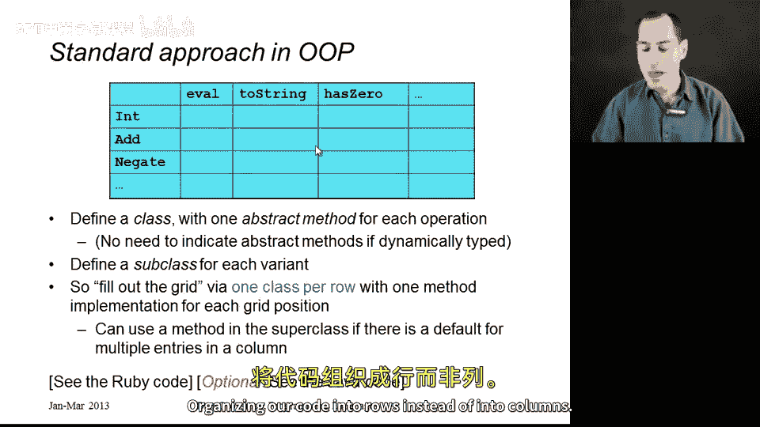
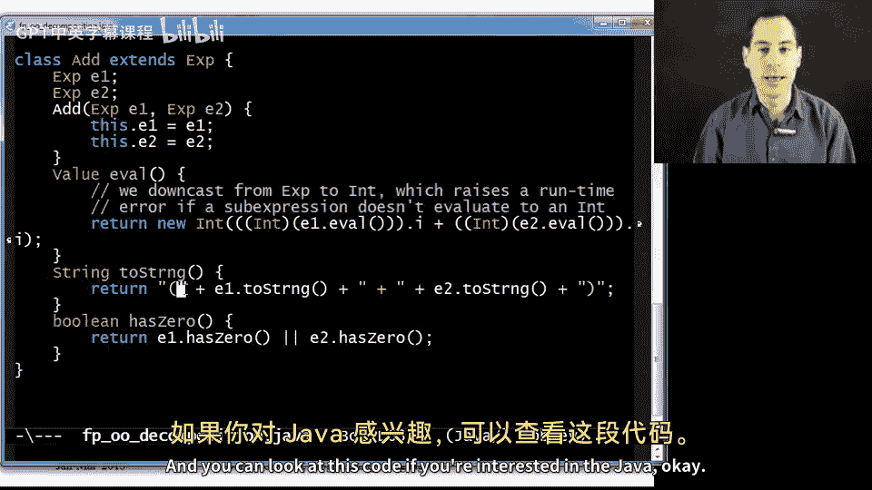
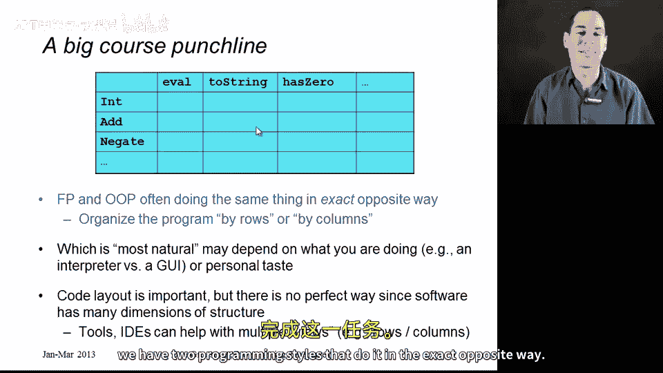

# 编程语言 A/B/C CSE341 Coursera：22：面向对象与函数式分解对比 🧩

在本节课中，我们将学习面向对象编程（OOP）与函数式编程（FP）在程序分解上的核心差异。我们将通过一个具体的例子——为一个小型编程语言实现表达式求值、字符串转换和零值检测功能——来展示这两种范式如何以截然相反的方式组织代码。课程结束时，你将理解这两种方法本质上是同一“操作矩阵”的互补视角。

---

## 概述：两种分解方式

随着课程接近尾声，我们仍有许多新知识要学习。但我们会越来越多地在对比已知概念的背景下学习它们。本节课程的开始也不例外。事实上，这是本课程的一大亮点。我们将首先探讨面向对象编程和函数式编程如何将程序分解为更易管理的部分。

在函数式语言中编程时，我们通常的做法是将一个程序分解成更小的函数。每个函数对其参数执行某些操作。

在面向对象编程中，我们则倾向于将程序分解为类。特定类的所有方法都对一种数据（即该类所代表的数据）执行操作。

在接下来的几个部分中，我们将理解这两种方法如此截然相反，以至于它们实际上只是看待同一“操作矩阵”的互补视角。我马上会展示这个矩阵。坦率地说，哪种视角更好很大程度上是个人喜好的问题。但正如我们将在下一节看到的，这不仅仅是喜好的问题。如果你认为你的软件可能以特定方式扩展，那么选择就变得重要。之后，我们将探讨面向对象编程在处理涉及多个不同种类参数的操作时遇到的更多困难。我们会按部就班地讲解。这就是我们的路线图，让我们开始吧。

---

## 核心示例：表达式语言

为了理解这个矩阵，我们来看一个解释此问题时常用的经典例子。

假设我们有一个小型编程语言的表达式，正是我们在课程早期学习如何编写解释器时考虑的那种语言。实际上，这里涉及两样东西：表达式的不同变体（即不同的构造函数）。例如，可能有整数常量、加法表达式、取负表达式等等。这些是不同种类的数据。

你还有不同的操作。我们关注的操作是 `eval`（求值表达式）。但你也可以有其他操作，比如 `to_string`（将表达式转换为字符串），或者 `has_zero`（遍历算术表达式，如果其中某处语法上存在常量零则返回 `true`，不求值，只是寻找零）。你可以有任意数量的其他操作。

---

## 操作矩阵的概念

如果从变体和操作的角度来思考，你本质上就得到了一个矩阵，一个二维网格。如下图所示，每一行代表一种数据，每一列代表一种操作。我认为，无论你使用何种编程语言来实现这个软件，都必须决定网格中每个方格（即每个数据与操作的组合）的正确行为。例如，如何将整数转换为字符串？如何求值加法表达式？如何检测 `has_zero`？等等。

因此，你必须填满这个网格。不同的编程风格只是鼓励你以不同的方式填充这个网格。



---


## 函数式（过程式）分解

首先，让我们看看函数式或过程式分解。当我们在像 ML 或 Racket 这样的语言中编写代码时（以 ML 为例），我们可以定义一个数据类型，其中每个变体对应一个构造函数。我们的数据类型定义了网格的行。

然后，在函数式分解中，我们为网格的每一列编写一个函数。我们有一个 `eval` 函数、一个 `to_string` 函数和一个 `has_zero` 函数。在这些函数中，我们使用 `case` 表达式为每一行（即该列中的每个方格）设置一个分支。这就是我们分解程序的方式。如果多个方格可以用相同的方式实现，你可以使用通配符模式之类的东西。但从根本上说，你是按照“为每个操作（即函数）设置各种分支”来分解的。



让我用一个具体的例子来说明，因为我们在接下来的部分会以此为基础。以下是实现此功能的 ML 代码：

```ml
(* 定义数据类型，对应网格的行 *)
datatype exp = Int of int
             | Negate of exp
             | Add of exp * exp

(* 第一列：eval 函数 *)
fun eval (e: exp) =
    case e of
        Int i => i
      | Negate e2 => ~ (eval e2)
      | Add(e1, e2) => (eval e1) + (eval e2)

(* 第二列：to_string 函数 *)
fun to_string (e: exp) =
    case e of
        Int i => Int.toString i
      | Negate e2 => "-(" ^ (to_string e2) ^ ")"
      | Add(e1, e2) => "(" ^ (to_string e1) ^ " + " ^ (to_string e2) ^ ")"

(* 第三列：has_zero 函数 *)
fun has_zero (e: exp) =
    case e of
        Int i => i = 0
      | Negate e2 => has_zero e2
      | Add(e1, e2) => (has_zero e1) orelse (has_zero e2)
```



这就是我的三列，这就是函数式编程。

---

## 面向对象分解

现在让我们看看面向对象编程。在 OOP 风格中，我们会定义一个类来描述“表达式”这个概念。在 Ruby 这样的动态类型语言中，你实际上不必这样做，但我会这样呈现，并将 `Int`、`Add` 和 `Negate` 视为该超类的子类。你也可以直接将 `Int`、`Add` 和 `Negate` 定义为不继承任何其他类（除了 `Object`）的类。但让我们将其视为一个类 `Exp` 及其子类 `Int`、`Add` 和 `Negate`。

然后，为了填充我们的表格，我们为每一行创建一个类。我们有 `Int` 类、`Add` 类和 `Negate` 类。接着，我们通过让 `Int` 拥有 `eval` 方法、`to_string` 方法和 `has_zero` 方法来填充该行的条目；`Add` 拥有相同的三个方法；`Negate` 也拥有相同的三个方法。这些方法定义了“一个取负表达式如何将自己转换为字符串”等逻辑。

因此，我们本质上是在填充完全相同的表格，只是将代码组织成行而不是列。


正如你所想，我已经在 Ruby 文件中实现了这一点。同样，我有一个 `Exp` 类，在 Ruby 中其实并不需要它。事实上，我甚至为我的语言中的值（目前只有 `Int` 表达式）设置了一个单独的超类。这类似于你将在作业中做的事情，所以我保留了它，但在这个例子中有些过度设计。

现在，我为每一行创建一个类。这是我的 `Int` 类。再往下看，这是我的 `Negate` 类。继续往下，这是我的 `Add` 类。

在每个类内部，我填充了该行。例如，对于 `Int` 类，我有一点关于如何初始化整数的内容（有一个实例变量存储底层的整数本身），然后我确实有 `eval`、`to_string` 和 `has_zero` 方法。

*   **`eval` 一个整数**：直接返回对象本身。这等同于函数式编程中 `eval` 分支里“整数求值为整个整数”的逻辑。这个对象在被调用 `eval` 时返回 `self`，即整个对象。
*   **`to_string`**：只需在存储数字的底层实例变量上调用 `to_s` 方法。
*   **`has_zero`**：检查 `i == 0`。

我们表格中的这三个条目（`Int` 情况下的 `eval`、`to_string` 和 `has_zero`）完全对应。我们只是把它们放在一起，这样我们就可以在一个地方看到 `Int` 的所有操作。

`Negate` 类似。对于 `eval`，我们递归调用 `e.eval`（这里我实际上调用了 getter 方法，我也可以直接使用实例变量，这涉及到我们见过的动态分派）。然后假设结果是一个 `Int`（从代码中调用 `.i` 可以看出），这会给我一个数字，然后创建一个新的 `Int` 对象。这就是你求值 `Negate` 的方式，它完全对应函数式代码中 `eval` 的这种情况。类似地，我有一个将 `Negate` 转换为字符串的方法，以及判断 `Negate` 是否包含零的方法（只需递归查看底层表达式是否包含零）。

最后，`Add` 的工作方式完全相同。我有一个构造函数来初始化两个实例变量以保存子表达式。我执行递归求值：`eval` 方法递归地对 `e1` 发送 `eval` 消息，递归地对 `e2` 发送 `eval` 消息，然后将它们组合起来。同样，这里我只是假设结果是 `Int`，所以我调用 `.i` 方法（在静态类型语言中不能这样做，但在这里运行良好）并返回一个新的 `Int`。这完全对应我们 ML 代码中 `eval` 的加法情况。类似地，我有一个 `to_string` 方法和一个 `has_zero` 方法。

这就是 Ruby 代码。我希望你理解，你将在作业中做类似的事情。可选地，我也有 Java 版本。在这里，因为我们是静态类型语言，你的超类 `Exp` 确实需要指明每个 `Exp` 拥有哪些方法，但除此之外是相同的事情：我有一个带有 `eval`、`to_string` 和 `has_zero` 三个方法的 `Int` 类，一个带有这些方法的 `Negate` 类，以及一个带有这些方法的 `Add` 类。如果你对 Java 感兴趣，可以查看这段代码。




---

## 对比与总结

对我来说，这是本课程的一大亮点，只有在你以精确和概念性的编程语言方式学习了函数式编程和面向对象编程之后才能体会到。那就是：FP 和 OOP 经常以完全相反的方式做同样的事情。这是一个关于你希望按行还是按列组织程序的问题。

如果这样表述，我认为可以合理地说是个人喜好的问题，也是一个视角问题，即哪种方式对我来说更自然。如果你正在为编程语言编写解释器，函数式编程的分解方式更自然。这是我思考的方式：我正在求值一个表达式，并且为不同种类的表达式设置了不同的分支。如果我正在编写图形用户界面，我通常发现面向对象编程的方法更合适。我的屏幕上有许多不同的图形元素，对于每种图形元素，我希望将所有关于该图形对象的内容（如它如何响应鼠标点击、它有什么颜色、如果我用鼠标拖动它会发生什么）保持在一起。我发现 OOP 分解更自然。

最后，我想说，从这个角度来看，我们实际上是在讨论代码布局的问题。在一个大型程序中，没有完美的方式来布局你的代码，因为软件有太多的结构，程序不同部分之间有太多的联系。但我们在这些编程语言中编写软件的方式是，我们有行、列和文件，我们只有这么多方式来布局代码。这就是为什么现代开发环境提供了许多以不同方式查看代码的功能。事实上，你可以将现代 IDE 视为一种工具：也许你正在用 OOP 语言编写代码，但如果你说“我知道我的代码是按行布局的，但请为我找到所有 `Exp` 子类的 `has_zero` 方法”，你本质上是在要求 IDE 为你找到列，即使你的代码是按行布局的。你可以想象一个用于函数式编程语言的 IDE 做完全相反的事情。

编写像我们的表达式语言这类程序，从根本上说是关于填充一个二维网格。我们有两种编程风格以完全相反的方式来完成它。



---

## 本节总结


在本节课中，我们一起学习了面向对象编程与函数式编程在分解程序时的核心对立视角。我们通过一个具体的表达式求值示例，展示了函数式编程如何按“操作”（网格的列）来组织代码，而面向对象编程如何按“数据类型”（网格的行）来组织代码。这两种方式本质上是填充同一张“操作矩阵”的互补方法，选择哪种方式取决于具体问题领域和个人（或团队）的偏好，有时也取决于软件未来可能的扩展方向。理解这一根本区别，有助于我们在设计软件时做出更明智的架构选择。