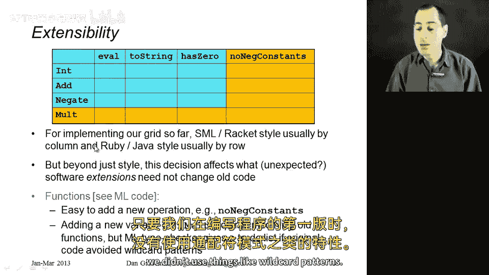
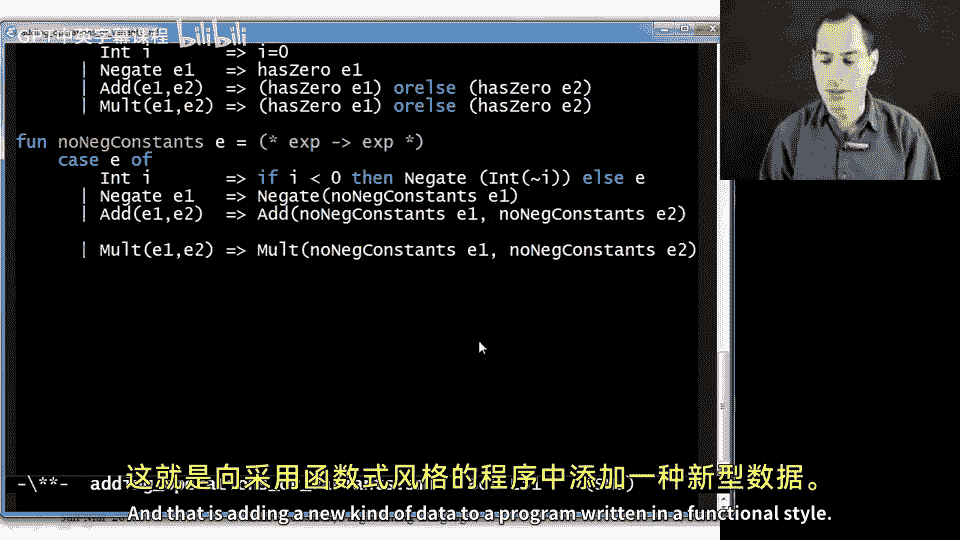
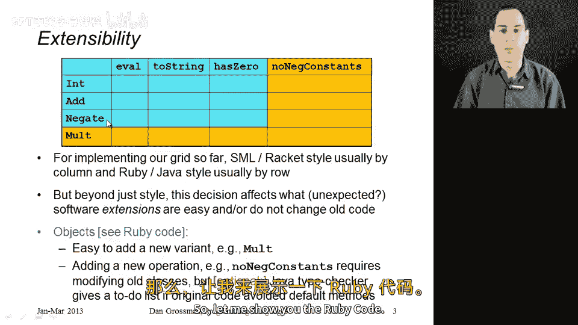
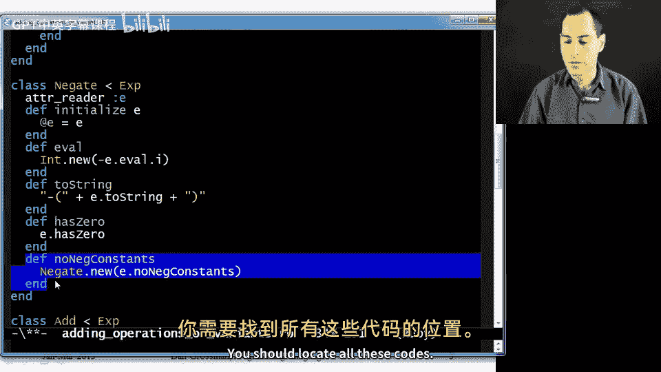
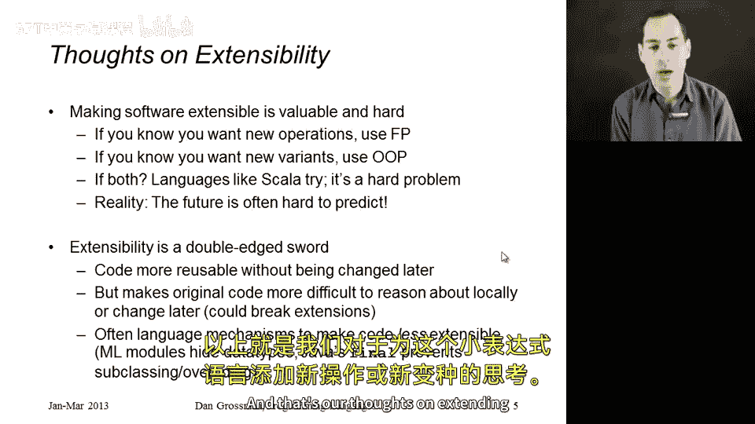

# 【编程语言 A⧸B⧸C CSE341 Coursera】华盛顿大学—中英字幕 p164 23_02_adding-operations-or-variants -BV1bw4m1D7MM_p164-

Now I want to continue our example of implementing an expression language in both FP and OOP by considering what happens when we want to later go back and extend our software。

So in the previous segment we implemented this blue grid and we did it by row in object oriented programming and by column and functional programming。

 but what if later we come back and we want to add some additional features to our program。

 maybe even some other person wants to extend our software， well maybe they want to add a row。

 like a new kind of expression like multiplications or maybe they want to add a column。

 a new operation like go through an expression and see if it contains all non-negative constants。

 something like this。So if you know what kind of extensibility you want to make natural and best support。

 that should very much affect your decision of how you decompose the software in the first place。

 and in particular， let's consider first functional and then OOP decomposition。

Under the functional decomposition， we're going to see that it's very easy to add a new column。

 You just write a new function。 It will not affect any of your existing functions。

 It's just a new function。 And all the old functions continue to work， just like they always did。

On the other hand， if we go to add a new constructor to our data type。

 this affects all of our old functions right， they willll have to deal with this new case and we'll have to go back and change all of them on the other hand。

 in a statically typed language， we do have this benefit that the type checker is going to tell us exactly which pattern matches are now not exhaustive。

 as long as when we wrote the first version of our program we didn't use things like wild card patterns。

So that's the idea。 So you might imagine I've done this for you， so let me show you this。

 Let's do the easy thing first。 Let's add a new operation， no negative constants。

 All I did was go down here to the bottom of my file though it could have done it anywhere after the data type definition and added this recursive procedure that takes in an expression E and says if it's an integer oh excuse me I misspoke on what I want no negative constants to do I actually want this to be an expression of type X arrow x that preprocess the expression to remove all negative constants by making a different expression so let me walk through what that does if you have an integer I and that I is less than zero then replace the expression int of I with negate of int of the negation of I so that will replace the negative constant with a positive constant by adding a negation expression otherwise just return the expression itself and then for negate just recursively remove all negative constants from the subexpress for add remove them from the two subexpressions。

And after we add multiplication， we'll need a case for multiplication as well。

 So that's the Xarrowarrow X。 Think of this as a preprocessor that gets rid of all negative constants in our little program。

😊，系。So that was adding no Ne constants。 And we did this in this localized way。

 It didn't affect anybody else。 But now， if we go and add a malt constructor like this。

 before we make any other changes， if we go to recompile our program。

 we'll find out that we broke all of our existing operations because eval to string and has zero。

 We're not expecting multiplications。 So we would have to go back and add those。

 we would have to go to eval and change it to add malt。

 we'd have to go back to two string to add malt and we would have to go back to has zero to add malt and assuming we did no negative constants first。

 we'd have to add one there。 And that is adding a new new kind of data to a program written in a functional style。

So now let's flip this around and do objects， as you might imagine， it's the exact opposite。

 addinging a new operation like malt will be very easy。

 We can do it in a local way and all of our existing classes will continue to work。 In fact。

 because of the dynamic dispatch it when an ad calls eval on a subexpression。

 it's fine if that sub expressionpression is now an instance of the new class malt。😊。

On the other hand， adding a new operation like noNeg constantss will be more painful。

 We'll have to go back to each of our subclasses to add that method exactly like in the functional code。

 we had to go back to each of our functions to add a new case in a statically typed language like Java。

 which is optional and I will show you briefly we actually get the same help from our type checker for the difficult case in this case。

 no Neg constants that what we do is in a superclass。

 we say that all subclasses need a no Ne constantsts method and then since our existing subclasses into add in a gate don't have one yet。

 we get the same kind of to do list from the type checker telling us what needs to change that we got an M showing us where our missing cases were。

😊，So let me show you the Ruby code。

So the first easy thing you would do would be to add a multit class。

 I'm calling it easy because I don't have to change any of my existing code。

 I just make yet another subexpression of X。 I implement it by having two getters E1 and E2。

 and initialize method that initializes instance variables E1 and E2。

 I write an eval method notice the multiplication here， a two string method。

 has zero method and I'm done。Did not affect any of my existing code。

But if I want to add a no Neg constants method to my program。

 I need to go back and I need to add one to the int class。 This is the interesting case。 if I。

 this is actually calling the self dot I method， which is reading the at I instance variable。

 but we can just say I if I is less than zero， then return a new object that is a negation where I pass to the initialized method。

 this subexpression， int do nu of minus I， otherwise self is itself a perfectly good result for no Neg constants and I return it。

 then I go down to add。Excuse me。 Add Nonet Con just recursively builds a new ad expression by calling E1 dot No net Cons in E2 dot node net Cons。

 I have to go to a gate， which I think I have here in the middle。

 Add a node net constants to that class as well。 You should look at all of this code。

So that is the OOP style， adding Mt was not affecting existing code。

 adding the new operation no NED constants was。So that's where we are and what I want to leave you with is if you don't plan for extensibility。

 functional programming will let you add new operations anyway， even if you didn't plan for it。

 and objects will let you add new kinds of data， new variant。

 even if you didn't plan for it originally， that's just the natural way they decompose。😡，Now。

 if you were programming in one style and you wanted to plan for the other kind of extensibility without having to change existing code。

 it is possible。 The rest of this slide is optional。

 I don't really want to explain it because it would take too much time。

 but there are workarounds in these languages。 So people really like these styles would say。

 I have a way to do that。 here's the rough idea。If you want to plan for new kinds of data and a functional decomposition。

 change your data type binding and all your functions to have an other case in other of some type alpha and always expect that some user of your code might instantiate that new possibility in some way and then they'll have to pass in higher order functions to all your operations saying how to handle that new case and if you plan ahead for that in all of your functions in all of your columns。

 then you can allow different kinds of extensions。😡，In OOP， it's the exact opposite way。

 and this is common enough that it usually goes by names like the visitor pattern that if you want to support a new operation。

 what you do is you make sure all of your classes have certain methods that accept these things called visitors。

 it's just a programming pattern。And then people who want to add new operations can define visitors and because you plan ahead in all of your classes。

 you can support that kind of new operation。 So the same way functional had to plan ahead in all the operations。

 object oriented has the plan ahead in all the classes， and then you can do this sort of thing。

So let me give some more general thoughts on writing extensible software planning for various extensions。

 new things that are going to be added later is fundamentally difficult。

 if you're expecting new operations， use functional decomposition if you're expecting new variants use object or any decomposition。

 but in the famous words of Yogia， the future predictions are hard to make especially about the future。

 you might not know what kind of extensions you expect。

 or you might expect both in which case one of them is going to be awkward as I've shown it here。

 Now very modern languages like scholar are trying to do better and support both kinds of extensibility well。

 and I want to give them a lot of credit for that， it's a fundamentally difficult problem and the design tradeoffs are subtle and worth thinking about I'm not going to go into detail here。

 but you know the future is hard to predict。 even if you got operations and variances worked out well。

 there's always ways to extend software and you're never going to be able to predict all of。

And I would finish by pointing out that extensibility while valuable is not always valuable and can certainly be taken too far that if your original code supports lots and lots of potential extensibility。

 it is harder to reason about， for example， in our object ored programming style before we had the mallt class。

 we could understand how eval worked by just looking at int add and negate。

 but because it supported extensibility， we had to have in the back of our mind that maybe there's going to be some other class that has some other eval method and if malt messes up eval。

 it's going to confuse us if we're only looking at int and add and negate。

 and that is exactly why programming languages have constructs that explicitly prevent extensibility。

In ML， if you do not want more operations over your data type。

 you hide it inside a module and code outside the module will not be able to add operations over your data type。

Conversely in object oriented programming， if you do not want to reason about other subclasses or possible overriding of methods。

 well in Ruby， it's a very dynamic language， there's nothing you can do to stop others。

 but in other languages like Java， there are keywords like final that exactly prevent that sort of thing。

So that is our story on extensibility， I didn't show you the Java code here in this video。

 but I have posted it alongside it so you can see how Java also adds no Neg Cons and a multit class。

 it's very similar to how we did it in Ruby， and that's our thoughts on extending our little expression language with new operations or new variants。

