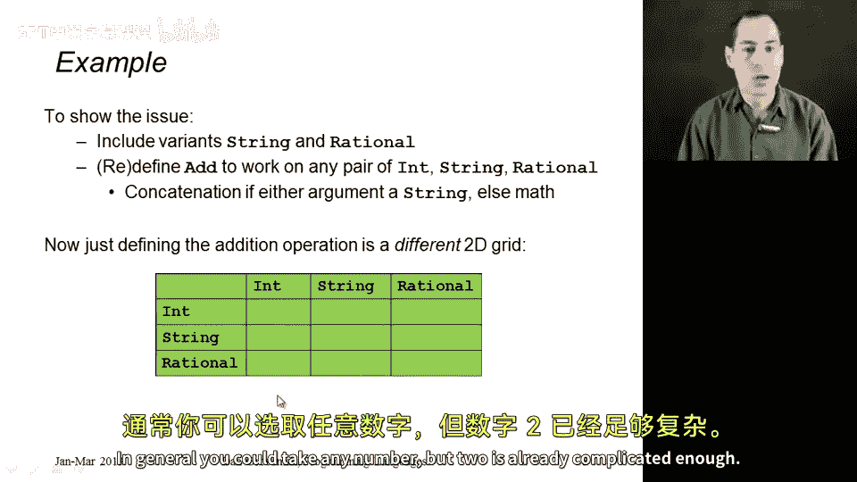
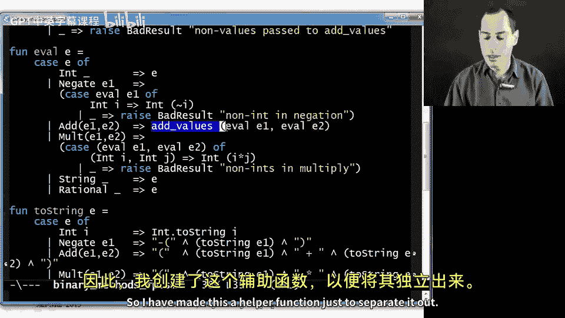
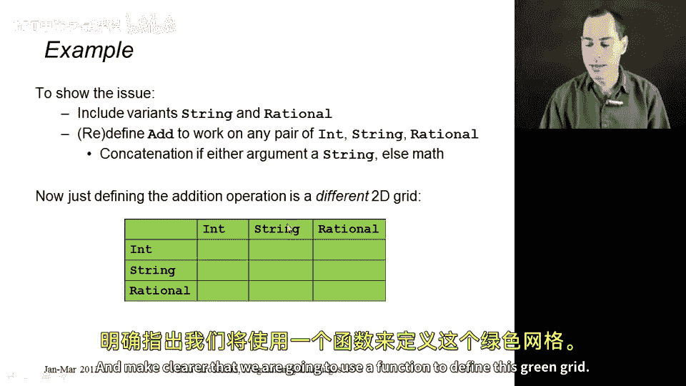
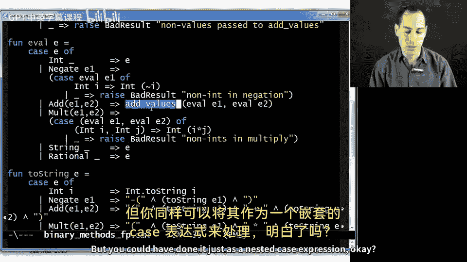
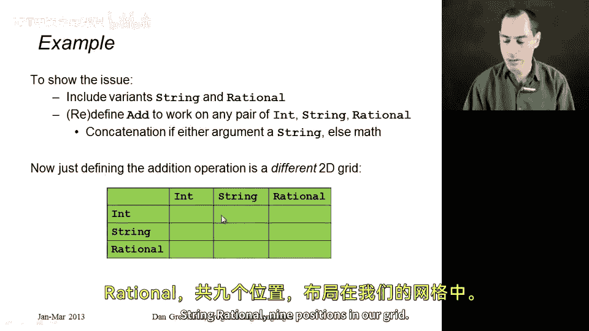

# 编程语言 A/B/C CSE341 Coursera：24：带函数式分解的二元方法

在本节课中，我们将学习如何在一个简单的编程语言解释器中实现加法操作。这个加法操作需要处理多种数据类型（整数、字符串、有理数）之间的任意组合，这构成了一个复杂的“二维网格”问题。我们将看到，使用函数式编程的分解方法可以非常清晰、自然地处理这种复杂性。

到目前为止，我们实现这个“操作-数据类型”二维网格的故事比实际情况要简单。在本节中，我想展示一个非常有趣的复杂情况：当你定义的操作需要处理你正在定义的多种数据类型的多个参数时会发生什么。我马上会展示一个例子。在本节中我们将看到，函数式分解能很好地处理这个问题，而面向对象编程风格要么必须放弃OOP，要么需要更复杂的技巧。我将在下一节展示这两种情况。

为了说明这个问题，让我们用两种新的数据类型来扩展我们的语言：字符串和有理数。但更有趣的是，让我们扩展加法操作，使其能在这些类型的任意组合上工作。如果你将整数与整数、整数与有理数、有理数与有理数相加，那就是数学运算。如果是字符串与字符串相加，那就是字符串连接。如果是字符串与某种数字相加，那么我们将数字转换为字符串，然后进行连接。这就是我们语言的定义。

现在，如果我们想这样做，我们就有了另一个二维网格。它不同于我们之前讨论的那个实现乘法的网格。现在有九种情况。这是一个二元操作，有左操作数和右操作数，你需要为整数、字符串和有理数之间的每一种组合编写代码。在我们的求值函数中，我们将递归地求值两个子表达式。我们的语言现在有三种值：数字、字符串和有理数，而加法适用于所有值的组合。因此，我们称加法为二元方法或二元操作，因为它接受两个属于整数、字符串或有理数（或更一般地说，可能的类型）的东西。理论上你可以接受任意数量，但两个已经足够复杂了。

从这里开始，我将主要展示代码，看看我们如何在函数式程序中做到这一点。

这是我的数据类型定义，与之前相比，我添加了字符串和有理数。我们知道，当我们添加字符串和有理数时，必须去修改所有旧的操作。我已经完成了这项工作，在进入重点之前，让我快速展示一下。

这是求值操作。字符串是值，所以直接返回表达式本身。有理数是值，所以直接返回表达式本身。这是转换为字符串的操作。对于字符串，直接返回底层的字符串。有理数有分子和分母，我们用这里的代码将其转换为字符串。

对于判断是否为零，字符串永远不会是零，所以返回假。对于有理数，如果分子是0则返回零。对于处理负常数，记得这是我们预处理的一部分，我们去掉了所有负常数。对于字符串，我们可以直接返回表达式本身，它没有负常数。对于有理数，我继续通过添加适当的取反参数来移除分子或分母中的任何负数，但这真的不是本节的重点。

本节的重点是加法。

在上面求值函数的加法分支中，让我们看看这个加法情况。和往常一样，我想递归地求值E1和递归地求值E2。但现在，我不希望加法在结果不是整数时引发异常。这就是乘法所做的，看看乘法：递归求值，如果它们都是整数，则通过相乘底层数字来构建一个新的整数，否则引发异常。但对于加法，我们决定整数、有理数或字符串（这是求值函数唯一会返回的三种东西）的任意组合都是可能的。现在我们要把这两个东西加在一起。

我为此创建了一个辅助函数，只是为了将其分离出来，并更清楚地表明我们将使用一个函数来定义这个绿色的网格。但你也可以直接将其作为一个嵌套的case表达式来完成。

所以，上面的`add_values`函数。它接受两个参数，每个参数可能是整数、字符串或有理数，并将它们加在一起。

最自然的做法是对这对参数进行模式匹配，这样我们就可以在（整数，字符串，有理数）与（整数，字符串，有理数）的笛卡尔积中布局九种情况，即我们网格中的九个位置，并说明在每种情况下该做什么。这是嵌套模式匹配的一个很好的应用。类型检查器不知道这些v不可能是某种非值类型的表达式，所以我确实有这个第10种情况，如果v1或v2不是整数、字符串或有理数的某种组合，则引发异常。

现在我们只需分情况处理。如果我有一个整数i和一个整数j，那么我返回整数`i + j`。这是我们上一节就有的情况。如果我有一个整数和一个字符串，那么创建一个新的字符串，将i转换为字符串后与s连接。继续，一个整数和一个有理数，我们直接构造有理数`(i * k + j) / k`，这里没有像之前那样进行约分，但它是加法的一个正确有理数值。如果我有一个字符串和一个整数，那么进行适当的连接。如果我有两个字符串，则进行连接。一个字符串和一个有理数，那么以某种方式将有理性转换为字符串，然后将其连接到前面。

这里有一个我想强调的有趣之处。如果你有一个有理数和一个整数，我完全可以在这里写下代码，实际上，我可以直接粘贴下面的代码，假设我没有在这里使用通配符模式，它也能正常工作。但你知道，当你粘贴代码时，通常有更好的方法。我可以为此写一个辅助函数。但要注意的是，有理数加整数与整数加有理数得到的结果相同，这是一个可交换的操作（用数学术语来说）。我在这里所做的，我认为是合理的风格，就是说我已经在相反的顺序中处理过这种情况了，所以让我们递归地调用`add_values`，参数顺序为`(v2, v1)`。当你有一个二元操作时，有很多可交换的情况是很常见的。我发现这是减少代码重复量或必须显式处理的情况数量的一个便捷方法。事实证明，在这个`add_values`函数中，这是我唯一能这样做的情况。但在其他情况下，甚至在你作业中可能看到的东西里，有更多这种情况适用。

最后，如果你有一个有理数和一个字符串，这很像连接一个字符串和一个有理数，但顺序很重要，所以不能简单地将其视为与上一个情况可交换。因此，对于有理数和字符串，我们进行这种连接。最后，两个有理数`a/b`和`c/d`，这是产生它们相加结果的基本算术运算。

所以这段代码是九种情况的函数式分解，这是我们实现这个绿色网格的方式。我觉得这非常自然，远比我们将在下一节看到的相同网格的面向对象分解要简洁明了。

本节课中，我们一起学习了如何使用函数式分解来处理一个需要支持多种数据类型（整数、字符串、有理数）任意组合的二元操作（加法）。我们看到了如何通过一个辅助函数和嵌套的模式匹配，清晰、无重复地覆盖所有九种情况，并巧妙地利用操作的交换性来减少代码量。这种方法使得处理这种“二维网格”问题变得直观而高效。