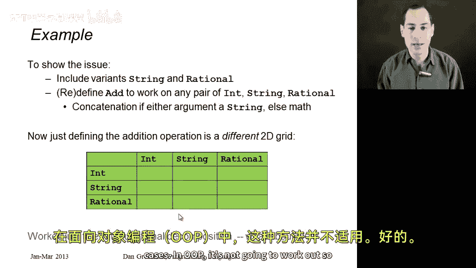
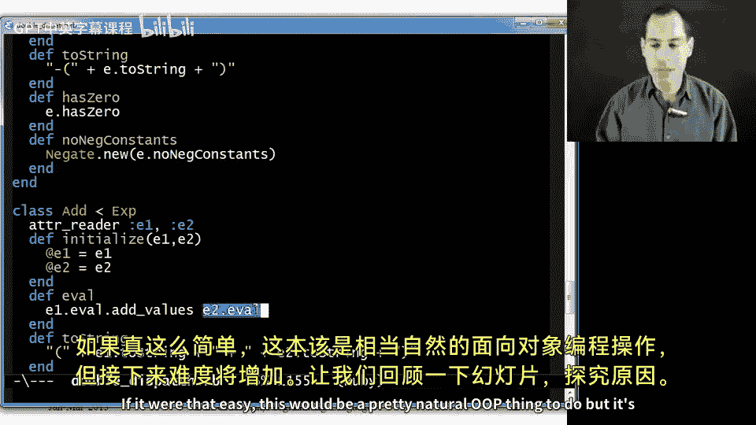
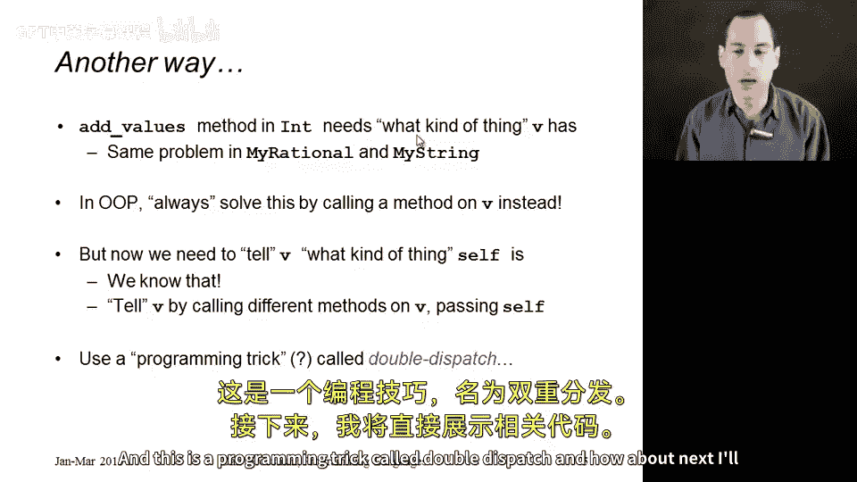
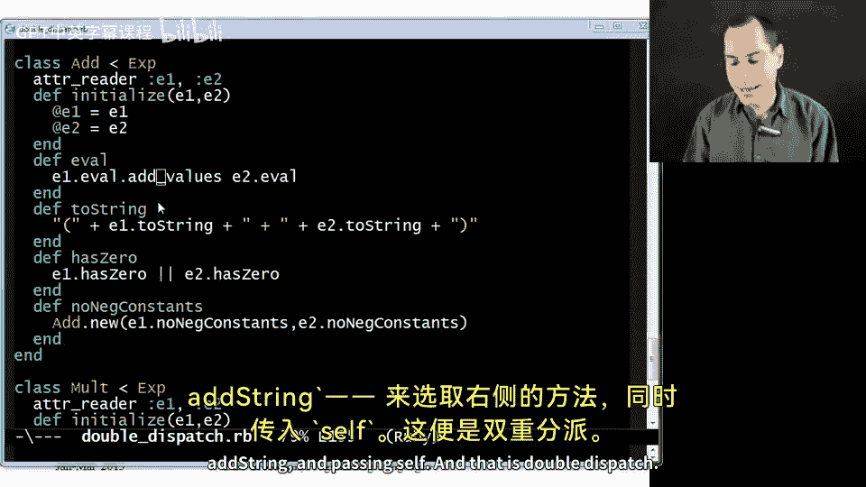
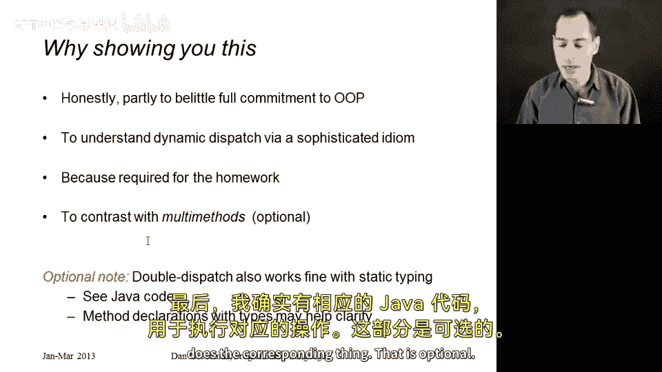
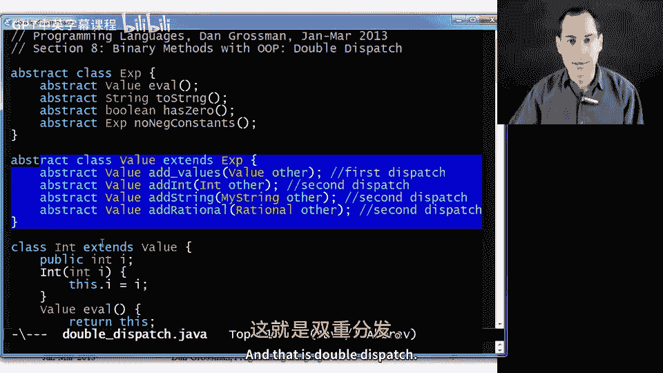

# 编程语言 A/B/C CSE341 Coursera：25：双分派（Double Dispatch）🚀

在本节课中，我们将学习如何在面向对象编程中实现一个能处理多种数据类型（如整数、字符串和有理数）的加法操作。我们将重点介绍一种称为“双分派”的编程技巧，它允许我们在不违反面向对象原则的情况下，根据两个操作数的类型动态选择正确的加法实现。

---

## 概述



在之前的ML代码中，我们通过一个辅助函数 `add_values` 和嵌套的模式匹配来处理九种不同的加法情况。现在，我们将把相同的功能移植到Ruby代码中。在面向对象编程中，我们不能简单地使用条件分支来检查类型，而需要利用动态分派机制。这就是“双分派”技巧的用武之地。

---

## 添加新数据类型

首先，我们需要在Ruby中添加字符串和有理数这两种新的数据类型。Ruby标准库中已有 `String` 和 `Rational` 类，但为了教学目的，我们将创建自己的 `MyString` 和 `MyRational` 类，它们都是 `Value` 类的子类。

### MyString 类

```ruby
class MyString < Value
  attr_reader :s

  def initialize(s)
    @s = s
  end

  def eval
    self
  end

  def to_s
    @s
  end

  def has_zero?
    false
  end
end
```



### MyRational 类

```ruby
class MyRational < Value
  attr_reader :num, :den

  def initialize(num, den)
    @num = num
    @den = den
  end

  def eval
    self
  end

  def to_s
    "#{@num}/#{@den}"
  end

  def has_zero?
    @num == 0
  end
end
```

这些方法的定义与ML代码中的模式匹配分支一一对应，每个方法对应一种数据类型的处理逻辑。

---

## 实现加法操作

现在，我们来看看如何实现加法操作。在ML代码中，我们调用 `add_values` 辅助函数，并传入两个子表达式的求值结果。在面向对象风格中，我们不调用辅助函数，而是发送消息（即调用方法）。

在 `Add` 类的 `eval` 方法中，我们递归地对两个子表达式求值，然后调用第一个值的 `add_values` 方法，并传入第二个值作为参数。

```ruby
class Add < Expression
  attr_reader :e1, :e2

  def initialize(e1, e2)
    @e1 = e1
    @e2 = e2
  end

  def eval
    e1.eval.add_values(e2.eval)
  end
end
```

接下来，我们需要在 `Int`、`MyString` 和 `MyRational` 类中实现 `add_values` 方法。然而，这里会遇到一个问题：`add_values` 方法需要根据第二个操作数的类型来决定如何执行加法。

---

## 双分派技巧

为了解决上述问题，我们引入“双分派”技巧。其核心思想是：不直接询问第二个操作数的类型，而是调用它的一个方法，并告诉它我们自己的类型。

### 第一步：添加 `add_values` 方法



首先，在每个值类中定义 `add_values` 方法。该方法会调用第二个操作数的特定方法，并传入自身作为参数。

```ruby
class Int < Value
  def add_values(v)
    v.add_int(self)
  end
end

class MyString < Value
  def add_values(v)
    v.add_string(self)
  end
end

class MyRational < Value
  def add_values(v)
    v.add_rational(self)
  end
end
```

### 第二步：实现九种加法情况

现在，我们需要在三个值类中分别实现 `add_int`、`add_string` 和 `add_rational` 方法。这样，我们总共有九个方法，对应九种加法情况。

#### Int 类中的实现

```ruby
class Int < Value
  def add_int(v)
    Int.new(@i + v.i)
  end

  def add_string(v)
    MyString.new(v.s + @i.to_s)
  end

  def add_rational(v)
    MyRational.new(@i * v.den + v.num, v.den)
  end
end
```

#### MyString 类中的实现

```ruby
class MyString < Value
  def add_int(v)
    MyString.new(@s + v.i.to_s)
  end

  def add_string(v)
    MyString.new(@s + v.s)
  end

  def add_rational(v)
    MyString.new(@s + v.to_s)
  end
end
```

#### MyRational 类中的实现

```ruby
class MyRational < Value
  def add_int(v)
    MyRational.new(@num + v.i * @den, @den)
  end

  def add_string(v)
    MyString.new(v.s + self.to_s)
  end

  def add_rational(v)
    common_den = @den * v.den
    new_num = @num * v.den + v.num * @den
    MyRational.new(new_num, common_den)
  end
end
```



---

## 双分派的工作原理

双分派通过两次动态分派来选择正确的加法实现：

1. **第一次分派**：在 `Add` 类的 `eval` 方法中，调用 `e1.eval.add_values(e2.eval)`。根据 `e1.eval` 的类型，动态选择 `Int`、`MyString` 或 `MyRational` 中的 `add_values` 方法。
2. **第二次分派**：在 `add_values` 方法中，调用第二个操作数的特定方法（如 `add_int`、`add_string` 或 `add_rational`），并传入自身作为参数。根据第二个操作数的类型，动态选择对应的方法。

这样，我们通过两次动态分派，覆盖了所有九种加法情况，同时保持了纯粹的面向对象风格。

---



## 总结

在本节课中，我们一起学习了如何在面向对象编程中实现一个能处理多种数据类型的加法操作。通过引入“双分派”技巧，我们避免了直接检查类型，而是利用动态分派机制，根据两个操作数的类型选择正确的加法实现。虽然这种方法比ML代码中的嵌套模式匹配更复杂，但它展示了面向对象编程中动态分派的强大能力。



双分派不仅帮助我们理解了动态分派的语义，还为处理更复杂的多态操作提供了一种可行的解决方案。在后续课程中，我们将看到其他语言构造如何简化这一过程。